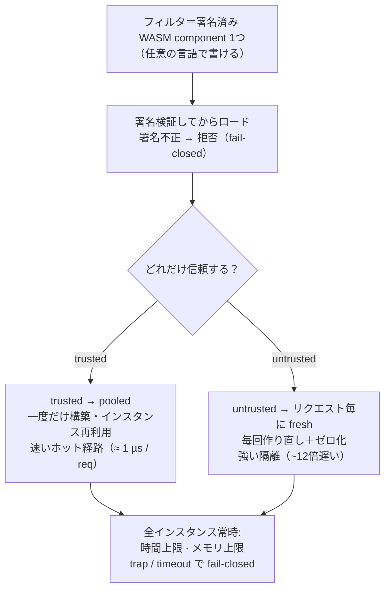

<div align="center">

# Plecto Proxy

**セルフホスト可能・プログラマブルな L7 リバースプロキシ / API ゲートウェイ — Rust 製、WebAssembly で拡張可能。**

[](https://github.com/Kaikei-e/PlectoProxy/actions/workflows/ci.yml)
[](LICENSE)
[](https://doc.rust-lang.org/edition-guide/)
[](#ロードマップ)

[English](README.md) · 日本語

</div>

---

Plecto Proxy は、**相補関係にある二つの構成要素**を型付き [WIT](https://component-model.bytecodealliance.org/) 契約で**結ぶ**:

- **fast path**（native Rust） — 接続受付・TLS 終端・HTTP/1.1・2・3・ルーティング・ロードバランシング・upstream 管理。
- **extension plane**（WebAssembly Component Model フィルタ） — 各リクエストの*判断*（認証・ヘッダ/ボディ書換・rate limit・WAF・ポリシー）。**任意の言語**で書き、`plecto:filter` 契約で差し込み、**無停止で差し替え**る。

速度が要となる経路は native Rust のまま。リクエストのロジックはサンドボックス化された WASM コンポーネントとして走り、**ホストが明示的に貸した能力以外には何も触れられない** —— それを強制するのは規約ではなくサンドボックスである。

> [!WARNING]
> **現状: 初期開発段階。** 設計は確定済み（**accepted ADR 88 本**）で、基盤は end-to-end で動く: `plecto:filter@0.3.0` 契約（ヘッダ値はバイト列。response フックは as-forwarded リクエストを受け取り応答を `replace` できる。`0.1.0` / `0.2.0` はロード可能）・フィルタをロードして実行する wasmtime ホスト・そして **fast path** —— **HTTP/1.1・HTTP/2（ALPN）・HTTP/3（QUIC）** と **TLS** を終端し、host・path-prefix・method・header・query を specificity 順で **routing**（weighted な **traffic split / canary** つき）し、ルートの filter chain をヘッダ **と** リクエスト body に対して回し、クライアント IP を edge モデルで伝播し、**healthy な upstream instance へロードバランシングする** —— round-robin・**weighted least-request（power-of-two-choices）**・**weighted Maglev consistent hashing** から選べ、active/passive **health check**・**outlier detection**・per-upstream の **circuit breaker**・二段（per-try ＋ overall）**timeout**・jittered **retry**・二層の **rate-limit** モデル（native な per-replica の local floor ＋ Redis を叩く global の reference filter）が支える。TLS は **aws-lc-rs** に一本化した crypto provider の上で終端し、post-quantum の X25519MLKEM768 鍵交換を既定で優先し、**stateless な TLS 1.3 session resumption**（ticket 鍵をローテーション、0-RTT は拒否）も備える。upstream への経路は **TLS+ALPN で再暗号化**でき（gRPC/HTTP-2 パススルー・custom CA・IP リテラルや DNS 展開先向けに検証名を固定する **`sni`** override）、hostname upstream は DNS を **定期的に再解決**してコンテナの再作成に追従する。per-route の **HTTP/1.1 `Upgrade` token allowlist** が WebSocket トンネルを end-to-end で成立させる。セキュリティ堅牢化（[ADR 000027](docs/ADR/000027.md)）により route 選択は信頼できる認証境界になり（path は ingress で正規化し、encode された迂回は fail-closed で拒否）、host 保持の状態は per-filter quota で縛り、inbound のリソース上限を強制する。出荷バイナリには SIGHUP hot reload・graceful shutdown・OTLP トレース export・operator CLI（`plecto validate` / `schema` / `new-filter` / `dev` / `conformance` / `--version`）が配線済みで、[タグ付き release](https://github.com/Kaikei-e/PlectoProxy/releases) にはそれぞれ独自の署名付きアーティファクト・パイプライン（cosign ＋ SBOM）が切られている。テスト一式は green で CI に載っている —— 読める・動かせる・フィルタを書ける基盤である。[ロードマップ](#ロードマップ)参照。

## クイックスタート

署名付きコンテナイメージを検証してから動かす——前提は Docker だけ:

```bash
IMAGE=ghcr.io/kaikei-e/plecto
TAG=0.4.2   # 最新リリースを選ぶ: https://github.com/Kaikei-e/PlectoProxy/releases
DIGEST=$(docker buildx imagetools inspect "$IMAGE:$TAG" --format '{{json .Manifest.Digest}}' | tr -d '"')

docker run --rm ghcr.io/sigstore/cosign/cosign:v3.1.1 verify "$IMAGE@$DIGEST" \
  --certificate-identity-regexp 'https://github.com/Kaikei-e/PlectoProxy/\.github/workflows/release\.yml@.*' \
  --certificate-oidc-issuer https://token.actions.githubusercontent.com
```

そして、いま検証した digest をそのまま実行する。最小 manifest・スタンドイン backend・
最初のプロキシ応答までのコピペ完結の全手順（5 分以内）は
**[docs/quickstart/](docs/quickstart/README.ja.md)**。署名検証は導線の中核であり、
脚注ではない（[ADR 000084](docs/ADR/000084.md) / [ADR 000087](docs/ADR/000087.md)）。

## なぜ Plecto Proxy か

ゲートウェイは必ず「**カスタムロジックをどこに置くか**」にぶつかる。従来の答えにはそれぞれトレードオフがある:

| アプローチ | プロセス内の速さ | サンドボックス | 言語自由 | 無停止差替 |
| --- | :---: | :---: | :---: | :---: |
| 設定 / DSL | ✅ | ✅ | ❌ | ✅ |
| 本体に再コンパイル組込 | ✅ | ❌ | ❌ | ❌ |
| 別プロセス（`ext_proc`・サイドカー） | ❌ | ✅ | ✅ | ✅ |
| **WASM フィルタ — Plecto Proxy** | ✅ | ✅ | ✅ | ✅ |

先行するデータプレーン向け WASM フィルタの実践は、**プロセス内 WASM** がゲートウェイ方針を運べることを示した。多くは当時の **module ABI** 上にあった。その後 **Component Model と WIT** が型付き・多言語・合成可能な基盤として成熟し、Plecto Proxy はその上にネイティブに築く —— 速い native データ経路とサンドボックス化された extension plane を組み合わせ、自分で運用しトラフィックも秘密も自分のインフラに留めたいチームのために **データ主権** を第一原理とする。立ち位置は製品名ではなく拡張モデルの型で語る（[ADR 000067](docs/ADR/000067.md)）。対外メッセージの順序は固定されている（[ADR 000083](docs/ADR/000083.md)）——第一看板は**供給網検証つき拡張性**（ロードする拡張への署名・SBOM・capability 契約の必須ゲート）、WIT 型付き契約はその実現手段として語り、mesh を持ち込まない環境向けの**両方向 mTLS** が補完第二看板。

根拠と却下した代替案は [ADR 000001](docs/ADR/000001.md) を参照。

## 設計テネット

> 安全 × ポータビリティ × セルフホスト性 × 運用の単純さ **＞** 機能網羅性 × 強い権限 × 分散デフォルト。

- **deny-by-default capability** — フィルタはホストが貸した host-API（log・clock・KV・counter・rate-limit・config）以外に到達できない。任意の outbound・FS・socket は貸与されない限り不可。Component Model サンドボックスが強制する。
- **判断は型で** — フィルタは `decision` variant を返す: `continue` / `modified` / `short-circuit`。曖昧なフラグや暗黙の副作用にしない。
- **init と per-request を分離** — 高コスト初期化（regex compile・スキーマ構築）は `init` フックへ、per-request のホット経路は軽く保つ。
- **フィルタはステートレス** — rate limit・セッション・キャッシュ等の状態はホスト KV に置く。だからフィルタはプール再利用・スケール・無停止差替が綺麗に決まる。
- **fail-closed** — フィルタの trap や deadline 超過で素通り（fail-open）させない。
- **single-node first** — 一台で仕事は完結する。分散（メンバーシップ・設定合意）はオプトイン。
- **データプレーンで panic 禁止** — たった一つの不正リクエストが worker を巻き込んではならない。

## アーキテクチャ

Plecto Proxy は速い **native の高速道路** ＋ **あなた自身のコードが走る検問所** という構成: 高速道路（native
Rust）が接続受付・TLS 終端・HTTP・ルーティング・LB を担い、**extension plane** が各リクエストをあなたの
*フィルタ*——小さな sandbox 化された WASM プログラム——に渡し、それが検査して3つの判断のいずれかを返す。
ポリシーはこの判断に宿る。


**continue**（素通し）・**modify**（ヘッダ/body を書換えて通す）・**reject**（*その場で* `401/403/429` を
返す＝**upstream に届かない**）——これがメンタルモデルの全て。フィルタは **stateless**：覚えておくべきものは
host 側にあり、**明示的に貸与された host サービスだけ**を呼べる（deny-by-default）。

フィルタは署名済み WASM component で、**同じ** component を「どれだけ信頼するか」で2通りに走らせられる——
これが性能の最大レバー：



**判断の指針:** ユーザー固有のロジック・ポリシー・WAF・認証・書換 → WASM フィルタ。TLS・ルーティング・LB・コネクションプール・グローバルカウンタ → native Rust —— [ADR 000029](docs/ADR/000029.md) が固定した「役割駆動」の配置基準で、native は横断的な関心事にのみ育ち、per-request のポリシーには育たない。WASM 税（データコピー＋ホストコール）はリクエスト判断ロジックにのみ課し、速い経路には課さない——pooled フィルタで **≈ 1 µs/req** と実測（[performance](performance/README.md)）。

## いま gateway ができること

native fast path は「動くプロキシ」をとうに越えて成熟している。実装済みかつ CI green な機能のスナップショット（各行は決定 ADR にリンク）:

| 関心事 | いま |
| --- | --- |
| **Edge & HTTP** | HTTP/1.1・HTTP/2（ALPN）・HTTP/3（QUIC、Alt-Svc 広告）。TLS 終端＋SNI 証明書選択、manifest 宣言、fail-closed。**aws-lc-rs** に一本化した crypto provider の上で post-quantum の X25519MLKEM768 を既定優先、**stateless な TLS 1.3 session resumption**（ticket 鍵ローテーション、0-RTT 拒否） — [ADR 13–16](docs/ADR/000013.md) · [51](docs/ADR/000051.md) · [52](docs/ADR/000052.md) |
| **Routing & upgrade** | host・path-prefix・method・header・query の照合を **specificity 順** で解決。weighted **traffic split / canary**。ingress 正規化で path を fail-closed な認証境界に。per-route の **HTTP/1.1 `Upgrade`** トンネリングで WebSocket（`h2c` は拒否） — [34](docs/ADR/000034.md) · [48](docs/ADR/000048.md) |
| **Response 圧縮** | per-route **`[route.compression]`** の opt-in（deny-by-default）: RFC 9110 の `Accept-Encoding` negotiation（gzip / br / zstd）、content-type allowlist、`no-transform` / 206 / HEAD の skip、`Vary` + 弱い `ETag`、response フィルタチェーンの後段 — [74](docs/ADR/000074.md) · [75](docs/ADR/000075.md)。**レスポンス body に secret を反射する route では有効にしないこと**（リクエスト由来の CSRF token・session nonce など）。圧縮 + 反射は TLS に対する [BREACH](https://breachattack.com/) 級の攻撃面になる。該当 route はブロックを書かない。 |
| **Load balancing & upstream** | per-upstream の **round-robin**（既定）・**weighted least-request**（P2C）・**weighted Maglev**。active＋passive health check、outlier detection、circuit breaker、二段 timeout、jittered retry。per-upstream **TLS+ALPN 再暗号化**（gRPC 対応、IP リテラルや DNS 展開先向けに検証名を固定する **`sni`** override 付き）と **定期 DNS 再解決** — [17](docs/ADR/000017.md) · [35](docs/ADR/000035.md) · [42](docs/ADR/000042.md) · [44](docs/ADR/000044.md) · [50](docs/ADR/000050.md) |
| **Rate limiting** | **二層モデル**（[ADR 61](docs/ADR/000061.md)）: native L7 token-bucket の **local floor**（**route** 単位 / **client-IP** 単位、node-local でラウンドトリップ前にバーストを吸収）＋ [`filter-ratelimit-redis`](plecto/examples/filters/filter-ratelimit-redis)（RESP 互換ストア（Redis/Valkey）を outbound-TCP capability 経由で叩く **global** な reference filter）。併用が推奨形（[hardening ガイド](docs/hardening.ja.md) 参照） — [33](docs/ADR/000033.md) · [53](docs/ADR/000053.md) · [60](docs/ADR/000060.md) · [66](docs/ADR/000066.md) |
| **Extension plane** | `plecto:filter` chain をヘッダ **と**、opt-in したフィルタには body にも回す（header-only なフィルタは zero-copy）。型付き `decision`。trusted **pooled** / untrusted **fresh**。deny-by-default の host-API ＋ per-filter / host-wide quota。feature-gated の **outbound HTTP** ＋ **outbound TCP**（いずれも SSRF ガード付き）。feature-gated（既定 off）の **fat-guest** 最小 WASI 貸与により、zero-WASI という既定を広げずに Go/TinyGo フィルタを解禁。manifest 宣言のフィルタ業務設定を貸す `host-config` capability — [1](docs/ADR/000001.md) · [25](docs/ADR/000025.md) · [38](docs/ADR/000038.md) · [60](docs/ADR/000060.md) · [63](docs/ADR/000063.md) · [66](docs/ADR/000066.md) |
| **Client IP** | edge モデル伝播 —— chain 実行の前に実 peer から `X-Forwarded-For` / `X-Real-IP` を付け直す — [18](docs/ADR/000018.md) |
| **Supply chain & ops** | cosign ＋ SBOM 検証済みのフィルタロード。無停止 SIGHUP reload ＋ graceful shutdown を出荷バイナリに配線。W3C トレース伝播・RED メトリクス・OTLP export。`plecto validate` / `schema` / `new-filter` / `dev` / `conformance` / `--version`。Plecto Proxy 自身のバイナリと container image も同じ署名付きアーティファクト規律に従う — [6](docs/ADR/000006.md) · [39](docs/ADR/000039.md) · [46](docs/ADR/000046.md) · [47](docs/ADR/000047.md) · [64](docs/ADR/000064.md) · [65](docs/ADR/000065.md) |

## フィルタ契約

Plecto Proxy の中核は `plecto:filter` WIT ワールド — 型付き `decision`、init/per-request フック、deny-by-default な host-API という独自の語彙を持ちつつ、polyglot 互換のため標準型を再利用する独自ワールドである。

```wit
package plecto:filter@0.3.0;

interface types {
  // ヘッダ値は原文バイト（ADR 000071）—— lossy な UTF-8 文字列ではない。
  record header { name: string, value: list<u8>, }

  // request 側フィルタの型付き戻り値。決して裸のフラグにしない。
  variant request-decision {
    %continue,                       // 次のフィルタへそのまま渡す
    modified(request-edit),          // edit を適用して継続
    short-circuit(http-response),    // チェーンを止め、ここで応答を合成する
  }
}

// deny-by-default: 能力ごとに 1 interface。フィルタは貸与されたものだけを import する。
interface host-kv      { get: func(key: string) -> option<list<u8>>; set: func(key: string, value: list<u8>); /* … */ }
interface host-counter { increment: func(key: string, delta: s64) -> s64; /* アトミックな名前付き counter */ }
interface host-log     { log: func(level: level, message: string); }
interface host-config  { get: func(key: string) -> option<string>; }  // manifest [filter.config]
// host-ratelimit は token bucket をホストネイティブに保つ —— ホット経路の refill/カウントは WASM 境界を
// 跨がない。bucket 仕様（capacity/refill）は manifest で host 設定。フィルタは (key, cost) だけを渡すので、
// untrusted フィルタは自分の制限を緩められない（ADR 000005 / 000026）。

// 基本契約: header-only なフィルタ（auth・rate-limit・WAF・rewrite）はこの world を対象にする。host は
// `on-request-body` の「不在」を、body を buffer せず素通しする合図として読む —— body に触れないフィルタは
// zero-copy のまま（ADR 000038）。
world filter {
  import host-log;  import host-clock;  import host-kv;  import host-counter;
  import host-ratelimit;  import host-config;
  export init: func();                                                // 重い・instance ごと一度
  export on-request:  func(req: http-request)  -> request-decision;   // ホット経路（ヘッダ）
  // `req` は as-forwarded リクエストスナップショット（ADR 000073）: request チェーン適用後の形で、
  // auth フィルタの stamp も無編集の `Origin` もここに乗る。
  export on-response: func(req: http-request, resp: http-response) -> response-decision;
}

// body を読む契約: `filter` ＋ `on-request-body`。この export の「存在」こそが、host に body を buffer させ
// このフックを走らせる合図になる（buffer-then-decide、ADR 000025）。
world filter-body {
  import host-log;  import host-clock;  import host-kv;  import host-counter;
  import host-ratelimit;  import host-config;
  export init: func();
  export on-request:      func(req: http-request)  -> request-decision;
  export on-request-body: func(body: list<u8>)     -> request-body-decision;  // buffer 済み body hook
  export on-response:     func(req: http-request, resp: http-response) -> response-decision;
}
```

> 現行契約は **`plecto:filter@0.3.0`**（ヘッダ値はバイト列、[ADR 000071](docs/ADR/000071.md)。response 側の request context ＋ `replace` decision、[ADR 000073](docs/ADR/000073.md) —— CORS dynamic origin echo フィルタを表現可能にした対。`examples/filters/filter-cors` 参照）。`0.1.0` / `0.2.0` は deprecation warning 付きでロード可能。**request 側の body hook**（`on-request-body`。buffer 済み `list<u8>`、[ADR 000025](docs/ADR/000025.md)）は `filter-body` 向けフィルタで end-to-end に動く。**実験的・feature-gated** な `stream<u8>` body ワールド（[ADR 000020](docs/ADR/000020.md)）と `wasi:http` 型の再利用が次にあり、いずれも P3 ゲスト toolchain の到達待ちで既定ビルドには入らない。
>
> **契約の安定性**（[ADR 000064](docs/ADR/000064.md) / [000085](docs/ADR/000085.md)）: host は出荷サポートした全契約バージョンを読み続ける——`0.1.0` / `0.2.0` は凍結ツリー＋ロード時アダプタで現に動いており、旧 major は ADR で廃止を宣言するまで最低 2 リリース系列は受理される。契約 **1.0** 以降は約束が強化される: 出荷したすべての world を恒久的に読み続け、例外は security 上維持不能な場合のみ——それも単独 ADR・最低 24 ヶ月の告知・移行文書を必須とする。

## フィルタを書く

フィルタはワールドを実装したコンポーネントにすぎない。同梱の例（`examples/filters/filter-quickstart`、Rust）:

```rust
wit_bindgen::generate!({ path: "../../../wit", world: "filter" });

struct FilterQuickstart;

impl Guest for FilterQuickstart {
    fn init() {}

    fn on_request(_req: HttpRequest) -> RequestDecision {
        RequestDecision::Continue
    }

    fn on_response(_req: HttpRequest, _resp: HttpResponse) -> ResponseDecision {
        // このフィルタが目に見える形でやる唯一のこと: ヘッダを1つ付け足して、
        // `curl -i` で WASM フィルタが応答に触れたことを見せる。
        ResponseDecision::Modified(ResponseEdit {
            set_status: None,
            set_headers: vec![Header {
                name: "x-plecto".into(),
                value: b"hello-from-wasm".to_vec(), // list<u8> ヘッダ値（@0.3.0）
            }],
            remove_headers: vec![],
        })
    }
}

export!(FilterQuickstart);
```

これは基本の `filter` world を対象にしている —— header-only なので host は body を素通しする。body が要る
フィルタ（`POST` の認証・WAF・body 書換）は `filter-body` を対象にし、export を1つ追加する。実用例フィルタは
[`filter-apikey`](plecto/examples/filters/filter-apikey)（header-only）、`filter-body` の例は
[`filter-hello`](plecto/examples/filters/filter-hello)（host 自身の conformance fixture）を参照。

契約が WIT なので、**WASM コンポーネントへコンパイルできる言語ならどれでもフィルタを書ける** —— それを二段構えで証明している。**Tier A（zero-WASI、既定）**: 同一の conformance サブセットを **MoonBit**（約 22 KB）・**JavaScript/TypeScript**（ComponentizeJS、エンジン固定費 約 12 MB）・**C**（wasi-sdk）へ移植し、いずれも **WASI import ゼロのコンポーネント**として、無変更の deny-by-default ホストが Rust フィクスチャと同じアサーション群で検証する（`plecto/crates/host/tests/polyglot.rs`、CI ジョブ `polyglot-guests`）。Python も同じ形で動く（`componentize-py --stub-wasi`、約 17 MB — 動くがフィルタには重い）。**Tier B（fat guest、feature-gated `fat-guest`・既定 off、[ADR 000063](docs/ADR/000063.md)）**: ランタイムが WASI baseline を必須とする言語には、`wasi:io` / `wasi:clocks` / `wasi:random` / `wasi:cli` という固定の最小スライスを貸す —— filesystem・socket は依然ゼロ。フィルタ側は manifest の `wasi = "minimal"` で opt-in する。**Go/TinyGo**（`filter-hello-go`）が最初の Tier B ゲストで、stdout/stderr は `host-log` へブリッジされるため panic 自身の診断出力もそのリクエストの trace span に残り、専用スイート（`polyglot_tier_b.rs`、CI ジョブ `polyglot-guest-go`）が貸与が fail-closed のままであることを検証する。言語別の手順は [Writing a filter §7](docs/writing-a-filter.md#7-other-languages)。polyglot フィルタの **SDK**（言語ごとに 1 フィクスチャを越えた scaffolding）は[ロードマップ](#ロードマップ)に載っている。

最短経路: `plecto new-filter --lang rust my-filter` —— クレートをスキャフォールドし、WIT 契約を `wkg` 経由で取得し（[ADR 000064](docs/ADR/000064.md)）、すぐ動く dev manifest を書き出す（[ADR 000065](docs/ADR/000065.md)。オフライン self-vendoring は [ADR 000072](docs/ADR/000072.md) で採択済み・実装は後続）。scaffold・ビルド・manifest・署名・ローカルテストまでの手引きは [**フィルタを書く（Writing a filter）**](docs/writing-a-filter.md)。リポジトリ内のコピー雛形は [`examples/filters/filter-template`](plecto/examples/filters/filter-template)。

## 試す

ツールチェーンと WASM ターゲットは [`plecto/rust-toolchain.toml`](plecto/rust-toolchain.toml) にピン留め
してあるので、[`rustup`](https://rustup.rs/) が初回ビルド時に自動で用意する（ツールチェーン外では一度だけ
`rustup target add wasm32-unknown-unknown`）。

```bash
cd plecto
cargo test --all   # 例フィルタを WASM コンポーネントへコンパイルし、wasmtime ホストにロードして
                    # 契約を end-to-end で検証する
```

例コンポーネントは `plecto:filter/*` のみを import し、WASI・network・filesystem には一切アクセスしない
—— これによりテストは、フィルタが**貸与された能力だけ**に到達し、型付き `decision` が実コンポーネント越しに
往復することを実証する。

### デモを動かす

ユースケース別の自己完結デモが `examples/<name>/` に 9 つあり、どれも**本番ロードパス**（署名＋オフライン OCI レイアウト＋検証＋ロード、fail-closed）を組んで起動時に貼り付け用の `curl` コマンドを表示する。学習パスの完全版は [`examples/README.md`](plecto/examples/README.md)。手早い地図はこちら:

```bash
cd plecto
./examples/try.sh <name>                      # ガイド付きツアー: 起動・curl・後片付けまで自動（または `all`）
cargo run -p plecto-server --example <name>   # 自分で叩くなら直接起動、Ctrl-C で停止
```

| `<name>` | 見せるもの |
| --- | --- |
| `quickstart` | 5 分の hello —— 署名済み WASM フィルタが応答ヘッダを1つ付与。まずここから。 |
| `wasm-auth` | 実用フィルタ —— 署名済み API キー認証、host KV、型付き decision。 |
| `load-balancing` | 3 instance への round-robin、active health check、fail-closed な eject。 |
| `filter-chain` | continue / modify / short-circuit / host-native rate limit を組み合わせる。 |
| `tls-http` | 同一ポートで HTTP/1.1・HTTP/2（ALPN）・HTTP/3 の TLS 終端。 |
| `hot-reload` | SIGHUP による無停止の config swap。壊れた編集は fail-closed のまま。 |
| `canary` | 90/10 の weighted traffic split、header-match routing、SIGHUP drain/promote。 |
| `resilience` | per-try timeout＋retry・circuit breaker・outlier ejection が curl から見える。 |
| `production` | 実 `plecto` バイナリが本物の deploy dir を serve（ターミナル 2 枚）。 |

単一プロセスのデモに加え、[`examples/multi-replica/`](plecto/examples/multi-replica/README.md) は **docker compose の reference** —— L4 ロードバランサが PROXY protocol v2 で Plecto ×2 に配る構成 —— であり、運用上の性質をスクリプトが*実証*する: 1 レプリカを drain してもリクエストは落ちない・TLS resumption がレプリカを跨いで生き残る（共有 STEK）・downstream mTLS（[ADR 000088](docs/ADR/000088.md)）。

ベンチマーク・ハーネス（`bench-server` / `swap-bench`）はデモではなく [`bench/harnesses/`](bench/) 配下にあり、[performance](performance/README.md) の数値を生む。

## ロードマップ

Plecto Proxy は ADR ファーストで、マイルストーン単位に作る。着地済みの項目・次にやること・決定 ADR まで含めた詳細は [`docs/ROADMAP.md`](docs/ROADMAP.md)（英語）にあり、ここではスナップショットだけ:

| マイルストーン | 状態 | 内容 |
| --- | --- | --- |
| **M0** — 基盤 | ✅ 完了 | `plecto:filter@0.3.0` 契約（0.1 / 0.2 凍結＋ロードアダプタ）、wasmtime ホスト、能力境界、CI |
| **M1** — フィルタランタイムの堅牢化 | ✅ 着地 | trusted pool / untrusted fresh-per-request、redb KV、host-native レート制限、quota |
| **M2** — データ経路（fast path） | 🚧 成熟中 | HTTP/1–3 ＋ TLS、routing / LB / resilience、upstream TLS ＋ 定期 DNS 再解決、WebSocket トンネリング |
| **M3** — async & ボディ | 🚧 Stage 1–2 着地 | wasmtime-46 async、header/body world 分割、buffer-then-decide の body hook。`stream<u8>` は実験的 |
| **M4** — provenance & 無停止リロード | ✅ 着地 | OCI ＋ cosign ＋ SBOM のフィルタロード、SIGHUP reload ＋ graceful shutdown、Plecto Proxy 自身の署名付き release |
| **M5** — 可観測性 & オプトイン分散 | 🚧 大半着地 | W3C トレース伝播・RED メトリクス・OTLP export は着地、オプトインの設定合意は deferred |
| **M6** — polyglot SDK & リファレンスフィルタ | 🚧 例が着地 | Tier A の zero-WASI 例フィルタ（MoonBit/JS/C）+ Tier B の fat-guest Go/TinyGo（[63](docs/ADR/000063.md)）、それぞれ専用の CI ゲート付き conformance スイートで検証済み。SSRF ガード付き outbound HTTP ＋ outbound TCP（いずれも feature-gated）、実用例として `filter-ratelimit-redis`。polyglot SDK は未着手 |

## リポジトリ構成

```
.
├── plecto/                    # Rust workspace（native 側）
│   ├── wit/world.wit          # plecto:filter 契約（contract-first）
│   ├── deny.toml              # cargo-deny サプライチェーン方針（CI ブロッキング）
│   ├── crates/
│   │   ├── host/              # wasmtime 埋め込み: Linker, InstancePre, host-API（+ CONTEXT.md）
│   │   ├── control/           # control plane: manifest, OCI load, chain, reload, TLS/QUIC（+ CONTEXT.md）
│   │   └── server/            # fast path: HTTP/1.1·2（hyper）+ HTTP/3（quinn）, routing, LB, upstream（+ CONTEXT.md）
│   └── examples/              # 動かせるデモ + 例フィルタ guest — 地図は examples/README.md（DX 入口）
│       ├── README.md          # 学習パス（quickstart → リアルなユースケース）
│       ├── <use-case>/        # デモ 9 種: cargo run -p plecto-server --example <name>
│       └── filters/           # 例 plecto:filter guest（独立 workspace・build.rs が component 化）
│           ├── filter-quickstart/ # 最簡スターター（応答に 1 ヘッダ付与）
│           ├── filter-apikey/ # API キー認証ゲート（実用例）
│           ├── filter-hello/  # host 自身の conformance fixture
│           ├── filter-hello-moonbit/ # zero-WASI conformance port — MoonBit（Tier A）
│           ├── filter-hello-js/   # zero-WASI conformance port — JS/TS（ComponentizeJS、Tier A）
│           ├── filter-hello-c/    # zero-WASI conformance port — C（wasi-sdk、Tier A）
│           ├── filter-hello-go/   # fat-guest conformance port — Go/TinyGo、最小 WASI（Tier B, ADR 000063）
│           ├── filter-template/ # コピー雛形（または `plecto new-filter` を推奨）
│           ├── filter-streaming/ # 実験的 stream<u8> フィルタ（feature-gated）
│           ├── filter-extauthz/ # outbound HTTP で ext_authz（feature-gated）
│           ├── filter-tcp-gate/ # outbound TCP 経由の raw-TCP consult gate（feature-gated）
│           └── filter-ratelimit-redis/ # Redis 連携の global rate-limit reference filter（feature-gated）
├── bench/                     # ベンチ・ハーネス + runbook（k6/oha; harnesses/, filters/, perf/）
├── performance/              # ベンチ結果の write-up（performance/README.md）
├── docs/ADR/                  # Architecture Decision Records（000001–000086）
├── CHANGELOG.md               # Keep a Changelog + pre-1.0 バージョニング方針
├── CLAUDE.md                  # プロジェクト規約・設計要約
├── CONTEXT-MAP.md             # ドメイン用語集の地図（コンテキスト分割）
└── Dockerfile                 # リファレンスの multi-stage build（distroless runtime）
```

## 設計判断（ADR）

Plecto Proxy は重要な設計判断をすべて ADR に、Fork 形式（*判断 / 根拠 / 再検討条件*）で記録している。accepted **88** 本は [`docs/ADR/`](docs/ADR/) にあり、起点は [ADR 000001](docs/ADR/000001.md)（相補的な二つの構成要素）。各 ADR は土台にした判断へ相互リンクしている。

何を・どこで検証しているかは一枚の地図にまとめてある: [docs/verification.ja.md](docs/verification.ja.md) —— CI / release の機構への地図であり、記録の実体は workflow 自体が green であること。独立した台帳は作らない（[ADR 000086](docs/ADR/000086.md)）。

このうち二つは、コードではなく利用者への約束である。**契約互換の約束**は段階化されている: host は出荷した全 `plecto:filter` バージョンを読み続け、契約 1.0 以降は出荷 world を恒久的に読み続ける——例外は security のみ、単独 ADR＋最低 24 ヶ月告知つき（[ADR 000085](docs/ADR/000085.md)）。そして**寿命の規律**（[ADR 000086](docs/ADR/000086.md)）: 年限のサポート宣言はせず、長期支援の意図宣言＋撤退プロトコル（意図的に開発を終了する場合は EOL 告知 ≥12 ヶ月＋期間中の security fix 継続）＋再現可能な署名済みリリース（ソース・署名成果物・SBOM attestation・pin 済み依存）で、メンテナ不在でも各タグ付きリリースが検証・fork 可能であり続けることを担保する。

## コントリビュート

コントリビュートは deliberate に扱う: **PR を出す前に issue か [Discussion](https://github.com/Kaikei-e/PlectoProxy/discussions) で方針を合意してほしい**（事前合意のない PR は close されることがある）。Plecto Proxy は outside-in TDD（E2E → WIT-conformance → unit）に従い、load-bearing な判断を ADR に記録する。完全な手引き（注意を要する領域・DCO sign-off を含む）は [CONTRIBUTING.md](CONTRIBUTING.md)（規約は [CLAUDE.md](CLAUDE.md)）参照。PR 前のローカル CI パリティ:

```bash
cd plecto
cargo fmt --all -- --check
cargo clippy --all-targets --all-features -- -D warnings
cargo test --all
```

（リポジトリ root からは `just check` でも可。）

## ライセンス

**Apache License, Version 2.0** — [LICENSE](LICENSE) を参照。Apache-2.0 の特許付与条項はインフラ・プロジェクトに適し、クラウドネイティブ／コンテナ周辺で広く使われている。

## 先行研究 & 謝辞

Plecto Proxy は [Bytecode Alliance](https://bytecodealliance.org/) のスタック —— [wasmtime](https://wasmtime.dev/)、[WIT と Component Model](https://component-model.bytecodealliance.org/) —— と、プロセス内 WASM がデータプレーン方針を運べることを示した業界の蓄積の上に立つ。他の拡張モデルとの立ち位置は [ADR 000067](docs/ADR/000067.md) に、製品名ではなくモデルの型で記録している。

listener が実装する PROXY protocol（[ADR 000057](docs/ADR/000057.md)）は HAProxy Technologies が保守する公開仕様であり、multi-replica reference は例示の L4 ロードバランサとして HAProxy を使っている。HAProxy は HAProxy Technologies の商標であり、本プロジェクトは同社と提携しておらず、同社の endorsement を受けてもいない。
