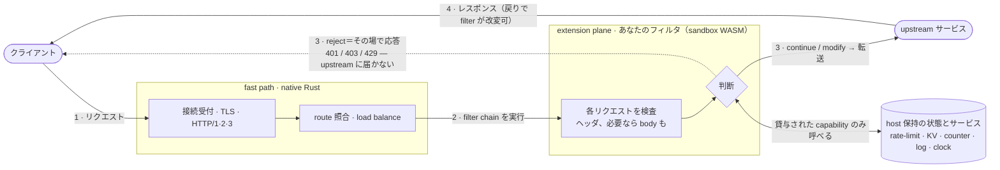

<div align="center">

# Plecto

**セルフホスト可能・プログラマブルな L7 リバースプロキシ / API ゲートウェイ — Rust 製、WebAssembly で拡張する。**

[](https://github.com/Kaikei-e/Plecto/actions/workflows/ci.yml)
[](LICENSE)
[](https://doc.rust-lang.org/edition-guide/)
[](#ロードマップ)

[English](README.md) · 日本語

</div>

---

Plecto は、**相補関係にある二つの構成要素**を型付き [WIT](https://component-model.bytecodealliance.org/) 契約で**結ぶ**:

- **fast path**（native Rust） — 接続受付・TLS 終端・HTTP/1.1・2・3・ルーティング・ロードバランシング・upstream 管理。
- **extension plane**（WebAssembly Component Model フィルタ） — 各リクエストの*判断*（認証・ヘッダ/ボディ書換・rate limit・WAF・ポリシー）。**任意の言語**で書き、`plecto:filter` 契約で差し込み、**無停止で差し替え**る。

速度が要となる経路は native Rust のまま。リクエストのロジックはサンドボックス化された WASM コンポーネントとして走り、**ホストが明示的に貸した能力以外には何も触れられない** —— それを強制するのは規約ではなくサンドボックスである。

> [!WARNING]
> **現状: 初期開発段階。** 設計は確定済み（26 本の ADR）で、基盤は end-to-end で動く: `plecto:filter` 契約・フィルタをロードして実行する wasmtime ホスト・そして **fast path** —— **HTTP/1.1・HTTP/2（ALPN）・HTTP/3（QUIC）** と **TLS** を終端し、host＋path-prefix で routing し、クライアント IP を edge モデルで伝播し、**healthy な upstream instance へロードバランシングする**（round-robin ＋ active/passive health・per-upstream timeout・request-level retry）。テスト一式は green で CI に載っている —— 読める・動かせる・フィルタを書ける基盤である。[ロードマップ](#ロードマップ)参照。

## なぜ Plecto か

ゲートウェイは必ず「**カスタムロジックをどこに置くか**」にぶつかる。従来の答えにはそれぞれトレードオフがある:

| アプローチ | プロセス内の速さ | サンドボックス | 言語自由 | 無停止差替 |
| --- | :---: | :---: | :---: | :---: |
| 設定 / DSL | ✅ | ✅ | ❌ | ✅ |
| 本体に再コンパイル組込 | ✅ | ❌ | ❌ | ❌ |
| 別プロセス（`ext_proc`・サイドカー） | ❌ | ✅ | ✅ | ✅ |
| **WASM フィルタ — Plecto** | ✅ | ✅ | ✅ | ✅ |

データプレーンのフィルタを WASM で動かすという発想は、**Envoy と proxy-wasm が切り拓き、約 10 年かけて実証**してきたものだ ―― その中核的な洞察に Plecto は多くを負っている。proxy-wasm は初期の WASM ABI（v0.2.1）を対象としており、その後 **Component Model と WIT** が型付き・多言語・合成可能な基盤として成熟した。Plecto は、それらの上にゲートウェイを一から築くとどうなるかを探る試みである。**Cloudflare の Pingora** をはじめとする高性能 Rust プロキシもまた、native なデータ経路がどれほど速くなり得るかを示してくれた。Plecto が特に焦点を当てるのは、**その native の速さと Component Model の extension plane を組み合わせる**こと ―― 自分で運用し、トラフィックも秘密も自分のインフラに留めたいチームのために、**データ主権**を第一原理として据える。

根拠と却下した代替案は [ADR 000001](docs/ADR/000001.md) を参照。

## 設計テネット

> 安全 × ポータビリティ × セルフホスト性 × 運用の単純さ **＞** 機能網羅性 × 強い権限 × 分散デフォルト。

- **deny-by-default capability** — フィルタはホストが貸した host-API（KV・counter・metrics・log・clock・random）以外に到達できない。任意の outbound・FS・socket は貸与されない限り不可。Component Model サンドボックスが強制する。
- **判断は型で** — フィルタは `decision` variant を返す: `continue` / `modified` / `short-circuit`。曖昧なフラグや暗黙の副作用にしない。
- **init と per-request を分離** — 高コスト初期化（regex compile・スキーマ構築）は `init` フックへ、per-request のホット経路は軽く保つ。
- **フィルタはステートレス** — rate limit・セッション・キャッシュ等の状態はホスト KV に置く。だからフィルタはプール再利用・スケール・無停止差替が綺麗に決まる。
- **fail-closed** — フィルタの trap や deadline 超過で素通り（fail-open）させない。
- **single-node first** — 一台で仕事は完結する。分散（メンバーシップ・設定合意）はオプトイン。
- **データプレーンで panic 禁止** — たった一つの不正リクエストが worker を巻き込んではならない。

## アーキテクチャ

Plecto は速い **native の高速道路** ＋ **あなた自身のコードが走る検問所** という構成。高速道路（native
Rust）が接続受付・TLS 終端・HTTP・ルーティング・LB を担う。検問所が **extension plane**：各リクエストは
あなたの *フィルタ*——小さな sandbox 化された WASM プログラム——に渡され、それが **リクエストを検査して
3つの判断のいずれかを返す**。ポリシーはこの判断に宿る。



3つの判断がメンタルモデルの全て：**continue**（素通し）・**modify**（ヘッダ/body を書換えて通す）・
**reject**（*その場で* クライアントへ応答する `401/403/429`＝**upstream に届かない**ので、悪性トラフィックは
edge で落ちる）。フィルタは **stateless**：覚えておくべきもの（カウンタ・rate-limit bucket・キャッシュ）は
host 側にあり、**明示的に貸与された host サービスだけ**を呼べる（deny-by-default）。

フィルタは署名済み WASM component で、**同じ** component を「どれだけ信頼するか」で2通りに走らせられる——
これが性能の最大レバー：


**判断の指針:** ユーザー固有のロジック・ポリシー・WAF・認証・書換 → WASM フィルタ。TLS・ルーティング・LB・コネクションプール・グローバルカウンタ → native Rust。WASM 税（データコピー＋ホストコール）はリクエスト判断ロジックにのみ課し、速い経路には課さない——pooled フィルタで **~2 µs/req** と実測（[performance](performance/README.md)）。

## フィルタ契約

Plecto の中核は `plecto:filter` WIT ワールド — Plecto 固有の語彙（型付き `decision`、init/per-request フック、deny-by-default な host-API）を持ちつつ、polyglot 互換のため標準型を再利用する独自ワールドである。

```wit
package plecto:filter@0.1.0;

interface types {
  // request 側フィルタの型付き戻り値。決して裸のフラグにしない。
  variant request-decision {
    %continue,                       // 次のフィルタへそのまま渡す
    modified(request-edit),          // edit を適用して継続
    short-circuit(http-response),    // チェーンを止め、ここで応答を合成する
  }
}

// deny-by-default: 能力ごとに 1 interface。フィルタは貸与されたものだけを import する。
interface host-kv      { get: func(key: string) -> option<list<u8>>; set: func(key: string, value: list<u8>); /* … */ }
interface host-counter { increment: func(key: string, delta: s64) -> s64; /* アトミックな名前付き counter */ }
interface host-log     { log: func(level: level, message: string); }
// host-ratelimit は token bucket をホストネイティブに保つ —— ホット経路の refill/カウントは WASM 境界を
// 跨がない。bucket 仕様（capacity/refill）は manifest で host 設定。フィルタは (key, cost) だけを渡すので、
// untrusted フィルタは自分の制限を緩められない（ADR 000005 / 000026）。

world filter {
  // 貸与された能力のみ —— log · clock · kv · counter · rate-limit
  import host-log;  import host-clock;  import host-kv;  import host-counter;  import host-ratelimit;
  export init: func();                                        // 重い・instance ごと一度
  export on-request:      func(req: http-request)  -> request-decision;       // ホット経路（ヘッダ）
  export on-request-body: func(body: list<u8>)     -> request-body-decision;  // body hook（ADR 000025）
  export on-response:     func(resp: http-response) -> response-decision;     // ホット経路（ヘッダ）
}
```

> v0.1.0 は当初 **sync・header-only** だったが、**request 側の body hook が end-to-end で配線された** —— `on-request-body`（buffer-then-decide。v1 では body を buffer 済みの `list<u8>` で受け取る、[ADR 000025](docs/ADR/000025.md)）が契約・ホスト・**fast path** を通して動き、ヘッダだけでなく body も変換・short-circuit できる。host は body を **上限付き**で buffer し（16 MiB cap、超過は fail-closed 413）、body 無しリクエストと filter 無しルートは zero-copy ストリーミングのまま。ホスト側の async（M3 Stage 1、[ADR 000021](docs/ADR/000021.md)）も入っている。残りは `stream<u8>` の真ストリーミング（大きな body を buffer せず済む）と `wasi:http` 型の再利用で、いずれも P3 ゲスト toolchain が枯れ次第進める — [ADR 000003](docs/ADR/000003.md) / [ADR 000020](docs/ADR/000020.md) 参照。

## フィルタを書く

フィルタはワールドを実装したコンポーネントにすぎない。同梱の例（`examples/filters/filter-hello`、Rust）:

```rust
wit_bindgen::generate!({ path: "../../../wit", world: "filter" });

struct FilterHello;

impl Guest for FilterHello {
    fn init() {}

    fn on_request(req: HttpRequest) -> RequestDecision {
        host_log::log(host_log::Level::Info, "filter-hello: on-request");
        if req.headers.iter().any(|h| h.name.eq_ignore_ascii_case("x-plecto-block")) {
            RequestDecision::ShortCircuit(HttpResponse { status: 403, /* … */ })
        } else {
            RequestDecision::Continue
        }
    }

    fn on_response(_: HttpResponse) -> ResponseDecision { ResponseDecision::Continue }
}

export!(FilterHello);
```

契約が WIT なので、**WASM コンポーネントへコンパイルできる言語ならどれでもフィルタを書ける** — Rust・Go（TinyGo）・JavaScript/TypeScript（`jco`）・Python（`componentize-py`）。polyglot フィルタ SDK は[ロードマップ](#ロードマップ)に載っている。

scaffold・ビルド・manifest フィールドリファレンス・署名・ローカルテストまでの完全な手引きは [**フィルタを書く（Writing a filter）**](docs/writing-a-filter.md) にある。契約を vendor 済みで、コピーしてすぐ使える雛形は [`examples/filters/filter-template`](plecto/examples/filters/filter-template)。

## 試す

ツールチェーンと WASM ターゲットは [`plecto/rust-toolchain.toml`](plecto/rust-toolchain.toml) に
ピン留めしてあるので、[`rustup`](https://rustup.rs/) が初回ビルド時に適切な Rust（edition 2024）と
`wasm32-unknown-unknown` ターゲットを自動で用意する —— 手動の `rustup target add` は不要。

```bash
# 全ビルド + テスト。host の build script が例フィルタを WASM コンポーネントへ
# コンパイルし、テストがそれを wasmtime ホストにロードして契約を検証する。
cd plecto
cargo test --all
```

（このツールチェーン外でビルドする場合は一度だけ: `rustup target add wasm32-unknown-unknown`。）

テストはスライスを end-to-end で実証する: リクエストがホストを通って実フィルタ・コンポーネントへ流れ、型付き `decision` が往復し、フィルタは**貸与された能力だけ**に到達する（例コンポーネントは `plecto:filter/*` のみを import し、WASI・network・filesystem には一切アクセスしない）。

### デモを動かす

ユースケース別の自己完結デモが `examples/<name>/` に 5 つある。どれも**本番ロードパス**（署名＋オフライン OCI レイアウト＋検証＋ロード、すべて fail-closed）を組み、小さな upstream を立て、実プロキシを serve し、起動時に貼り付け用の `curl` コマンドを表示する。

手早く end-to-end で見るならガイド付きツアー —— デモを起動し、readiness を待ち、`curl` を流し、結果を可視化して、後片付けまで自動でやる:

```bash
cd plecto
./examples/try.sh <name>      # または `all`。リポジトリ root からは `just demo <name>` でも可
```

自分で叩きたいなら、サーバを直接起動して、起動時に表示される `curl` レシピを使う:

```bash
cargo run -p plecto-server --example <name>   # Ctrl-C で停止
```

| `<name>` | 見せるもの |
| --- | --- |
| `wasm-auth` | **実用 WASM フィルタ** —— 署名済みの API キー認証コンポーネント（`examples/filters/filter-apikey`）。鍵が無ければ 401、認証できれば呼び出し元の identity を付与し、per-user のリクエスト数を host KV で数える。Plecto の核。 |
| `load-balancing` | 1 つの upstream を 3 instance に分散: healthy 集合の round-robin、active health probe、unhealthy 化での eject、全滅時の 503（ADR 000017）。 |
| `filter-chain` | plain HTTP で filter chain: continue / modify（ヘッダ書換）/ short-circuit 403 / host-native rate limit。 |
| `tls-http` | 同一ポートで TLS 終端＋HTTP/1.1・HTTP/2（ALPN）・HTTP/3（QUIC）、`Alt-Svc` による h3 広告。 |
| `hot-reload` | manifest を編集して `kill -HUP <pid>`、無停止で設定をアトミックに差し替え（壊れた編集は fail-closed）。 |

まず読むなら `wasm-auth`: 貸与された host-API だけに触れるサンドボックス・コンポーネントとしてカスタムなリクエスト処理が走る様子 —— cosign 風署名＋SBOM 検証・型付き `decision`・host 保持の状態 —— が端から端まで見える。

`examples/` にはデモではない micro-benchmark が 2 つ（`wasm-bench` と `edge-bench`）あり、[performance](performance/README.md) の数値を生む。

## ロードマップ

Plecto は ADR ファーストで作る。各マイルストーンは `docs/ADR/` の特定の設計判断を具体化する。

- **M0 — 基盤** ✅ *(完了)*
  `plecto:filter@0.1.0` 契約、フィルタをロード&実行する wasmtime ホスト、deny-by-default の能力境界（log / clock / kv）、例フィルタ、E2E/conformance/unit テスト、CI。— [ADR 1](docs/ADR/000001.md) · [2](docs/ADR/000002.md) · [10](docs/ADR/000010.md)
- **M1 — フィルタランタイムの堅牢化** ✅ *(着地)*
  trusted / untrusted で生成戦略を分ける。trusted は固定容量のプールをリクエストごとに借りて返し（飽和時は上限付きで待ってから fail-closed、trap が続けばプール全体のブレーカーが開き、一定回数で recycle）、untrusted は毎回新しく生成する（線形メモリが構造的にまっさらなのでゼロ化が要らない）。状態は redb 上の host KV とアトミックカウンタに置き、token-bucket のレート制限はホスト側で持つ（bucket 仕様は manifest で host 設定・リクエストごとに key 付け —— untrusted フィルタが自分の制限を緩められない、[ADR 26](docs/ADR/000026.md)）。epoch 計量とメモリ/テーブル上限も実装済み。trusted/untrusted を分けるのは性能のための選択ではなく、init とゼロ化を両立できないことによる必然。
- **M2 — データ経路（fast path）** 🚧 *(slice 1–6 着地)*
  tokio + hyper + quinn で書いた `plecto-server`。**HTTP/1.1・HTTP/2（ALPN）・HTTP/3（QUIC）** と **TLS**（rustls、証明書は manifest 宣言、不正なら fail-closed）を終端し、host＋path-prefix で route を選び、その chain を `spawn_blocking` 経由で M1 のプールに載せて回す。upstream は **healthy な instance に round-robin で分散**し、active/passive の health check（pessimistic 起動、全滅すれば 503 で fail-closed）、クライアント IP の edge 伝播（`X-Forwarded-For` / `X-Real-IP` を実 peer から付け直す）、per-upstream の request timeout（504）、別 instance への有界リトライまで備える。*次:* upstream TLS と least-conn/EWMA。
- **M4 — provenance & 無停止リロード** ✅ *(着地)*
  OCI artifact によるフィルタ配布（オフライン image-layout・digest ピン）+ cosign 署名検証 + SBOM↔component バインド、宣言的マニフェストの content hash で整合する無停止リロード（`ArcSwap` 原子適用・all-or-nothing・SIGHUP 駆動）。残るのは*リモート*レジストリ取得経路（`wkg` 境界・設計上 out-of-band）。— [ADR 6](docs/ADR/000006.md) · [8](docs/ADR/000008.md)
- **M5 — 可観測性 & オプトイン分散** 🚧 *(span/metrics の中核は着地・export は deferred)*
  **着地:** ホスト伝播の W3C トレース文脈（受信 `traceparent` をプロキシ越しに継続）、フィルタ実行ごとの span（OpenTelemetry データモデル）、sync な `TelemetrySink`（in-memory + ホスト集計の RED メトリクス）。**deferred:** OTLP ネットワーク export（`wasi-otel` / SDK exporter — no-tokio 維持のため named-deferred）とオプトインの `foca`/`openraft` 設定合意。— [ADR 7](docs/ADR/000007.md) · [9](docs/ADR/000009.md)
- **M3 — async & ボディ** 🚧 *(Stage 1 着地・Stage 2 進行中)*
  M4・M5 がほぼ片付いたので、ここが次の主戦場。**Stage 1（着地）:** [wasmtime 46](https://github.com/bytecodealliance/wasmtime/releases/tag/v46.0.0)（2026-06-22）が WASI 0.3 と Component Model async を既定で有効にし、host は guest のフックを `call_async` で wasmtime の fiber 上に走らせ、まだ sync の公開 API へ `block_on` で橋渡ししている。**Stage 2（進行中）:** **request 側の body hook が end-to-end で配線された** —— `on-request-body`（buffer-then-decide。v1 は body を buffer 済みの `list<u8>` で受ける）を契約・host・**fast path** に通し（プロキシは filter 付きルートの body を上限付きで buffer —— 16 MiB cap・超過は fail-closed 413 —— 一方 body 無しリクエストと filter 無しルートは zero-copy のまま）、conformance と E2E まで green（[ADR 25](docs/ADR/000025.md)）。次は `stream<u8>` 真ストリーミング（大きな body を buffer せず済む）と `wasi:http` 収斂で、P3 ゲストの toolchain（`wasm32-wasip3` の Tier-2 化・wit-bindgen async）待ちで gated のまま。方向は [ADR 20](docs/ADR/000020.md) のとおり —— 収斂しても deny-by-default は型語彙と切り離して保つ。
- **M6 — polyglot SDK & リファレンスフィルタ**
  Go / JS / Python のフィルタテンプレート、リファレンスの auth / rate-limit / WAF フィルタ。

## リポジトリ構成

```
.
├── plecto/                    # Rust workspace（native 側）
│   ├── wit/world.wit          # plecto:filter 契約（contract-first）
│   ├── deny.toml              # cargo-deny サプライチェーン方針（CI ブロッキング）
│   ├── crates/
│   │   ├── host/              # wasmtime 埋め込み: Linker, InstancePre, host-API（+ CONTEXT.md）
│   │   ├── control/           # control plane: manifest, OCI load, chain, reload, TLS/QUIC（+ CONTEXT.md）
│   │   └── server/            # fast path: HTTP/1.1·2（hyper）+ HTTP/3（quinn）, routing, LB, upstream（+ CONTEXT.md）
│   └── examples/              # 動かせるデモ（<use-case>/）+ 例フィルタ guest（filters/）
│       ├── <use-case>/        # デモ 5 種: cargo run -p plecto-server --example <name>
│       └── filters/           # 例 plecto:filter guest（独立 workspace・build.rs が component 化）
│           ├── filter-hello/  # conformance 用の例フィルタ（wasm32-unknown-unknown ゲスト）
│           ├── filter-apikey/ # 実用例フィルタ: API キー認証ゲート（WASM コンポーネント）
│           └── filter-template/ # 自作フィルタのコピー雛形（WIT を vendor 済み）
├── docs/ADR/                  # Architecture Decision Records（000001–000026）
├── CLAUDE.md                  # プロジェクト規約・設計要約
└── CONTEXT-MAP.md             # ドメイン用語集の地図（コンテキスト分割）
```

## 設計判断（ADR）

Plecto は重要な設計判断をすべて ADR に、Fork 形式（*判断 / 根拠 / 再検討条件*）で記録している。26 本すべては [`docs/ADR/`](docs/ADR/) にあり、起点は [ADR 000001](docs/ADR/000001.md)（相補的な二つの構成要素）。各 ADR は土台にした判断へ相互リンクしている。

## コントリビュート

コントリビュートは deliberate に扱う: **PR を出す前に issue か [Discussion](https://github.com/Kaikei-e/Plecto/discussions) で方針を合意してほしい**（事前合意のない PR は close されることがある）。Plecto は outside-in TDD（E2E → WIT-conformance → unit）に従い、load-bearing な判断を ADR に記録する。完全な手引き（注意を要する領域・DCO sign-off を含む）は [CONTRIBUTING.md](CONTRIBUTING.md)（規約は [CLAUDE.md](CLAUDE.md)）参照。PR 前のローカル CI パリティ:

```bash
cd plecto
cargo fmt --all -- --check
cargo clippy --all-targets --all-features -- -D warnings
cargo test --all
```

（リポジトリ root からは `just check` でも可。）

## ライセンス

**Apache License, Version 2.0** — [LICENSE](LICENSE) を参照。Apache-2.0 の特許付与条項はインフラ・プロジェクトに適し、Envoy・Linkerd・containerd でも採用されている。

## 先行研究 & 謝辞

Plecto は [Envoy](https://www.envoyproxy.io/) / [proxy-wasm](https://github.com/proxy-wasm)、[Cloudflare Pingora](https://github.com/cloudflare/pingora)、[Bytecode Alliance](https://bytecodealliance.org/)（[wasmtime](https://wasmtime.dev/)、[WIT と Component Model](https://component-model.bytecodealliance.org/)）の肩の上に立っている。
