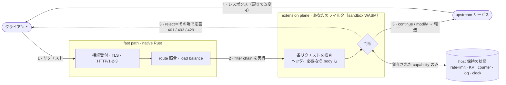

<div align="center">

# Plecto Proxy

**セルフホスト可能・プログラマブルな L7 リバースプロキシ / API ゲートウェイ — Rust 製、WebAssembly で拡張可能。**

[](https://github.com/Kaikei-e/PlectoProxy/actions/workflows/ci.yml)
[](LICENSE)
[](https://doc.rust-lang.org/edition-guide/)
[](#現状とロードマップ)

[English](README.md) · 日本語

</div>

---

Plecto Proxy は、**相補関係にある二つの構成要素**を型付き [WIT](https://component-model.bytecodealliance.org/) 契約で結ぶ:

- **fast path**（native Rust）— 接続受付・TLS 終端・HTTP/1.1 · 2 · 3・ルーティング・ロードバランシング・upstream 管理。
- **extension plane**（WebAssembly Component Model フィルタ）— 各リクエストの*判断*（認証・書換・rate limit・WAF・ポリシー）。**任意の言語**で書き、`plecto:filter` 契約で差し込み、**無停止で差し替え**る。

リクエストのロジックはサンドボックス化された WASM コンポーネントとして走り、**ホストが明示的に貸した
能力以外には何も触れられない**——それを強制するのは規約ではなくサンドボックスである。


```mermaid
flowchart LR
    client(["クライアント"])
    upstream(["upstream サービス"])

    subgraph fast["fast path · native Rust"]
        direction TB
        edge["接続受付 · TLS · HTTP/1·2·3"]
        route["route 照合 · load balance"]
        edge --> route
    end

    subgraph ext["extension plane · あなたのフィルタ（sandbox WASM）"]
        direction TB
        inspect["各リクエストを検査<br/>ヘッダ、必要なら body も"]
        decide{"判断"}
        inspect --> decide
    end

    state[("host 保持の状態<br/>rate-limit · KV · counter · log · clock")]

    client -->|"1 · リクエスト"| edge
    route -->|"2 · filter chain を実行"| inspect
    decide -->|"3 · continue / modify → 転送"| upstream
    decide -.->|"3 · reject＝その場で応答<br/>401 / 403 / 429"| client
    upstream -->|"4 · レスポンス（戻りで改変可）"| client
    decide <-->|"貸与された capability のみ"| state
```

**continue**・**modify**・**reject**（*その場で*応答＝upstream に届かない）——これがメンタルモデルの
全て。フィルタは stateless で、覚えておくべきものは host 側にある。

> [!WARNING]
> **現状: 初期開発段階。** [現状とロードマップ](#現状とロードマップ)を参照。

## なぜ Plecto Proxy か

ゲートウェイは必ず「**カスタムロジックをどこに置くか**」にぶつかる。従来の答えにはそれぞれトレードオフがある:

| アプローチ | プロセス内の速さ | サンドボックス | 言語自由 | 無停止差替 |
| --- | :---: | :---: | :---: | :---: |
| 設定 / DSL | ✅ | ✅ | ❌ | ✅ |
| 本体に再コンパイル組込 | ✅ | ❌ | ❌ | ❌ |
| 別プロセス（`ext_proc`・サイドカー） | ❌ | ✅ | ✅ | ✅ |
| **WASM フィルタ — Plecto Proxy** | ✅ | ✅ | ✅ | ✅ |

先行するデータプレーン向け WASM フィルタの実践は、**プロセス内 WASM** がゲートウェイ方針を運べることを
示した——多くは当時の **module ABI** 上に。その後 **Component Model と WIT** が型付き・多言語・合成可能な
基盤として成熟し、Plecto Proxy はその上にネイティブに築く。自分で運用し、トラフィックも秘密も自分の
インフラに留めたいチームのために。第一看板は**供給網検証つき拡張性**——ロードする拡張への署名・SBOM・
capability 契約を必須ゲートとし、mesh を持ち込まない環境向けの**両方向 mTLS** を補完第二看板とする
（[ADR 000083](docs/ADR/000083.md)）。却下した代替案は [ADR 000001](docs/ADR/000001.md)。

## 設計テネット

> 安全 × ポータビリティ × セルフホスト性 × 運用の単純さ **＞** 機能網羅性 × 強い権限 × 分散デフォルト。

- **deny-by-default capability** — フィルタは貸与された host-API（log・clock・KV・counter・rate-limit・config）以外に到達できない。network・FS・socket は貸与されない限り不可。
- **判断は型で** — `decision` variant を返す。曖昧なフラグや暗黙の副作用にしない。
- **init と per-request を分離** — 高コスト初期化は `init` フックへ、ホット経路は軽く保つ。
- **フィルタはステートレス** — 状態は host KV に置く。だからプール再利用・スケール・無停止差替が決まる。
- **fail-closed** — trap や deadline 超過で素通り（fail-open）させない。
- **single-node first** — 一台で仕事は完結する。分散はオプトイン。
- **データプレーンで panic 禁止** — 一つの不正リクエストが worker を巻き込んではならない。

**判断の指針:** ポリシー・WAF・認証・書換 → フィルタ。TLS・ルーティング・LB・コネクションプール →
native（[ADR 000029](docs/ADR/000029.md)）。WASM 税は判断ロジックにのみ課され、pooled フィルタで
**≈ 1 µs/req**（[performance](performance/README.md)）。原典は
[docs/design-principles.ja.md](docs/design-principles.ja.md)。

## クイックスタート

署名付きコンテナイメージを検証し、いま検証した digest をそのまま実行する——前提は Docker だけ:

```bash
IMAGE=ghcr.io/kaikei-e/plecto
TAG=0.6.4   # 最新リリースを選ぶ: https://github.com/Kaikei-e/PlectoProxy/releases
DIGEST=$(docker buildx imagetools inspect "$IMAGE:$TAG" --format '{{json .Manifest.Digest}}' | tr -d '"')

docker run --rm ghcr.io/sigstore/cosign/cosign:v3.1.1 verify "$IMAGE@$DIGEST" \
  --certificate-identity-regexp 'https://github.com/Kaikei-e/PlectoProxy/\.github/workflows/release\.yml@.*' \
  --certificate-oidc-issuer https://token.actions.githubusercontent.com
```

manifest・スタンドイン backend・最初のプロキシ応答までのコピペ完結の全手順（5 分以内）は
**[docs/quickstart/](docs/quickstart/README.ja.md)**。署名付きバイナリ・`cargo install plecto`・
2 つの runtime capability profile は [docs/install.ja.md](docs/install.ja.md)。

自己完結デモが 9 つあり、認証・ロードバランシング・HTTP/1.1 · 2 · 3 の TLS 終端・hot reload・canary・
resilience を扱う。どれも**本番ロードパス**（署名 + SBOM 検証、fail-closed）でフィルタを読み、
貼り付け用の `curl` を表示する:

```bash
cd plecto
./examples/try.sh quickstart   # 起動・curl・後片付けまで自動（または `all`）
```

学習パスは [`plecto/examples/README.md`](plecto/examples/README.md)。
[`examples/multi-replica/`](plecto/examples/multi-replica/README.md) は docker compose の reference で、
drain 時の無欠損・レプリカ跨ぎの TLS resumption・downstream mTLS をスクリプトが実証する。

## いまできること

native fast path は「動くプロキシ」をとうに越えて成熟している。**HTTP/1.1・HTTP/2（ALPN）・
HTTP/3（QUIC）** を TLS 上で終端し——post-quantum 鍵交換を既定で優先、stateless な TLS 1.3
resumption、**両方向 mTLS**、opt-in の PROXY protocol v2——host · path-prefix · method · header ·
query を specificity 順で **routing**（weighted traffic split つき）し、ルートの filter chain を
ヘッダと body に回し、healthy な upstream へ **ロードバランシング**する（round-robin・weighted
least-request・weighted Maglev）。その背後に health check・outlier detection・circuit breaker・
二段 timeout・jittered retry が付く。upstream への脚は TLS+ALPN で再暗号化し DNS を再解決する。
WebSocket トンネルは end-to-end で成立する。inbound の admission control は接続数を全体*と*送信元 IP
単位で抑え、ingress の path 正規化が route 選択を信頼できる認証境界にする。出荷バイナリには SIGHUP
reload・graceful shutdown・OTLP export・フィルタの全ライフサイクルを覆う operator CLI が配線済み。

概念ごとの完全な表（各行に決定 ADR つき）と、**意図的に置いていないもの**の一覧は
**[docs/features.ja.md](docs/features.ja.md)**。

## フィルタを書く

フィルタはワールドを実装したコンポーネントにすぎない——同梱の例（Rust）:

```rust
wit_bindgen::generate!({ path: "../../../wit", world: "filter" });

struct FilterQuickstart;

impl Guest for FilterQuickstart {
    fn init() {}

    fn on_request(_req: HttpRequest) -> RequestDecision {
        RequestDecision::Continue
    }

    fn on_response(_req: HttpRequest, _resp: HttpResponse) -> ResponseDecision {
        // ヘッダを 1 つ付けて、`curl -i` で WASM フィルタが応答に触れたことを見せる。
        ResponseDecision::Modified(ResponseEdit {
            set_status: None,
            set_headers: vec![Header {
                name: "x-plecto".into(),
                value: b"hello-from-wasm".to_vec(), // list<u8> ヘッダ値（@0.3.0）
            }],
            remove_headers: vec![],
        })
    }
}

export!(FilterQuickstart);
```

これは header-only の `filter` world を対象にしているので、host は body を素通しする。body が要る
フィルタは `filter-body` を対象にし export を 1 つ追加する。最短経路は
`plecto new-filter --lang rust my-filter`——クレートを scaffold し、WIT 契約を vendoring し、
すぐ動く dev manifest を書き出す。

契約が WIT なので、**WASM コンポーネントへコンパイルできる言語ならどれでもフィルタを書ける**。
それを二段構えで証明している。**Tier A（zero-WASI、既定）**: 同一の conformance サブセットを
**MoonBit**・**JavaScript/TypeScript**・**C** へ移植し、いずれも **WASI import ゼロ**のまま、Rust
フィクスチャと同じアサーション群で検証する。**Tier B（feature-gated・既定 off）**: ランタイムが WASI
baseline を必須とする言語には固定の最小スライスを貸す——filesystem・socket は依然ゼロ——フィルタ単位で
opt-in する。**Go/TinyGo** が最初の Tier B ゲスト。

契約・scaffold・ビルド・manifest・署名・言語別レシピ・互換ポリシーまでの完全な手引きは
**[docs/writing-a-filter.md](docs/writing-a-filter.md)**（英語）。現行契約は
**`plecto:filter@0.3.0`**、`0.1.0` / `0.2.0` もロード可能。

## ドキュメント

| ページ | 内容 |
| --- | --- |
| [クイックスタート](docs/quickstart/README.ja.md) | 検証済みイメージ → 最初のプロキシ応答まで 5 分以内 |
| [インストール](docs/install.ja.md) | イメージ・署名付きバイナリ・`cargo install`・capability profile |
| [機能一覧](docs/features.ja.md) | いま実装済みのもの、各行に決定 ADR つき |
| [フィルタを書く](docs/writing-a-filter.md) | 契約・scaffold・manifest・署名・他言語（英語） |
| [リファレンスフィルタ](docs/reference-filters.md) | 署名付き OCI の棚: JWT・CORS・API キー・ext-authz（英語） |
| [運用](docs/operations.ja.md) | drain / readiness 契約・healthcheck・CI pre-flight |
| [Hardening](docs/hardening.ja.md) | マルチレプリカの意味論——host 保持の状態は node-local |
| [設計原則](docs/design-principles.ja.md) | 原則・配置決定木・非目標 |
| [ADR](docs/ADR/) | 全ての load-bearing な判断（判断 / 根拠 / 再検討条件）。契約互換の段階的約束（[000085](docs/ADR/000085.md)）と寿命 / EOL プロトコル（[000086](docs/ADR/000086.md)）を含む |
| [検証マップ](docs/verification.ja.md) | 何を・どの workflow で・いつ検証しているか |
| [ロードマップ](docs/ROADMAP.md) | マイルストーン単位の着地状況（英語） |
| [performance](performance/README.md) | ベンチマークの write-up と結果（英語） |

## 現状とロードマップ

ADR ファーストで、マイルストーン単位に作る。**着地済み**: 基盤（**M0** — 契約・ホスト・能力境界・CI）、
フィルタランタイムの堅牢化（**M1**）、provenance ＋ 無停止リロード（**M4**）。**進行中**: データ経路
（**M2**）、async & ボディ（**M3** — Stage 1–2 着地、streaming は実験的）、可観測性（**M5** —
オプトイン分散は deferred）、polyglot（**M6** — 例フィルタと conformance CI は着地、SDK は未着手）。
項目ごとの詳細と決定 ADR は [`docs/ROADMAP.md`](docs/ROADMAP.md)。

## コントリビュート

コントリビュートは deliberate に扱う: **PR を出す前に issue か
[Discussion](https://github.com/Kaikei-e/PlectoProxy/discussions) で方針を合意してほしい**
（事前合意のない PR は close されることがある）。Plecto Proxy は outside-in TDD（E2E →
WIT-conformance → unit）に従い、load-bearing な判断を ADR に記録する。完全な手引きは
[CONTRIBUTING.md](CONTRIBUTING.md)。PR 前のローカル CI パリティは `just check`、または:

```bash
cd plecto
cargo fmt --all -- --check
cargo clippy --all-targets --all-features -- -D warnings
cargo test --all
```

セキュリティ上の問題は public issue ではなく [SECURITY.md](SECURITY.md) の窓口へ。

## ライセンス

**Apache License, Version 2.0** — [LICENSE](LICENSE) 参照。特許付与条項はインフラ・プロジェクトに適し、
クラウドネイティブ周辺で広く使われている。

## 先行研究 & 謝辞

Plecto Proxy は [Bytecode Alliance](https://bytecodealliance.org/) のスタック——
[wasmtime](https://wasmtime.dev/)・[WIT と Component
Model](https://component-model.bytecodealliance.org/)——と、プロセス内 WASM がデータプレーン方針を
運べることを示した業界の蓄積の上に立つ。他の拡張モデルとの立ち位置は
[ADR 000067](docs/ADR/000067.md) に、製品名ではなくモデルの型で記録している。

listener が実装する PROXY protocol（[ADR 000057](docs/ADR/000057.md)）は HAProxy Technologies が
保守する公開仕様であり、multi-replica reference は例示の L4 ロードバランサとして HAProxy を使っている。
HAProxy は HAProxy Technologies の商標であり、本プロジェクトは同社と提携しておらず、同社の
endorsement を受けてもいない。
