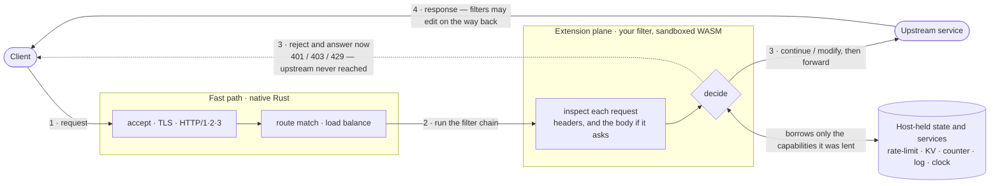
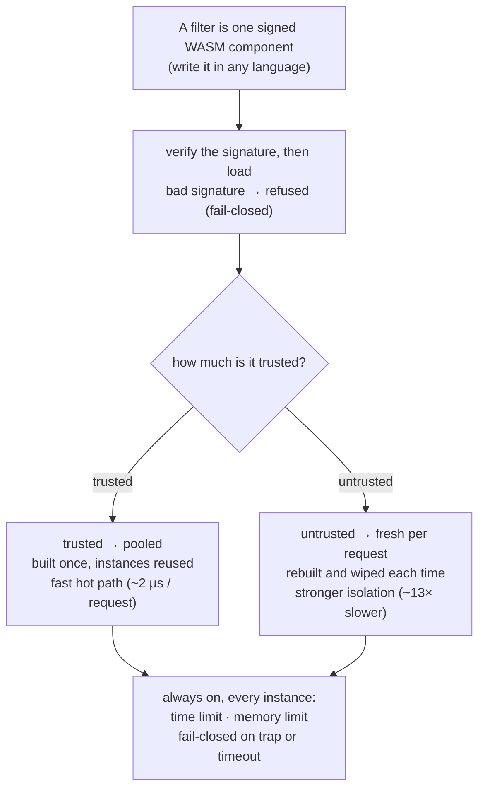

<div align="center">

# Plecto

**A self-hostable, programmable L7 reverse proxy & API gateway — in Rust, extended with WebAssembly.**

[](https://github.com/Kaikei-e/Plecto/actions/workflows/ci.yml)
[](LICENSE)
[](https://doc.rust-lang.org/edition-guide/)
[](#roadmap)

English · [日本語](README.ja.md)

</div>

---

Plecto pairs **two complementary halves** through a typed [WIT](https://component-model.bytecodealliance.org/) contract:

- a **fast path** in native Rust — connection handling, TLS termination, HTTP/1.1·2·3, routing, load balancing, and upstream management;
- an **extension plane** of **WebAssembly Component Model filters** — the per-request *decisions* (auth, header/body rewriting, rate limiting, WAF, policy) that you write in **any language**, plug in over the `plecto:filter` contract, and **hot-swap with zero downtime**.

The speed-critical path stays native Rust. Your request logic runs as a sandboxed WASM component that can touch **only** the capabilities the host explicitly lends it — enforced by the sandbox, not by convention.

> [!WARNING]
> **Status: early development.** The design is settled (26 ADRs) and the foundation runs end to end: the `plecto:filter` contract, a wasmtime host that loads and runs filters, and a **fast path** that terminates **HTTP/1.1, HTTP/2 (ALPN), HTTP/3 (QUIC)** and **TLS**, routes by host + path prefix, propagates the client IP in an edge model, and **load-balances across healthy upstream instances** (round-robin + active/passive health, per-upstream timeout, request-level retry). The full suite is green on CI — a foundation you can read, run, and build filters against. See the [Roadmap](#roadmap).

## Why Plecto?

Every gateway eventually faces the same question: **where does custom logic go?** The classic answers each involve trade-offs:

| Approach | In-process speed | Sandboxed | Any language | Hot-swap |
| --- | :---: | :---: | :---: | :---: |
| Config / DSL | ✅ | ✅ | ❌ | ✅ |
| Recompile into the binary | ✅ | ❌ | ❌ | ❌ |
| Out-of-process (`ext_proc`, sidecar) | ❌ | ✅ | ✅ | ✅ |
| **WASM filters — Plecto** | ✅ | ✅ | ✅ | ✅ |

Running data-plane filters as WASM is an idea **Envoy and proxy-wasm pioneered and proved** over the better part of a decade — Plecto owes them the core insight. proxy-wasm targets the earlier WASM ABI (v0.2.1); since then the **Component Model and WIT** have matured into a typed, polyglot, composable foundation, and Plecto explores what a gateway looks like when it is built natively on them. High-performance Rust proxies such as **Cloudflare's Pingora** likewise show how fast a native data path can be. Plecto's particular focus is **pairing that native speed with a Component-Model extension plane** — for teams who want to self-host and keep their traffic and secrets on their own infrastructure, with **data sovereignty** as a first principle.

See [ADR 000001](docs/ADR/000001.md) for the full rationale and rejected alternatives.

## Design tenets

> Safety × portability × self-hostability × operational simplicity **＞** feature breadth × broad privilege × distributed-by-default.

- **Deny-by-default capabilities** — a filter can reach nothing but the host-API explicitly lent to it (KV, counter, metrics, log, clock, random). No outbound network, filesystem, or sockets unless granted. Enforced by the Component Model sandbox.
- **Decisions are typed** — a filter returns a `decision` variant: `continue` / `modified` / `short-circuit`. Never an ambiguous flag or an implicit side effect.
- **Init vs per-request** — expensive setup (regex compile, schema build) goes in an `init` hook; the per-request hot path stays lean.
- **Filters are stateless** — rate-limit, session, and cache state live in host KV, so filters pool, scale, and hot-swap cleanly.
- **Fail-closed** — a filter trap or deadline overrun never silently passes traffic through.
- **Single-node first** — one node completes the job; distribution (membership, config consensus) is opt-in.
- **No panics in the data plane** — a single bad request must never take down a worker.

## Architecture

Plecto is a fast **native highway** plus a **checkpoint where your own code runs**. The highway
(native Rust) accepts connections, terminates TLS, speaks HTTP, routes and load-balances. The
checkpoint is the **extension plane**: every request is handed to your *filter* — a small sandboxed
WASM program — which **inspects it and returns one of three decisions**. That decision is where the
policy lives.



The three decisions are the whole mental model: **continue** (pass through), **modify** (rewrite a
header/body, then pass), or **reject** (answer the client *now* — a `401/403/429` that **never
reaches the upstream**, so bad traffic is shed at the edge). The filter is **stateless**: anything it
needs to remember (a counter, a rate-limit bucket, a cached value) lives in the host, and it can call
**only** the host services it was explicitly lent — nothing else (deny-by-default).

A filter is just a signed WASM component, and the **same** component can run two ways depending on
how much you trust it — which is the single biggest performance lever:



**Rule of thumb:** user-specific logic / policy / WAF / auth / rewrite → a WASM filter; TLS / routing / LB / connection pools / global counters → native Rust. The WASM "tax" (data copy + host-call overhead) is charged only to request-decision logic, never to the speed path — measured at **~2 µs/request** for a pooled filter ([performance](performance/README.md)).

## The filter contract

The heart of Plecto is the `plecto:filter` WIT world — a custom world that defines Plecto's own vocabulary (the typed `decision`, init/per-request hooks, the deny-by-default host-API) while reusing standard types for polyglot compatibility.

```wit
package plecto:filter@0.1.0;

interface types {
  // The typed outcome of a request-side filter. Never a bare flag.
  variant request-decision {
    %continue,                       // pass unchanged to the next filter
    modified(request-edit),          // apply the edit, then continue
    short-circuit(http-response),    // stop the chain; synthesise a response now
  }
}

// deny-by-default: one capability per interface; a filter imports only what it is lent.
interface host-kv      { get: func(key: string) -> option<list<u8>>; set: func(key: string, value: list<u8>); /* … */ }
interface host-counter { increment: func(key: string, delta: s64) -> s64; /* atomic named counter */ }
interface host-log     { log: func(level: level, message: string); }
// host-ratelimit keeps the token bucket host-native — the hot-path refill/counting never crosses
// the WASM boundary. The bucket spec (capacity/refill) is host-configured in the manifest; the
// filter passes only (key, cost), so an untrusted filter cannot widen its own limit (ADR 000005 / 000026).

world filter {
  // granted capabilities only — log · clock · kv · counter · rate-limit
  import host-log;  import host-clock;  import host-kv;  import host-counter;  import host-ratelimit;
  export init: func();                                        // heavy, once per instance
  export on-request:      func(req: http-request)  -> request-decision;       // hot path (headers)
  export on-request-body: func(body: list<u8>)     -> request-body-decision;  // body hook (ADR 000025)
  export on-response:     func(resp: http-response) -> response-decision;     // hot path (headers)
}
```

> v0.1.0 started **sync + header-only**; the request-side **body hook** is now wired **end-to-end** — `on-request-body` (buffer-then-decide; the body is a buffered `list<u8>` in v1, [ADR 000025](docs/ADR/000025.md)) runs through the contract, the host, **and the fast path**, so a filter can transform or short-circuit on the body, not just headers. The host buffers the body **bounded** (16 MiB cap, fail-closed 413); a bodyless request and a filter-less route keep the zero-copy streaming path. Host-side async (M3 Stage 1, [ADR 000021](docs/ADR/000021.md)) is in. Still ahead: `stream<u8>` true-streaming (so large bodies need not be buffered) and `wasi:http` type reuse once the P3 guest toolchain settles — see [ADR 000003](docs/ADR/000003.md) / [ADR 000020](docs/ADR/000020.md).

## Writing a filter

A filter is just a component that implements the world. Here is the included example (`examples/filters/filter-hello`), in Rust:

```rust
wit_bindgen::generate!({ path: "../../../wit", world: "filter" });

struct FilterHello;

impl Guest for FilterHello {
    fn init() {}

    fn on_request(req: HttpRequest) -> RequestDecision {
        host_log::log(host_log::Level::Info, "filter-hello: on-request");
        if req.headers.iter().any(|h| h.name.eq_ignore_ascii_case("x-plecto-block")) {
            RequestDecision::ShortCircuit(HttpResponse { status: 403, /* … */ })
        } else {
            RequestDecision::Continue
        }
    }

    fn on_response(_: HttpResponse) -> ResponseDecision { ResponseDecision::Continue }
}

export!(FilterHello);
```

Because the contract is WIT, **any language that compiles to a WASM component can write a filter** — Rust, Go (TinyGo), JavaScript/TypeScript (`jco`), or Python (`componentize-py`). Polyglot filter SDKs are on the [roadmap](#roadmap).

A complete how-to — scaffold, build, the manifest field reference, signing, and local testing — is in [**Writing a filter**](docs/writing-a-filter.md). A copy-ready starting point with the contract already vendored lives in [`examples/filters/filter-template`](plecto/examples/filters/filter-template).

## Try it

The repository pins its toolchain and WASM target in
[`plecto/rust-toolchain.toml`](plecto/rust-toolchain.toml), so [`rustup`](https://rustup.rs/) sets
up the right Rust (edition 2024) and the `wasm32-unknown-unknown` target on your first build — no
manual `rustup target add` step.

```bash
# Build and test everything. The host build script compiles the example filter to a
# WASM component and the tests load it into the wasmtime host and exercise the contract.
cd plecto
cargo test --all
```

(Building outside that toolchain? Add the target once: `rustup target add wasm32-unknown-unknown`.)

The suite proves the slice end-to-end: a request flows through the host into a real filter component, the typed `decision` round-trips, and the filter reaches **only** the capabilities it was lent (the example component imports `plecto:filter/*` and nothing else — zero WASI, network, or filesystem access).

### Run the demos

Five self-contained, use-case-focused demos live under `examples/<name>/`. Each wires the **production load path** (sign + offline OCI layout + verify + load, all fail-closed), starts a tiny upstream, serves a real proxy, and prints copy-paste `curl` commands on startup.

The quickest way to see one work end to end is the guided tour — it starts the demo, waits for it, runs the `curl` commands, visualizes the output, and cleans up:

```bash
cd plecto
./examples/try.sh <name>      # or `all`; or `just demo <name>` from the repo root
```

Prefer to drive it yourself? Run the server directly and use the `curl` recipes it prints on startup:

```bash
cargo run -p plecto-server --example <name>   # Ctrl-C to stop
```

| `<name>` | What it shows |
| --- | --- |
| `wasm-auth` | **A real WASM filter doing real work** — a signed API-key auth component (`examples/filters/filter-apikey`) that 401s without a valid key, stamps the caller's identity, and counts per-user requests in host KV. The point of Plecto. |
| `load-balancing` | One upstream over three instances: round-robin across the healthy set, active health probes, ejection when an instance goes unhealthy, and 503 when none are left (ADR 000017). |
| `filter-chain` | The filter chain over plain HTTP: continue / modify (header rewrite) / short-circuit 403 / host-native rate limit. |
| `tls-http` | TLS termination with HTTP/1.1, HTTP/2 (ALPN) and HTTP/3 (QUIC) on one port, plus `Alt-Svc` h3 advertisement. |
| `hot-reload` | Edit the manifest, `kill -HUP <pid>`, and watch the config swap atomically with zero downtime (a broken edit is fail-closed). |

Read `wasm-auth` first: it shows custom request logic running as a sandboxed component that can touch only the host-API it was lent — cosign-style signature + SBOM verification, the typed `decision`, and host-held state, end to end.

Two more examples under `examples/` are micro-benchmarks rather than demos — `wasm-bench` and `edge-bench` — and produce the numbers in [performance](performance/README.md).

## Roadmap

Plecto is built ADR-first; each milestone realizes specific design decisions in `docs/ADR/`.

- **M0 — Foundation** ✅ *(done)*
  The `plecto:filter@0.1.0` contract, a wasmtime host that loads & runs filters, a deny-by-default capability boundary (log / clock / kv), an example filter, E2E/conformance/unit tests, and CI. — [ADR 1](docs/ADR/000001.md) · [2](docs/ADR/000002.md) · [10](docs/ADR/000010.md)
- **M1 — Filter runtime hardening** ✅ *(landed)*
  Trust-branched instances: trusted filters reuse a fixed-capacity, lazily-filled **pool** checked out per request (bounded-wait fail-closed, pool-wide circuit breaker, recycle-after-N); untrusted run **fresh-per-request** (linear memory fresh by construction). redb-backed host KV + atomic counters + **host-native token-bucket rate limiting** (bucket spec host-set in the manifest, keyed per request — an untrusted filter cannot widen its own limit, [ADR 26](docs/ADR/000026.md)), per-filter key namespacing, **epoch metering + memory/table limits**. The trusted/untrusted split is *forced* (not just perf) by the init/zeroization knot.
- **M2 — The data path (fast path)** 🚧 *(slices 1–6 landed)*
  A tokio + hyper + quinn `plecto-server` that terminates **HTTP/1.1, HTTP/2 (ALPN) and HTTP/3 (QUIC)** and **TLS** (rustls, manifest-declared certs, fail-closed), routes by host + path prefix, runs the route's filter chain via a `spawn_blocking` bridge to the M1 pool, and **load-balances across healthy upstream instances** — active/passive health checks (pessimistic start, fail-closed 503 when none healthy), edge-model client-IP propagation (re-issue `X-Forwarded-For` / `X-Real-IP` from the real peer), a per-upstream request timeout (504), and bounded request-level retry onto another instance. *Next:* upstream TLS, least-conn/EWMA.
- **M4 — Provenance & zero-downtime reload** ✅ *(landed)*
  OCI-artifact filter distribution (offline image-layout, digest-pinned) + cosign signature verification + SBOM↔component binding, and content-hash-reconciled hot reload from a declarative manifest (atomic `ArcSwap`, all-or-nothing, SIGHUP-driven). What remains is a *remote* registry fetch path (the `wkg` boundary, out-of-band by design). — [ADR 6](docs/ADR/000006.md) · [8](docs/ADR/000008.md)
- **M5 — Observability & opt-in distribution** 🚧 *(span/metrics core landed; export deferred)*
  **Landed:** host-propagated W3C trace context (inbound `traceparent` continued through the proxy), one span per filter execution over the OpenTelemetry data model, and a sync `TelemetrySink` (in-memory + host-aggregated RED metrics). **Deferred:** OTLP network export (`wasi-otel` / SDK exporter, named-deferred to stay no-tokio) and opt-in `foca`/`openraft` config consensus. — [ADR 7](docs/ADR/000007.md) · [9](docs/ADR/000009.md)
- **M3 — Async & bodies** 🚧 *(Stage 1 landed; Stage 2 in progress)*
  The frontier, since M4/M5 are largely done. **Stage 1 (landed):** [wasmtime 46](https://github.com/bytecodealliance/wasmtime/releases/tag/v46.0.0) (2026-06-22) made WASI 0.3 + Component Model async default-on; the host runs guest hooks via `call_async` on wasmtime fibers, bridged to its still-sync public API with `block_on`. **Stage 2 (in progress):** the request-side **body hook** is wired **end-to-end** — `on-request-body` (buffer-then-decide; body as a buffered `list<u8>` in v1) through the contract, the host, **and the fast path** (the proxy buffers a filtered route's body bounded — 16 MiB cap, fail-closed 413 — while bodyless requests and filter-less routes stay zero-copy), conformance- and E2E-green ([ADR 25](docs/ADR/000025.md)). Next: `stream<u8>` true-streaming (large bodies need not be buffered) and `wasi:http` convergence, which stay gated on the P3 guest toolchain (`wasm32-wasip3` Tier-2, wit-bindgen async). [ADR 20](docs/ADR/000020.md) keeps the convergence direction — deny-by-default independent of the type vocabulary.
- **M6 — Polyglot SDKs & reference filters**
  Go / JS / Python filter templates and reference auth / rate-limit / WAF filters.

## Project layout

```
.
├── plecto/                    # Rust workspace (the native half)
│   ├── wit/world.wit          # the plecto:filter contract (contract-first)
│   ├── deny.toml              # cargo-deny supply-chain policy (CI-blocking)
│   ├── crates/
│   │   ├── host/              # wasmtime embedding: Linker, InstancePre, host-API (+ CONTEXT.md)
│   │   ├── control/           # control plane: manifest, OCI load, chain, reload, TLS/QUIC (+ CONTEXT.md)
│   │   └── server/            # fast path: HTTP/1.1·2 (hyper) + HTTP/3 (quinn), routing, LB, upstream (+ CONTEXT.md)
│   └── examples/              # runnable demos (<use-case>/) + example filter guests (filters/)
│       ├── <use-case>/        # five demos: cargo run -p plecto-server --example <name>
│       └── filters/           # example plecto:filter guests (own workspace, componentized by build.rs)
│           ├── filter-hello/  # conformance-fixture filter (wasm32-unknown-unknown guest)
│           ├── filter-apikey/ # real-world example filter: API-key auth gate (WASM component)
│           └── filter-template/ # copy-ready starting point for your own filter (vendored WIT)
├── docs/ADR/                  # Architecture Decision Records (000001–000026)
├── CLAUDE.md                  # project conventions & design summary
└── CONTEXT-MAP.md             # domain glossary map (split per context)
```

## Design decisions

Plecto records every load-bearing decision as an ADR in the Fork form (*decision / rationale / re-examination condition*). All 26 live in [`docs/ADR/`](docs/ADR/) — start at [ADR 000001](docs/ADR/000001.md) (the two complementary halves); each cross-links the decisions it builds on.

## Contributing

Contributions are deliberate: please **agree an approach in an issue or [Discussion](https://github.com/Kaikei-e/Plecto/discussions) before opening a PR** (unsolicited PRs may be closed). Plecto follows outside-in TDD (E2E → WIT-conformance → unit) and records load-bearing decisions as ADRs. See [CONTRIBUTING.md](CONTRIBUTING.md) for the full guide — including the areas that need extra care and DCO sign-off — and [CLAUDE.md](CLAUDE.md) for conventions. Local CI parity before a PR:

```bash
cd plecto
cargo fmt --all -- --check
cargo clippy --all-targets --all-features -- -D warnings
cargo test --all
```

(or just `just check` from the repository root.)

## License

Licensed under the **Apache License, Version 2.0** — see [LICENSE](LICENSE). The Apache-2.0 patent grant suits an infrastructure project; it is the license used by Envoy, Linkerd, and containerd.

## Prior art & acknowledgements

Plecto stands on the shoulders of [Envoy](https://www.envoyproxy.io/) / [proxy-wasm](https://github.com/proxy-wasm), [Cloudflare Pingora](https://github.com/cloudflare/pingora), and the [Bytecode Alliance](https://bytecodealliance.org/) — [wasmtime](https://wasmtime.dev/), [WIT, and the Component Model](https://component-model.bytecodealliance.org/).
