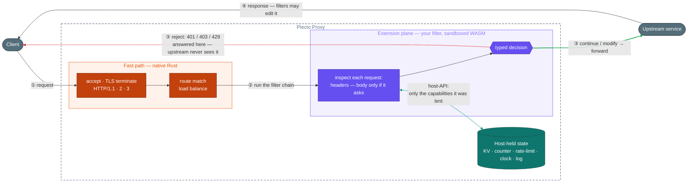

<div align="center">

# Plecto Proxy

**A self-hostable, programmable L7 reverse proxy & API gateway — in Rust, extended with WebAssembly.**

[](https://github.com/Kaikei-e/PlectoProxy/actions/workflows/ci.yml)
[](LICENSE)
[](https://doc.rust-lang.org/edition-guide/)
[](#status--roadmap)

English · [日本語](README.ja.md)

</div>

---

Plecto Proxy pairs **two complementary halves** through a typed [WIT](https://component-model.bytecodealliance.org/) contract:

- a **fast path** in native Rust — connections, TLS termination, HTTP/1.1 · 2 · 3, routing, load balancing, upstream management;
- an **extension plane** of **WebAssembly Component Model filters** — the per-request *decisions* (auth, rewriting, rate limiting, WAF, policy) that you write in **any language**, plug in over the `plecto:filter` contract, and **hot-swap with zero downtime**.

Your request logic runs as a sandboxed WASM component that can touch **only** the capabilities the
host explicitly lends it — enforced by the sandbox, not by convention.


```mermaid
flowchart LR
    client(["Client"])

    subgraph proxy["Plecto Proxy"]
        direction LR
        subgraph fast["Fast path — native Rust"]
            edge["accept · TLS terminate<br/>HTTP/1.1 · 2 · 3"]
            route["route match<br/>load balance"]
            edge --> route
        end

        subgraph ext["Extension plane — your filter, sandboxed WASM"]
            inspect["inspect each request:<br/>headers — body only if it asks"]
            decide{{"typed decision"}}
            inspect --> decide
        end

        state[("Host-held state<br/>KV · counter · rate-limit · clock · log")]
    end

    upstream(["Upstream service"])

    client -- "① request" --> edge
    route -- "② run the filter chain" --> inspect
    decide -- "③ continue / modify → forward" --> upstream
    decide -. "③ reject: 401 / 403 / 429<br/>answered here — upstream never sees it" .-> client
    upstream -- "④ response — filters may edit it" --> client
    inspect <-. "host-API:<br/>only the capabilities it was lent" .-> state

    classDef endpoint fill:#546e7a,stroke:#37474f,color:#ffffff
    classDef fastNode fill:#c2410c,stroke:#7c2d12,color:#ffffff
    classDef wasmNode fill:#654ff0,stroke:#4527a0,color:#ffffff
    classDef stateNode fill:#0f766e,stroke:#134e4a,color:#ffffff
    class client,upstream endpoint
    class edge,route fastNode
    class inspect,decide wasmNode
    class state stateNode

    style proxy fill:transparent,stroke:#64748b,stroke-width:1.5px,stroke-dasharray:6 4,color:#64748b
    style fast fill:#e8590c14,stroke:#e8590c,color:#e8590c
    style ext fill:#654ff014,stroke:#654ff0,color:#8b7bff

    linkStyle 4 stroke:#16a34a,stroke-width:2px
    linkStyle 5 stroke:#dc2626,stroke-width:2px
    linkStyle 7 stroke:#0d9488,stroke-width:2px
```

**Continue**, **modify**, or **reject** (answer the client *now* — the upstream is never reached)
is the whole mental model. The filter is stateless: anything it must remember lives in the host.

> [!WARNING]
> **Status: early development.** See [Status & roadmap](#status--roadmap).

## Why Plecto Proxy?

Every gateway eventually faces the same question: **where does custom logic go?** The classic answers each involve trade-offs:

| Approach | In-process speed | Sandboxed | Any language | Hot-swap |
| --- | :---: | :---: | :---: | :---: |
| Config / DSL | ✅ | ✅ | ❌ | ✅ |
| Recompile into the binary | ✅ | ❌ | ❌ | ❌ |
| Out-of-process (`ext_proc`, sidecar) | ❌ | ✅ | ✅ | ✅ |
| **WASM filters — Plecto Proxy** | ✅ | ✅ | ✅ | ✅ |

Earlier data-plane filter work proved **in-process WASM** can carry gateway policy, typically on
the older **module ABI**. The **Component Model and WIT** have since matured into a typed,
polyglot, composable foundation, and Plecto Proxy builds on that natively — for teams who
self-host and keep traffic and secrets on their own infrastructure. It leads with
**supply-chain-verified extensibility**: signature, SBOM, and capability contract as a mandatory
gate on what you load, with **mesh-less mutual TLS** as the complementary second banner
([ADR 000083](docs/ADR/000083.md)). Rejected alternatives: [ADR 000001](docs/ADR/000001.md).

## Design tenets

> Safety × portability × self-hostability × operational simplicity **＞** feature breadth × broad privilege × distributed-by-default.

- **Deny-by-default capabilities** — a filter reaches nothing but the host-API lent to it (log, clock, KV, counter, rate-limit, config). No network, filesystem, or sockets unless granted.
- **Decisions are typed** — a `decision` variant, never an ambiguous flag or an implicit side effect.
- **Init vs per-request** — expensive setup goes in an `init` hook; the hot path stays lean.
- **Filters are stateless** — state lives in host KV, so filters pool, scale, and hot-swap cleanly.
- **Fail-closed** — a trap or deadline overrun never silently passes traffic through.
- **Single-node first** — one node completes the job; distribution is opt-in.
- **No panics in the data plane** — one bad request must never take down a worker.

**Rule of thumb:** policy, WAF, auth, and rewriting go in a filter; TLS, routing, LB, and
connection pools stay native ([ADR 000029](docs/ADR/000029.md)). The WASM "tax" is paid only on
decision logic — pooled no-op dispatch is **≈ 4.5 µs/req** ([performance](performance/README.md)).
Canon: [docs/design-principles.md](docs/design-principles.md).

## Quick start

Verify the signed container image, then run the digest you just verified — Docker is the only
prerequisite:

```bash
IMAGE=ghcr.io/kaikei-e/plecto
TAG=0.11.2   # pick the latest release: https://github.com/Kaikei-e/PlectoProxy/releases
DIGEST=$(docker buildx imagetools inspect "$IMAGE:$TAG" --format '{{json .Manifest.Digest}}' | tr -d '"')

docker run --rm ghcr.io/sigstore/cosign/cosign:v3.1.1 verify "$IMAGE@$DIGEST" \
  --certificate-identity-regexp 'https://github.com/Kaikei-e/PlectoProxy/\.github/workflows/release\.yml@.*' \
  --certificate-oidc-issuer https://token.actions.githubusercontent.com
```

The full copy-paste flow — manifest, stand-in backend, first proxied response, under 5 minutes —
is **[docs/quickstart/](docs/quickstart/README.md)**. Signed binaries, `cargo install plecto`, and
the two runtime capability profiles are in [docs/install.md](docs/install.md).

Nine runnable demos cover auth, load balancing, TLS across HTTP/1.1 · 2 · 3, hot reload, canary,
and resilience — every demo that loads a filter loads it through the production path (signature +
SBOM verified, fail-closed) — and each prints the `curl` commands to run:

```bash
cd plecto
./examples/try.sh wasm-auth   # guided: runs it, curls it, cleans up (or `all`)
```

[`plecto/examples/README.md`](plecto/examples/README.md) is the learning path;
[`examples/multi-replica/`](plecto/examples/multi-replica/README.md) is a docker-compose reference
whose scripts prove drain-without-drops, cross-replica TLS resumption, and downstream mTLS.

## What it does today

The native fast path has matured well past "a proxy that works." It terminates **HTTP/1.1,
HTTP/2 (ALPN), and HTTP/3 (QUIC)** over TLS — post-quantum key exchange preferred by default,
stateless TLS 1.3 resumption, **mutual TLS in both directions**, opt-in PROXY protocol v2. It
**routes** by host · path-prefix · method · header · query in specificity order with weighted
traffic split, runs the route's filter chain over headers and the body, and **load-balances**
across healthy upstreams (round-robin, weighted least-request, weighted Maglev) behind health
checks, outlier detection, circuit breakers, two-tier timeouts, and jittered retry. Upstream legs
re-encrypt with TLS+ALPN and re-resolve from DNS; WebSocket tunnels splice end to end. Inbound
admission control caps connections globally *and* per source IP; ingress path normalization makes
route selection a reliable auth boundary. The binary wires SIGHUP reload, graceful shutdown, OTLP
export, and an operator CLI covering a filter's whole lifecycle — scaffold, dev loop, a
versioned conformance battery, packaging/signing, and a CI pre-flight of the loader's own
provenance gate.

**[docs/features.md](docs/features.md)** is the full table, concern by concern, with the deciding
ADR on every row — and what is deliberately *not* there.

## Writing a filter

A filter is a component that implements the world — the in-tree example, in Rust:

```rust
wit_bindgen::generate!({ path: "../../../wit/v0.3.0", world: "filter" });

use crate::plecto::filter::types::{Header, ResponseEdit};

struct FilterQuickstart;

impl Guest for FilterQuickstart {
    fn init() {}

    fn on_request(_req: HttpRequest) -> RequestDecision {
        RequestDecision::Continue
    }

    fn on_response(_req: HttpRequest, _resp: HttpResponse) -> ResponseDecision {
        // Stamp a header, so `curl -i` shows a WASM filter touched the response.
        ResponseDecision::Modified(ResponseEdit {
            set_status: None,
            set_headers: vec![Header {
                name: "x-plecto".into(),
                value: b"hello-from-wasm".to_vec(), // list<u8> header values
            }],
            remove_headers: vec![],
        })
    }
}

export!(FilterQuickstart);
```

That targets the header-only `filter` world, so the host streams the body straight through; a
filter that needs the body targets `filter-body` and adds body exports (`on-request-body` /
`on-response-body` — any subset). The example pins the frozen `0.3.0` world it was written
against, which the host keeps loading. Start with `plecto new-filter --lang rust my-filter`,
which scaffolds the crate, vendors the current WIT contract, and writes a ready-to-run dev
manifest — or copy one of the three **tokenlimit starters**
(`filter-tokenlimit-{js,moonbit,go}`): one token-budget policy for LLM upstreams in three
languages, the first example guests written against `plecto:filter@0.4.0`.

Because the contract is WIT, **any language that compiles to a WASM component can write a filter**,
proven two ways. **Tier A (zero-WASI, the default)**: the same conformance subset ported to
**MoonBit**, **JavaScript/TypeScript**, and **C**, each with **zero WASI imports**, all driven
through the same assertion suite as the Rust fixture. **Tier B (feature-gated, off by default)**:
runtimes that hard-wire a WASI baseline get a fixed minimal slice — still zero filesystem, zero
sockets — opted into per filter. **Go/TinyGo** is the first Tier B guest.

The full how-to — contract, scaffold, build, manifest, signing, per-language recipes, and the
compatibility policy — is **[docs/writing-a-filter.md](docs/writing-a-filter.md)**. The current
contract is **`plecto:filter@0.4.0`**; `0.1.0`, `0.2.0` and `0.3.0` remain loadable.

## Upgrading: two independent version series

The proxy and the filter contract are versioned **separately**, and the separation is the point:

- **`plecto` (binary / image / library crates)** — the proxy itself: manifest schema, CLI, data
  plane, host.
- **`plecto:filter@<version>`** — the WIT contract between the proxy and your filters.

**Bumping the proxy never requires rebuilding a filter.** The host keeps loading every contract
version it ships support for, so a filter built against an older contract keeps running across
proxy upgrades — patch releases carrying security fixes included. Take them.

`plecto --version` prints the contract versions this binary accepts; one startup log line per
filter reports the version each of yours actually bound. Check the first covers the second and the
upgrade needs no filter work. A major contract version stays loadable for at least two release
series and its retirement is declared in its own ADR ([ADR 000085](docs/ADR/000085.md)), never
silently — the full rule, with the access log's field contract, is in
[docs/operations.md](docs/operations.md).

## Documentation

| Page | What it covers |
| --- | --- |
| [Quick start](docs/quickstart/README.md) | Verified image → first proxied response, under 5 minutes |
| [Install](docs/install.md) | Images, signed binaries, `cargo install`, capability profiles |
| [Features](docs/features.md) | What is implemented today, with the deciding ADR per row |
| [Writing a filter](docs/writing-a-filter.md) | Contract, scaffolding, manifest, signing, other languages |
| [Reference filters](docs/reference-filters.md) | The signed OCI shelf: JWT, CORS, API-key, ext-authz |
| [Operations](docs/operations.md) | Drain / readiness contract, healthchecks, CI pre-flight |
| [Hardening](docs/hardening.md) | Multi-replica semantics — host-held state is node-local |
| [Design principles](docs/design-principles.md) | Principles, placement decision tree, non-goals |
| [ADRs](docs/ADR/) | Every load-bearing decision: decision / rationale / re-examination — including the staged contract-compatibility promise ([000085](docs/ADR/000085.md)) and the longevity + EOL protocol ([000086](docs/ADR/000086.md)) |
| [Verification](docs/verification.md) | What is verified, in which workflow, and when |
| [Roadmap](docs/ROADMAP.md) | Milestone by milestone, landed and pending |
| [Performance](performance/README.md) | The benchmark write-up and results |

## Status & roadmap

Built ADR-first, milestone by milestone. Landed: the foundation (**M0** — contract, host,
capability boundary, CI), the hardened filter runtime (**M1**), and provenance + zero-downtime
reload (**M4**). In progress: the data path (**M2**), async and bodies (**M3** — Stages 1–2 landed,
streaming still experimental), observability (**M5** — opt-in distribution deferred), and polyglot
work (**M6** — example filters and conformance CI, no SDKs yet).
[`docs/ROADMAP.md`](docs/ROADMAP.md) has the detail and the deciding ADR per item.

## Contributing

Contributions are deliberate: please **agree an approach in an issue or
[Discussion](https://github.com/Kaikei-e/PlectoProxy/discussions) before opening a PR** (unsolicited
PRs may be closed). Plecto Proxy follows outside-in TDD (E2E → WIT-conformance → unit) and records
load-bearing decisions as ADRs; [CONTRIBUTING.md](CONTRIBUTING.md) is the full guide. Local CI
parity before a PR is `just check`, or:

```bash
cd plecto
cargo fmt --all -- --check
cargo clippy --all-targets --all-features -- -D warnings
cargo test --all
```

Security issues go through [SECURITY.md](SECURITY.md), not a public issue.

## License

**Apache License, Version 2.0** — see [LICENSE](LICENSE). The patent grant suits an infrastructure
project and is widely used across the cloud-native ecosystem.

## Prior art & acknowledgements

Plecto Proxy builds on the [Bytecode Alliance](https://bytecodealliance.org/) stack —
[wasmtime](https://wasmtime.dev/), [WIT and the Component
Model](https://component-model.bytecodealliance.org/) — and on a decade of industry work showing
in-process WASM can carry data-plane policy. Positioning relative to other extension models is in
[ADR 000067](docs/ADR/000067.md), by model type rather than product name.

The PROXY protocol implemented by the listener ([ADR 000057](docs/ADR/000057.md)) is the public
specification maintained by HAProxy Technologies; the multi-replica reference uses HAProxy as its
example L4 load balancer. HAProxy is a trademark of HAProxy Technologies — this project is not
affiliated with or endorsed by them.
