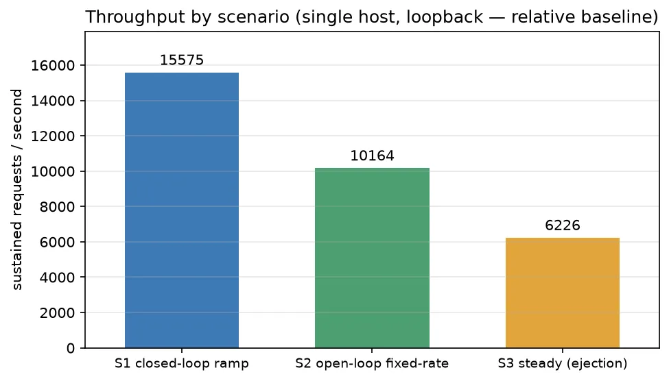
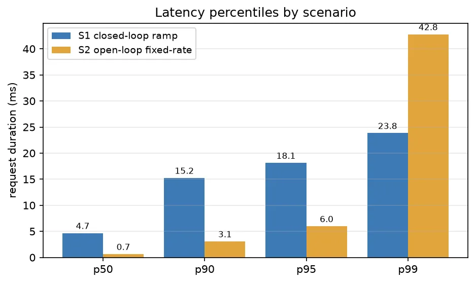

# Plecto Performance

A small, honest performance snapshot of Plecto's load-balancing fast path. The goal is
**transparency about method**, not a leaderboard. Numbers here are an internal regression
baseline; they are **not** a capacity guide and **not** a comparison against other proxies.

## TL;DR

- Under a closed-loop ramp, a single Plecto instance served a steady **~15k requests/second**
  with a **median ~5 ms** and **p99 ~24 ms**, zero failed requests across ~1.5M requests.
- Round-robin distribution across three upstream instances was **even** (≈ equal thirds).
- **Resilience behaved as designed**: ejecting one upstream shifted traffic to the survivors
  within ~1 s with **no client-visible errors**; a full upstream outage **failed closed with
  HTTP 503** (no hangs), and the pool **recovered within ~1 s** of health being restored.
- Reported tail latency depends heavily on the measurement model. We report the **open-loop**
  tail as the honest one (see [Methodology](#methodology--why-the-numbers-look-the-way-they-do)).

## Scope and honesty notes

- **Machine specifications are intentionally omitted.** All components — the load generator,
  Plecto, the upstream instances, and the metrics stack — ran **co-resident on a single
  commodity developer-class machine** over the loopback interface. Absolute throughput is
  therefore bounded by loopback and CPU contention on that one host, not by Plecto in
  isolation. Treat every absolute figure as a **relative / regression** signal.
- **Upstream backends were trivial** (tiny static responses, no upstream latency). This is
  deliberate: it isolates the **proxy + load-balancer overhead** rather than backend work.
- This run covers **plaintext HTTP/1.1** only (the configuration exercised by the bundled
  `examples/load-balancing`). HTTP/2 and HTTP/3 are out of scope here.
- We make **no comparative claims**. Mature open-source proxies are referenced only for
  shared methodology, not for ranking.

## Test environment

| Item | Value |
| --- | --- |
| Subject | Plecto fast path, round-robin LB over **3 upstream instances** |
| Health checking | active probe every **500 ms**, eject after **2** consecutive failures (≈ ~1 s) |
| Protocol | HTTP/1.1, plaintext |
| Topology | load generator, proxy, backends, and metrics all on one host (loopback) |
| Hardware | **intentionally omitted** (single commodity machine) |
| Load tool | [k6](https://grafana.com/docs/k6/latest/) (open- and closed-loop executors) |
| Visualization | InfluxDB + Grafana (self-hosted, local only) |

## Scenarios

Each scenario targets a single Plecto route (`/`) backed by one upstream pool of three
instances. The k6 executor configuration is given so the shape is unambiguous and reproducible.

### S1 — Throughput ramp (closed-loop)

Find achievable throughput and latency as concurrency rises. A closed-loop (VU) model: each
virtual user issues the next request only after the previous response.

```js
// k6 — ramping virtual users
scenarios: {
  ramping: {
    executor: 'ramping-vus', startVUs: 0,
    stages: [
      { duration: '15s', target: 50 },
      { duration: '30s', target: 50 },
      { duration: '15s', target: 200 },
      { duration: '30s', target: 200 },
      { duration: '10s', target: 0 },
    ],
  },
}
```

### S2 — Fixed arrival rate (open-loop)

Measure **coordinated-omission-safe** tail latency. An open-loop model sends at a constant
rate regardless of how quickly responses come back, so queueing shows up in the tail instead
of being hidden.

```js
// k6 — constant arrival rate (rate set to ~70% of the S1 closed-loop max)
scenarios: {
  constant_rate: {
    executor: 'constant-arrival-rate',
    rate: /* requests/sec */, timeUnit: '1s', duration: '45s',
    preAllocatedVUs: 200, maxVUs: 2000,
  },
}
```

### S3 — Resilience under load (open-loop + fault injection)

Hold a steady arrival rate and drive failures on a timeline to observe load-balancing and
fail-closed behavior. The upstreams expose a toggle that flips their health endpoint; the
harness drives the timeline below while k6 keeps sending traffic.

```
t ≈ 12 s   eject instance B               -> traffic should shift to A + C
t ≈ 24 s   restore instance B             -> B should rejoin the rotation
t ≈ 36 s   eject ALL instances            -> pool should fail closed (HTTP 503)
t ≈ 46 s   restore ALL instances          -> pool should recover
```

## Results

### Throughput and latency (indicative)

> Single co-resident host, loopback, trivial backends. For relative comparison and regression
> tracking only — not a capacity claim.

| Scenario | Model | Throughput | median | p95 | p99 | p99.9 | Failures |
| --- | --- | --- | --- | --- | --- | --- | --- |
| S1 ramp (→200 VUs) | closed-loop | ~15k req/s | ~4.7 ms | ~18 ms | ~24 ms | — | 0 |
| S2 fixed rate | open-loop | ~10k req/s sustained | ~0.7 ms | ~6 ms | ~43 ms | ~1.4 s | 0 |

In S2 the requested rate sat close to what this single host could sustain, so the open-loop
tail (p99.9 ≈ 1.4 s) climbed sharply and a fraction of iterations were shed by the generator.
That is expected and instructive: it marks where the host saturates, and it is **why we do not
quote the closed-loop p99 (~24 ms) as the tail** — see Methodology.





### Load-balancing behavior (the portable findings)

These observations are qualitative and do not depend on the host's specifications:


*Steady ~2k req/s split across three upstreams. At **eject b** instance B's share falls to zero
within ~1 s and the survivors carry on with **no failed requests**; at **eject all** the pool
fails closed and every request returns HTTP 503 until **restore all**, after which traffic
rebalances within ~1 s. (When only the middle instance is out, the round-robin skip sends its
share to the next instance rather than splitting it evenly — visible as the uneven a/c bands.)*

- **Even round-robin.** With all three instances healthy, traffic split into ≈ equal thirds.
- **Graceful ejection.** After instance B was driven unhealthy, its share dropped to zero
  within ~1 s (consistent with the 500 ms probe interval and a 2-failure threshold) and the
  surviving instances absorbed the load **with zero client-visible errors**.
- **Fail-closed, not fail-open.** With every instance unhealthy, Plecto returned **HTTP 503**
  promptly rather than hanging or forwarding blindly. During that window ~14% of requests
  received 503 — exactly the requests that arrived while no healthy upstream existed.
- **Fast recovery.** Restoring health returned instances to rotation within ~1 s.

## Methodology — why the numbers look the way they do

- **Open- vs closed-loop matters.** A closed-loop generator throttles itself whenever the
  server slows down, which quietly hides queueing and under-reports tail latency — the
  *coordinated omission* problem described by Gil Tene. An open-loop, fixed-rate generator
  keeps offering load and surfaces the real tail. We therefore treat the open-loop figures as
  authoritative for latency tails, and the closed-loop figures as a throughput ceiling.
- **One host, loopback.** Co-residency means the load generator competes with Plecto and the
  backends for CPU; absolute numbers would shift on dedicated hardware and a real network. We
  publish them only as a baseline to catch regressions between changes.
- **Prior art.** Open-source proxies and load tools have long published their methods openly —
  for example HAProxy documents both method and results for its benchmarks, and the
  fixed-rate / corrected-latency approach is standard in tools such as `wrk2` and k6. This
  report follows that spirit of disclosing *how* a number was produced, without reusing anyone
  else's text or figures.

## Reproducing

The subject is the bundled example:

```bash
cargo run --release -p plecto-server --example load-balancing   # proxy on 127.0.0.1:8080
```

Then drive it with k6 using the scenario shapes above (closed-loop ramp, fixed-rate open-loop,
and the S3 fault timeline). Any HTTP load generator that supports an open-loop / constant
arrival-rate mode can reproduce the latency-tail figures.

The charts above are regenerated from the measured CSVs under [`data/`](data/) with:

```bash
python3 performance/plot.py     # reads performance/data/*.csv -> performance/img/*.webp
```

`plot.py` needs only `matplotlib` (which brings `numpy` and `Pillow`; Pillow supplies the WebP
encoder). The per-second resilience timeline in `data/ejection_timeline.csv` comes from tagging
each response's `X-Instance` header onto a k6 counter and aggregating to 1-second buckets.

## Non-goals

- Not a sizing or capacity guide.
- Not a comparison against other proxies or load balancers.
- Not representative of production hardware, real networks, or non-trivial upstream work.

## References

- Gil Tene, *coordinated omission*, summarized in ScyllaDB's [On Coordinated Omission](https://www.scylladb.com/2021/04/22/on-coordinated-omission/).
- [k6 executors](https://grafana.com/docs/k6/latest/using-k6/scenarios/executors/) — closed-loop (VU) vs open-loop (arrival-rate) models.
- [wrk2](https://github.com/giltene/wrk2) — constant throughput with corrected latency recording.
- [OpenSearch — performance testing best practices](https://docs.opensearch.org/latest/benchmark/user-guide/optimizing-benchmarks/performance-testing-best-practices/) — general reproducibility guidance.
- [HAProxy benchmark transparency](https://www.haproxy.com/company/news/haproxy-kubernetes-ingress-controller-twice-as-fast-with-lowest-cpu-vs-four-competitors) — an example of publishing method alongside results.
