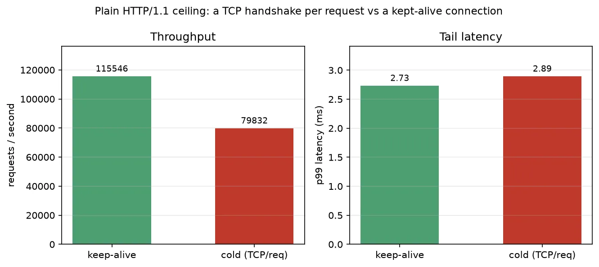
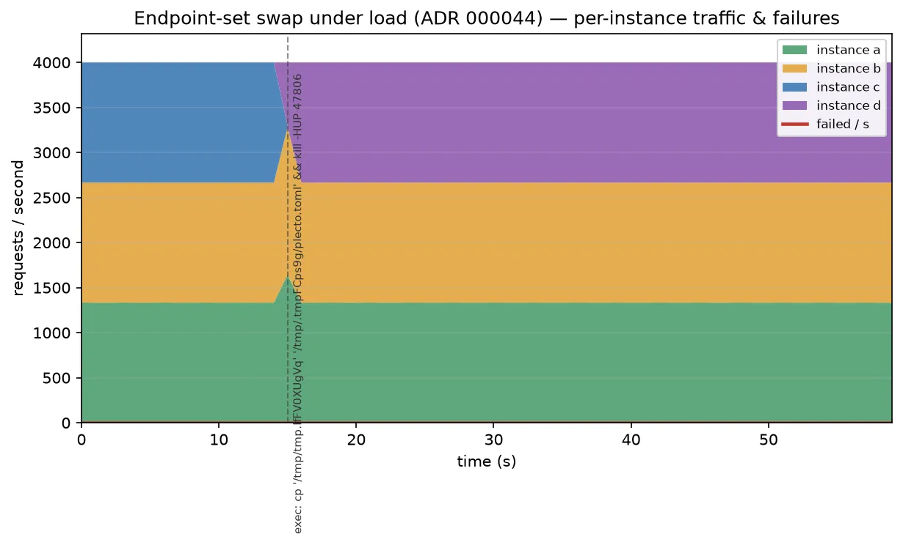
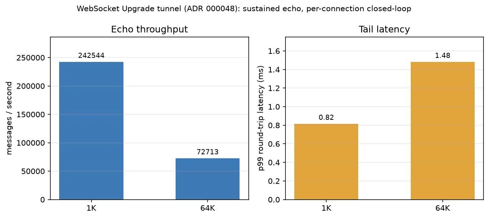

# Plecto Proxy Performance

An honest performance snapshot of Plecto Proxy's two halves: the **native load-balancing fast
path** and the **WASM extension plane** (per-request filters, host-enforced rate limiting, the
request-body hook). The goal is **transparency about method**, not a leaderboard. Every number
here is an internal **regression baseline** — not a capacity guide, and not a comparison against
other proxies.

All components — load generator, Plecto Proxy, the upstream instances, and any tooling — run
**co-resident on a single commodity developer host over loopback**, so absolute figures are
bounded by that host and by the generator, not by Plecto Proxy in isolation. Read them as **relative**
signals — ratios, curve shapes and time-constants, not headline throughput.

## Measurement setup

- **Core isolation by pinning.** Plecto Proxy (and its in-process backends) is pinned to one dedicated
  set of CPU cores; **every** load generator is pinned to a separate, disjoint set. The generator
  therefore never steals a core from the proxy — the run measures Plecto Proxy, not the generator
  fighting it. (Done with `taskset`; no privileged host tuning.)
- **No host tuning.** CPU governor / turbo are left at their defaults — no fixed-frequency lock.
  Absolute throughput shifts run-to-run with clock; the **ratios, shapes and time-constants** are
  the durable signal, so those are what we read.
- **Generators, by phase.** [k6](https://grafana.com/docs/k6/latest/) drives the closed-loop
  concurrency sweep (`constant-vus`), the mixed short-circuit run, and the rate-limit / body
  scenarios; **`plecto-loadgen openloop`** is the **authoritative** open-loop tail driver
  (constant arrival rate with **schedule-based latency** — the wrk2 / Gil Tene model; see
  [`bench/methodology.md`](../bench/methodology.md)); `OPENLOOP_GEN=k6` keeps the older
  `constant-arrival-rate` path for A/B. `plecto-loadgen` also runs the fault-injection timeline,
  the endpoint-set swap timeline, the round-robin count, and the WebSocket / TLS-handshake
  scenarios; and [oha](https://github.com/hatoo/oha) drives the single-route ceiling (plain h1,
  WASM W1, TLS) runs. Different generators have different ceilings — **numbers are comparable
  within a section, and across same-generator sections, but not blindly across all of them**.
  Each section names its generator.
- **Warm-up excluded.** Every measured window starts after a short warm-up (default 5 s) that
  sends load but is not recorded: in-script for k6 and plecto-loadgen, a discarded pre-run for
  oha. Cold-start seconds (route tables, upstream pools, allocator state) never enter a
  percentile. The rate-limit enforcement / fairness runs are the deliberate exception — their
  initial token-bucket burst *is* the measured signal.
- **Ceilings vs tails.** Closed-loop full-throttle runs (oha, `constant-vus`) are read as
  *throughput ceilings*; their latencies are queueing-at-saturation, not service latency
  ("never measure latency at max load"). Honest tails come from the fixed-rate runs:
  **`plecto-loadgen openloop`** (schedule-latency) and oha `-q` + `--latency-correction`, both
  coordinated-omission-safe. The plain-h1 ceiling reports **RR** (keep-alive) and **CRR**
  (cold TCP/req) KPIs in `ceiling.csv`.
- **Fully local.** Generators, proxy and upstreams talk only over loopback; generator telemetry and
  the optional dashboard's phone-home are disabled. Nothing leaves the host during a load run —
  load traffic stays on loopback; `REQUIRE_OFFLINE=1` can refuse a default IPv4 route for a
  netns-style lab (see [`bench/methodology.md`](../bench/methodology.md)).
- **PMU not collected.** The runbook's optional micro-architectural attribution (cycles/req, IPC,
  LLC / branch misses via `perf`) needs a lowered `kernel.perf_event_paranoid` (privileged); it
  was not enabled on this run, so the WASM / rate-limit tax is reported as throughput / latency /
  **µs-per-req**, not a cycles breakdown.

## TL;DR

> **Measurement history** (newest first). **2026-07-11 (release confirmation)** — a second full
> `bash bench/perf/run-perf.sh all` refresh (plus a fresh `cargo bench` criterion pass) ahead of
> the **v0.3.0** release, after landing native response compression
> ([ADR 000074](../docs/ADR/000074.md) / [ADR 000075](../docs/ADR/000075.md)) and the
> `plecto:filter@0.3.0` response-context / `replace` contract ([ADR 000073](../docs/ADR/000073.md)).
> Compression is opt-in (`[route.compression]`) and off by default, so it touches none of the
> routes this report measures — the point of this pass is to confirm exactly that: every
> fixed-rate/tail invariant this report tracks for regressions (the pooled WASM dispatch floor
> **+0.11 ms p50 / +0.26 ms p99**, the apikey filter's own cost **≈0.86 µs / −9.8 %**, rate-limit
> enforcement converging to **1,033/s at 79.3 % shed**, round-robin **exact to one request**)
> reproduces the earlier same-day pass number-for-number — a clean regression check. Full-throttle
> *absolute* figures this pass are cleanly ordered for once (`baseline` > every WASM/rate-limit
> rung, no under-read artifact), so this snapshot's tables read directly without the "adjacent
> deltas only" caveat earlier snapshots needed — but per the methodology, still treat them as this
> host's noise band, not a capacity claim. Charts regenerated with `python3 performance/plot.py`.
> **2026-07-11 (earlier same day)** — first full refresh after the industry-methodology pass
> ([`bench/methodology.md`](../bench/methodology.md)): authoritative open-loop is now
> **`plecto-loadgen openloop`** (wrk2 schedule-latency), so the auto 70 %-of-peak target achieved
> **0 dropped** — the earlier k6-pinned `OPENLOOP_RATE=60000` workaround is no longer needed for
> the published figure. Ceiling CSV carries **RR/CRR** KPI labels. **2026-07-09** — re-measured after KvQuota striping, PROXY protocol v2, body-retry,
> H3 GOAWAY, outbound-TCP, two-tier rate-limit, shared ticket keys, and fat-guest (unmeasured in
> the default build). Open-loop still needed a pinned 60k/s under k6. **2026-07-05** — re-measured after ADR 000052 (stateless
> TLS 1.3 session resumption) plus three hot-path fixes landed alongside it: a control-plane
> outlier-ejection race fix that also cut a per-request **route-lookup** allocation and the chain's
> per-filter HashMap re-resolution (the LB *pick* path is untouched), a host quota-accounting
> race fix + new untrusted-instance breaker, and fail-closed handling for a buffer-permit error. This
> run fills the [TLS section](#tls-termination)'s previously-pending resumption gap with a clean
> `plecto-loadgen tls --mode full|resumed` measurement, which confirms oha's `handshake/req` row was
> already silently resumption-contaminated. **2026-07-04** — re-measured post ADR 000050/000051 (TLS
> crypto provider moved to **aws-lc-rs**, a new baseline, not a `ring` delta); `wasm-bench` /
> `edge-bench` consolidated into one `bench-server` harness so the plain-HTTP/1.1 ceiling is measured
> once and every other section reads it; added endpoint-set-swap (ADR 000044) and WebSocket
> (ADR 000048) scenarios. **2026-07-02** — harness rebuilt onto `plecto-loadgen` (Rust), warm-up
> excluded from every window. Every figure below is refreshed; the **µs/req deltas are what to track
> across snapshots**, not raw throughput.

**Load-balancing fast path** (plaintext HTTP/1.1, 3 upstreams, trivial 0 ms backend; k6 / loadgen / oha):

- Closed-loop throughput peaks at **~154.6k req/s** (50–100 VUs this run — which VU wins the peak is
  generator/host noise) with **p99 ≈ 1.1–2.3 ms** and zero failures; it degrades **gracefully**
  as concurrency climbs — still **~120.8k at 800 VUs** (p99 14.5 ms, a **~22 %** decline from
  peak) with **0 failures and no latency cliff**.
- Open-loop at the auto **108.2k/s** (70 % of closed-loop peak) **achieves 108 240/s exactly** with
  **p50 2.5 ms, p99 42.3 ms, p99.9 60.1 ms, 0 dropped, 0 % failed** — schedule-latency
  (`plecto-loadgen openloop`), not a pinned workaround.
- Round-robin across three upstreams is **even to within one request** (33.3 % each).
- **Resilience is as designed**: ejecting one upstream drops its share to zero in ~1 s and the
  survivors absorb the load with **no client-visible errors**; a *total* outage **fails closed
  with HTTP 503** and the pool **recovers within ~1 s** of health returning.
- TLS termination (**aws-lc-rs**, ADR 000051): within-TLS, keep-alive **~121k** (~50 % of the
  plaintext ceiling — this run's ordering is clean, unlike earlier snapshots) vs handshake/req
  **~27.4k** (~23 % of keep-alive) and h2 **~107.9k** (~89 % of keep-alive) — the path is
  **crypto-/TLS-I/O-bound**. A resumption-isolated measurement (carried from 07-05, not re-run
  this pass) puts a **true full handshake at ~22.1k/s** vs **~29.8k/s resumed (93 %)** — see
  [TLS](#tls-termination).
- A **kept-alive** connection (**RR**) serves **~241.3k req/s** this run; forcing a **TCP
  handshake per request** (**CRR**) costs **~48 % throughput and +0.56 ms p99** — connection
  reuse is still load-bearing (see [the plain HTTP/1.1 ceiling](#plain-http11-ceiling)).

**WASM extension plane** (the cost of running a decision as a sandboxed component; oha / k6):

- A **cost ladder** isolates each cost by adjacent delta. This run's full-throttle ceiling is
  clean (`baseline` **>** every WASM rung, no under-read artifact), so the raw floor reads
  directly: **baseline → noop-pooled costs ~47 % throughput** full-throttle, while the
  **fixed-rate tail** (the portable, queueing-honest read) puts it at **+0.11 ms p50 / +0.26 ms
  p99** over native. A **real filter's own work** (`filter-apikey` on top of the pooled no-op) is
  **≈ 0.86 µs (−9.8 % this run)** — reproducing the same-day earlier pass almost exactly; running
  that filter **fresh-per-request** instead of pooled costs **~13–30×** throughput — the price of
  re-paying `init` every request. A **fixed-rate tail run** (all rungs at **2.15k/s**, CO-corrected
  — the auto 60 %-of-slowest-rung rate, well clear of the ~4k/s fresh knee) puts honest latency on
  the same ladder: the pooled no-op adds **+0.11 ms p50 / +0.26 ms p99** over native, the real
  pooled filter **+0.17 ms p50 / +0.33 ms p99**, while fresh rungs sit at **p99 4.4–6.4 ms**
  (clean of the knee; see
  [the ladder's tail note](#the-same-ladder-at-one-fixed-rate--honest-tails)).
- These macro deltas **reconcile with the criterion [micro-benchmarks](#0-micro-benchmarks-in-process-criterion)**
  in direction and order of magnitude — both freshly re-run this pass.
- A rejected request (**HTTP 401 short-circuit**) is decided in **~0.30 ms and never reaches the
  backend** — bad traffic is shed **~55× faster** than good traffic is forwarded through a 15 ms backend.

**Host-enforced rate limiting** (token bucket, spec host-configured in the manifest; k6):

- The rate-limited route costs **~3.2 µs/req** (~34 % throughput, p99 unchanged) over a no-filter
  baseline when the bucket never denies — the filter dispatch floor plus the host-native bucket
  consult (and its multi-tenant quota check) on the hot path.
- Offered **5× over the configured rate**, the **allowed throughput converges to the bucket's refill
  rate** (≈ 1.0k/s for a 1000-token/s bucket) and **79.3 % is shed as 429** — decided at the edge in
  **~0.8 ms**, never reaching the backend — the same shed fraction as prior snapshots (bucket math).
- Buckets are **per key**: a hot key offered 4× its limit is throttled to its refill rate while a
  light key on the **same filter passes untouched (0 % shed)** — no cross-key starvation.

**Request-body hook** (buffer-then-decide, ADR 000025; export-presence zero-copy bypass, ADR 000038; k6):

- A filter that **reads** the body (`/body`, filter-hello) costs **~49 % throughput at 1 KB** and
  scales with payload: **~61 % at 100 KB**, **~68 % at 1 MB**, versus the streaming passthrough.
  A **header-only filter** (`/body-headeronly`) **streams the body through**: at 100 KB / 1 MB it
  lands **within ~2–6 % of `/baseline`** (ADR 000038); at 1 KB the gap is the ordinary **WASM**
  **dispatch floor** on a tiny request, not a body cost.
- RSS at 1 MB × 50 VUs (`MALLOC_ARENA_MAX=4`): **~96 MB `/baseline` · ~184 MB `/body` · ~102 MB
  `/body-headeronly`**. The header-only bypass stays near baseline; the buffer stays bounded (16 MiB
  cap, fail-closed 413).

## Scope & honesty notes

- **Machine specs intentionally omitted.** Single commodity host, loopback, everything
  co-resident. Absolute throughput is contended and clock-variable; treat figures as relative /
  regression signals.
- **Generator-bound where noted.** The closed-loop sweep tops out near the *generator's* ceiling on
  its cores, not the proxy's: absolute peaks move with host/generator noise (this run ~154.6k k6
  peak vs ~241.3k oha ceiling keep-alive — different generators, different ceilings). The sweep
  curve's *shape* is the signal, not
  its absolute peak. Open-loop tails use `plecto-loadgen` so they are no longer k6-VU-bound.
- **Trivial upstreams** (tiny static responses, 0 ms latency by default) deliberately isolate
  **proxy + LB + filter overhead** rather than backend work. A 15 ms synthetic backend is used
  where realistic proportions matter (WASM short-circuit); a sized-body backend for the body sweep.
- The LB figures are **plaintext HTTP/1.1**, except the dedicated [TLS run](#tls-termination).
- **No comparative claims.** Mature proxies are referenced only for shared methodology, never ranking.
- Charts rendered with matplotlib → WebP; an optional InfluxDB + Grafana stack (`INFLUX=1`) provides
  live dashboards during k6 runs (its images are a one-time setup pull; the load stays on loopback).

---

# 0. Micro-benchmarks (in-process, criterion)

A deterministic, network-free layer (`cargo bench`, criterion) that isolates the **per-function** cost
of the hot path with low noise — complementary to the end-to-end macro scenarios below, and the basis
for the CI regression gate (`--save-baseline` / `--baseline`). Micro-cost × calls-per-request should
roughly explain the macro deltas, and it does (the WASM ladder is the worked example).

**Fast path** (`crates/control/benches/fastpath.rs`):

| bench | cost | note |
| --- | --- | --- |
| LB pick — round-robin | 39 → 43 → 60 ns (32 → 8 → 3 instances) | ~O(1) over the eligible set |
| LB pick — P2C weighted-least-request | 53 → 64 → 96 ns (8 → 3 → 32) | two eligibility passes + the sampled compare |
| LB pick — weighted Maglev | ~53–63 ns | + one table lookup |
| LB pick under swap churn (`pick_under_swap_churn`) | 98 → 85 → 81 ns (3 → 8 → 32 instances) | round-robin pick while a background thread continuously calls `update_endpoints` (ADR 000044) — the per-pick `ArcSwap<Endpoints>` load cost under worst-case concurrent churn |
| route match (`find_route`) | 60 ns → 242 ns (1 → 64 routes) | scans by specificity, allocation-free |
| ingress path normalization | ~56–72 ns clean / ~223 ns dot-segments | ADR 000027; a clean path is borrowed, no allocation |

All three LB algorithms are covered here; the macro suite only load-tests round-robin. The `n=3`
`pick_under_swap_churn` cell reads slower than `n=8`/`n=32` — under continuous churn the eligible
set is tiny (2 instances) relative to the fixed cost of the concurrent `update_endpoints`
allocation contending for the same cache lines every tick; reported as measured, not smoothed.

**Extension plane** (`crates/host/benches/wasm.rs`):

| bench | cost | isolates |
| --- | --- | --- |
| `on_request` — pooled instance | ~2.34 µs/req | dispatch + call (init amortized) |
| `on_request` — fresh instance / request | ~32.1 µs/req | + per-request instantiation (the pool's value) |
| cold `load` (verify + instantiate + init) | ~18.7 ms | cosign signature + SBOM verification dominates |

The ~14× pooled→fresh gap here is the same one the [macro ladder](#the-wasm-cost-ladder--isolating-each-cost)
shows end-to-end (~30× this snapshot, with the HTTP layer and its own run-to-run noise around it) —
the two layers agree in direction and order of magnitude, so a divergence between them would be a
real bug. (Both tables freshly re-run this pass, same host session as the macro suite.)

---

# 1. Load-balancing fast path

Subject: one Plecto Proxy route forwarding to an upstream pool of **3 instances**, round-robin pick
over the healthy set, active health probe every **500 ms** with eject after **2** consecutive
failures (≈ ~1 s to detect). The three upstream nodes are three loopback backends, so the run
needs no external network.

## Plain HTTP/1.1 ceiling

The canonical reference figure every other section in this report reads from — measured **once**,
on `bench-server`'s filter-less `/baseline` route (oha; keep-alive vs a fresh TCP handshake per
request, `--disable-keepalive`). Before the `bench-server` harness merge this same route was
measured independently by three different processes (the WASM ladder's own server, the TLS run's
plaintext control, and a standalone churn run) — three numbers for one thing, differing only by
host noise. The `ceiling` phase now produces `ceiling.csv`; the [WASM ladder](#the-wasm-cost-ladder--isolating-each-cost)'s
`baseline` row and [TLS termination](#tls-termination)'s `plain (h1)` row cite it instead of
re-measuring.



| Variant | KPI | req/s | p50 | p99 |
| --- | --- | --- | --- | --- |
| keep-alive       | RR  | 241,318 | 0.19 ms | 0.53 ms |
| cold (TCP/req)   | CRR | 125,405 | 0.35 ms | 1.09 ms |

*(Re-measured 2026-07-11 (release confirmation) — `bash bench/perf/run-perf.sh all` / `ceiling`.
Absolute keep-alive reads roughly 2× the same-day earlier pass — host noise band, not a proxy
change; cold/keep-alive **ratio** and the RR/CRR split are the durable signal.)*

A TCP handshake per request costs **~48 % throughput and +0.56 ms p99** even on loopback (where the
handshake is nearly free) — over a real network the gap widens with RTT. Connection reuse is
load-bearing; this is the plaintext analogue of the [TLS handshake-per-request row](#tls-termination) below.

> **A note on a latency bug this scenario caught.** An early body run showed a ~40 ms p99 cliff on
> medium streamed bodies — the signature of a delayed-ACK stall. The upstream client had Nagle's
> algorithm on (no `TCP_NODELAY`), so a streamed request body sent in several writes stalled on the
> peer's delayed-ACK timer. Disabling Nagle on the upstream sockets — standard practice for L7
> proxies — removed it (100 KB streamed p99 42.9 ms → 4.2 ms). The numbers here are post-fix.

## Throughput & latency vs concurrency

Closed-loop sweep (k6 `constant-vus`) — a fixed number of virtual users, each issuing its next
request only after the previous response. Rising concurrency walks the load curve.


| VUs | req/s | p50 | p95 | p99 | p99.9 | failed |
| --- | --- | --- | --- | --- | --- | --- |
| 50  | **154,629** | 0.22 ms | 0.69 ms | 1.11 ms | 2.07 ms | 0% |
| 100 | 154,624 | 0.44 ms | 1.37 ms | 2.30 ms | 4.27 ms | 0% |
| 200 | 150,628 | 0.72 ms | 2.27 ms | 3.73 ms | 7.12 ms | 0% |
| 400 | 138,077 | 1.15 ms | 4.11 ms | 6.57 ms | 13.19 ms | 0% |
| 800 | 120,791 | 3.20 ms | 8.53 ms | 14.49 ms | 23.98 ms | 0% |

Throughput peaks at **~154.6k at 50–100 VUs this run** (the k6 generator's own ceiling on its
cores — which VU count wins the peak is host/generator noise, not a proxy change) and declines
**gracefully** as concurrency climbs — latency rises in proportion with **no failures and no cliff
even at 800 VUs**. The useful reading is the shape: a flat-then-declining ceiling with an orderly
latency climb, the pinned proxy never collapsing under the generator.

## Tail latency under open-loop load

Open-loop sends at a **constant arrival rate** regardless of how fast responses come back, so
queueing surfaces in the tail instead of being hidden — the *coordinated-omission-safe* model.

| Model | target | achieved | p50 | p95 | p99 | p99.9 | dropped | failed |
| --- | --- | --- | --- | --- | --- | --- | --- | --- |
| open-loop, 0 ms backend (`plecto-loadgen`) | 108,240/s | **108,240/s** | 2.50 ms | 25.44 ms | 42.28 ms | 60.06 ms | **0** | 0% |

The auto target (70 % of the closed-loop peak, **108.2k/s** this run) is **achieved exactly** with
**zero dropped slots** under schedule-latency measurement (`plecto-loadgen openloop`, wrk2 model —
see [`bench/methodology.md`](../bench/methodology.md)). A co-resident Rust generator sustains the
auto rate without inventing its own queueing tail. p50 is a couple of milliseconds (honest schedule
lag under load); the ~42 ms p99 is the queueing tail to track.

## Round-robin distribution


Over a steady window with all three upstreams healthy, **120,000** requests split **40,000 /
40,000 / 40,000** — even to a single request (33.3 % each). Round-robin holds under load.

## Resilience: ejection & fail-closed

A steady open-loop rate (~4k req/s, `plecto-loadgen ejection` with a 5 s unrecorded warm-up so
t=0 is already steady state) while a controller drives a fault timeline (`eject b` → `rejoin b` →
`eject all` → `restore all`) and the driver buckets each upstream's served-count and the 503/s
every second:


- **Even baseline.** ~4k req/s split three ways while healthy (1,333/1,334/1,333 this run).
- **Graceful ejection.** When **b** is driven unhealthy its share falls to zero within ~1 s (a
  one-second mixed transition bucket, then clean) and the survivors (a + c) absorb the full load
  **with zero failed requests** — this run they split it **evenly** (2,000/2,000), round-robin over
  two survivors landing on an even split.
- **Fail-closed, not fail-open.** With **every** instance unhealthy, Plecto Proxy returns **HTTP 503**
  promptly (no hang, no blind forward); the 503/s line jumps to the full offered rate (4,000/s here).
- **Fast recovery.** Restoring health returns instances to rotation within ~1 s (a one-second mixed
  bucket, then clean).

## Endpoint-set swap under load (ADR 000044)

A different axis than the ejection run above: instead of an existing instance's *health* flipping,
the upstream's *configured address set itself* changes — the shape a periodic-DNS re-resolution
swap takes (`resolve_interval_ms`), reproduced here via `swap-bench`'s SIGHUP reload path (the same
`ArcSwap<Endpoints>` replacement, ADR 000044). Subject: a 4-instance harness (`a, b, c, d`) starting
with the pool `[a, b, c]`; `plecto-loadgen swap` holds a steady open-loop rate while, mid-run, the
manifest is rewritten to `[a, b, d]` (dropping `c`, adding the spare `d`) and reloaded via SIGHUP —
the same fixed-rate timeline + per-instance bucketing the ejection run uses, generalized to a
changing label set (`bench/perf/run-perf.sh`'s `swap` phase).

The per-pick cost this introduces — an `ArcSwap<Endpoints>` load on every LB pick, not just on a
reload — is isolated in the companion criterion micro-benchmark,
[`pick_under_swap_churn`](#0-micro-benchmarks-in-process-criterion), under continuous concurrent
swap churn (the worst case; an unchanged tick short-circuits to one atomic load + compare and isn't
exercised there).



> Re-measured 2026-07-11: a steady ~4k req/s open-loop while, at t=15 s (post-warmup),
> the manifest is rewritten `[a, b, c]` → `[a, b, d]` and SIGHUP-reloaded (release-confirmation
re-run; same shape as the same-day earlier pass).

- **Zero client-visible failures.** All 240,000 responses over the 60 s run succeeded — **0 %
  failed** — even through the swap itself. Unlike a health-based ejection, nothing here ever needs
  to fail closed: `a` and `b` are unchanged addresses, so `reconcile` reuses their `Arc`s and
  health outright (ADR 000017's reuse rule), and only `d` starts pessimistic.
- **The swap completes within one second.** The transition second (t=15) shows a brief mixed
  bucket (`a=1574, b=1573, c=13, d=840`) as in-flight requests to `c` finish and the reconciled
  pool takes over mid-second; by t=16 the split is already clean — `c=0`, and `a` / `b` / `d` even
  at ~1,333 each — the same ~1 s time constant [ejection](#resilience-ejection--fail-closed) shows,
  because both paths funnel through the same `ArcSwap<Endpoints>` replacement.
- This confirms the read the [per-pick micro-benchmark](#0-micro-benchmarks-in-process-criterion)
  predicts: the swap itself is cheap and instantaneous from the client's perspective — the cost
  ADR 000044 introduces is the small continuous per-pick `ArcSwap` load, not a client-visible
  disruption at swap time.

## TLS termination

The same single-backend pass-through, re-run with rustls TLS termination, decomposed so the cost
of each layer is separable (oha; h1 client isolates the record/handshake split from h2
multiplexing). `plain (h1)` is the [plain HTTP/1.1 ceiling](#plain-http11-ceiling)'s keep-alive row,
not re-measured here.


| Variant | req/s | p50 | p99 | isolates |
| --- | --- | --- | --- | --- |
| plain (h1)               | 241,318 | 0.19 ms | 0.53 ms | [ceiling](#plain-http11-ceiling) keep-alive |
| TLS h1, keep-alive       | 121,008 | 0.39 ms | 0.79 ms | record layer + TLS I/O path |
| TLS h1, handshake/req    | 27,370  | 1.66 ms | 5.03 ms | oha, shared `ClientConfig` — see caveat below |
| TLS (h2)                 | 107,889 | 0.44 ms | 0.86 ms | h2 multiplexing over TLS |

The decomposition is the point. This run's ordering is clean — plain h1 keep-alive (241.3k) sits
above the TLS keep-alive rung (121.0k, ~50 % of plaintext): **within-TLS ratios** are the signal:
handshake/req is **~23 % of TLS keep-alive**, and **h2 is clean** (107.9k/s, ~89 % of TLS
keep-alive, p99 0.86 ms). The TLS-terminated path remains **crypto-/TLS-I/O-bound**;
native-path optimisations don't reach it. A client that funnels many VUs over a handful of
multiplexed connections can make h2 *look* far worse (head-of-line queueing, not server work);
measuring with a connection-per-concurrency client removes that artifact.

*(Re-measured 2026-07-11 (release confirmation) on **aws-lc-rs** (ADR 000051). Qualitative story
unchanged across every snapshot so far.)*

### Full vs resumed handshake (ADR 000052)

*(Not re-run in the 2026-07-11 pass — `bench/perf/run-perf.sh`'s `tls` phase doesn't drive this
rung automatically; the numbers below are carried over unchanged from 2026-07-05.)*

The `handshake/req` row above no longer isolates a *true* full handshake: oha shares one rustls
`ClientConfig` across connections, and against a server issuing stateless TLS 1.3 session tickets
its "cold" connections silently resume once warm. `plecto-loadgen tls --mode full|resumed` gives
each rung explicit resumption control instead:

| Client resumption | req/s | p50 | p99 | resumed |
| --- | --- | --- | --- | --- |
| full (disabled)      | 22,099 | 2.06 ms | 4.36 ms | 0 % |
| resumed (enabled)     | 29,768 | 1.54 ms | 3.26 ms | 93.0 % |

A true full handshake (22.1k/s) is **~17 % slower** than the old `handshake/req` row (26.5k/s) —
confirming it really was partly resumed. Enabling client resumption recovers **~35 % throughput**
over a true full handshake — **≈11.7 µs/connection** (45.3 → 33.6 µs). That saving is the
certificate chain + signature generation/verification, **not** the ECDHE exchange: rustls's client
hardcodes `psk_dhe_ke` and never offers plain `psk_ke` (`client/hs.rs`, RFC 8446 §4.2.9 — "such
connections don't have forward secrecy"), so every resumed handshake here still runs a fresh ECDHE
exchange for forward secrecy. The ~11.7 µs matches that: skipping only the asymmetric
sign/verify + cert bytes is a much smaller saving than skipping ECDHE too would be. The residual
7 % full handshakes are cold-cache misses under concurrent load.

---

# 2. WASM extension plane

Plecto Proxy runs each request's *decision* — auth, rewriting, rate limiting, policy — as a sandboxed
**WebAssembly Component Model filter**, not native proxy code. This measures what that costs,
changing only **how the decision runs**. The bundled `bench/harnesses/bench-server` serves a **ladder** of
routes — all forwarding to the **same** backend — so each adjacent delta isolates one cost (the full
table is in [the cost ladder](#the-wasm-cost-ladder--isolating-each-cost) below): a native `/baseline`,
a pure no-op WASM filter pooled vs fresh (`/noop-pooled`, `/noop-fresh`), and the real `filter-apikey`
pooled vs fresh (`/trusted`, `/ondemand`).

`filter-apikey` is a real `plecto:filter` component: it reads `x-api-key`, stamps
`x-authenticated-user` on a valid key and forwards, or returns a typed `short-circuit` **401** on a
missing/invalid key. It is cosign-signed and loaded through the production verify-then-load path
(fail-closed). `filter-noop` returns `continue` with **no host-API calls** — it exists only to expose
the irreducible dispatch floor.

## The WASM cost ladder — isolating each cost


> W1 — fixed 50 connections, 0 ms backend, valid key (oha, warm-up burned in a discarded 5 s
> pre-run). Full-throttle: read these rows as **throughput ceilings**; the honest latencies are in
> the fixed-rate tail table below.

Five routes forward to the **same** backend, so each **adjacent delta isolates exactly one cost**. A
pure **no-op** WASM filter (no host-API calls) is the key addition — it separates "the WASM tax" from
"a real filter's work", which older reports conflated.

| Route | Decision path | req/s | p50 | p99 |
| --- | --- | --- | --- | --- |
| `/baseline` | native fast path (no filter) | 241,318 | 0.19 ms | 0.53 ms |
| `/noop-pooled` | a **pure no-op** WASM filter, pooled | 126,846 | 0.38 ms | 0.73 ms |
| `/noop-fresh` | the same no-op, **fresh instance / request** | 4,300 | 9.92 ms | 29.07 ms |
| `/trusted` | the real `filter-apikey`, pooled | 114,364 | 0.42 ms | 0.84 ms |
| `/ondemand` | `filter-apikey`, fresh instance / request | 3,585 | 15.41 ms | 28.97 ms |

*(Re-measured 2026-07-11 (release confirmation). `/baseline` is sourced from
[ceiling.csv](#plain-http11-ceiling); the other four rungs are measured together later in the same
`all` run. This run's ordering is clean — `baseline` > every WASM rung, no under-read artifact —
so the full-throttle floor reads directly; the fixed-rate tails below remain the honest
queueing-free read.)*

- **baseline → noop-pooled** = the **irreducible extension-plane dispatch cost**. Full-throttle,
  this run cleanly shows a **~47 % throughput** cost (241.3k → 126.8k); the fixed-rate tails put
  the queueing-free floor at **+0.11 ms p50 / +0.26 ms p99**. Every WASM filter pays this floor.
- **noop-pooled → noop-fresh** = the **per-request instantiation cost**, cleanly isolated from any
  host work: throughput collapses **~29.5×** (126.8k → 4.3k). This is what pooling buys.
- **noop-pooled → trusted** = a **real filter's own work** on top of the no-op (header parse +
  host-KV lookup + counter): **−9.8 % (~0.86 µs this run)** — inside the historical interleaved A/B
  band (0.6 ± 0.2 µs). The apikey filter is cheap; the dispatch floor still dominates it.
- **noop-fresh and ondemand are the same order of magnitude** (4.3k vs 3.6k req/s), confirming
  instantiation dominates the fresh path — the filter's per-request work is noise next to re-paying
  `init` (~32 µs) every request.

### The same ladder at one fixed rate — honest tails

> W1b — every rung offered the **same** fixed **2,150 req/s** this run (60 % of the slowest rung's
> ceiling, `/ondemand` at 3,585/s), 50 connections, oha `-q` + `--latency-correction`
> (coordinated-omission-safe). Identical offered load, so the latency columns are directly
> comparable. The rate sits comfortably below every rung's knee, pooled and fresh alike.

| Route | achieved | p50 | p90 | p99 |
| --- | --- | --- | --- | --- |
| `/baseline` | 2,150/s | 0.27 ms | 0.45 ms | 0.76 ms |
| `/noop-pooled` | 2,150/s | 0.38 ms | 0.60 ms | 1.02 ms |
| `/trusted` | 2,150/s | 0.44 ms | 0.67 ms | 1.09 ms |
| `/noop-fresh` | 2,150/s | 1.05 ms | 1.84 ms | 4.39 ms |
| `/ondemand` | 2,150/s | 1.08 ms | 1.95 ms | 6.41 ms |

At a rate every rung sustains, the pooled dispatch floor costs **+0.11 ms p50 / +0.26 ms p99** over
native and the real pooled filter **+0.17 ms p50 / +0.33 ms p99** — sub-millisecond to ~1 ms at p99.
The fresh rungs live at **p99 4.4–6.4 ms** this run — clean of the ~4k/s knee (see the mechanism note
below). Per-request instantiation is still not a tail you can operate behind near or above that
knee; this snapshot's fixed rate (2.15k/s) is itself confirmation of where the knee sits.

> **The fresh tail is a kernel-side knee, not CPU queueing (measured 2026-07-06).** A fresh
> instance is an mmap at instantiate and an munmap at drop, every request
> (`Allocation::OnDemand`); munmap serializes on the process's `mmap_lock` and IPIs every core
> running the process (TLB shootdown). `/proc/interrupts` deltas during fixed-rate runs: the fresh
> rung takes **~31–35 TLB shootdowns/req vs ~0.3 pooled — ~100×**. The resulting tail is sharply
> rate-dependent — p99 **1.4 ms at 1k/s, 4.7 ms at 2k/s, ~650 ms at 4.2k/s, ~1.2 s at 6k/s** (with
> shootdowns/req itself doubling as concurrency rises) — a knee near ~4k/s, roughly *half* the
> rung's closed-loop ceiling. The 07-05 snapshot's W1b fixed rate (60 % of that run's slowest
> ceiling, 4,189 req/s) landed almost exactly on that knee, which is why its fresh rows' absolute
> tails were chaotic across earlier snapshots (440 → 738 ms between runs; 83 ms vs 648 ms at the
> same rate on the same host minutes apart) while the pooled rows stayed stable; later snapshots
> (07-09 at 2.9k/s, 07-11 earlier pass at 1.9k/s, **07-11 release confirmation at 2.15k/s**) sit
> clear of the knee and read correspondingly cleaner
> fresh tails. Avoiding precisely this
> per-request mmap/munmap churn is why wasmtime's pooling
> allocator pre-maps slots and batches decommits — the trusted path rides that. Stated portably:
> fresh-per-request has a clean-tail operating ceiling around ~2k/s on this host, and that — not
> the 32 µs — is the pooling decision's real justification.

**The µs/req deltas are the invariants to track for regressions, not the percentages** (which widen or
shrink whenever the *baseline* moves). These macro deltas **reconcile with the in-process
[micro-benchmarks](#0-micro-benchmarks-in-process-criterion)** — with one disclosed asymmetry: this
run's clean full-throttle ordering gives a real baseline→noop-pooled inverse-throughput delta of
**~3.7 µs/req** (4.14 → 7.88 µs); criterion clocks the pooled per-request call at ~2.34 µs of that,
leaving **~1.4 µs** as the `spawn_blocking` handoff (sync wasmtime, `!Send` store) that a route
with no filters skips entirely. The fresh ~32 µs, by contrast, is the *uncontended* cost — criterion
instantiates sequentially, so it never pays the `mmap_lock` contention or cross-core shootdowns the
concurrent macro run exposes (the knee above). The layers agree once that kernel-side term is named.

## Short-circuit: rejecting bad traffic at the edge


> W2 — fixed 2000 req/s, 15 ms backend, ~90 % valid / ~10 % bad keys (k6). 108,012 accepted, 12,021 rejected.

| Path | p50 | p95 | p99 |
| --- | --- | --- | --- |
| accept (200, forwarded) | 16.36 ms | 17.20 ms | 17.55 ms |
| reject (401, short-circuited) | 0.30 ms | 0.52 ms | 0.78 ms |

Accepted requests cost the 15 ms backend plus the small pooled-filter + proxy overhead. Rejected
requests are decided **at the edge in ~0.30 ms** and never reach the upstream: bad traffic is shed
**~55× faster** than good traffic is forwarded, and is harmless to the backend it would otherwise
hit. (Filter faults or deadline overruns **fail closed** — 502/504 — exercised by the test suite,
not this benchmark.)

## Outbound ext_authz (ADR 000036)

A filter can call an external authorization service per request over the lent, SSRF-guarded outbound
capability (`filter-extauthz`). Per-request cost is three parts, only the first two Plecto Proxy's: the
WASM tax (the same [cost ladder](#the-wasm-cost-ladder--isolating-each-cost)), the outbound gate
(allowlist + SSRF classification — nanoseconds, negligible), and the network round-trip to the authz
endpoint, which dominates and is the *operator's* latency, not Plecto Proxy's.

Load numbers are deferred rather than faked: the SSRF guard blocks loopback by design, so a hermetic
mock authz needs a non-loopback endpoint (environment-specific), and the connector currently opens a
new connection per call (pooling is a follow-up). The capability itself is verified end-to-end by
the host's `outbound-http` test suite (allowlist deny + DNS-rebinding SSRF block).

## Host-enforced rate limiting

Plecto Proxy's rate limiter is a **host-native token bucket** (ADR 000026): the bucket spec
(`capacity` / `refill_tokens` / `refill_interval_ms`) is configured **in the operator's manifest**,
not by the filter — an untrusted filter passes only `(key, cost)` and so cannot widen its own limit.
The refill + counting stay host-side (the WASM boundary is not crossed on the hot path); the filter
only decides *whether* to consult the limiter and *on what key*. Driven through `bench/harnesses/bench-server`
(`filter-hello`, pooled); a `429` carries `retry-after-ms`.

> **Scope: single node.** Every run below drives one `plecto` instance. The bucket is **node-local**
> ([ADR 000053](../docs/ADR/000053.md)) — the enforcement and fairness numbers describe what one
> instance guarantees, not a multi-replica fleet. Behind a load balancer fanning out to N replicas,
> the fleet's effective allowed rate scales with N unless the front LB pins a key to one replica; see
> the [hardening guide](../docs/hardening.md) for the operational formula.
>
> **Scope: in-memory state backend.** These numbers (and every host-state number in this report) run
> the default `[state] backend = "memory"`. With `backend = "redb"`, the backend write happens
> **inside the process-wide quota lock** (`charge_and_apply` — the price of closing the CWE-770
> accounting race), so every host-kv / counter / rate-limit call across all filters serializes
> behind that disk write. Persistent-state throughput under concurrency is structurally different
> and **unmeasured here**.

### Overhead — the cost of consulting the bucket

> R1 — 50 VUs, 0 ms backend, a **never-deny** bucket spread across 1000 keys (k6). `/baseline` vs
> `/ratelimit`.

| Route | req/s | p50 | p99 |
| --- | --- | --- | --- |
| /baseline (no filter) | 157,062 | 0.22 ms | 1.21 ms |
| /ratelimit (bucket) | 104,144 | 0.40 ms | 1.08 ms |

The rate-limited route adds **~3.2 µs/req** over the no-filter baseline (~34 % of its throughput;
p99 stays in the same ~1.1 ms band — the µs/req is the inverse-throughput delta at 50 VUs).
That is the whole hot-path tax with no rejections — the filter dispatch floor (the same one the
[WASM ladder](#the-wasm-cost-ladder--isolating-each-cost) isolates) plus the host-native bucket
consult, including the per-call host-state quota check (ADR 000027) that keeps a multi-tenant
filter's bucket count bounded.

### Enforcement — does it actually hold the rate?


> R2 — a **tight** bucket (refill 1000 tok/s, burst 2000), offered **5000 req/s** open-loop at one
> key for 30 s (k6).

| offered | allowed (200) | shed (429) | accept p99 | 429 p99 |
| --- | --- | --- | --- | --- |
| 5,000/s | **1,033/s** | 79.3% | 3.62 ms | 0.81 ms |

Offered 5× over the limit, the **allowed throughput converges to the bucket's refill rate**
(≈ 1.0k/s — the configured 1000 tok/s plus the burst amortised over the run) — **the same
1,033/s and 79.3 % shed as prior snapshots**, since both fall out of the bucket's own math
(refill vs offered rate), not host timing. The excess is shed as 429 each decided at the edge in
**~0.8 ms** without touching the backend. Open-loop (`constant-arrival-rate`) keeps offering
regardless of the 429s, so the enforcement is measured honestly, not hidden by a self-throttling
client.

### Fairness — one key cannot starve another


> R3 — same tight bucket; two keys concurrently: a **hot** key offered 4000/s and a **light** key
> offered 500/s (k6).

| key | offered | allowed (200) | shed |
| --- | --- | --- | --- |
| hot | 4,000/s | 1,033/s | 74% |
| light | 500/s | 500/s | **0%** |

State is **per key**, so the hot key is throttled to its own refill rate (1.0k/s, 74 % shed) while
the light key sharing the same filter **passes completely untouched** — no cross-key starvation. A
noisy tenant is contained to its own bucket.

## Request body handling

The request-side **body hook** (`on-request-body`, ADR 000025) follows a *buffer-then-decide* model:
for a filtered route carrying a body, the host buffers it (bounded — 16 MiB cap, fail-closed 413),
runs the filter's `on-request-body`, and forwards the possibly-transformed body — or short-circuits
before upstream. `filter-hello` uppercases the body (a real transform) or 403s on a `deny-body`
marker. A bodyless request, a filter-less route, and — since ADR 000038 — a route whose filters are
**all header-only** (none exports `on-request-body`) keep the zero-copy streaming path: the host
decides from the component's exports whether any filter reads the body, and buffers only then.


> B — 50 VUs, POST a `SIZE`-byte body at 1 KB / 100 KB / 1 MB (k6), to `/body` (filter-hello buffers +
> transforms), `/body-headeronly` (a header-only filter — body streams through, ADR 000038), and
> `/baseline` (no filter). `MALLOC_ARENA_MAX=4`, the shipped allocator default (ADR 000038).

| size | route | req/s | throughput | p99 |
| --- | --- | --- | --- | --- |
| 1 KB   | /baseline        | 152,126 | 156 MB/s  | 1.03 ms |
| 1 KB   | /body            | 78,169  | 80 MB/s   | 1.30 ms |
| 1 KB   | /body-headeronly | 98,738  | 101 MB/s  | 1.10 ms |
| 100 KB | /baseline        | 46,900  | 4803 MB/s | 3.85 ms |
| 100 KB | /body            | 18,312  | 1875 MB/s | 5.52 ms |
| 100 KB | /body-headeronly | 44,088  | 4515 MB/s | 3.92 ms |
| 1 MB   | /baseline        | 6,356   | 6665 MB/s | 31.9 ms |
| 1 MB   | /body            | 2,038   | 2137 MB/s | 39.8 ms |
| 1 MB   | /body-headeronly | 6,249   | 6553 MB/s | 32.2 ms |

A filter that **reads** the body pays for it, growing with payload: **~49 % throughput at 1 KB** (the
buffer + WASM transform dominate the small request), **~61 % at 100 KB**, **~68 % at 1 MB** (a
full-body copy + uppercase per request). A **header-only filter takes the zero-copy bypass** — the
body never enters guest memory: at 100 KB and 1 MB it lands **within ~2–6 % of `/baseline`** (ADR
000038; 1 MB is within noise of baseline). At 1 KB it reads **−35 %** — the per-request **WASM**
**dispatch floor** on a tiny request, not a body cost. RSS at 1 MB × 50 VUs (fresh proxy per route,
`MALLOC_ARENA_MAX=4`): **~96 MB `/baseline` · ~184 MB `/body` · ~102 MB `/body-headeronly`**
(`data/body_rss.csv`). The export-presence bypass keeps a header-only route at baseline. The buffer
stays bounded (16 MiB cap, fail-closed 413) for the filters that do read the body. The remaining
buffered-path copy is the target of a future `stream<u8>` increment (ADR 000020); a per-request
time-series / allocator-sweep decomposition lives in `bench/perf/mem_matrix.py`.

## Footprint

Idle resident set and the marginal cost of an open connection (`bench/harnesses/bench-server`):

| Metric | Value |
| --- | --- |
| idle RSS | ~45 MB |
| RSS holding ~1,000 idle keep-alive connections | ~69 MB |
| marginal bytes / connection | ~24.8 KB |

---

# 3. Realistic & protocol coverage

## Weighted request mix — with its own baseline

> M1 — open-loop 20k req/s, a weighted blend across routes on one gateway (k6): read-heavy, partly
> edge-checked (per-tenant rate-limit keys, 200 tenants, never-deny bucket), occasional writes,
> rare large payloads. Paired with a **read-only control at the same arrival rate** — 100 % plain
> reads — so the per-class deltas are attributable to the traffic *blend*, not the offered load.

| Profile | Class (share) | route | p50 | p99 | p99.9 |
| --- | --- | --- | --- | --- | --- |
| read-only (control) | read 100 % | GET `/baseline` (1 KB) | 0.26 ms | 13.33 ms | 29.3 ms |
| mix | read 60 % | GET `/baseline` (1 KB) | 0.30 ms | 16.13 ms | 31.2 ms |
| mix | auth read 25 % | GET `/ratelimit` (tenant key) | 0.45 ms | 16.38 ms | — |
| mix | write 10 % | POST `/body` (1 KB) | 0.54 ms | 17.45 ms | — |
| mix | large 5 % | POST `/body` (100 KB) | 1.82 ms | 20.45 ms | — |

Both profiles achieve the full 20k/s (zero 429s from the never-deny bucket). The pairing is the
point: at the same rate, **the blend costs the plain reads +2.8 ms at p99** (13.3 → 16.1 ms) this
run — head-of-line pressure from the body classes — and the classes order exactly as their work
predicts (read < auth read < write < large, all p50s sub-millisecond). Absolute tails vary run to
run (host noise); the ordering and the pairing methodology are the durable signal. A single-endpoint
test hides all of this; the control run keeps it honest.

## HTTP/3

The fast path terminates **HTTP/3 over QUIC** (ADR 000016; `tls-http` serves h1/h2/h3 on one port). A
functional check confirms it end-to-end:

```
curl --http3-only https://…/api/hello  ->  status=200 http_version=3
```

A **rigorous, coordinated-omission-safe H3 *load* benchmark is deferred**: oha and k6 have no native
HTTP/3, and a correct tail needs an H3-capable open-loop generator (**h2load** with
`--npn-list h3`, or an equivalent H3 load tool). Rather than publish process-spawn-bound `curl`-loop numbers, the H3 load figure
stays absent until that tooling is in place — server support is verified, not throughput.

## WebSocket Upgrade tunnel (ADR 000048)

Plecto Proxy's HTTP/1.1 Upgrade path (ADR 000048): a route declaring `[route.upgrade] protocols =
["websocket"]` forwards the client's handshake (controlled re-issue — hop-by-hop stripping stays
the default for every other route), and on the upstream's 101 the proxy splices the two connections
into an opaque bidirectional byte tunnel — the same post-upgrade relay shape used by typical
L7 `Upgrade` / TCP tunnel modes. This is a **different load shape**
than every other scenario in this report: a long-lived, stateful connection instead of a
short-lived request, so it exercises axes nothing else here does — connection-permit accounting
(the circuit breaker / least-request in-flight counters follow the tunnel for its whole lifetime,
not just the handshake) and an activity-based idle timeout, rather than throughput-per-request.

`bench-server`'s `/ws` route tunnels to a dedicated mock upstream that completes the RFC 6455
handshake and echoes every frame; `plecto-loadgen`'s `ws` subcommand drives three sub-scenarios
(`bench/perf/run-perf.sh`'s `ws` phase):

- **Handshake rate** — open-loop paced Upgrade attempts/sec (the 101 handshake runs through the full
  filter chain like any other request, so it pays the same per-request cost the rest of this report
  measures — only the post-101 tunnel is new).
- **Tunnel footprint** — RSS held by 1,000 concurrently open (idle) tunnels, the long-lived-connection
  analogue of [Footprint](#footprint)'s keep-alive connection measurement.
- **Echo throughput** — sustained request/response frames per held tunnel, at two payload sizes
  (1 KB / 64 KB), closed-loop per connection (the same concurrency model oha's `-c N` uses).

> Re-measured 2026-07-11 (release confirmation): `bash bench/perf/run-perf.sh all` / `ws`.

| Scenario | Result |
| --- | --- |
| Handshake rate | 10,000/10,000 Upgrades succeeded at the paced 500/s target — **0 % failed** over 20 s |
| Tunnel footprint | idle RSS 47.6 MB → 66.3 MB with 1,000 held tunnels — **~19.1 KB/tunnel** |



| Payload | messages/s | throughput | p50 | p99 |
| --- | --- | --- | --- | --- |
| 1 KB  | 187,074 | 192 MB/s   | 0.21 ms | 1.03 ms |
| 64 KB | 72,979  | 4,783 MB/s | 0.66 ms | 1.37 ms |

The handshake rate holds at 100 % of target with zero rejections — the Upgrade path costs nothing
beyond the ordinary per-request floor. Tunnel footprint (~19.1 KB/tunnel) is in the same order as a
held keep-alive HTTP connection ([Footprint](#footprint): ~24.8 KB/conn) — a tunnel is not
meaningfully heavier to hold open than an ordinary idle connection, only longer-lived. Echo
throughput at 1 KB (187k msg/s) exceeds 64 KB (73k msg/s) as expected — the larger payload's
messages/s falls roughly in proportion to its size, while aggregate byte throughput rises (192 →
4,783 MB/s), consistent with a per-message dispatch floor that amortizes better over larger frames.
(Shape stable vs prior snapshots; absolute msg/s moves within host noise.)

*(A per-request small-frame delayed-ACK stall — the exact Nagle signature the
[connection-churn history](#plain-http11-ceiling) already found once — appeared during this
scenario's development on the mock upstream's accept-side socket; disabling Nagle there fixed it.
The numbers above are post-fix. The idle timeout (default 5 min, ADR 000048) and its interaction
with the breaker permit / least-request in-flight counters are exercised by the host's own test
suite, not this benchmark; a transfer-bytes / tunnel-duration metric is a documented observability
gap (ADR 000048's re-examine condition (d)) this report will pick up once it lands.)*

---

## Methodology — why the numbers look the way they do

(Builds on [Measurement setup](#measurement-setup) above — pinning, warm-up, open/closed-loop — with
what that setup buys.)

- **Track the invariant, not the headline.** The WASM tax and the rate-limit tax are ~µs/req (not a
  %), rate-limit enforcement converges to the configured refill rate, fairness is per-key isolation,
  resilience is ~time-constants, and round-robin is exact — these hold across hosts and generators,
  so a change in them is a real regression. A change in absolute peak throughput is usually just the
  host or the generator.
- **Benchmarks find bugs.** The body scenario surfaced a delayed-ACK stall from Nagle on the upstream
  sockets (no `TCP_NODELAY`); disabling Nagle there — standard for L7 proxies — removed a ~40 ms p99
  cliff on streamed bodies. Disclosing *how* a number was produced is the point.
- **Two layers that must agree.** In-process criterion micro-benchmarks isolate per-function cost
  deterministically; the open-loop macro scenarios measure it end-to-end. Micro-cost × calls-per-request
  should explain the macro delta — the WASM ladder is the worked example — so a divergence between the
  layers is a bug in one of them, not noise.
- **CI regression gate (opt-in).** Per-PR runs only the light criterion micro-benchmarks
  (`cargo bench -- --baseline main`, seconds); the heavy k6/oha macro suite runs on manual dispatch /
  nightly. Hosted-runner numbers are treated as *relative* (regression direction), never absolute — CI
  VMs are noisy neighbours.
- **Prior art.** Disclosing open- vs closed-loop and corrected latency is standard in tools such as
  `wrk2` and k6. This report follows that spirit using only its own measurements.

## Reproducing

The tracked, in-repo subjects and the runbook that produces every CSV here:

```bash
# Build the release examples first (the runbook does not build). bench-server/swap-bench live
# outside plecto/ (bench/harnesses/), so they need --features bench-harnesses.
cargo build --release -p plecto-server --features bench-harnesses \
  --example load-balancing --example bench-server --example tls-http --example swap-bench

# One phase, or `all`. Pins the proxy to a core set and generators to a disjoint set; writes
# performance/data/*.csv. Phases:
#   quick ceiling sweep openloop rr ejection swap wasm tls h3 ws footprint ratelimit body mix all
bash bench/perf/run-perf.sh all

# Or just a fast local sanity check (~1 min, oha only, no k6/Docker, no tracked CSV):
bash bench/perf/run-perf.sh quick

# In-process micro-benchmarks (deterministic; the CI regression gate). Save a baseline, then compare:
cargo bench -p plecto-control -p plecto-host -- --save-baseline main   # on the base branch
cargo bench -p plecto-control -p plecto-host -- --baseline main        # on a change, to read the deltas

# Optional live dashboard (images are a one-time setup pull; the load stays on loopback):
INFLUX=1 bash bench/perf/run-perf.sh all     # http://localhost:3000/d/plecto-lb-k6

# The underlying examples (default ports overridable with PLECTO_PROXY_ADDR):
cargo run --release -p plecto-server --example load-balancing   # LB fast path
BACKEND_LATENCY_MS=0 cargo run --release -p plecto-server --features bench-harnesses --example bench-server   # WASM plane + rate-limit + body hook + WS
cargo run --release -p plecto-server --example tls-http          # TLS termination
cargo run --release -p plecto-server --features bench-harnesses --example swap-bench          # endpoint-set swap under load

# TLS full-vs-resumed handshake rungs (ADR 000052; the `tls` phase doesn't drive this yet — the
# cert.pem lives in tls-http's temp dir, printed nowhere, so find it under /tmp and pass it as --ca):
plecto-loadgen tls --mode full    --target https://localhost:PORT/api/hello --ca CERT.pem --out performance/data/tls_full.csv
plecto-loadgen tls --mode resumed --target https://localhost:PORT/api/hello --ca CERT.pem --out performance/data/tls_resumed.csv
```

The k6 scenarios live in `bench/k6/` and `bench/k6-wasm/`; the round-robin counter, the open-loop
fault/swap timelines, and the WebSocket handshake/hold/echo scenarios are `plecto-loadgen`
subcommands (`bench/loadgen/`, built lazily by the runbook). Charts are regenerated from the
measured CSVs:

```bash
python3 performance/plot.py     # reads performance/data/*.csv -> performance/img/*.webp
```

(`matplotlib` brings `numpy` + `Pillow`; Pillow supplies the WebP encoder. The benchmark *method* —
the runbook, scenarios, the Rust loadgen, plotting — is tracked, as are the rendered charts and this
report; the measured CSVs are regenerable working data and stay untracked, like `bench/`'s raw run
artifacts. See `bench/plan.md`.)

## Non-goals

- Not a sizing or capacity guide.
- Not a comparison against other proxies, gateways, or Wasm runtimes.
- Not representative of production hardware, real networks, or non-trivial upstream work.

## References

- Gil Tene, *coordinated omission* — summarized in ScyllaDB's [On Coordinated Omission](https://www.scylladb.com/2021/04/22/on-coordinated-omission/).
- [k6 executors](https://grafana.com/docs/k6/latest/using-k6/scenarios/executors/) — closed-loop (`constant-vus`) vs open-loop (`constant-arrival-rate`) models.
- [oha](https://github.com/hatoo/oha) — the single-connection-pool HTTP load generator used for the ceiling, WASM overhead, and TLS runs.
- [criterion.rs](https://bheisler.github.io/criterion.rs/book/) — the in-process micro-benchmark harness (LB pick, route match, WASM per-request cost) and its baseline-comparison regression gate.
- Open-loop HTTP/1–2–3 load generators suitable for an HTTP/3 *load* benchmark (deferred here).
- [h2load](https://nghttp2.org/documentation/h2load-howto.html) — nghttp2's load generator; supports HTTP/3 (`--npn-list h3`) with qlog output, and a candidate for the deferred H3 load run.
- [wrk2](https://github.com/giltene/wrk2) — constant throughput with corrected latency recording.
- [Wasmtime](https://docs.wasmtime.dev/) — the pooling allocator and epoch interruption behind pooled vs on-demand filter instances.
- [WebAssembly Component Model](https://component-model.bytecodealliance.org/) — the `plecto:filter` contract is a Component Model world.
- [RFC 6455](https://www.rfc-editor.org/rfc/rfc6455) — the WebSocket protocol `bench-server`'s `/ws` mock upstream and `plecto-loadgen`'s `ws` subcommand implement (handshake + frame codec) to drive the Upgrade tunnel scenario.
