# Plecto Performance

An honest performance snapshot of Plecto's two halves: the **native load-balancing fast
path** and the **WASM extension plane** (per-request filters, host-enforced rate limiting, the
request-body hook). The goal is **transparency about method**, not a leaderboard. Every number
here is an internal **regression baseline** — not a capacity guide, and not a comparison against
other proxies.

All components — load generator, Plecto, the upstream instances, and any tooling — run
**co-resident on a single commodity developer host over loopback**, so absolute figures are
bounded by that host and by the generator, not by Plecto in isolation. Read them as **relative**
signals — ratios, curve shapes and time-constants, not headline throughput.

## Measurement setup

- **Core isolation by pinning.** Plecto (and its in-process backends) is pinned to one dedicated
  set of CPU cores; **every** load generator is pinned to a separate, disjoint set. The generator
  therefore never steals a core from the proxy — the run measures Plecto, not the generator
  fighting it. (Done with `taskset`; no privileged host tuning.)
- **No host tuning.** CPU governor / turbo are left at their defaults — no fixed-frequency lock.
  Absolute throughput shifts run-to-run with clock; the **ratios, shapes and time-constants** are
  the durable signal, so those are what we read.
- **Generators, by phase.** [k6](https://grafana.com/docs/k6/latest/) drives the closed-loop
  concurrency sweep (`constant-vus`), the open-loop tail (`constant-arrival-rate`), the mixed
  short-circuit run, and the rate-limit / body scenarios; a small Python open-loop driver runs the
  fault-injection timeline; and [oha](https://github.com/hatoo/oha) drives the single-route overhead
  (WASM W1), TLS and connection-churn runs. Different generators have different ceilings — **numbers
  are comparable within a section, and across same-generator sections, but not blindly across all of
  them** (a lighter generator reveals a higher proxy ceiling). Each section names its generator.
- **Fully local.** Generators, proxy and upstreams talk only over loopback; generator telemetry and
  the optional dashboard's phone-home are disabled. Nothing leaves the host during a load run.
- **PMU not collected.** The runbook's optional micro-architectural attribution (cycles/req, IPC,
  LLC / branch misses via `perf`) needs a lowered `kernel.perf_event_paranoid` (privileged); it
  was not enabled on this run, so the WASM / rate-limit tax is reported as throughput / latency /
  **µs-per-req**, not a cycles breakdown.

## TL;DR

**Load-balancing fast path** (plaintext HTTP/1.1, 3 upstreams, trivial 0 ms backend; k6):

- Closed-loop throughput peaks at **~133k req/s** (50 VUs) with **p99 ≈ 1.0 ms** and zero failures;
  it degrades **gracefully** — still **~107k at 800 VUs** (p99 21 ms) with **0 failures and no
  latency cliff**.
- An open-loop arrival rate set to 70 % of the closed-loop peak (**~93k/s**) already **saturates the
  co-resident generator**: ~61k/s achieved, **16 % dropped**, p99 256 ms — that divergence *is* the
  saturation signal, and is why the open-loop tail, not the closed-loop p99, is treated as
  authoritative.
- Round-robin across three upstreams is **even to within one request** (33.3 % each).
- **Resilience is as designed**: ejecting one upstream drops its share to zero in ~1 s and the
  survivors absorb the load with **no client-visible errors**; a *total* outage **fails closed
  with HTTP 503** and the pool **recovers within ~1 s** of health returning.
- TLS termination (ALPN **h2**) costs about **29 % throughput and +0.26 ms p99** here — a realistic
  termination cost (see [TLS](#tls-termination)).
- A **kept-alive** connection serves **~147k req/s**; forcing a **TCP handshake per request** costs
  **~33 % throughput and +0.6 ms p99** — connection reuse is load-bearing (see
  [churn](#connection-churn)).

**WASM extension plane** (the cost of running a decision as a sandboxed component; oha / k6):

- A **cost ladder** isolates each cost by adjacent delta. The **irreducible dispatch floor** — a pure
  no-op WASM filter, pooled — is **≈ 1.2 µs/req (−15 % throughput)** over the native baseline; a **real
  filter's own work** (`filter-apikey`: header + host-KV + counter) adds only **another −5 %**; and
  running that filter **fresh-per-request** instead of pooled costs **~15×** throughput — the price of
  re-paying `init` every request, and the value of pooling. The **µs/req is the portable figure**.
- These macro deltas **reconcile with the criterion [micro-benchmarks](#0-micro-benchmarks-in-process-criterion)**
  (pooled call ~2.4 µs, fresh ~30 µs) — the two layers agree.
- A rejected request (**HTTP 401 short-circuit**) is decided in **~0.3 ms and never reaches the
  backend** — bad traffic is shed **~60× faster** than good traffic is forwarded through a 15 ms backend.

**Host-enforced rate limiting** (token bucket, spec host-configured in the manifest; k6):

- The limiter adds **~1.6 µs/req** (+0.13 ms p99, ~16 % throughput) over a no-filter baseline when
  it never denies — the cost of consulting the host-native bucket (and its multi-tenant quota check)
  on the hot path.
- Offered **5× over the configured rate**, the **allowed throughput converges to the bucket's refill
  rate** (≈ 1.0k/s for a 1000-token/s bucket) and **79 % is shed as 429** — decided at the edge in
  **~0.7 ms**, never reaching the backend.
- Buckets are **per key**: a hot key offered 4× its limit is throttled to its refill rate while a
  light key on the **same filter passes untouched (0 % shed)** — no cross-key starvation.

**Request-body hook** (buffer-then-decide, ADR 000025; k6):

- The hook costs **~31 % throughput at 1 KB** bodies and scales with payload (buffer + transform):
  **~55 % at 100 KB**, **~67 % at 1 MB**, versus the streaming passthrough that never buffers.
  Buffering 1 MB bodies at 50 concurrency holds **~317 MB RSS** — which is why the buffer is bounded
  (16 MiB cap, fail-closed 413).

## Scope & honesty notes

- **Machine specs intentionally omitted.** Single commodity host, loopback, everything
  co-resident. Absolute throughput is contended and clock-variable; treat figures as relative /
  regression signals.
- **Generator-bound where noted.** The closed-loop sweep tops out near the *generator's* ceiling on
  its cores, not the proxy's: the same fast path serves a single route at ~143k–147k req/s under the
  lighter oha (see WASM baseline / TLS plain), above the k6 sweep's ~133k. The sweep curve's *shape*
  is the signal, not its absolute peak.
- **Trivial upstreams** (tiny static responses, 0 ms latency by default) deliberately isolate
  **proxy + LB + filter overhead** rather than backend work. A 15 ms synthetic backend is used
  where realistic proportions matter (WASM short-circuit); a sized-body backend for the body sweep.
- The LB figures are **plaintext HTTP/1.1**, except the dedicated [TLS run](#tls-termination).
- **No comparative claims.** Mature proxies are referenced only for shared methodology, never ranking.
- Charts rendered with matplotlib → WebP; an optional InfluxDB + Grafana stack (`INFLUX=1`) provides
  live dashboards during k6 runs (its images are a one-time setup pull; the load stays on loopback).

---

# 0. Micro-benchmarks (in-process, criterion)

A deterministic, network-free layer (`cargo bench`, criterion) that isolates the **per-function** cost
of the hot path with low noise — complementary to the end-to-end macro scenarios below, and the basis
for the CI regression gate (`--save-baseline` / `--baseline`). Micro-cost × calls-per-request should
roughly explain the macro deltas, and it does (the WASM ladder is the worked example).

**Fast path** (`crates/control/benches/fastpath.rs`):

| bench | cost | note |
| --- | --- | --- |
| LB pick — round-robin | 6.7 → 10 ns (3 → 32 instances) | ~O(1) |
| LB pick — P2C weighted-least-request | ~7 → 10 ns | |
| LB pick — weighted Maglev | 13.6 → 17.3 ns | + one table lookup |
| route match (`find_route`) | 48 ns → 878 ns (1 → 64 routes) | scans by specificity |
| ingress path normalization | ~110–140 ns | ADR 000027 |

All three LB algorithms are covered here; the macro suite only load-tests round-robin.

**Extension plane** (`crates/host/benches/wasm.rs`):

| bench | cost | isolates |
| --- | --- | --- |
| `on_request` — pooled instance | ~2.4 µs/req | dispatch + call (init amortized) |
| `on_request` — fresh instance / request | ~30 µs/req | + per-request instantiation (the pool's value) |
| cold `load` (verify + instantiate + init) | ~10 ms | cosign signature + SBOM verification dominates |

The ~12× pooled→fresh gap here is the same one the [macro ladder](#the-wasm-cost-ladder--isolating-each-cost)
shows end-to-end — the two layers agree, so a divergence between them is a real bug.

---

# 1. Load-balancing fast path

Subject: one Plecto route forwarding to an upstream pool of **3 instances**, round-robin pick
over the healthy set, active health probe every **500 ms** with eject after **2** consecutive
failures (≈ ~1 s to detect). The three upstream nodes are three loopback backends, so the run
needs no external network.

## Throughput & latency vs concurrency

Closed-loop sweep (k6 `constant-vus`) — a fixed number of virtual users, each issuing its next
request only after the previous response. Rising concurrency walks the load curve.

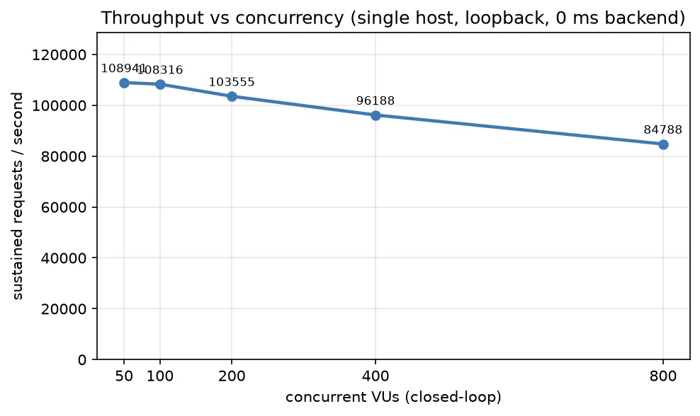
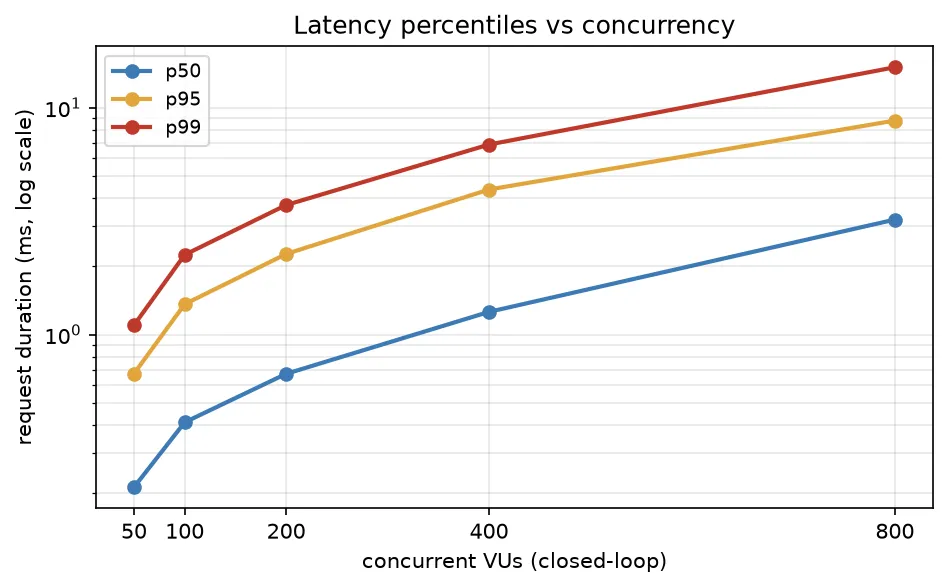

| VUs | req/s | p50 | p95 | p99 | p99.9 | failed |
| --- | --- | --- | --- | --- | --- | --- |
| 50  | **132,790** | 0.30 ms | 0.57 ms | 1.03 ms | 2.40 ms | 0% |
| 100 | 124,011 | 0.68 ms | 1.25 ms | 2.33 ms | 5.16 ms | 0% |
| 200 | 122,453 | 1.38 ms | 2.65 ms | 4.90 ms | 9.89 ms | 0% |
| 400 | 110,166 | 2.81 ms | 6.40 ms | 10.99 ms | 19.48 ms | 0% |
| 800 | 107,411 | 5.35 ms | 12.69 ms | 21.46 ms | 33.63 ms | 0% |

Throughput peaks near **50 VUs** (the k6 generator's ceiling on its cores) and declines
**gracefully** as concurrency climbs — latency rises in proportion with **no failures and no cliff
even at 800 VUs**. The useful reading is the shape: a flat-then-declining ceiling with an orderly
latency climb, the pinned proxy never collapsing under the generator.

## Tail latency under open-loop load

Open-loop sends at a **constant arrival rate** regardless of how fast responses come back, so
queueing surfaces in the tail instead of being hidden — the *coordinated-omission-safe* model.

| Model | target | achieved | p50 | p95 | p99 | p99.9 | dropped | failed |
| --- | --- | --- | --- | --- | --- | --- | --- | --- |
| open-loop, 0 ms backend | 92,953/s | 60,782/s | 0.63 ms | 174 ms | 256 ms | 423 ms | 16.2% | 0.5% |

The target is **70 % of the closed-loop peak** — but the closed-loop peak is the *generator's*
ceiling, and open-loop generation saturates **below** it. So 93k/s offered already drowns the
generator: ~61k achieved, **16 % dropped**, p99 256 ms. That divergence is the saturation signal,
and is why we treat the open-loop tail, not the optimistic closed-loop p99, as authoritative. A
sustainable open-loop rate sits lower; pin one with `OPENLOOP_RATE` to read a clean tail.

## Round-robin distribution

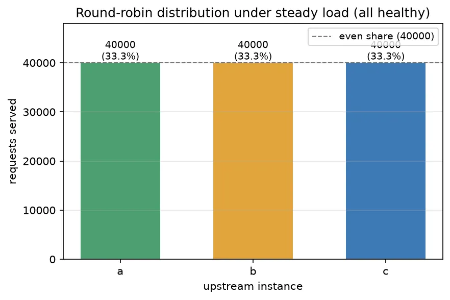

Over a steady window with all three upstreams healthy, **120,000** requests split **40,000 /
40,000 / 40,000** — even to a single request (33.3 % each). Round-robin holds under load.

## Resilience: ejection & fail-closed

A steady open-loop rate (~4k req/s) while a controller drives a fault timeline (`eject b` →
`rejoin b` → `eject all` → `restore all`) and the driver buckets each upstream's served-count and
the 503/s every second:

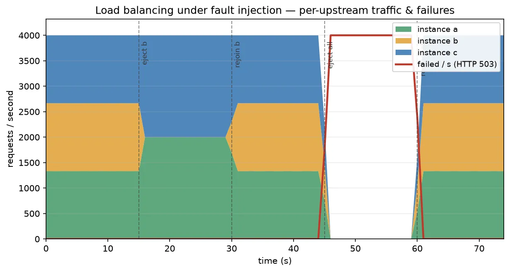

- **Even baseline.** ~4k req/s split three ways while healthy.
- **Graceful ejection.** When **b** is driven unhealthy its share falls to zero within ~1 s and the
  survivors (a + c) absorb the full load **with zero failed requests**. The survivors' split is
  *not* even — the ejected instance's round-robin slot is taken by its neighbour — so traffic
  shifts but isn't re-balanced across the survivors (the all-healthy split *is* exactly even).
- **Fail-closed, not fail-open.** With **every** instance unhealthy, Plecto returns **HTTP 503**
  promptly (no hang, no blind forward); the 503/s line jumps to the full offered rate.
- **Fast recovery.** Restoring health returns instances to rotation within ~1 s.

## TLS termination

The same single-backend pass-through, re-run with rustls TLS termination, decomposed so the cost
of each layer is separable (oha; h1 client isolates the record/handshake split from h2
multiplexing). `plain (h1)` is the plaintext baseline.

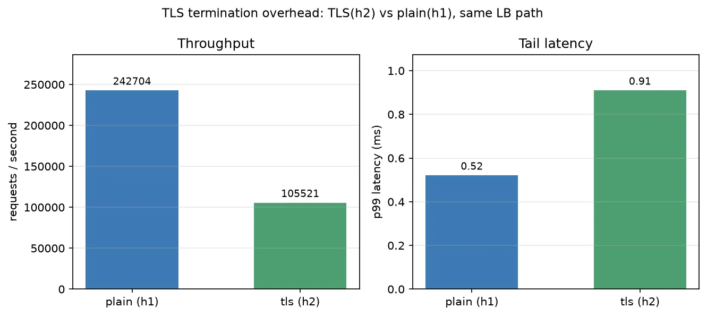

| Variant | req/s | p50 | p99 | isolates |
| --- | --- | --- | --- | --- |
| plain (h1)               | 143,317 | 0.33 ms | 0.66 ms | baseline |
| TLS h1, keep-alive       | 118,743 | 0.40 ms | 0.77 ms | record-layer AES-GCM = Δ vs plain |
| TLS h1, handshake/req    | 30,231  | 1.45 ms | 4.59 ms | full handshake (ECDHE + signature) per request |
| TLS (h2)                 | 101,290 | 0.47 ms | 0.91 ms | h2 multiplexing over TLS |

The decomposition is the point. **Record-layer crypto is cheap** — amortised over a kept-alive
connection, TLS h1 costs ~17 % throughput and only **+0.11 ms p99** vs plaintext, because AES-GCM
runs on AES-NI hardware. **The handshake dominates** — forcing a fresh ECDHE handshake on *every*
request collapses throughput to ~30k/s (~4.7× lower) and adds ~1.1 ms median. And **h2 is clean**
(101k/s, p99 0.91 ms): ALPN-negotiated HTTP/2 over TLS costs ~29 % throughput and +0.26 ms p99 vs
plaintext — a realistic termination cost. A client that funnels many VUs over a handful of
multiplexed connections can make h2 *look* far worse (head-of-line queueing, not server work);
measuring with a connection-per-concurrency client removes that artifact.

## Connection churn

The cost of *establishing* a connection vs reusing one, on the same plaintext single-backend path
(oha; keep-alive vs `--disable-keepalive` = a fresh TCP handshake per request).

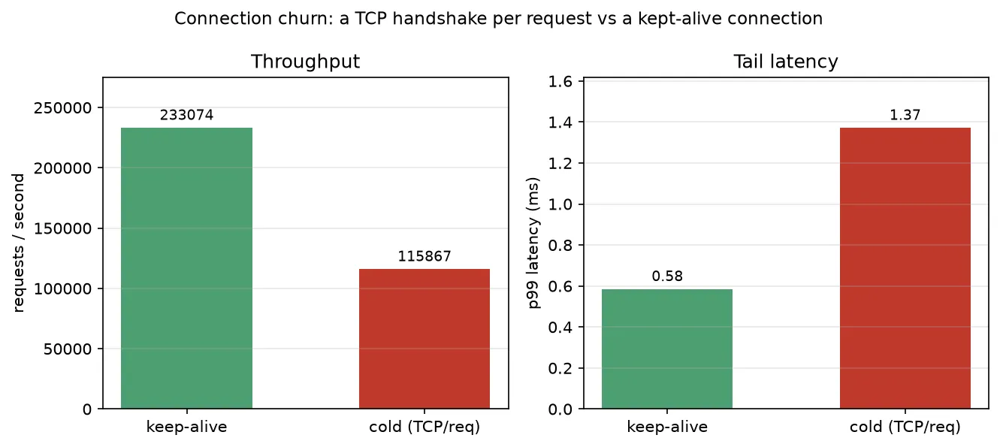

| Variant | req/s | p50 | p99 |
| --- | --- | --- | --- |
| keep-alive       | 147,265 | 0.32 ms | 0.65 ms |
| cold (TCP/req)   | 97,958  | 0.46 ms | 1.27 ms |

A TCP handshake per request costs **~33 % throughput and +0.62 ms p99** even on loopback (where the
handshake is nearly free) — over a real network the gap widens with RTT. Connection reuse is
load-bearing; this is the plaintext analogue of the TLS handshake-per-request row above.

> **A note on a latency bug this scenario caught.** An early body run showed a ~40 ms p99 cliff on
> medium streamed bodies — the signature of a delayed-ACK stall. The upstream client had Nagle's
> algorithm on (no `TCP_NODELAY`), so a streamed request body sent in several writes stalled on the
> peer's delayed-ACK timer. Disabling Nagle on the upstream sockets — standard practice for L7
> proxies — removed it (100 KB streamed p99 42.9 ms → 4.2 ms). The numbers here are post-fix.

---

# 2. WASM extension plane

Plecto runs each request's *decision* — auth, rewriting, rate limiting, policy — as a sandboxed
**WebAssembly Component Model filter**, not native proxy code. This measures what that costs,
changing only **how the decision runs**. The bundled `examples/wasm-bench` serves a **ladder** of
routes — all forwarding to the **same** backend — so each adjacent delta isolates one cost (the full
table is in [the cost ladder](#the-wasm-cost-ladder--isolating-each-cost) below): a native `/baseline`,
a pure no-op WASM filter pooled vs fresh (`/noop-pooled`, `/noop-fresh`), and the real `filter-apikey`
pooled vs fresh (`/trusted`, `/ondemand`).

`filter-apikey` is a real `plecto:filter` component: it reads `x-api-key`, stamps
`x-authenticated-user` on a valid key and forwards, or returns a typed `short-circuit` **401** on a
missing/invalid key. It is cosign-signed and loaded through the production verify-then-load path
(fail-closed). `filter-noop` returns `continue` with **no host-API calls** — it exists only to expose
the irreducible dispatch floor.

## The WASM cost ladder — isolating each cost

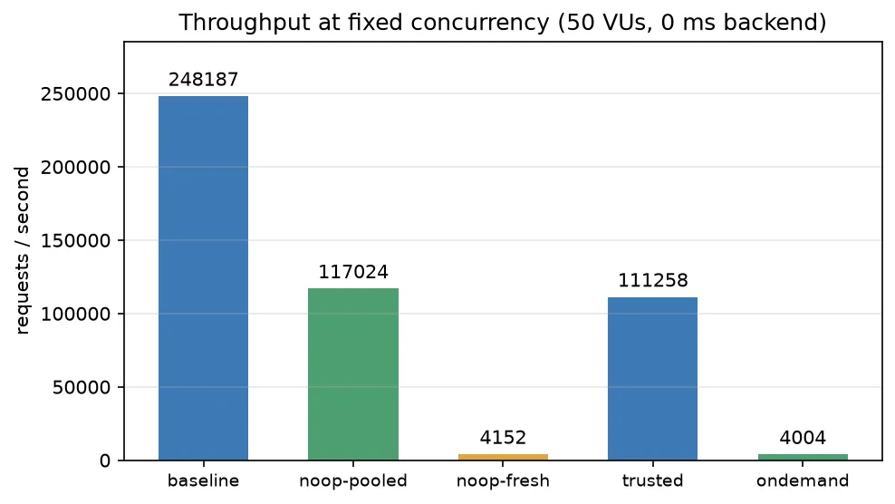
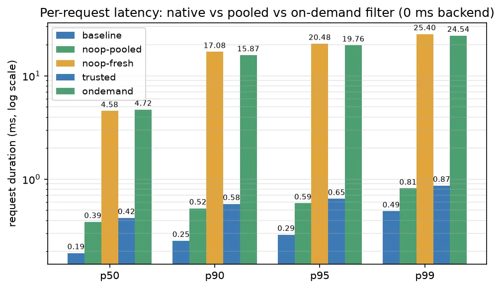

> W1 — fixed 50 connections, 0 ms backend, valid key (oha). Isolates filter cost from upstream time.

Five routes forward to the **same** backend, so each **adjacent delta isolates exactly one cost**. A
pure **no-op** WASM filter (no host-API calls) is the key addition — it separates "the WASM tax" from
"a real filter's work", which older reports conflated.

| Route | Decision path | req/s | p50 | p99 |
| --- | --- | --- | --- | --- |
| `/baseline` | native fast path (no filter) | 141,755 | 0.33 ms | 0.72 ms |
| `/noop-pooled` | a **pure no-op** WASM filter, pooled | 120,696 | 0.40 ms | 0.78 ms |
| `/noop-fresh` | the same no-op, **fresh instance / request** | 7,953 | 4.31 ms | 24.8 ms |
| `/trusted` | the real `filter-apikey`, pooled | 114,846 | 0.42 ms | 0.79 ms |
| `/ondemand` | `filter-apikey`, fresh instance / request | 8,401 | 4.50 ms | 23.0 ms |

- **baseline → noop-pooled** = the **irreducible extension-plane dispatch cost** (chain dispatch +
  instance acquisition + one empty host↔guest crossing), with *no* filter work: **−15 % throughput,
  ≈ 1.2 µs/req**. Every WASM filter pays this floor.
- **noop-pooled → noop-fresh** = the **per-request instantiation cost**, now cleanly isolated from any
  host work: throughput collapses **~15×** (121k → 8k). This is what pooling buys.
- **noop-pooled → trusted** = a **real filter's own work** on top of the no-op (header parse +
  host-KV lookup + counter): only **−5 %**. The apikey filter is cheap; the dispatch floor dominates it.
- **noop-fresh ≈ ondemand** confirms instantiation dominates the fresh path — the filter's per-request
  work is noise next to re-paying `init` (~30 µs) every request.

**The µs/req deltas are the invariants to track for regressions, not the percentages** (which shrink as
the rest of the request gets heavier). These macro deltas **reconcile with the in-process
[micro-benchmarks](#0-micro-benchmarks-in-process-criterion)**: criterion clocks the pooled per-request
call at ~2.4 µs and the fresh (instantiate + init + call) at ~30 µs — the same ~12–15× gap the ladder
shows end-to-end.

## Short-circuit: rejecting bad traffic at the edge

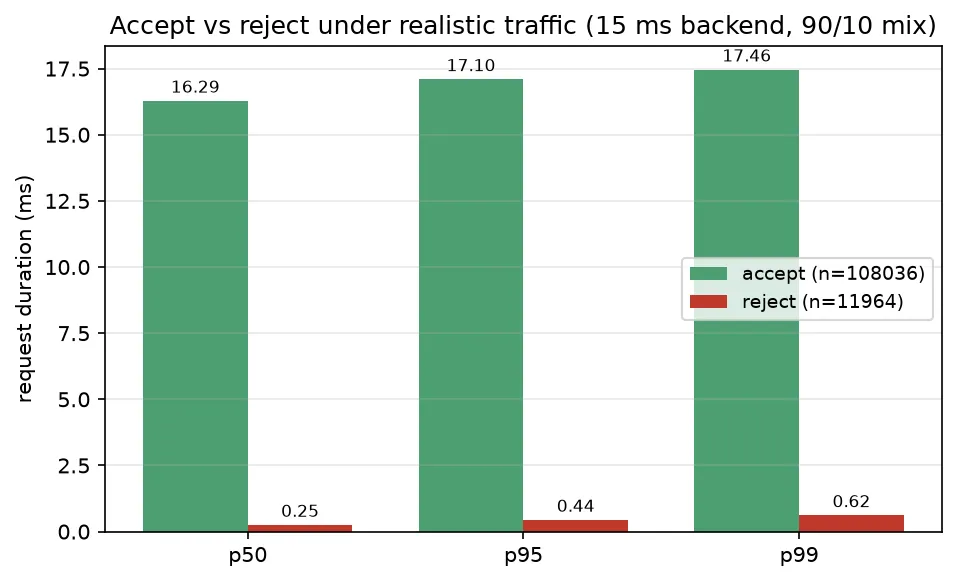

> W2 — fixed 2000 req/s, 15 ms backend, ~90 % valid / ~10 % bad keys (k6). 108,036 accepted, 11,964 rejected.

| Path | p50 | p95 | p99 |
| --- | --- | --- | --- |
| accept (200, forwarded) | 16.29 ms | 17.10 ms | 17.46 ms |
| reject (401, short-circuited) | 0.25 ms | 0.44 ms | 0.62 ms |

Accepted requests cost the 15 ms backend plus the small pooled-filter + proxy overhead. Rejected
requests are decided **at the edge in ~0.3 ms** and never reach the upstream: bad traffic is shed
**~60× faster** than good traffic is forwarded, and is harmless to the backend it would otherwise
hit. (Filter faults or deadline overruns **fail closed** — 502/504 — exercised by the test suite,
not this benchmark.)

## Outbound ext_authz (ADR 000036)

A filter can call an external authorization service per request over the lent, SSRF-guarded outbound
capability (`filter-extauthz`). Its per-request cost decomposes into three parts, only the first two of
which are Plecto's:

- **WASM tax** — the same dispatch floor and (for untrusted) instantiation the
  [cost ladder](#the-wasm-cost-ladder--isolating-each-cost) measures.
- **The outbound gate** — the operator allowlist (an exact scheme/host/port match) plus the SSRF
  classification of every resolved address. Structurally this is a small scan + a handful of octet
  checks — nanoseconds, the same order as an LB pick (see [# 0](#0-micro-benchmarks-in-process-criterion)) —
  and negligible next to the two costs around it.
- **The network round-trip** to the authz endpoint — which is the *operator's* authz-service latency,
  not a Plecto overhead, and dominates the total (as proxy-wasm's own guidance notes for ext_authz).

Two facts keep this out of the headline load numbers for now, honestly rather than faked: the SSRF
guard **blocks loopback by design**, so a hermetic mock authz needs a non-loopback endpoint
(environment-specific), and the current connector opens **a new connection per call** — outbound
connection pooling is a follow-up. A through-the-guest ext_authz *load* benchmark is therefore
deferred (like [HTTP/3](#http3)) rather than published with an environment-dependent,
connect-per-request number. The capability itself is verified end-to-end by the host's `outbound-http`
test suite (allowlist deny + the DNS-rebinding SSRF block).

## Host-enforced rate limiting

Plecto's rate limiter is a **host-native token bucket** (ADR 000026): the bucket spec
(`capacity` / `refill_tokens` / `refill_interval_ms`) is configured **in the operator's manifest**,
not by the filter — an untrusted filter passes only `(key, cost)` and so cannot widen its own limit.
The refill + counting stay host-side (the WASM boundary is not crossed on the hot path); the filter
only decides *whether* to consult the limiter and *on what key*. Driven through `examples/edge-bench`
(`filter-hello`, pooled); a `429` carries `retry-after-ms`.

### Overhead — the cost of consulting the bucket

> R1 — 50 VUs, 0 ms backend, a **never-deny** bucket spread across 1000 keys (k6). `/baseline` vs
> `/ratelimit`.

| Route | req/s | p50 | p99 | CPU/req |
| --- | --- | --- | --- | --- |
| /baseline (no filter) | 118,587 | 0.35 ms | 1.10 ms | 8.43 µs |
| /ratelimit (bucket) | 99,478 | 0.43 ms | 1.23 ms | 10.05 µs |

Consulting the host bucket on every request adds **~1.6 µs/req** (+0.13 ms p99, ~16 % throughput).
That is the limiter's hot-path tax with no rejections — the floor cost of the mechanism, including
the per-call host-state quota check (ADR 000027) that keeps a multi-tenant filter's bucket count
bounded.

### Enforcement — does it actually hold the rate?

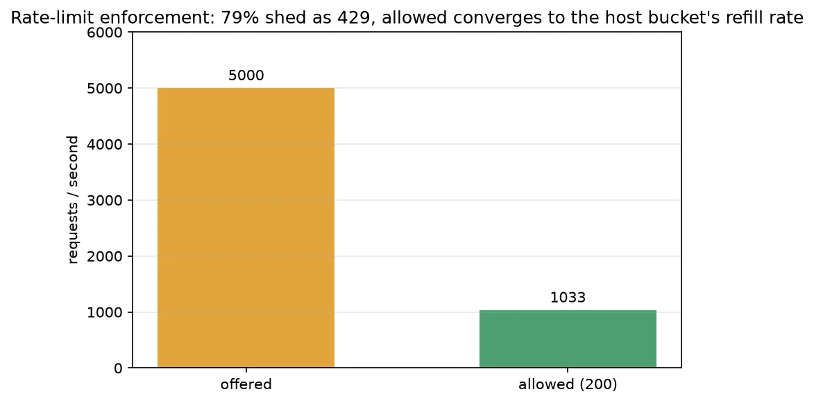

> R2 — a **tight** bucket (refill 1000 tok/s, burst 2000), offered **5000 req/s** open-loop at one
> key for 30 s (k6).

| offered | allowed (200) | shed (429) | accept p99 | 429 p99 |
| --- | --- | --- | --- | --- |
| 5,000/s | **1,033/s** | 79.3% | 2.65 ms | 0.62 ms |

Offered 5× over the limit, the **allowed throughput converges to the bucket's refill rate**
(≈ 1.0k/s — the configured 1000 tok/s plus the burst amortised over the run). The excess **79 % is
shed as 429**, each decided at the edge in **~0.6 ms** without touching the backend. Open-loop
(`constant-arrival-rate`) keeps offering regardless of the 429s, so the enforcement is measured
honestly, not hidden by a self-throttling client.

### Fairness — one key cannot starve another

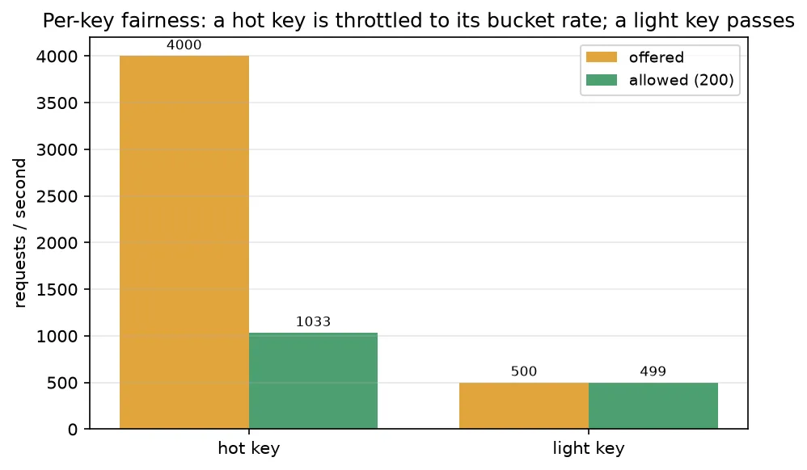

> R3 — same tight bucket; two keys concurrently: a **hot** key offered 4000/s and a **light** key
> offered 500/s (k6).

| key | offered | allowed (200) | shed |
| --- | --- | --- | --- |
| hot | 4,000/s | 1,033/s | 74% |
| light | 500/s | 500/s | **0%** |

State is **per key**, so the hot key is throttled to its own refill rate (1.0k/s, 74 % shed) while
the light key sharing the same filter **passes completely untouched** — no cross-key starvation. A
noisy tenant is contained to its own bucket.

## Request body handling

The request-side **body hook** (`on-request-body`, ADR 000025) follows a *buffer-then-decide* model:
for a filtered route carrying a body, the host buffers it (bounded — 16 MiB cap, fail-closed 413),
runs the filter's `on-request-body`, and forwards the possibly-transformed body — or short-circuits
before upstream. `filter-hello` uppercases the body (a real transform) or 403s on a `deny-body`
marker. A bodyless request and a filter-less route keep the zero-copy streaming path.

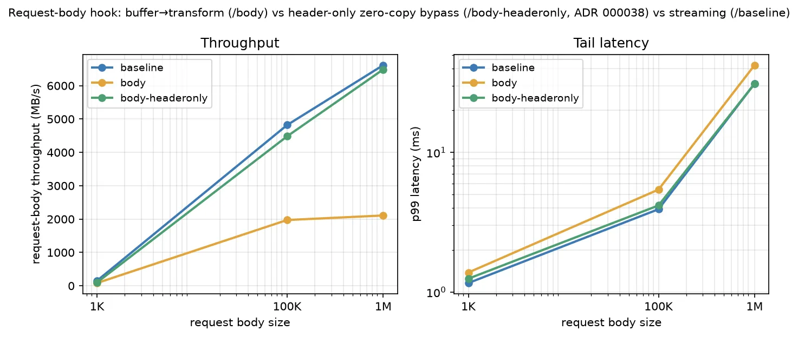

> B — 50 VUs, POST a `SIZE`-byte body to `/body` (buffer + transform) vs `/baseline` (streaming
> passthrough), at 1 KB / 100 KB / 1 MB (k6).

| size | route | req/s | throughput | p99 |
| --- | --- | --- | --- | --- |
| 1 KB   | /baseline | 121,998 | 125 MB/s | 1.26 ms |
| 1 KB   | /body     | 84,043  | 86 MB/s | 1.41 ms |
| 100 KB | /baseline | 41,075  | 4206 MB/s | 4.29 ms |
| 100 KB | /body     | 18,408  | 1885 MB/s | 5.73 ms |
| 1 MB   | /baseline | 5,688   | 5964 MB/s | 32.8 ms |
| 1 MB   | /body     | 1,877   | 1968 MB/s | 45.2 ms |

The hook's cost grows with payload: **~31 % throughput at 1 KB** (the buffer + WASM transform
dominate the small request), **~55 % at 100 KB**, **~67 % at 1 MB** (a full-body copy + uppercase per
request). The streaming passthrough has no per-body CPU and scales with raw I/O. Buffering also costs
memory: holding 1 MB bodies at 50 concurrency drove **~317 MB RSS**, which is why the buffer is bounded
and a request over the cap fails closed (413) rather than being read into RAM. The export-presence
zero-copy bypass for header-only filters is a follow-up — v1 buffers whenever a filtered route has a body.

## Footprint

Idle resident set and the marginal cost of an open connection (`examples/wasm-bench`):

| Metric | Value |
| --- | --- |
| idle RSS | ~31 MB |
| RSS holding ~1,000 idle keep-alive connections | ~52 MB |
| marginal bytes / connection | ~21 KB |

---

# 3. Realistic & protocol coverage

## Weighted request mix

> M1 — open-loop ~20k req/s, a weighted blend across routes on one gateway (k6). More representative
> than a single hot endpoint: read-heavy with occasional writes and rare large payloads.

| Class (share) | route | p50 | p99 | p99.9 |
| --- | --- | --- | --- | --- |
| read 80 % | GET `/baseline` (1 KB) | 0.20 ms | 12.5 ms | 27.6 ms |
| write 15 % | POST `/body` (1 KB) | 0.29 ms | 13.6 ms | — |
| large 5 % | POST `/body` (100 KB) | 0.96 ms | 17.6 ms | — |

Steady-state p50s stay sub-millisecond, but the **tail (p99 12–18 ms) is elevated by the 5 % of 100 KB
bodies** creating head-of-line pressure at 20k offered (1,544 dropped iterations) — exactly the
realistic-mix behaviour a single-endpoint test hides. This exercises the router's match cost and the
no-filter + body-hook paths together, under one arrival stream.

## HTTP/3

The fast path terminates **HTTP/3 over QUIC** (ADR 000016; `tls-http` serves h1/h2/h3 on one port). A
functional check confirms it end-to-end:

```
curl --http3-only https://…/api/hello  ->  status=200 http_version=3
```

A **rigorous, coordinated-omission-safe H3 *load* benchmark is deferred**: the load generators here
(oha, k6) have no native HTTP/3, and a correct H3 tail needs an H3-capable open-loop generator such as
**Nighthawk**. Rather than publish process-spawn-bound `curl`-loop numbers, the H3 load figure is
honestly left absent until that tooling is in place — the server support is verified, not the throughput.

---

## Methodology — why the numbers look the way they do

- **Open- vs closed-loop matters.** A closed-loop generator throttles itself whenever the server
  slows, quietly hiding queueing and under-reporting the tail (Gil Tene's *coordinated omission*).
  An open-loop, fixed-rate generator keeps offering load and surfaces the real tail. We treat
  open-loop figures as authoritative for latency tails and closed-loop figures as a throughput ceiling.
- **Pin the proxy, pin the generator, separately.** Co-residency means the generator competes with
  Plecto for CPU; pinning each to a disjoint core set removes that contention from the proxy's
  numbers. Absolute figures still shift on dedicated hardware and a real network — they exist to
  catch regressions between changes.
- **Track the invariant, not the headline.** The WASM tax and the rate-limit tax are ~µs/req (not a
  %), rate-limit enforcement converges to the configured refill rate, fairness is per-key isolation,
  resilience is ~time-constants, and round-robin is exact — these hold across hosts and generators,
  so a change in them is a real regression. A change in absolute peak throughput is usually just the
  host or the generator.
- **Benchmarks find bugs.** The body scenario surfaced a delayed-ACK stall from Nagle on the upstream
  sockets (no `TCP_NODELAY`); disabling Nagle there — standard for L7 proxies — removed a ~40 ms p99
  cliff on streamed bodies. Disclosing *how* a number was produced is the point.
- **Two layers that must agree.** In-process criterion micro-benchmarks isolate per-function cost
  deterministically; the open-loop macro scenarios measure it end-to-end. Micro-cost × calls-per-request
  should explain the macro delta — the WASM ladder is the worked example — so a divergence between the
  layers is a bug in one of them, not noise.
- **Tooling by job.** criterion for the deterministic in-process layer and the CI gate; k6
  `constant-arrival-rate` (open-loop) for the macro tails; oha for single-route capacity ceilings.
  Neither oha nor k6 has native HTTP/3, so H3 *load* is deferred to an H3-capable generator (Nighthawk)
  rather than faked (see [HTTP/3](#http3)).
- **CI regression gate (opt-in).** Per-PR runs only the light criterion micro-benchmarks
  (`cargo bench -- --baseline main`, seconds); the heavy k6/oha macro suite runs on manual dispatch /
  nightly. Hosted-runner numbers are treated as *relative* (regression direction), never absolute — CI
  VMs are noisy neighbours. Running the project's own benchmarks in GitHub Actions is squarely within
  GitHub's Acceptable Use ("testing … the software project associated with the repository"); keeping
  heavy load off per-PR respects the "no disproportionate burden" clause.
- **Prior art.** Disclosing open- vs closed-loop and corrected latency is standard in tools such as
  `wrk2` and k6. This report follows that spirit using only its own measurements.

## Reproducing

The tracked, in-repo subjects and the runbook that produces every CSV here:

```bash
# Build the release examples first (the runbook does not build).
cargo build --release -p plecto-server \
  --example load-balancing --example wasm-bench --example tls-http --example edge-bench

# One phase, or `all`. Pins the proxy to a core set and generators to a disjoint set; writes
# performance/data/*.csv. Phases:
#   sweep openloop rr ejection wasm tls h3 ratelimit body churn mix footprint all
bash bench/perf/run-perf.sh all

# In-process micro-benchmarks (deterministic; the CI regression gate). Save a baseline, then compare:
cargo bench -p plecto-control -p plecto-host -- --save-baseline main   # on the base branch
cargo bench -p plecto-control -p plecto-host -- --baseline main        # on a change, to read the deltas

# Optional live dashboard (images are a one-time setup pull; the load stays on loopback):
INFLUX=1 bash bench/perf/run-perf.sh all     # http://localhost:3000/d/plecto-lb-k6

# The underlying examples (default ports overridable with PLECTO_PROXY_ADDR):
cargo run --release -p plecto-server --example load-balancing   # LB fast path
BACKEND_LATENCY_MS=0 cargo run --release -p plecto-server --example wasm-bench   # WASM plane
cargo run --release -p plecto-server --example tls-http          # TLS termination
cargo run --release -p plecto-server --example edge-bench        # rate-limit + body hook
```

The k6 scenarios live in `bench/k6/` and `bench/k6-wasm/`; the round-robin counter and the
open-loop fault driver in `bench/perf/`. Charts are regenerated from the measured CSVs:

```bash
python3 performance/plot.py     # reads performance/data/*.csv -> performance/img/*.webp
```

(`matplotlib` brings `numpy` + `Pillow`; Pillow supplies the WebP encoder. The measured CSVs and
the local heavy-load harness are git-untracked working data, like `bench/`. The benchmark *method*
— the runbook, scenarios, plotting — is tracked; see `bench/plan.md`.)

## Non-goals

- Not a sizing or capacity guide.
- Not a comparison against other proxies, gateways, or Wasm runtimes.
- Not representative of production hardware, real networks, or non-trivial upstream work.

## References

- Gil Tene, *coordinated omission* — summarized in ScyllaDB's [On Coordinated Omission](https://www.scylladb.com/2021/04/22/on-coordinated-omission/).
- [k6 executors](https://grafana.com/docs/k6/latest/using-k6/scenarios/executors/) — closed-loop (`constant-vus`) vs open-loop (`constant-arrival-rate`) models.
- [oha](https://github.com/hatoo/oha) — the single-connection-pool HTTP load generator used for the overhead, TLS and churn runs.
- [criterion.rs](https://bheisler.github.io/criterion.rs/book/) — the in-process micro-benchmark harness (LB pick, route match, WASM per-request cost) and its baseline-comparison regression gate.
- [Nighthawk](https://github.com/envoyproxy/nighthawk) — Envoy's open-loop, HTTP/1–2–3 load generator; the tool an HTTP/3 *load* benchmark would use (deferred here).
- [wrk2](https://github.com/giltene/wrk2) — constant throughput with corrected latency recording.
- [Wasmtime](https://docs.wasmtime.dev/) — the pooling allocator and epoch interruption behind pooled vs on-demand filter instances.
- [WebAssembly Component Model](https://component-model.bytecodealliance.org/) — the `plecto:filter` contract is a Component Model world.
