# Plecto Proxy Performance

An honest performance snapshot of Plecto Proxy's two halves: the **native load-balancing fast
path** and the **WASM extension plane** (per-request filters, host-enforced rate limiting, the
request-body hook). The goal is **transparency about method**, not a leaderboard. Every number
here is an internal **regression baseline** — not a capacity guide, and not a comparison against
other proxies.

All components — load generator, Plecto Proxy, the upstream instances, and any tooling — run
**co-resident on a single commodity developer host over loopback**, so absolute figures are
bounded by that host and by the generator, not by Plecto Proxy in isolation. Read them as **relative**
signals — ratios, curve shapes and time-constants, not headline throughput.

## Measurement setup

- **Core isolation by pinning.** Plecto Proxy (and its in-process backends) is pinned to one dedicated
  set of CPU cores; **every** load generator is pinned to a separate, disjoint set. The generator
  therefore never steals a core from the proxy — the run measures Plecto Proxy, not the generator
  fighting it. (Done with `taskset`; no privileged host tuning.)
- **No host tuning.** CPU governor / turbo are left at their defaults — no fixed-frequency lock.
  Absolute throughput shifts run-to-run with clock; the **ratios, shapes and time-constants** are
  the durable signal, so those are what we read.
- **Generators, by phase.** [k6](https://grafana.com/docs/k6/latest/) drives the closed-loop
  concurrency sweep (`constant-vus`), the mixed short-circuit run, and the rate-limit / body
  scenarios; **`plecto-loadgen openloop`** is the **authoritative** open-loop tail driver
  (constant arrival rate with **schedule-based latency** — the wrk2 / Gil Tene model; see
  [`bench/methodology.md`](../bench/methodology.md)); `OPENLOOP_GEN=k6` keeps the older
  `constant-arrival-rate` path for A/B. `plecto-loadgen` also runs the fault-injection timeline,
  the endpoint-set swap timeline, the round-robin count, and the WebSocket / TLS-handshake
  scenarios; and [oha](https://github.com/hatoo/oha) drives the single-route ceiling (plain h1,
  WASM W1, TLS) runs. Different generators have different ceilings — **numbers are comparable
  within a section, and across same-generator sections, but not blindly across all of them**.
  Each section names its generator.
- **Warm-up excluded.** Every measured window starts after a short warm-up (default 5 s) that
  sends load but is not recorded: in-script for k6 and plecto-loadgen, a discarded pre-run for
  oha. Cold-start seconds (route tables, upstream pools, allocator state) never enter a
  percentile. The rate-limit enforcement / fairness runs are the deliberate exception — their
  initial token-bucket burst *is* the measured signal.
- **Ceilings vs tails.** Closed-loop full-throttle runs (oha, `constant-vus`) are read as
  *throughput ceilings*; their latencies are queueing-at-saturation, not service latency
  ("never measure latency at max load"). Honest tails come from the fixed-rate runs:
  **`plecto-loadgen openloop`** (schedule-latency) and oha `-q` + `--latency-correction`, both
  coordinated-omission-safe. The plain-h1 ceiling reports **RR** (keep-alive) and **CRR**
  (cold TCP/req) KPIs in `ceiling.csv`.
- **Fully local.** Generators, proxy and upstreams talk only over loopback; generator telemetry and
  the optional dashboard's phone-home are disabled. Nothing leaves the host during a load run —
  load traffic stays on loopback; `REQUIRE_OFFLINE=1` can refuse a default IPv4 route for a
  netns-style lab (see [`bench/methodology.md`](../bench/methodology.md)).
- **PMU not collected.** The runbook's optional micro-architectural attribution (cycles/req, IPC,
  LLC / branch misses via `perf`) needs a lowered `kernel.perf_event_paranoid` (privileged); it
  was not enabled on this run, so the WASM / rate-limit tax is reported as throughput / latency /
  **µs-per-req**, not a cycles breakdown.

## TL;DR

> **Measurement history** (newest first). **2026-08-15 (v0.9.0 snapshot)** — a full refresh of the
> fast path at commit `b2a89be` (**v0.9.0**): T2 `all`, T3 `v03`, the T1 `gate` three times, and both
> micro layers (criterion + gungraun instruction counts, each saved as a local `main` baseline). The
> harness repairs described next landed on top of that commit and touch no crate source, so every
> figure stands for v0.9.0 as shipped. **The 07-20
> pass's harness contamination is fixed, and the rows it invalidated are trustworthy again.** Two
> defects compounded: the k6 scenarios' VU pools exceeded ADR 000092's per-source-IP connection cap
> (**256**/IP), and the scripts folded a status-less response — a connection the proxy never accepted
> — into a meaningful bucket (`mixed.js` counted anything not 200 as a short-circuit "reject";
> `weighted-mix.js` fed its near-zero duration straight into the published percentiles). Both are
> repaired: every pool is now bounded below the cap (Little's law leaves them ample at loopback
> service times) and every scenario counts status-less responses in their own `no_status` bucket,
> reported in the CSVs so the artifact can never pass as signal again. **Every re-measured scenario
> reports `no_status` = 0 this pass**, and the corrected figures land back where the pre-cap 07-11
> snapshot had them: the short-circuit mix reads its designed **90.0 % / 10.0 %** split (was
> 76 %/24 %), enforcement accounts for **all 150,000** offered requests (48.8 % were missing) and
> sheds **79.3 %** — the 07-11 figure to the decimal — and the light rate-limit key passes **500/500
> untouched** (was 140/500). The `footprint` phase was repaired the same way — it asked for 1,000
> connections, got the cap's 256, and then divided by 1,000 — and its corrected marginal cost
> (**~25.4 KB/conn**) returns to the historical figure. The one scenario still crossing the cap is the closed-loop **sweep** at
> VU 400/800, which does so *deliberately* (its whole point is the concurrency curve); under the cap
> it is failure-free. **Verdicts this pass**: T1 `gate` **PASS**, then **FAIL**, then **PASS** — the
> single excursion was `ratelimit_tax_us` at 4.88 µs against a 2.2–4.2 band, with the phase's other
> three same-day measurements at 3.11 / 3.42 / 3.79 µs. This host was *not* idle (a browser,
> cadvisor and a clickhouse-server were resident; 15-min load average ~10), which is the honest
> explanation for a between-session excursion the interleave cannot cancel; the band was left
> untouched. **2026-07-20 (v0.5.1/v0.5.2 patch confirmation)** — a
> full refresh: T1 `gate` (**PASS**, every invariant in band), a full `bash bench/perf/run-perf.sh
> all` (T2), and `v03` (T3). Measured at commit `c635ed3` (tag **v0.5.1**); tag **v0.5.2** landed
> on top moments later as an unintended early release — version strings and three reference-filter
> patch bumps only (`filter-cors` / `filter-apikey` / `filter-extauthz` 0.1.1 → 0.1.2), no
> `plecto-server` / `plecto-control` / `plecto-host` source changed, so every figure below stands
> for v0.5.2 as shipped too. The entire load run executed inside an unprivileged network namespace
> (`unshare -rn`, `ip link set lo up`, no default route) rather than relying only on the runbook's
> own `REQUIRE_OFFLINE=1` self-check — a kernel-enforced guarantee that nothing left the host during
> the run, verified beforehand (`curl http://example.com` fails at DNS resolution inside the
> namespace, before any route is even consulted). **New finding this pass** — ADR 000092's
> per-source-IP connection cap (**256** concurrent connections/IP, landed 2026-07-15, after the
> prior 07-11 snapshot) now intersects several k6 open-loop scenarios whose `preAllocatedVUs` pool
> exceeds 256, because the generator and Plecto Proxy share one loopback source IP on this harness.
> Confirmed two ways: the closed-loop **sweep** fails cleanly above the threshold (0 % at VU ≤ 200,
> **28 % / 47 %** at VU 400/800 — reproduced identically with and without the netns sandbox, ruling
> the isolation method out as the cause), and the **rate-limit enforcement / fairness (hot key)**
> scenarios silently drop **43–49 %** of offered load from their own accepted/limited accounting (a
> refused connection returns no HTTP status, so k6's `status === 200 | 429` branches never see it).
> Affected numbers are flagged inline below; every oha-driven section (ceiling, WASM ladder, TLS,
> footprint — all `-c 50`), the low-VU k6 scenarios (body, rate-limit overhead — `VUS=50`), and every
> `plecto-loadgen` scenario (open-loop, round-robin, ejection, swap, WebSocket — all ≤ 64 workers)
> stay well under the cap and are clean, comparable figures. *(The harness half of that finding is
> fixed in the 08-15 pass above; the numbers it flagged have been re-measured.)* **Older
> generations** (2026-07-11 v0.3.0 feature costs … 07-02) live in [`HISTORY.md`](HISTORY.md) — this
> TL;DR keeps only the newest two.
> **µs/req deltas are what to track across snapshots**, not raw throughput — and the tracked
> invariant set is machine-checked by the T1 gate (`bash bench/perf/run-perf.sh gate`, bands in
> `bench/perf/gate_tolerances.toml`).

**Load-balancing fast path** (plaintext HTTP/1.1, 3 upstreams, trivial 0 ms backend; k6 / loadgen / oha):

- Closed-loop throughput peaks at **~140.3k req/s** (VU 100 this run) with **p99 ≈ 1.3–4.8 ms** and
  zero failures through VU 200. **VU 400/800 show 27.8 % / 51.7 % "failed"** — this is **not** proxy
  overload: it is the sweep's own concurrency (400/800 simultaneous connections, all from the
  generator's single loopback IP) crossing ADR 000092's **256-connections-per-source-IP**
  admission cap, which those two rungs cross deliberately — see the measurement-history callout
  above and [the sweep section](#throughput--latency-vs-concurrency). Under the
  cap (VU ≤ 200) the curve still declines gracefully with no cliff.
- Open-loop at the auto **98.2k/s** (70 % of closed-loop peak) **achieves 98,221/s exactly** with
  **p50 1.7 ms, p95 12.5 ms, p99 27.8 ms, p99.9 41.1 ms, 0 dropped, 0 % failed** — schedule-latency
  (`plecto-loadgen openloop`, 64 workers — well under the per-IP cap, unaffected).
- Round-robin across three upstreams is **even to within one request** (33.3 % each, 120,000 reqs).
- **Resilience is as designed**: ejecting one upstream drops its share to zero in ~1 s and the
  survivors absorb the load with **no client-visible errors**; a *total* outage **fails closed
  with HTTP 503** and the pool **recovers within ~1 s** of health returning.
- TLS termination (**aws-lc-rs**, ADR 000051): within-TLS, keep-alive **~107.7k** (~50 % of the
  plaintext ceiling) vs handshake/req **~23.1k** (~21 % of keep-alive) and h2 **~99.2k** (~92 % of
  keep-alive) — the path is **crypto-/TLS-I/O-bound**, ordering clean. A resumption-isolated
  measurement (carried from 07-05, not re-run this pass) puts a **true full handshake at ~22.1k/s**
  vs **~29.8k/s resumed (93 %)** — see [TLS](#tls-termination).
- A **kept-alive** connection (**RR**) serves **~215.9k req/s** this run; forcing a **TCP
  handshake per request** (**CRR**) costs **~50 % throughput and +0.80 ms p99** — connection
  reuse is still load-bearing (see [the plain HTTP/1.1 ceiling](#plain-http11-ceiling)).

**WASM extension plane** (the cost of running a decision as a sandboxed component; oha / k6):

- A **cost ladder** isolates each cost by adjacent delta (oha, `-c 50` — well under the per-IP cap,
  clean). This run's full-throttle ceiling is clean (`baseline` **>** every WASM rung), so the raw
  floor reads directly: **baseline → noop-pooled costs ~47 % throughput** full-throttle
  (**≈ 4.17 µs/req** inverse-throughput delta, matching the interleaved T1 gate's **3.90–4.06 µs**
  dispatch-floor invariant); the **fixed-rate tail** (2,209 req/s, the portable queueing-honest read)
  puts it at **+0.10 ms p50 / +0.33 ms p99** over native. A **real filter's own work**
  (`filter-apikey` on top of the pooled no-op) is **≈ 1.09 µs** — bracketing the gate's **0.87–1.06 µs**
  apikey-cost invariant; running that filter **fresh-per-request** instead of pooled
  costs **~31×** throughput — the price of re-paying `init` every request.
- These macro deltas **reconcile with the criterion [micro-benchmarks](#0-micro-benchmarks-in-process-criterion)**
  in direction and order of magnitude, and with the T1 gate, which returned **PASS twice and FAIL
  once** across three runs this pass — the single excursion being `ratelimit_tax_us` on a host with
  unrelated resident load (`bash bench/perf/run-perf.sh gate`, bands in
  `bench/perf/gate_tolerances.toml`; every other invariant was in band on all three runs).
- **v0.3.0 response / compression (opt-in `v03` phase, re-run 2026-08-15):** reading the
  as-forwarded request snapshot on `on-response` costs **≈ +0.22 µs/req** over pooled no-op this
  pass (small enough that the ceiling's own run-to-run movement is a comparable term — see
  [the section itself](#v030-response-ladder--compression)); gzip on a 4 KiB compressible body costs
  **≈ −31 % ceiling / +2.3 µs/req** vs the same body uncompressed, the third pass in a row within
  ~0.25 µs of the same figure.
- A rejected request (**HTTP 401 short-circuit**) is decided in **~0.32 ms and never reaches the
  backend** — bad traffic is shed **~51× faster** than good traffic is forwarded through a 15 ms
  backend. With the harness fixed, the split matches the design mix again — **90.0 % accepted /
  10.0 % rejected, zero status-less responses** — see
  [the section](#short-circuit-rejecting-bad-traffic-at-the-edge).

**Host-enforced rate limiting** (token bucket, spec host-configured in the manifest; k6):

- The rate-limited route costs **~3.4 µs/req** (~33 % throughput, p99 unchanged) over a no-filter
  baseline when the bucket never denies (`VUS=50`, well under the per-IP cap, clean) — the filter
  dispatch floor plus the host-native bucket consult (and its multi-tenant quota check).
- Offered **5× over the configured rate**, the **allowed throughput converges correctly to the
  bucket's refill rate** (**1,033/s** for a 1000-token/s bucket) and the run now accounts for
  **every** offered request — 31,000 allowed + 119,000 shed = the full 150,000 attempted, **0
  status-less** — putting the shed fraction at **79.3 %**, the same figure the pre-cap 07-11
  snapshot measured.
- Buckets are **per key**: a hot key offered 4× its limit is throttled to its own refill rate
  (1,033/s, 74.2 % shed) while a **light key on the same filter passes completely untouched —
  500/s offered, 500/s allowed, zero 429s** — no cross-key starvation, now measured rather than
  inferred.

**Request-body hook** (buffer-then-decide, ADR 000025; export-presence zero-copy bypass, ADR 000038; k6):

- A filter that **reads** the body (`/body`, filter-hello) costs **~49 % throughput at 1 KB** and
  scales with payload: **~60 % at 100 KB**, **~67 % at 1 MB**, versus the streaming passthrough
  (`VUS=50`, well under the per-IP cap, clean).
  A **header-only filter** (`/body-headeronly`) **streams the body through**: at 1 MB it lands
  **within ~1 % of `/baseline`** (ADR 000038, within noise); at 100 KB the gap is **~11 %**
  and at 1 KB the gap is the ordinary **WASM dispatch floor** on a tiny request, not a body cost.
- RSS at 1 MB × 50 VUs (`MALLOC_ARENA_MAX=4`): **~101 MB `/baseline` · ~177 MB `/body` · ~97 MB
  `/body-headeronly`**. The header-only bypass stays near baseline; the buffer stays bounded (16 MiB
  cap, fail-closed 413).

## Scope & honesty notes

- **Machine specs intentionally omitted.** Single commodity host, loopback, everything
  co-resident. Absolute throughput is contended and clock-variable; treat figures as relative /
  regression signals.
- **The host was not idle this pass (2026-08-15).** Unrelated resident workloads (a browser,
  cadvisor, a clickhouse-server; 15-minute load average ~10) shared the machine with the run. Core
  pinning keeps the proxy and the generators off each other's cores but cannot fence out a third
  party, so absolute figures this pass sit below an idle-host run and one gate invariant took a
  between-session excursion (see the [TL;DR](#tldr)). Ratios, shapes and time-constants — what this
  report actually tracks — are unaffected, and the interleaved gate cancels drift *within* a session.
- **Generator-bound where noted.** The closed-loop sweep tops out near the *generator's* ceiling on
  its cores, not the proxy's: absolute peaks move with host/generator noise (this run ~140.3k k6
  peak vs ~215.9k oha ceiling keep-alive — different generators, different ceilings). The sweep
  curve's *shape* is the signal, not
  its absolute peak (below the per-IP admission cap — see the [TL;DR callout](#tldr) for VU ≥ 400).
  Open-loop tails use `plecto-loadgen` so they are no longer k6-VU-bound.
- **Trivial upstreams** (tiny static responses, 0 ms latency by default) deliberately isolate
  **proxy + LB + filter overhead** rather than backend work. A 15 ms synthetic backend is used
  where realistic proportions matter (WASM short-circuit); a sized-body backend for the body sweep.
- The LB figures are **plaintext HTTP/1.1**, except the dedicated [TLS run](#tls-termination).
- **No comparative claims.** Mature proxies are referenced only for shared methodology, never ranking.
- Charts rendered with matplotlib → WebP; an optional InfluxDB + Grafana stack (`INFLUX=1`) provides
  live dashboards during k6 runs (its images are a one-time setup pull; the load stays on loopback).

---

# 0. Micro-benchmarks (in-process, criterion)

A deterministic, network-free layer (`cargo bench`, criterion) that isolates the **per-function** cost
of the hot path with low noise — complementary to the end-to-end macro scenarios below, and the basis
for the CI regression gate (`--save-baseline` / `--baseline`). Micro-cost × calls-per-request should
roughly explain the macro deltas, and it does (the WASM ladder is the worked example).

**Fast path** (`crates/control/benches/fastpath.rs`):

| bench | cost | note |
| --- | --- | --- |
| LB pick — round-robin | 36 → 27 → 31 ns (32 → 8 → 3 instances) | ~O(1) over the eligible set |
| LB pick — P2C weighted-least-request | 36 → 43 → 69 ns (3 → 8 → 32 instances) | two eligibility passes + the sampled compare |
| LB pick — weighted Maglev | ~22 ns (3, 8) → ~21 ns (32) | + one table lookup |
| LB pick under swap churn (`pick_under_swap_churn`) | 85 → 60 → 65 ns (3 → 8 → 32 instances) | round-robin pick while a background thread continuously calls `update_endpoints` (ADR 000044) — the per-pick `ArcSwap<Endpoints>` load cost under worst-case concurrent churn |
| route match (`find_route`) | 47 ns → 242 ns (1 → 64 routes) | scans by specificity, allocation-free |
| ingress path normalization | ~52–74 ns clean / ~187 ns dot-segments | ADR 000027; a clean path is borrowed, no allocation |

All three LB algorithms are covered here; the macro suite only load-tests round-robin. The `n=3`
`pick_under_swap_churn` cell reads slower than `n=8`/`n=32` — under continuous churn the eligible
set is tiny (2 instances) relative to the fixed cost of the concurrent `update_endpoints`
allocation contending for the same cache lines every tick; reported as measured, not smoothed.

**Extension plane** (`crates/host/benches/wasm.rs`):

| bench | cost | isolates |
| --- | --- | --- |
| `on_request` — pooled instance | ~2.88 µs/req | dispatch + call (init amortized) |
| `on_request` — fresh instance / request | ~44.0 µs/req | + per-request instantiation (the pool's value) |
| cold `load` (verify + instantiate + init) | ~27.3 ms | cosign signature + SBOM verification dominates |

The ~15× pooled→fresh gap here is the same one the [macro ladder](#the-wasm-cost-ladder--isolating-each-cost)
shows end-to-end (~31× this snapshot, with the HTTP layer and its own run-to-run noise around it) —
the two layers agree in direction and order of magnitude, so a divergence between them would be a
real bug. (Both tables freshly re-run 2026-08-15 and saved as the local `main` baseline for future
`--baseline main` comparisons; absolute values only this pass, unpinned governor and a non-idle host
— day-to-day drift of ±10–20 % is expected per
[`bench/methodology.md`](../bench/methodology.md) § Measurement tiers.)

**The frequency-invariant twin — instruction counts** (gungraun/callgrind, feature
`instruction-bench`; `crates/host/benches/wasm_inst.rs`, `crates/control/benches/fastpath_inst.rs`).
Instruction counts don't move with clock, thermals or a noisy neighbour, which is what makes them
the *judged* layer in CI (`ir=5%` soft limit against main's baseline) while criterion stays
informational:

| bench | instructions | est. L1+LL read/write |
| --- | --- | --- |
| `on_request` — pooled instance | 507,977 | 720,383 |
| `on_request` — fresh instance / request | 563,824 | 806,894 |
| LB pick — round-robin | 2,114 | 3,031 |
| LB pick — P2C weighted-least-request | 2,377 | 3,384 |
| LB pick — weighted Maglev (source IP) | 2,277 | 3,253 |

Note what this layer *cannot* see: the pooled→fresh gap is only **1.11×** in instructions against
~15× in wall-clock, because per-request instantiation's real cost is `mmap`/`munmap` and the TLB
shootdowns they trigger — waiting, not executing (the [knee](#the-same-ladder-at-one-fixed-rate--honest-tails)
below). Instruction-count invariance is not wall-clock invariance; both layers are kept for that
reason. (Saved as the local `main` baseline 2026-08-15; **0 regressions** reported.)

---

# 1. Load-balancing fast path

Subject: one Plecto Proxy route forwarding to an upstream pool of **3 instances**, round-robin pick
over the healthy set, active health probe every **500 ms** with eject after **2** consecutive
failures (≈ ~1 s to detect). The three upstream nodes are three loopback backends, so the run
needs no external network.

## Plain HTTP/1.1 ceiling

The canonical reference figure every other section in this report reads from — measured **once**,
on `bench-server`'s filter-less `/baseline` route (oha; keep-alive vs a fresh TCP handshake per
request, `--disable-keepalive`). Before the `bench-server` harness merge this same route was
measured independently by three different processes (the WASM ladder's own server, the TLS run's
plaintext control, and a standalone churn run) — three numbers for one thing, differing only by
host noise. The `ceiling` phase now produces `ceiling.csv`; the [WASM ladder](#the-wasm-cost-ladder--isolating-each-cost)'s
`baseline` row and [TLS termination](#tls-termination)'s `plain (h1)` row cite it instead of
re-measuring.

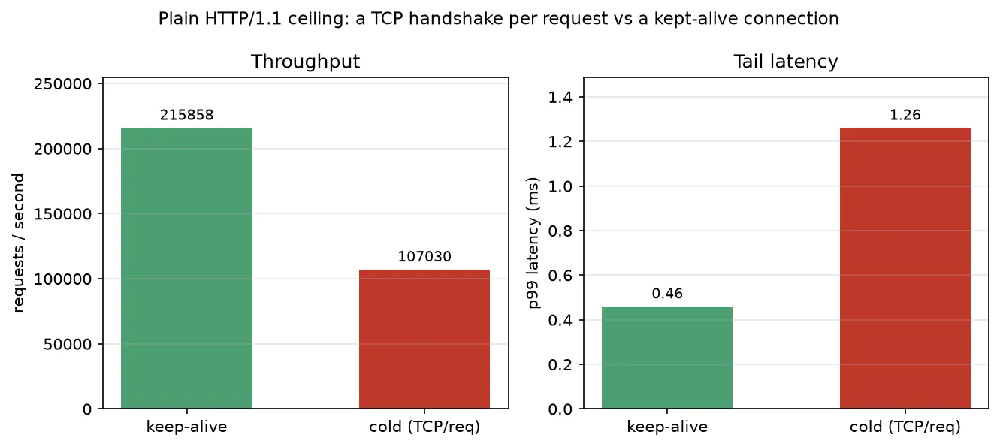
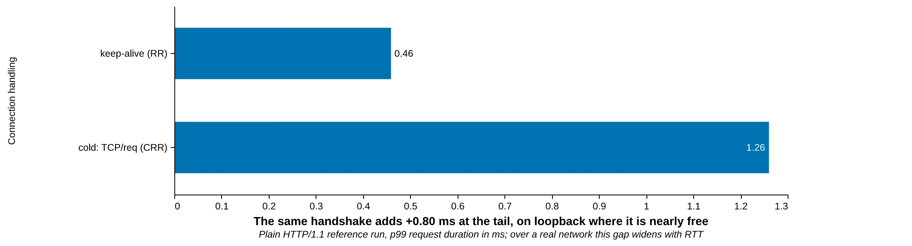

| Variant | KPI | req/s | p50 | p99 |
| --- | --- | --- | --- | --- |
| keep-alive       | RR  | 215,858 | 0.22 ms | 0.46 ms |
| cold (TCP/req)   | CRR | 107,031 | 0.40 ms | 1.26 ms |

*(Re-measured 2026-08-15 (v0.9.0 snapshot) — `bash bench/perf/run-perf.sh all` / `ceiling`.
Absolute keep-alive reads below the 07-20 pass (248.2k → 215.9k) on a host carrying unrelated
resident load this time (see [Scope & honesty notes](#scope--honesty-notes)); cold/keep-alive
**ratio** and the RR/CRR split are the durable signal.)*

A TCP handshake per request costs **~50 % throughput and +0.80 ms p99** even on loopback (where the
handshake is nearly free) — over a real network the gap widens with RTT. Connection reuse is
load-bearing; this is the plaintext analogue of the [TLS handshake-per-request row](#tls-termination) below.

> **A note on a latency bug this scenario caught.** An early body run showed a ~40 ms p99 cliff on
> medium streamed bodies — the signature of a delayed-ACK stall. The upstream client had Nagle's
> algorithm on (no `TCP_NODELAY`), so a streamed request body sent in several writes stalled on the
> peer's delayed-ACK timer. Disabling Nagle on the upstream sockets — standard practice for L7
> proxies — removed it (100 KB streamed p99 42.9 ms → 4.2 ms). The numbers here are post-fix.

## Throughput & latency vs concurrency

Closed-loop sweep (k6 `constant-vus`) — a fixed number of virtual users, each issuing its next
request only after the previous response. Rising concurrency walks the load curve.

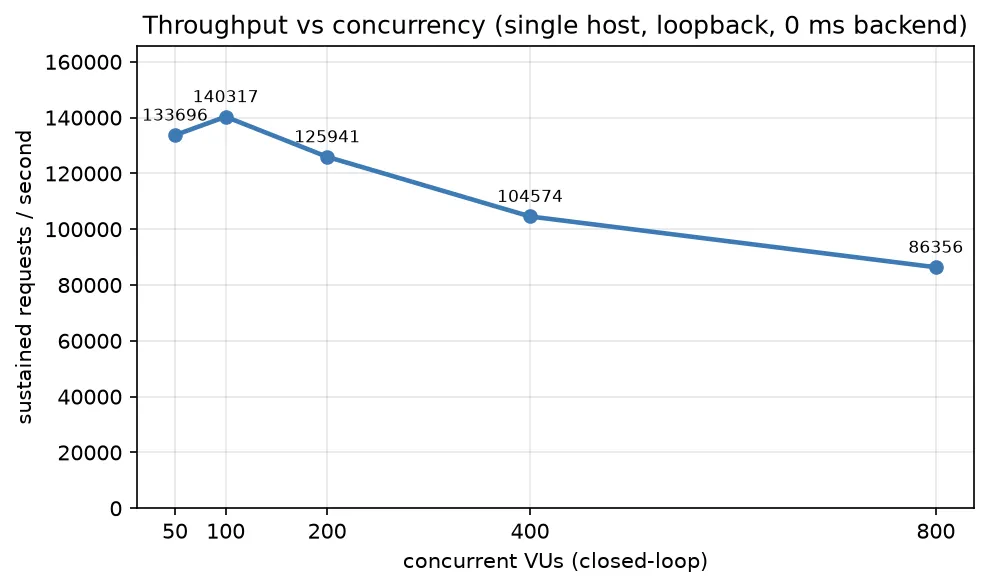
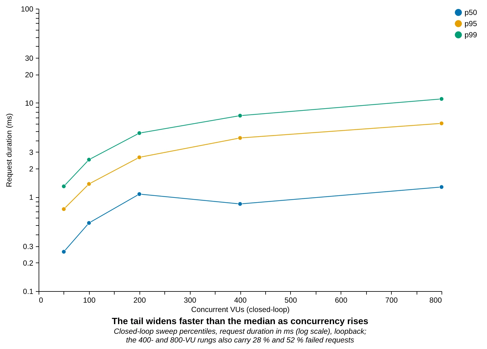

| VUs | req/s | p50 | p95 | p99 | p99.9 | failed |
| --- | --- | --- | --- | --- | --- | --- |
| 50  | 133,696 | 0.26 ms | 0.74 ms | 1.30 ms | 2.58 ms | 0% |
| 100 | **140,317** | 0.53 ms | 1.38 ms | 2.49 ms | 4.99 ms | 0% |
| 200 | 125,941 | 1.07 ms | 2.64 ms | 4.77 ms | 9.83 ms | 0% |
| 400 | 104,574 | 0.84 ms | 4.24 ms | 7.31 ms | 14.45 ms | **27.8%** |
| 800 | 86,356  | 1.28 ms | 6.06 ms | 11.01 ms | 22.28 ms | **51.7%** |

Throughput peaks at **~140.3k at VU 100 this run** (the k6 generator's own ceiling on its cores —
which VU count wins the peak is host/generator noise, not a proxy change) and, **through VU 200**,
declines gracefully with latency rising in proportion and zero failures — the shape this section has
always shown.

> **A newly-added admission-control cap now surfaces at VU >= 400 (measured 2026-07-20).** This pass
> is the first since ADR 000092 landed (2026-07-15, commit `36006c7`): Plecto Proxy now refuses a new
> connection outright once a single source IP holds `MAX_CONNECTIONS_PER_IP` = **256** concurrent
> connections (`crates/server/src/conn_limit.rs`, amending [[000027]]) - a CWE-770/CWE-400 hardening
> measure so one source can no longer monopolize every connection permit. `constant-vus` runs every
> VU as a genuinely concurrent connection from the **same** loopback source IP as the proxy itself,
> so VU 400 and VU 800 are, from the cap's point of view, one source opening 400 / 800 connections -
> well past the 256 threshold the 07-11 snapshot never crossed (its highest rung was also VU 800, but
> that pre-dates the cap by ten days). The refused connections surface as k6 `status !== 200` (no
> HTTP response at all - `res.status` reads `0`), which is exactly what the `failed` column counts.
> Confirmed as the cap, not host noise or the netns sandbox: the failure fractions reproduce within
> 0.1 pp whether this phase runs inside the isolated network namespace or in the host's normal
> namespace (28.0 %/47.0 % outside vs 27.9 %/47.1 % inside, back-to-back on the same host state), and
> the threshold crossing lines up exactly with the cap - 0 % at VU 200 (under 256), a jump at VU 400
> (over 256). This is a **benchmark-harness / feature interaction**, not a regression in the load
> balancer itself. **Reproduced unchanged on 2026-08-15** (27.8 % / 51.7 %), and *kept* here rather
> than tuned away: unlike the open-loop scenarios — whose oversized VU pools were pure artifact and
> are now [bounded below the cap](#tldr) — these two rungs exist to walk the concurrency curve, so
> crossing the cap is the honest thing for them to do. Read VU 400/800 as "one source IP past its
> admission budget", not as proxy overload; every other phase in this report keeps its own
> concurrency under 256 and reads clean.

## Tail latency under open-loop load

Open-loop sends at a **constant arrival rate** regardless of how fast responses come back, so
queueing surfaces in the tail instead of being hidden — the *coordinated-omission-safe* model.

| Model | target | achieved | p50 | p95 | p99 | p99.9 | dropped | failed |
| --- | --- | --- | --- | --- | --- | --- | --- | --- |
| open-loop, 0 ms backend (`plecto-loadgen`) | 98,221/s | **98,221/s** | 1.74 ms | 12.54 ms | 27.79 ms | 41.09 ms | **0** | 0% |

The auto target (70 % of the closed-loop peak, **98.2k/s** this run) is **achieved exactly** with
**zero dropped slots** under schedule-latency measurement (`plecto-loadgen openloop`, 64 workers —
well under ADR 000092's per-IP cap, unaffected; wrk2 model — see
[`bench/methodology.md`](../bench/methodology.md)). A co-resident Rust generator sustains the
auto rate without inventing its own queueing tail. p50 is a couple of milliseconds (honest schedule
lag under load); the ~28 ms p99 is the queueing tail to track.

## Round-robin distribution

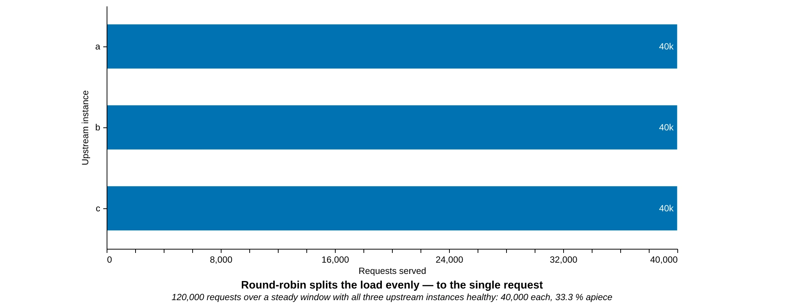

Over a steady window with all three upstreams healthy, **120,000** requests split **40,000 /
40,000 / 40,000** — even to a single request (33.3 % each). Round-robin holds under load.
(Re-measured 2026-08-15; `plecto-loadgen rr`, 48 workers — well under the per-IP cap, unaffected.)

## Resilience: ejection & fail-closed

A steady open-loop rate (~4k req/s, `plecto-loadgen ejection` with a 5 s unrecorded warm-up so
t=0 is already steady state) while a controller drives a fault timeline (`eject b` → `rejoin b` →
`eject all` → `restore all`) and the driver buckets each upstream's served-count and the 503/s
every second:

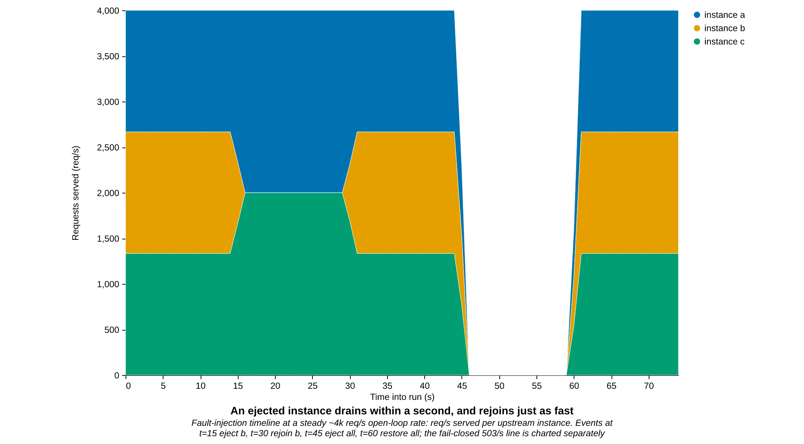
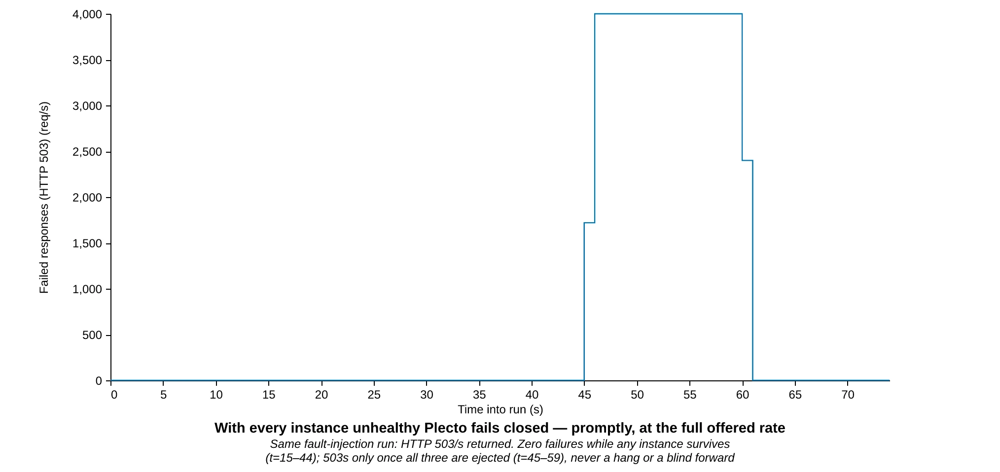

- **Even baseline.** ~4k req/s split three ways while healthy (1,333/1,334/1,333 this run).
- **Graceful ejection.** When **b** is driven unhealthy its share falls to zero within ~1 s (a
  one-second mixed transition bucket — `a=1660, b=680, c=1660` at t=15, then clean) and the
  survivors (a + c) absorb the full load **with zero failed requests** — this run they split it
  **evenly** (2,000/2,000), round-robin over two survivors landing on an even split.
- **Fail-closed, not fail-open.** With **every** instance unhealthy, Plecto Proxy returns **HTTP 503**
  promptly (no hang, no blind forward); the 503/s line jumps to the full offered rate (4,000/s here).
- **Fast recovery.** Restoring health returns instances to rotation within ~1 s (a one-second mixed
  bucket, then clean).

## Endpoint-set swap under load (ADR 000044)

A different axis than the ejection run above: instead of an existing instance's *health* flipping,
the upstream's *configured address set itself* changes — the shape a periodic-DNS re-resolution
swap takes (`resolve_interval_ms`), reproduced here via `swap-bench`'s SIGHUP reload path (the same
`ArcSwap<Endpoints>` replacement, ADR 000044). Subject: a 4-instance harness (`a, b, c, d`) starting
with the pool `[a, b, c]`; `plecto-loadgen swap` holds a steady open-loop rate while, mid-run, the
manifest is rewritten to `[a, b, d]` (dropping `c`, adding the spare `d`) and reloaded via SIGHUP —
the same fixed-rate timeline + per-instance bucketing the ejection run uses, generalized to a
changing label set (`bench/perf/run-perf.sh`'s `swap` phase).

The per-pick cost this introduces — an `ArcSwap<Endpoints>` load on every LB pick, not just on a
reload — is isolated in the companion criterion micro-benchmark,
[`pick_under_swap_churn`](#0-micro-benchmarks-in-process-criterion), under continuous concurrent
swap churn (the worst case; an unchanged tick short-circuits to one atomic load + compare and isn't
exercised there).

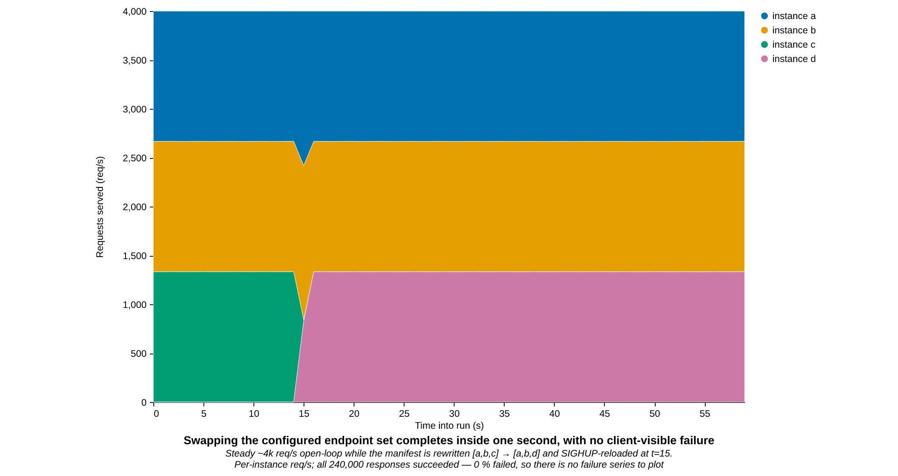

> Re-measured 2026-08-15 (v0.9.0 snapshot): a steady ~4k req/s open-loop while, at
> t=15 s (post-warmup), the manifest is rewritten `[a, b, c]` → `[a, b, d]` and SIGHUP-reloaded
> (64 workers — well under the per-IP cap, unaffected; same shape as every prior pass).

- **Zero client-visible failures.** All 240,000 responses over the 60 s run succeeded — **0 %
  failed** — even through the swap itself. Unlike a health-based ejection, nothing here ever needs
  to fail closed: `a` and `b` are unchanged addresses, so `reconcile` reuses their `Arc`s and
  health outright (ADR 000017's reuse rule), and only `d` starts pessimistic.
- **The swap completes within one second.** The transition second (t=15) shows a brief mixed
  bucket (`a=1581, b=1579, c=13, d=827`) as in-flight requests to `c` finish and the reconciled
  pool takes over mid-second; by t=16 the split is already clean — `c=0`, and `a` / `b` / `d` even
  at ~1,333 each — the same ~1 s time constant [ejection](#resilience-ejection--fail-closed) shows,
  because both paths funnel through the same `ArcSwap<Endpoints>` replacement.
- This confirms the read the [per-pick micro-benchmark](#0-micro-benchmarks-in-process-criterion)
  predicts: the swap itself is cheap and instantaneous from the client's perspective — the cost
  ADR 000044 introduces is the small continuous per-pick `ArcSwap` load, not a client-visible
  disruption at swap time.

## TLS termination

The same single-backend pass-through, re-run with rustls TLS termination, decomposed so the cost
of each layer is separable (oha; h1 client isolates the record/handshake split from h2
multiplexing). `plain (h1)` is the [plain HTTP/1.1 ceiling](#plain-http11-ceiling)'s keep-alive row,
not re-measured here.

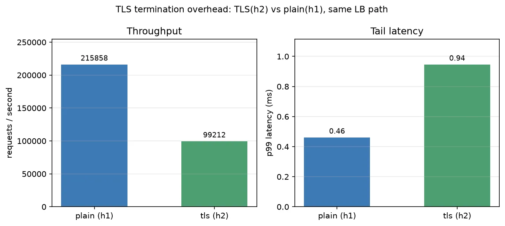
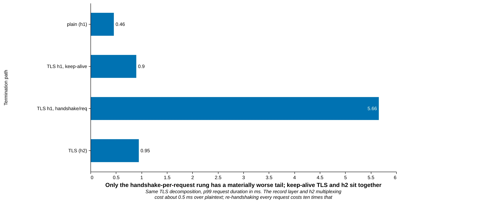

| Variant | req/s | p50 | p99 | isolates |
| --- | --- | --- | --- | --- |
| plain (h1)               | 215,858 | 0.22 ms | 0.46 ms | [ceiling](#plain-http11-ceiling) keep-alive |
| TLS h1, keep-alive       | 107,711 | 0.44 ms | 0.90 ms | record layer + TLS I/O path |
| TLS h1, handshake/req    | 23,085  | 1.90 ms | 5.66 ms | oha, shared `ClientConfig` — see caveat below |
| TLS (h2)                 | 99,213  | 0.48 ms | 0.95 ms | h2 multiplexing over TLS |

The decomposition is the point. This run's ordering is clean — plain h1 keep-alive (215.9k) sits
above the TLS keep-alive rung (107.7k, ~50 % of plaintext): **within-TLS ratios** are the signal:
handshake/req is **~21 % of TLS keep-alive**, and **h2 is clean** (99.2k/s, ~92 % of TLS
keep-alive, p99 0.95 ms — the closest h2 has read to the h1 rung in this report's history, and a
reminder that this ratio moves with host state). The TLS-terminated path remains **crypto-/TLS-I/O-bound**;
native-path optimisations don't reach it. A client that funnels many VUs over a handful of
multiplexed connections can make h2 *look* far worse (head-of-line queueing, not server work);
measuring with a connection-per-concurrency client removes that artifact.

*(Re-measured 2026-08-15 (v0.9.0 snapshot) on **aws-lc-rs** (ADR 000051), `-c 50` —
well under the per-IP cap, unaffected. Qualitative story unchanged across every snapshot so far.)*

### Full vs resumed handshake (ADR 000052)

*(Not re-run this pass either — `bench/perf/run-perf.sh`'s `tls` phase doesn't drive this
rung automatically; the numbers below are carried over unchanged from 2026-07-05.)*

The `handshake/req` row above no longer isolates a *true* full handshake: oha shares one rustls
`ClientConfig` across connections, and against a server issuing stateless TLS 1.3 session tickets
its "cold" connections silently resume once warm. `plecto-loadgen tls --mode full|resumed` gives
each rung explicit resumption control instead:

| Client resumption | req/s | p50 | p99 | resumed |
| --- | --- | --- | --- | --- |
| full (disabled)      | 22,099 | 2.06 ms | 4.36 ms | 0 % |
| resumed (enabled)     | 29,768 | 1.54 ms | 3.26 ms | 93.0 % |

A true full handshake (22.1k/s) is **~17 % slower** than the old `handshake/req` row (26.5k/s) —
confirming it really was partly resumed. Enabling client resumption recovers **~35 % throughput**
over a true full handshake — **≈11.7 µs/connection** (45.3 → 33.6 µs). That saving is the
certificate chain + signature generation/verification, **not** the ECDHE exchange: rustls's client
hardcodes `psk_dhe_ke` and never offers plain `psk_ke` (`client/hs.rs`, RFC 8446 §4.2.9 — "such
connections don't have forward secrecy"), so every resumed handshake here still runs a fresh ECDHE
exchange for forward secrecy. The ~11.7 µs matches that: skipping only the asymmetric
sign/verify + cert bytes is a much smaller saving than skipping ECDHE too would be. The residual
7 % full handshakes are cold-cache misses under concurrent load.

---

# 2. WASM extension plane

Plecto Proxy runs each request's *decision* — auth, rewriting, rate limiting, policy — as a sandboxed
**WebAssembly Component Model filter**, not native proxy code. This measures what that costs,
changing only **how the decision runs**. The bundled `bench/harnesses/bench-server` serves a **ladder** of
routes — all forwarding to the **same** backend — so each adjacent delta isolates one cost (the full
table is in [the cost ladder](#the-wasm-cost-ladder--isolating-each-cost) below): a native `/baseline`,
a pure no-op WASM filter pooled vs fresh (`/noop-pooled`, `/noop-fresh`), and the real `filter-apikey`
pooled vs fresh (`/trusted`, `/ondemand`).

`filter-apikey` is a real `plecto:filter` component: it reads `x-api-key`, stamps
`x-authenticated-user` on a valid key and forwards, or returns a typed `short-circuit` **401** on a
missing/invalid key. It is cosign-signed and loaded through the production verify-then-load path
(fail-closed). `filter-noop` returns `continue` with **no host-API calls** — it exists only to expose
the irreducible dispatch floor.

## The WASM cost ladder — isolating each cost

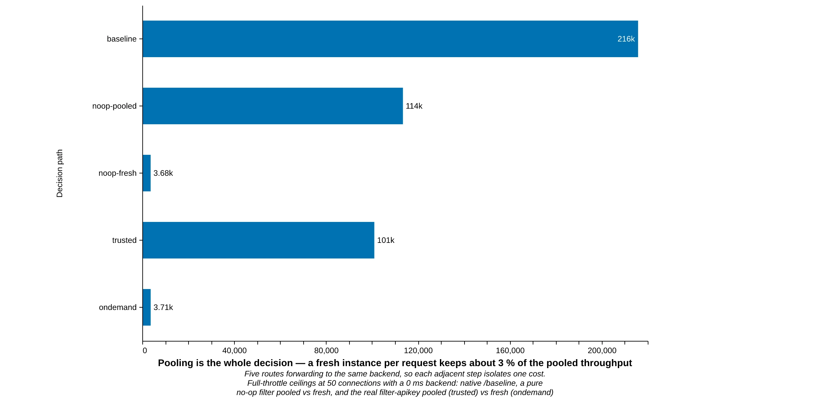
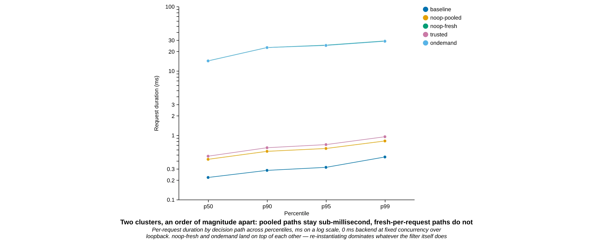

> W1 — fixed 50 connections, 0 ms backend, valid key (oha, warm-up burned in a discarded 5 s
> pre-run). Full-throttle: read these rows as **throughput ceilings**; the honest latencies are in
> the fixed-rate tail table below.

Five routes forward to the **same** backend, so each **adjacent delta isolates exactly one cost**. A
pure **no-op** WASM filter (no host-API calls) is the key addition — it separates "the WASM tax" from
"a real filter's work", which older reports conflated.

| Route | Decision path | req/s | p50 | p99 |
| --- | --- | --- | --- | --- |
| `/baseline` | native fast path (no filter) | 215,858 | 0.22 ms | 0.46 ms |
| `/noop-pooled` | a **pure no-op** WASM filter, pooled | 113,509 | 0.42 ms | 0.81 ms |
| `/noop-fresh` | the same no-op, **fresh instance / request** | 3,684 | 14.32 ms | 29.17 ms |
| `/trusted` | the real `filter-apikey`, pooled | 101,050 | 0.47 ms | 0.95 ms |
| `/ondemand` | `filter-apikey`, fresh instance / request | 3,714 | 14.29 ms | 28.87 ms |

*(Re-measured 2026-08-15 (v0.9.0 snapshot), `-c 50` — well under the per-IP cap,
clean. `/baseline` is sourced from [ceiling.csv](#plain-http11-ceiling); the other four rungs are
measured together in the same session. This run's ordering is clean — `baseline` > every
WASM rung, no under-read artifact — so the full-throttle floor reads directly; the fixed-rate tails
below remain the honest queueing-free read.)*

- **baseline → noop-pooled** = the **irreducible extension-plane dispatch cost**. Full-throttle,
  this run shows a **~47 % throughput** cost (215.9k → 113.5k, **≈ 4.18 µs/req** inverse-throughput
  delta — matching the T1 gate's interleaved **3.90–4.06 µs** dispatch-floor invariant across three
  runs); the fixed-rate tails put the queueing-free floor at **+0.10 ms p50 / +0.33 ms p99**. Every
  WASM filter pays this floor.
- **noop-pooled → noop-fresh** = the **per-request instantiation cost**, cleanly isolated from any
  host work: throughput collapses **~31×** (113.5k → 3.7k). This is what pooling buys.
- **noop-pooled → trusted** = a **real filter's own work** on top of the no-op (header parse +
  host-KV lookup + counter): **−11 % (~1.09 µs this run)** — bracketing the T1 gate's interleaved
  **0.87–1.06 µs** apikey-cost invariant, and inside the historical A/B band (0.3–1.2 µs) though
  near its top; the 07-20 pass read 0.44 µs at the band's other end. The apikey filter is cheap;
  the dispatch floor still dominates it by ~4×.
- **noop-fresh and ondemand are the same order of magnitude** (3.7k vs 3.7k req/s — indistinguishable
  this pass), confirming instantiation dominates the fresh path — the filter's per-request work is
  noise next to re-paying `init` (~44 µs, this pass's fresh criterion figure) every request.

### The same ladder at one fixed rate — honest tails

> W1b — every rung offered the **same** fixed **2,209 req/s** this run (60 % of the slowest rung's
> ceiling, `/noop-fresh` at 3,684/s), 50 connections, oha `-q` + `--latency-correction`
> (coordinated-omission-safe). Identical offered load, so the latency columns are directly
> comparable — but this rate still sits on the fresh path's ~4k/s knee (see the mechanism note
> below), and the fresh rungs' tails show it.

| Route | achieved | p50 | p90 | p99 |
| --- | --- | --- | --- | --- |
| `/baseline` | 2,209/s | 0.32 ms | 0.49 ms | 0.80 ms |
| `/noop-pooled` | 2,209/s | 0.42 ms | 0.57 ms | 1.13 ms |
| `/trusted` | 2,209/s | 0.48 ms | 0.64 ms | 1.13 ms |
| `/noop-fresh` | 2,209/s | 1.07 ms | 1.83 ms | 23.73 ms |
| `/ondemand` | 2,209/s | 1.17 ms | 1.90 ms | 31.63 ms |

At a rate every rung sustains, the pooled dispatch floor costs **+0.10 ms p50 / +0.33 ms p99** over
native and the real pooled filter **+0.16 ms p50 / +0.33 ms p99** — sub-millisecond to ~1 ms at p99,
consistent with prior snapshots. The fresh rungs live at **p99 ~24–32 ms** this run, in the same
band as the 07-20 pass (~25.8 ms) at a nearby rate, and consistent with the already-documented knee
mechanism below: the fresh path's tail is sharply rate-dependent near ~4k/s (documented p99 4.7 ms
at 2k/s vs ~650 ms at 4.2k/s), and both passes' derived rates (2.21k/s here, 2.40k/s then) sit on
that steep stretch. Per-request instantiation is still not a tail you can operate behind near or
above that knee.

> **The fresh tail is a kernel-side knee, not CPU queueing (measured 2026-07-06).** A fresh
> instance is an mmap at instantiate and an munmap at drop, every request
> (`Allocation::OnDemand`); munmap serializes on the process's `mmap_lock` and IPIs every core
> running the process (TLB shootdown). `/proc/interrupts` deltas during fixed-rate runs: the fresh
> rung takes **~31–35 TLB shootdowns/req vs ~0.3 pooled — ~100×**. The resulting tail is sharply
> rate-dependent — p99 **1.4 ms at 1k/s, 4.7 ms at 2k/s, ~650 ms at 4.2k/s, ~1.2 s at 6k/s** (with
> shootdowns/req itself doubling as concurrency rises) — a knee near ~4k/s, roughly *half* the
> rung's closed-loop ceiling. The 07-05 snapshot's W1b fixed rate (60 % of that run's slowest
> ceiling, 4,189 req/s) landed almost exactly on that knee, which is why its fresh rows' absolute
> tails were chaotic across earlier snapshots (440 → 738 ms between runs; 83 ms vs 648 ms at the
> same rate on the same host minutes apart) while the pooled rows stayed stable; snapshots at
> 07-09 (2.9k/s), 07-11 earlier pass (1.9k/s) and 07-11 release confirmation (2.15k/s) sat clear of
> the knee and read correspondingly clean fresh tails — **2026-07-20's 2.40k/s and 2026-08-15's
> 2.21k/s both sit far enough up the same curve that the fresh p99 (~25.8 ms / ~24–32 ms) is
> visibly worse than those three**, illustrating just how steep this region is: a ~12 % rate
> increase (2.15k → 2.40k/s) produced a ~4–6× tail increase, not a proportional one. Avoiding precisely this
> per-request mmap/munmap churn is why wasmtime's pooling
> allocator pre-maps slots and batches decommits — the trusted path rides that. Stated portably:
> fresh-per-request has a clean-tail operating ceiling around ~2k/s on this host, and that — not
> the ~40 µs — is the pooling decision's real justification.

**The µs/req deltas are the invariants to track for regressions, not the percentages** (which widen or
shrink whenever the *baseline* moves). These macro deltas **reconcile with the in-process
[micro-benchmarks](#0-micro-benchmarks-in-process-criterion)** — with one disclosed asymmetry: this
run's clean full-throttle ordering gives a real baseline→noop-pooled inverse-throughput delta of
**~4.18 µs/req** (4.63 → 8.81 µs); criterion clocks the pooled per-request call at ~2.88 µs of that,
leaving **~1.3 µs** as the `spawn_blocking` handoff (sync wasmtime, `!Send` store) that a route
with no filters skips entirely. The fresh ~44 µs, by contrast, is the *uncontended* cost — criterion
instantiates sequentially, so it never pays the `mmap_lock` contention or cross-core shootdowns the
concurrent macro run exposes (the knee above). The layers agree once that kernel-side term is named.

## Short-circuit: rejecting bad traffic at the edge

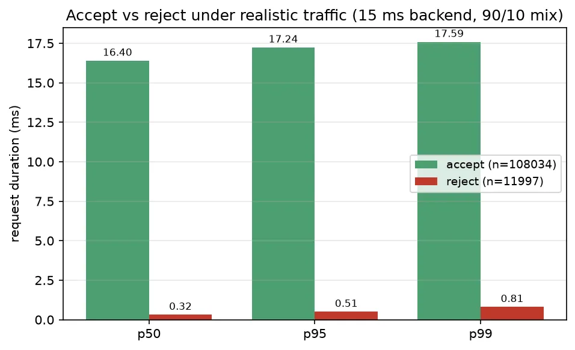

> W2 — fixed 2000 req/s, 15 ms backend, ~90 % valid / ~10 % bad keys (k6). 108,034 accepted, 11,997
> rejected, **0 status-less** — a **90.0 % / 10.0 %** split, matching the script's own key roll.

| Path | p50 | p95 | p99 |
| --- | --- | --- | --- |
| accept (200, forwarded) | 16.40 ms | 17.24 ms | 17.59 ms |
| reject (401, short-circuited) | 0.32 ms | 0.51 ms | 0.81 ms |

Accepted requests cost the 15 ms backend plus the small pooled-filter + proxy overhead. Rejected
requests are decided **at the edge in ~0.32 ms** and never reach the upstream: bad traffic is shed
**~51x faster** than good traffic is forwarded, and is harmless to the backend it would otherwise
hit. (Filter faults or deadline overruns **fail closed** - 502/504 - exercised by the test suite,
not this benchmark.)

> **The 07-20 split (76 %/24 %) was a harness artifact, now fixed and re-measured (2026-08-15).**
> That pass's `constant-arrival-rate` executor pre-allocated **300 VUs** — above ADR 000092's
> 256-connections-per-source-IP cap — and `bench/k6-wasm/mixed.js` counted *anything* not `200` as
> a rejection, so refused connections (`res.status === 0`, no HTTP status at all) were tallied
> alongside genuine 401s. The script now bounds its pool below the cap and counts a status-less
> response in its own `no_status` bucket, which the CSV carries; this pass reports **`no_status` =
> 0** and the split returns to the designed ~90/10. The 07-20 *latency* figures were always valid —
> only the count split was contaminated.

## v0.3.0 response ladder + compression

The `all` pass measures every route with ADR 000073/074/075 **present but
unused**. This section fills the gap: what those features cost **when exercised**. Opt-in phase
(`bash bench/perf/run-perf.sh v03`) — not part of `all`, so a full refresh stays heavy while this
row can be re-run alone. Same generators and CO-safe tail pattern as
[the WASM cost ladder](#the-wasm-cost-ladder--isolating-each-cost).

### Response-context read vs `replace` (ADR 000073)

> R1 — fixed 50 connections, 0 ms backend, tiny response (oha). Lean `filter-resp` (no host-API
> calls): `/resp-ctx` always *reads* the as-forwarded request snapshot then `continue`;
> `/resp-replace` does the same read then `replace`s with a synthesised **418** (marker header
> `x-plecto-resp-replace`). Control is same-session `/noop-pooled` (ignores the snapshot).

| Route | Decision path | req/s | p50 | p99 | µs/req |
| --- | --- | --- | --- | --- | --- |
| `/noop-pooled` | on-response unused params → continue | 112,955 | 0.42 ms | 0.83 ms | 8.85 |
| `/resp-ctx` | read as-forwarded snapshot → continue | 110,183 | 0.44 ms | 0.83 ms | 9.08 |
| `/resp-replace` | read + `replace` (418, 23 B body) | 105,742 | 0.45 ms | 0.84 ms | 9.46 |

*(Re-measured 2026-08-15 via `v03`. Same-process adjacent deltas — do not splice onto an older
`wasm` CSV's noop row.)*

- **noop-pooled → resp-ctx ≈ +0.22 µs/req** this run — the cost of *using* the ADR 000073 request
  snapshot on `on-response` (path length + header scan), with the same continue/forward path. The
  three snapshots that have measured this rung read **+0.90 / +0.10 / +0.22 µs**, all small enough
  that the run-to-run movement of the ceiling itself is a comparable term; track the fixed-rate p50
  below alongside this figure, not this number alone. The T1 gate's `respctx_tail_p50_ms`
  invariant (+0.016 ms over pooled this pass) is the tighter read.
- **noop-pooled → resp-replace ≈ +0.60 µs/req** net at full throttle — unchanged from the prior
  pass to two decimals. `replace` synthesises a tiny body and **drops** the upstream payload on the
  wire (verified: `Content-Encoding` N/A, 23-byte 418). That wire-shape change can *under-* or
  *over-read* replace's guest/host work relative to resp-ctx run to run; do **not** read either
  pass's number as a pure CPU claim. The regression signal for replace is "still within ~1 µs of
  the pooled no-op on this host," and that holds this pass too.
- Fixed-rate tails at **63,444/s** (60 % of this ladder's slowest ceiling; oha `-q`
  `--latency-correction`): all three rungs hold the offered rate; **p50 stays ~0.88–0.91 ms**. p99
  at this rate is host-noise-dominated on this session (8–18 ms) — same caveat as other
  high-rate fixed runs near a host knee; prefer µs/req + p50 for this row.

### Native response compression (ADR 000074 / 000075)

> R2 — same oha shape; backend **4 096 B** repeating `text/plain` (above the 1024-byte
> `min_length` default). Both routes send `Accept-Encoding: gzip`. `/baseline` has no
> `[route.compression]` → identity; `/compress` pins `algorithms = ["gzip"]`. Wire check:
> identity 4096 B vs gzip **45 B** + `Content-Encoding: gzip` + `Vary: accept-encoding`.

| Route | Transform | req/s | p50 | p99 | µs/req |
| --- | --- | --- | --- | --- | --- |
| `/baseline` | identity (AE advertised, opt-in off) | 192,892 | 0.25 ms | 0.46 ms | 5.18 |
| `/compress` | gzip (level 5, ADR 000075 defaults) | 133,135 | 0.36 ms | 0.63 ms | 7.51 |

- **baseline → compress ≈ −31.0 % ceiling / +2.33 µs/req** for this highly compressible 4 KiB
  filler — the third pass in a row within ~0.25 µs of the same figure (+2.11 / +2.09 / +2.33). Real
  HTML/JSON ratios and CPU will differ; this row is a **regression floor** for the opt-in path, not
  a capacity guide for production payloads. RFC 9411 §7.3-style: one object size, sustainable
  throughput, method disclosed.
- Fixed-rate at **79,881/s** (60 % of compress ceiling): both hold the rate; p50 ≈ 0.94 ms;
  p99 again host-noise-band at this offered load (87 ms identity / 116 ms gzip — this session's
  neighbour load shows up hardest in the highest-rate fixed run in the report) — µs/req from the
  ceiling table is the durable signal.

**Criterion note (not re-run here).** Day-to-day criterion absolute drift (±10–20 %) is expected
without a locked governor. To attribute ADR 000073 contract-surface cost in-process, use a
same-host baseline pair — `cargo bench -p plecto-host -- --save-baseline pre-adr73` on the
pre-landing commit, then `--baseline pre-adr73` after — per
[criterion baselines](https://bheisler.github.io/criterion.rs/book/user_guide/command_line_options.html)
([`bench/methodology.md`](../bench/methodology.md)).

## Outbound ext_authz (ADR 000036)

A filter can call an external authorization service per request over the lent, SSRF-guarded outbound
capability (`filter-extauthz`). Per-request cost is three parts, only the first two Plecto Proxy's: the
WASM tax (the same [cost ladder](#the-wasm-cost-ladder--isolating-each-cost)), the outbound gate
(allowlist + SSRF classification — nanoseconds, negligible), and the network round-trip to the authz
endpoint, which dominates and is the *operator's* latency, not Plecto Proxy's.

Load numbers are deferred rather than faked: the SSRF guard blocks loopback by design, so a hermetic
mock authz needs a non-loopback endpoint (environment-specific), and the connector currently opens a
new connection per call (pooling is a follow-up). The capability itself is verified end-to-end by
the host's `outbound-http` test suite (allowlist deny + DNS-rebinding SSRF block).

## Host-enforced rate limiting

Plecto Proxy's rate limiter is a **host-native token bucket** (ADR 000026): the bucket spec
(`capacity` / `refill_tokens` / `refill_interval_ms`) is configured **in the operator's manifest**,
not by the filter — an untrusted filter passes only `(key, cost)` and so cannot widen its own limit.
The refill + counting stay host-side (the WASM boundary is not crossed on the hot path); the filter
only decides *whether* to consult the limiter and *on what key*. Driven through `bench/harnesses/bench-server`
(`filter-hello`, pooled); a `429` carries `retry-after-ms`.

> **Scope: single node.** Every run below drives one `plecto` instance. The bucket is **node-local**
> ([ADR 000053](../docs/ADR/000053.md)) — the enforcement and fairness numbers describe what one
> instance guarantees, not a multi-replica fleet. Behind a load balancer fanning out to N replicas,
> the fleet's effective allowed rate scales with N unless the front LB pins a key to one replica; see
> the [hardening guide](../docs/hardening.md) for the operational formula.
>
> **Scope: in-memory state backend.** These numbers (and every host-state number in this report) run
> the default `[state] backend = "memory"`. With `backend = "redb"`, the backend write happens
> **inside the process-wide quota lock** (`charge_and_apply` — the price of closing the CWE-770
> accounting race), so every host-kv / counter / rate-limit call across all filters serializes
> behind that disk write. Persistent-state throughput under concurrency is structurally different
> and **unmeasured here**.

### Overhead — the cost of consulting the bucket

> R1 — 50 VUs, 0 ms backend, a **never-deny** bucket spread across 1000 keys (k6). `/baseline` vs
> `/ratelimit`.

| Route | req/s | p50 | p99 |
| --- | --- | --- | --- |
| /baseline (no filter) | 146,402 | 0.24 ms | 1.33 ms |
| /ratelimit (bucket) | 97,584 | 0.43 ms | 1.22 ms |

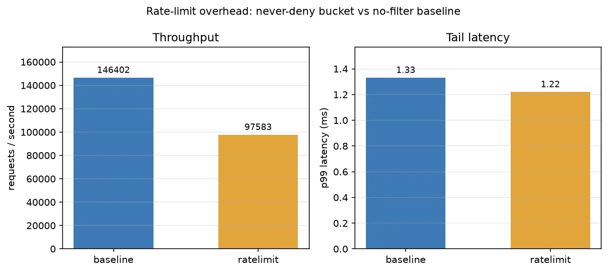
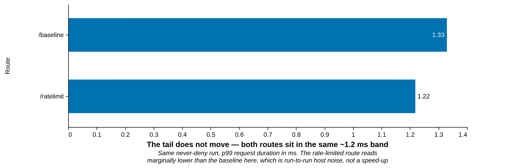

The rate-limited route adds **~3.4 µs/req** over the no-filter baseline (~33 % of its throughput;
p99 stays in the same ~1.2 ms band — the µs/req is the inverse-throughput delta at 50 VUs, well
under ADR 000092's per-IP cap, unaffected). Four same-day measurements of this tax read **3.11 /
3.42 / 3.79 / 4.88 µs** — the last one is the single T1 gate excursion this pass (band 2.2–4.2, see
the [TL;DR](#tldr)), and the spread is what a non-idle host costs a wall-clock invariant. That is
the whole hot-path tax with no rejections — the
filter dispatch floor (the same one the
[WASM ladder](#the-wasm-cost-ladder--isolating-each-cost) isolates) plus the host-native bucket
consult, including the per-call host-state quota check (ADR 000027) that keeps a multi-tenant
filter's bucket count bounded.

### Enforcement — does it actually hold the rate?

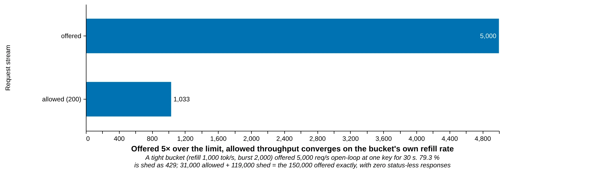

> R2 — a **tight** bucket (refill 1000 tok/s, burst 2000), offered **5000 req/s** open-loop at one
> key for 30 s (k6).

| offered | allowed (200) | shed (429) | status-less | accept p99 | 429 p99 |
| --- | --- | --- | --- | --- | --- |
| 5,000/s | **1,033/s** | 79.3% | **0** | 1.97 ms | 0.70 ms |

Offered 5× over the limit, the **allowed throughput converges correctly to the bucket's refill
rate** (≈ 1.0k/s — the configured 1000 tok/s plus the burst amortised over the run) — **the same
1,033/s as every prior snapshot**, falling out of the bucket's own math (refill vs offered rate),
not host timing. The accounting is complete this pass: 31,000 allowed + 119,000 shed = **150,000**,
exactly the 5,000/s × 30 s offered, with **zero status-less responses**.

> **This row was contaminated on 2026-07-20 and is repaired here (2026-08-15).** That pass reported
> 59.6 % shed because `bench/k6-wasm/ratelimit-enforce.js` counted only `status === 200` and
> `status === 429`, dropping everything else — and its `preAllocatedVUs` (`max(200, RATE/10)` =
> **500** for a 5,000 req/s offer) was almost double ADR 000092's 256-per-IP cap, so **48.8 % of
> attempts produced no HTTP status at all** and vanished from both counters. The pool is now bounded
> below the cap and status-less responses have their own tracked `no_status` bucket. The repaired
> figure — **79.3 %** — reproduces the pre-cap 07-11 snapshot's 79.3 % exactly, which is the
> strongest available evidence that the cap interaction, not the proxy, was the whole story.

### Fairness — one key cannot starve another

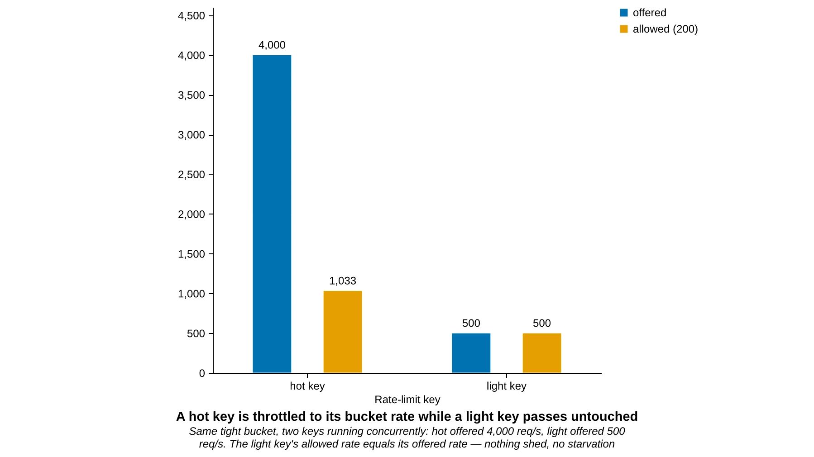

> R3 — same tight bucket; two keys concurrently: a **hot** key offered 4000/s and a **light** key
> offered 500/s (k6).

| key | offered | allowed (200) | shed | status-less |
| --- | --- | --- | --- | --- |
| hot | 4,000/s | 1,033/s | 74.2% | **0** |
| light | 500/s | **500/s** | 0% | **0** |

State is **per key**, and this pass measures it end to end rather than inferring it: the hot key is
throttled to **its own** refill rate (1,033/s — the same figure the single-key
[enforcement](#enforcement--does-it-actually-hold-the-rate) run produces, so the light key's traffic
costs it nothing), while the light key **receives every request it offers** — 500/s offered, 500/s
allowed, zero 429s, zero status-less. A hot neighbour cannot starve a light one.

> **The 07-20 pass could not show this** (light read 145/s against a 500/s offer, with 0 % shed):
> the two scenarios share one k6 process and one loopback source IP, and `hot`'s pool alone
> (`max(200, 4000/10)` = **400**) exceeded ADR 000092's 256-per-IP cap, so the light key's
> connections were refused at accept — starvation by the harness's own connection budget, dressed
> up as a fairness result. With both pools bounded below the cap (150 hot / 50 light) the intended
> claim is now the measured one.

## Request body handling

The request-side **body hook** (`on-request-body`, ADR 000025) follows a *buffer-then-decide* model:
for a filtered route carrying a body, the host buffers it (bounded — 16 MiB cap, fail-closed 413),
runs the filter's `on-request-body`, and forwards the possibly-transformed body — or short-circuits
before upstream. `filter-hello` uppercases the body (a real transform) or 403s on a `deny-body`
marker. A bodyless request, a filter-less route, and — since ADR 000038 — a route whose filters are
**all header-only** (none exports `on-request-body`) keep the zero-copy streaming path: the host
decides from the component's exports whether any filter reads the body, and buffers only then.

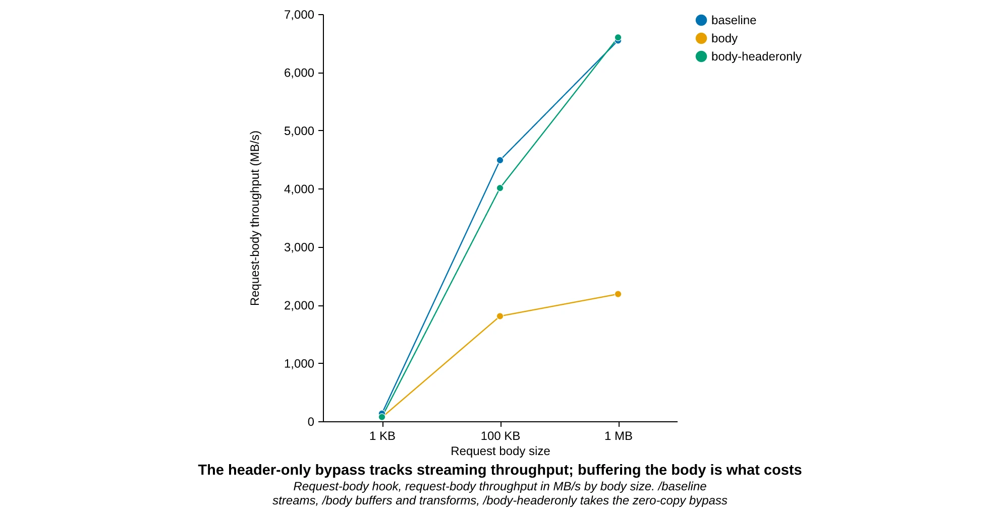
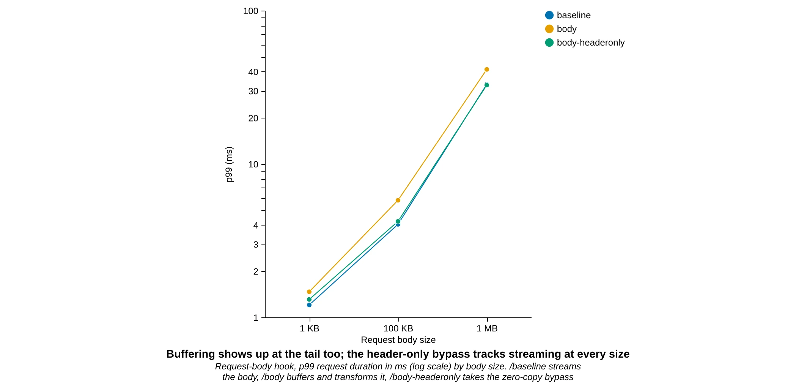

> B — 50 VUs, POST a `SIZE`-byte body at 1 KB / 100 KB / 1 MB (k6), to `/body` (filter-hello buffers +
> transforms), `/body-headeronly` (a header-only filter — body streams through, ADR 000038), and
> `/baseline` (no filter). `MALLOC_ARENA_MAX=4`, the shipped allocator default (ADR 000038).

| size | route | req/s | throughput | p99 |
| --- | --- | --- | --- | --- |
| 1 KB   | /baseline        | 129,641 | 133 MB/s  | 1.21 ms |
| 1 KB   | /body            | 65,639  | 67 MB/s   | 1.47 ms |
| 1 KB   | /body-headeronly | 72,084  | 74 MB/s   | 1.31 ms |
| 100 KB | /baseline        | 43,833  | 4488 MB/s | 4.05 ms |
| 100 KB | /body            | 17,648  | 1807 MB/s | 5.80 ms |
| 100 KB | /body-headeronly | 39,161  | 4010 MB/s | 4.23 ms |
| 1 MB   | /baseline        | 6,243   | 6546 MB/s | 33.1 ms |
| 1 MB   | /body            | 2,086   | 2187 MB/s | 41.4 ms |
| 1 MB   | /body-headeronly | 6,293   | 6599 MB/s | 32.7 ms |

A filter that **reads** the body pays for it, growing with payload: **~49 % throughput at 1 KB** (the
buffer + WASM transform dominate the small request), **~60 % at 100 KB**, **~67 % at 1 MB** (a
full-body copy + uppercase per request). A **header-only filter takes the zero-copy bypass** — the
body never enters guest memory: at 1 MB it reads **~0.8 % above `/baseline`** (ADR
000038 — the two paths are indistinguishable at this size, and which one wins is noise); at 100 KB
the gap is **~11 %** (`VUS=50`, well under the per-IP cap); at 1 KB it reads well below baseline —
the ordinary **WASM dispatch floor** on a tiny request, not a body cost. RSS at 1 MB × 50 VUs (fresh
proxy per route, `MALLOC_ARENA_MAX=4`): **~101 MB `/baseline` · ~177 MB `/body` · ~97 MB
`/body-headeronly`**
(`data/body_rss.csv`). The export-presence bypass keeps a header-only route near baseline. The buffer
stays bounded (16 MiB cap, fail-closed 413) for the filters that do read the body. The remaining
buffered-path copy is the target of a future `stream<u8>` increment (ADR 000020); a per-request
time-series / allocator-sweep decomposition lives in `bench/perf/mem_matrix.py`.

## Footprint

Idle resident set and the marginal cost of an open connection (`bench/harnesses/bench-server`):

| Metric | Value |
| --- | --- |
| idle RSS | ~46 MB |
| RSS holding keep-alive connections | ~53 MB (250 conns) |
| marginal bytes / connection | ~25.4 KB |

*(Re-measured 2026-08-15, after fixing the phase itself. It used to ask for **1,000** connections —
above ADR 000092's 256-per-IP cap, so only 256 were ever admitted — and then divide the RSS delta by
the **requested** 1,000, publishing a figure ~4× too small; the long connect loop could also outrun
the RSS sample, which is how the first run of this pass read an absurd 8 bytes/conn. The phase now
asks for **250** (under the cap, so every connection it counts is one the proxy actually holds) and
divides by the count the generator reports as open. At 25.4 KB/conn the corrected figure lands back
on the historical ~24.8–24.9 KB/conn, and idle RSS (~46 MB) matches the prior ~45–46 MB.)*

---

# 3. Realistic & protocol coverage

## Weighted request mix — with its own baseline

> M1 — open-loop 20k req/s, a weighted blend across routes on one gateway (k6): read-heavy, partly
> edge-checked (per-tenant rate-limit keys, 200 tenants, never-deny bucket), occasional writes,
> rare large payloads. Paired with a **read-only control at the same arrival rate** — 100 % plain
> reads — so the per-class deltas are attributable to the traffic *blend*, not the offered load.

| Profile | Class (share) | route | p50 | p99 | p99.9 |
| --- | --- | --- | --- | --- | --- |
| read-only (control) | read 100 % | GET `/baseline` (1 KB) | 0.29 ms | 8.92 ms | 18.22 ms |
| mix | read 60 % | GET `/baseline` (1 KB) | 0.31 ms | 10.94 ms | 18.50 ms |
| mix | auth read 25 % | GET `/ratelimit` (tenant key) | 0.46 ms | 11.37 ms | — |
| mix | write 10 % | POST `/body` (1 KB) | 0.55 ms | 11.99 ms | — |
| mix | large 5 % | POST `/body` (100 KB) | 1.69 ms | 14.68 ms | — |

Both profiles hold ~20k/s offered (19,937 read-only / 19,870 mix; zero 429s from the never-deny
bucket, **zero status-less responses**, and 0.47 % / 0.80 % of iterations dropped — the honest
open-loop shed signal, see the note below). The pairing is the point: at the same rate, **the blend
costs the plain reads +2.0 ms at p99** (8.92 → 10.94 ms) this run — head-of-line pressure from the
body classes — and the classes order exactly as their work predicts (read < auth read < write <
large, monotone in both p50 and p99). A single-endpoint test hides all of this; the control run
keeps it honest.

> **The 07-20 figures for this section were diluted; these are not (2026-08-15).** That pass's
> `record()` folded **every** response's duration into the latency Trends regardless of status,
> while its VU pool (**500**, for a 20,000 req/s offer) sat above ADR 000092's 256-per-IP cap — so
> near-instant connection refusals were pulling the published percentiles *down*. It read p99 ~5.5 ms
> where this pass reads ~10.9 ms; the earlier number was the artifact, and the report flagged it as
> unconfirmed at the time. `weighted-mix.js` now drops status-less responses into their own counter
> before the trend, and holds its pool at **240** — just under the cap. That pool is also this
> phase's binding constraint: at 20k req/s the blend's slow patches want ~200 iterations in flight,
> so what does not fit is reported as dropped iterations (~0.5–0.8 %) rather than silently reshaping
> the distribution. Running this phase materially above 20k req/s from a single source IP is not
> possible on this harness without crossing the cap.

## HTTP/3

The fast path terminates **HTTP/3 over QUIC** (ADR 000016; `tls-http` serves h1/h2/h3 on one port). A
functional check confirms it end-to-end:

```
curl --http3-only https://…/api/hello  ->  status=200 http_version=3
```

*(Re-confirmed 2026-08-15.)*

A **rigorous, coordinated-omission-safe H3 *load* benchmark is deferred**: oha and k6 have no native
HTTP/3, and a correct tail needs an H3-capable open-loop generator (**h2load** with
`--npn-list h3`, or an equivalent H3 load tool). Rather than publish process-spawn-bound `curl`-loop numbers, the H3 load figure
stays absent until that tooling is in place — server support is verified, not throughput.

## WebSocket Upgrade tunnel (ADR 000048)

Plecto Proxy's HTTP/1.1 Upgrade path (ADR 000048): a route declaring `[route.upgrade] protocols =
["websocket"]` forwards the client's handshake (controlled re-issue — hop-by-hop stripping stays
the default for every other route), and on the upstream's 101 the proxy splices the two connections
into an opaque bidirectional byte tunnel — the same post-upgrade relay shape used by typical
L7 `Upgrade` / TCP tunnel modes. This is a **different load shape**
than every other scenario in this report: a long-lived, stateful connection instead of a
short-lived request, so it exercises axes nothing else here does — connection-permit accounting
(the circuit breaker / least-request in-flight counters follow the tunnel for its whole lifetime,
not just the handshake) and an activity-based idle timeout, rather than throughput-per-request.

`bench-server`'s `/ws` route tunnels to a dedicated mock upstream that completes the RFC 6455
handshake and echoes every frame; `plecto-loadgen`'s `ws` subcommand drives three sub-scenarios
(`bench/perf/run-perf.sh`'s `ws` phase):

- **Handshake rate** — open-loop paced Upgrade attempts/sec (the 101 handshake runs through the full
  filter chain like any other request, so it pays the same per-request cost the rest of this report
  measures — only the post-101 tunnel is new).
- **Tunnel footprint** — RSS held by 1,000 concurrently open (idle) tunnels, the long-lived-connection
  analogue of [Footprint](#footprint)'s keep-alive connection measurement.
- **Echo throughput** — sustained request/response frames per held tunnel, at two payload sizes
  (1 KB / 64 KB), closed-loop per connection (the same concurrency model oha's `-c N` uses).

> Re-measured 2026-08-15 (v0.9.0 snapshot): `bash bench/perf/run-perf.sh all` / `ws`.
> Handshake (paced 500/s, 64 workers) and echo (50 conns) both stay well under ADR 000092's per-IP
> cap and show no failure symptom; the tunnel-footprint `hold --conns 1000` again reached the full
> 1,000 held tunnels, where the generic [Footprint](#footprint) phase's plain-connection hold is
> bounded by that cap — reported as measured.

| Scenario | Result |
| --- | --- |
| Handshake rate | 10,000/10,000 Upgrades succeeded at the paced 500/s target — **0 % failed** over 20 s |
| Tunnel footprint | idle RSS 77.6 MB → 90.1 MB with 1,000 held tunnels — **~12.8 KB/tunnel** |

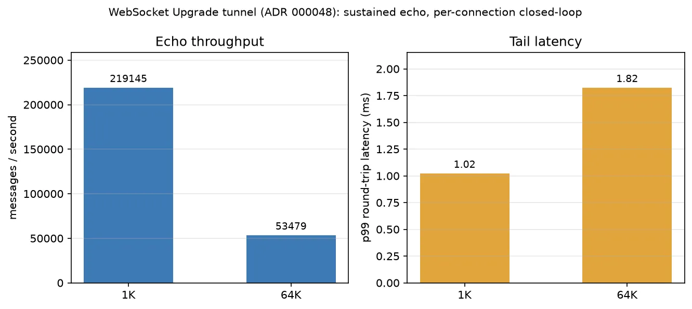


| Payload | messages/s | throughput | p50 | p99 |
| --- | --- | --- | --- | --- |
| 1 KB  | 219,145 | 224 MB/s   | 0.18 ms | 1.02 ms |
| 64 KB | 53,480  | 3,505 MB/s | 0.90 ms | 1.83 ms |

The handshake rate holds at 100 % of target with zero rejections — the Upgrade path costs nothing
beyond the ordinary per-request floor. Tunnel footprint (~12.8 KB/tunnel) is about half a held
keep-alive HTTP connection ([Footprint](#footprint): ~25.4 KB/conn) — a tunnel is not meaningfully
heavier to hold open than an ordinary idle connection, only longer-lived. Echo throughput at 1 KB
(219.1k msg/s) is **4.1×** the 64 KB rate (53.5k msg/s) while aggregate byte throughput rises 15.6×
(224 → 3,505 MB/s), consistent with a per-message dispatch floor that amortizes better over larger
frames. (Both rungs move substantially from the 07-20 pass — 1 KB up 2.4×, 64 KB down 37 % — which
is more than host noise comfortably explains and more than this report can attribute without a
dedicated pass; the *shape* — small frames dispatch-bound, large frames bandwidth-bound — is the
part that has held across every snapshot.)

*(A per-request small-frame delayed-ACK stall — the exact Nagle signature the
[connection-churn history](#plain-http11-ceiling) already found once — appeared during this
scenario's development on the mock upstream's accept-side socket; disabling Nagle there fixed it.
The numbers above are post-fix. The idle timeout (default 5 min, ADR 000048) and its interaction
with the breaker permit / least-request in-flight counters are exercised by the host's own test
suite, not this benchmark; a transfer-bytes / tunnel-duration metric is a documented observability
gap (ADR 000048's re-examine condition (d)) this report will pick up once it lands.)*

---

## Methodology — why the numbers look the way they do

(Builds on [Measurement setup](#measurement-setup) above — pinning, warm-up, open/closed-loop — with
what that setup buys.)

- **Track the invariant, not the headline.** The WASM tax and the rate-limit tax are ~µs/req (not a
  %), rate-limit enforcement converges to the configured refill rate, fairness is per-key isolation,
  resilience is ~time-constants, and round-robin is exact — these hold across hosts and generators,
  so a change in them is a real regression. A change in absolute peak throughput is usually just the
  host or the generator.
- **Benchmarks find bugs.** The body scenario surfaced a delayed-ACK stall from Nagle on the upstream
  sockets (no `TCP_NODELAY`); disabling Nagle there — standard for L7 proxies — removed a ~40 ms p99
  cliff on streamed bodies. Disclosing *how* a number was produced is the point.
- **Two layers that must agree.** In-process criterion micro-benchmarks isolate per-function cost
  deterministically; the open-loop macro scenarios measure it end-to-end. Micro-cost × calls-per-request
  should explain the macro delta — the WASM ladder is the worked example — so a divergence between the
  layers is a bug in one of them, not noise. The micro layer itself is split in two: criterion for
  wall-clock direction, and instruction counts (gungraun/callgrind, feature `instruction-bench`) as
  the frequency-invariant judge for "did the contract surface get more expensive?" — see
  [Reproducing](#reproducing) and `bench/methodology.md` § Measurement tiers.
- **The local per-change gate.** `bash bench/perf/run-perf.sh gate` re-measures exactly the
  invariants this report tracks (interleaved for a confidence half-width) and machine-checks them
  against `bench/perf/gate_tolerances.toml` — the bands are tracked in-repo, so a deliberate
  performance change is reviewed as a diff. `all` stays the human-read release snapshot.
- **CI regression gate.** Per-PR, two layers with different verdict policies (`bench.yml`): the
  criterion micro-benchmarks stay *informational* (hosted-runner wall-clock is noisy-neighbour
  bound, ~2–3 % CV, so a tight threshold would false-fail), while the gungraun instruction-count
  benches are *judged* — a soft limit (`ir=5%`) against the baseline saved from main pushes.
  Instruction counts don't inherit the runner's frequency/thermal noise, which is what makes a
  machine verdict meaningful on shared VMs. The heavy k6/oha macro suite never runs in CI — the
  local T1 `gate` covers per-change macro invariants.
- **Prior art.** Disclosing open- vs closed-loop and corrected latency is standard in tools such as
  `wrk2` and k6. This report follows that spirit using only its own measurements.

## Reproducing

The tracked, in-repo subjects and the runbook that produces every CSV here:

```bash
# Build the release examples first (the runbook does not build). bench-server/swap-bench live
# outside plecto/ (bench/harnesses/), so they need --features bench-harnesses.
cargo build --release -p plecto-server --features bench-harnesses \
  --example load-balancing --example bench-server --example tls-http --example swap-bench

# T1 — the per-change regression gate (~6-7 min): interleaved invariant deltas judged against
# bench/perf/gate_tolerances.toml, written to performance/data/gate.csv. Exit 0 = in band.
bash bench/perf/run-perf.sh gate          # or: just gate

# T2 — the full release-snapshot suite (~22 min at the report-tier windows). Phases:
#   quick gate ceiling sweep openloop rr ejection swap wasm v03 tls h3 ws footprint ratelimit body mix all
bash bench/perf/run-perf.sh all           # or: just report

# T3 — opt-in deep phases (not part of `all`): v0.3.0 response-context / replace + compression:
bash bench/perf/run-perf.sh v03           # or: just deep v03

# T0 — a fast local sanity check (~1 min, oha only, no k6/Docker, no tracked CSV):
bash bench/perf/run-perf.sh quick

# In-process micro-benchmarks, two layers (see bench/methodology.md § Measurement tiers):
# 1) criterion (wall-clock; drifts with the unpinned governor — read direction, not absolutes).
#    For ADR-sized contract changes, prefer a named baseline on the pre-change commit:
#      git checkout <pre-adr73> && cargo bench -p plecto-host -- --save-baseline pre-adr73
#      git checkout <post>      && cargo bench -p plecto-host -- --baseline pre-adr73
cargo bench -p plecto-control -p plecto-host -- --save-baseline main   # on the base branch
cargo bench -p plecto-control -p plecto-host -- --baseline main        # on a change, to read the deltas
# 2) instruction counts (gungraun/callgrind; frequency/thermal-invariant — the deterministic
#    judge for "did the contract surface get more expensive?"). Needs valgrind + a
#    version-matched `cargo install gungraun-runner`; feature-gated so plain `cargo bench` skips it:
#    NB: gungraun needs `=`-attached values — a space-separated `--save-baseline main` is parsed
#    as a positional benchmark filter and silently runs nothing — and baseline names allow only
#    [A-Za-z0-9_] (use `pre_adr73`, not `pre-adr73`).
cargo bench -p plecto-host    --features instruction-bench --bench wasm_inst     -- --save-baseline=main
cargo bench -p plecto-control --features instruction-bench --bench fastpath_inst -- --save-baseline=main
#    ...then on a change: the same commands with `-- --baseline=main` (soft limits are also
#    available, e.g. `-- --callgrind-limits=ir=5%`).

# Optional live dashboard (images are a one-time setup pull; the load stays on loopback):
INFLUX=1 bash bench/perf/run-perf.sh all     # http://localhost:3000/d/plecto-lb-k6

# The underlying examples (default ports overridable with PLECTO_PROXY_ADDR):
cargo run --release -p plecto-server --example load-balancing   # LB fast path
BACKEND_LATENCY_MS=0 cargo run --release -p plecto-server --features bench-harnesses --example bench-server   # WASM plane + rate-limit + body hook + WS
cargo run --release -p plecto-server --example tls-http          # TLS termination
cargo run --release -p plecto-server --features bench-harnesses --example swap-bench          # endpoint-set swap under load

# TLS full-vs-resumed handshake rungs (ADR 000052; the `tls` phase doesn't drive this yet — the
# cert.pem lives in tls-http's temp dir, printed nowhere, so find it under /tmp and pass it as --ca):
plecto-loadgen tls --mode full    --target https://localhost:PORT/api/hello --ca CERT.pem --out performance/data/tls_full.csv
plecto-loadgen tls --mode resumed --target https://localhost:PORT/api/hello --ca CERT.pem --out performance/data/tls_resumed.csv
```

The k6 scenarios live in `bench/k6/` and `bench/k6-wasm/`; the round-robin counter, the open-loop
fault/swap timelines, and the WebSocket handshake/hold/echo scenarios are `plecto-loadgen`
subcommands (`bench/loadgen/`, built lazily by the runbook). The open-loop driver records
schedule-latency into an HDR histogram (fixed footprint at any rate/window) and dumps the FULL
distribution alongside the summary (`--hist-out`, written to `performance/data/openloop_hist.csv`
by the runbook) — so a p99 move can be attributed to a second mode appearing vs one mode's tail
stretching, without a re-run. Charts are regenerated from the measured CSVs:

```bash
python3 performance/plot.py     # reads performance/data/*.csv -> performance/img/*.webp
```

(`matplotlib` brings `numpy` + `Pillow`; Pillow supplies the WebP encoder. The benchmark *method* —
the runbook, scenarios, the Rust loadgen, plotting — is tracked, as are the rendered charts and this
report; the measured CSVs are regenerable working data and stay untracked, like `bench/`'s raw run
artifacts. See `bench/plan.md`.)

## Non-goals

- Not a sizing or capacity guide.
- Not a comparison against other proxies, gateways, or Wasm runtimes.
- Not representative of production hardware, real networks, or non-trivial upstream work.

## References

- Gil Tene, *coordinated omission* — summarized in ScyllaDB's [On Coordinated Omission](https://www.scylladb.com/2021/04/22/on-coordinated-omission/).
- [k6 executors](https://grafana.com/docs/k6/latest/using-k6/scenarios/executors/) — closed-loop (`constant-vus`) vs open-loop (`constant-arrival-rate`) models.
- [oha](https://github.com/hatoo/oha) — the single-connection-pool HTTP load generator used for the ceiling, WASM overhead, and TLS runs.
- [criterion.rs](https://bheisler.github.io/criterion.rs/book/) — the in-process micro-benchmark harness (LB pick, route match, WASM per-request cost) and its baseline-comparison regression gate.
- Open-loop HTTP/1–2–3 load generators suitable for an HTTP/3 *load* benchmark (deferred here).
- [h2load](https://nghttp2.org/documentation/h2load-howto.html) — nghttp2's load generator; supports HTTP/3 (`--npn-list h3`) with qlog output, and a candidate for the deferred H3 load run.
- [wrk2](https://github.com/giltene/wrk2) — constant throughput with corrected latency recording.
- [Wasmtime](https://docs.wasmtime.dev/) — the pooling allocator and epoch interruption behind pooled vs on-demand filter instances.
- [WebAssembly Component Model](https://component-model.bytecodealliance.org/) — the `plecto:filter` contract is a Component Model world.
- [RFC 6455](https://www.rfc-editor.org/rfc/rfc6455) — the WebSocket protocol `bench-server`'s `/ws` mock upstream and `plecto-loadgen`'s `ws` subcommand implement (handshake + frame codec) to drive the Upgrade tunnel scenario.
