# Plecto Proxy Performance

An honest performance snapshot of Plecto Proxy's two halves: the **native load-balancing fast
path** and the **WASM extension plane** (per-request filters, host-enforced rate limiting, the
request-body hook). The goal is **transparency about method**, not a leaderboard. Every number
here is an internal **regression baseline** — not a capacity guide, and not a comparison against
other proxies.

All components — load generator, Plecto Proxy, the upstream instances, and any tooling — run
**co-resident on a single commodity developer host over loopback**, so absolute figures are
bounded by that host and by the generator, not by Plecto Proxy in isolation. Read them as **relative**
signals — ratios, curve shapes and time-constants, not headline throughput.

## Measurement setup

- **Core isolation by pinning (and co-resident in-process upstream in T1/T2).** The proxy is pinned at exec time so every thread inherits the mask
  and the per-thread affinity is verified after start; the default proxy/generator split is by whole
  physical cores (`bench/perf/cpu_split.py`). On the reference host (`Intel Core i7-13700K`: 8 Raptor Cove P-cores as adjacent SMT pairs on CPUs `0-15`, 8 Gracemont E-cores on CPUs `16-23`), the proxy runs on `PROXY_CPUS=0-11` (6 P-cores / 12 threads) and the load generator runs on `GEN_CPUS=12-23` (2 P-cores / 4 threads + 8 E-cores / 8 threads). The generator therefore never steals a core from the proxy, though generator-heavy phases can be bounded by the hybrid P+E generator core set. **Important co-residency note:** the four standard benchmark harnesses (`bench-server`, `load-balancing`, `tls-http`, `swap-bench`) spawn their mock HTTP upstream **in-process** on the same OS process and Tokio runtime (`PROXY_CPUS=0-11`). Consequently, standard T1/T2 absolute throughput, CPU/req, and RSS figures (`body_rss.csv`, `footprint.txt`, `ws_footprint.csv`) measure **`proxy + in-process mock upstream` together** (adjacent route deltas cancel the shared upstream work, whereas absolute numbers and percentages include it). By contrast, `bench/perf/arena_sweep.py` (T3) isolates proxy, upstream, and generator into three separate OS processes on disjoint physical cores (`PROXY_CPUS=0-11`, `UP_CPUS=16-19`, `GEN_CPUS=12-15,20-23`).
- **Allocator configuration.** Every proxy launch runs with the shipped arena cap (default **32**, revised from the historical cap of 4; all 4 standard harnesses call `cap_malloc_arenas` before runtime initialization). Legacy behavior is reproducible in production with `PLECTO_MALLOC_ARENA_MAX=4` (or in benchmarks via `BENCH_MALLOC_ARENA_MAX=4`, as `run-perf.sh` scrubs inherited `PLECTO_*` variables). Note that the historical `MALLOC_ARENA_MAX=4` body RSS table (`~114 / ~196 / ~122 MB`, `2026-09-25`), the `2026-10-24` (`v0.15.2`) default-32 `body_rss.csv` measurement (`~122 / ~296 / ~117 MB`, `+51 %` on `/body` — traded for `+32 %` auth and `+18 %` rate-limit throughput per [ADR 000118](../docs/ADR/000118.md)), and the current `2026-11-14` (`v0.16.1`) default-32 `body_rss.csv` table (`~136 / ~293 / ~132 MB`, `+49 %` on `/body` vs the cap-4 `~196 MB`) are all **co-resident** mid-load samples (`proxy + in-process upstream` under `phase_body`), whereas isolated **proxy-only** RSS (`~256 MiB` peak / `~186–199 MiB` post-load 15 s settled at cap 32, vs `~167 / ~140 MiB` at cap 4) is measured separately by `arena_sweep.py` (T3); see [`bench/methodology.md`](../bench/methodology.md#2026-09-27--アリーナ既定値を判断するための分離計測t3), [`performance/HISTORY.md`](HISTORY.md#2026-09-28-allocator-arena-default-transition-4--32), and [ADR 000118](../docs/ADR/000118.md).
- **Run data retention & host fingerprinting.** Raw per-round JSON, proxy logs, CSV copies and a host
  fingerprint (`host.txt`, allowlisted for publication: no hostname, kernel build string or per-CVE
  mitigation lines) are kept under `performance/data/runs/<run-id>/` and `just perf-archive` tars
  one for attaching to a GitHub Release.
- **Historical comparability note.** Numbers measured before this change (the 2026-09-25 snapshot and
  earlier) were taken with partial pinning and uncapped arenas outside the body phase, so footprint
  KB/conn and gate spreads are not directly comparable.
- **No host tuning.** CPU governor / turbo are left at their defaults — no fixed-frequency lock.
  Absolute throughput shifts run-to-run with clock; the **ratios, shapes and time-constants** are
  the durable signal, so those are what we read.
- **Generators, by phase.** [k6](https://grafana.com/docs/k6/latest/) drives the closed-loop
  concurrency sweep (`constant-vus`), the mixed short-circuit run, and the rate-limit / body
  scenarios; **`plecto-loadgen openloop`** is the **authoritative** open-loop tail driver
  (constant arrival rate with **schedule-based latency** — the wrk2 / Gil Tene model; see
  [`bench/methodology.md`](../bench/methodology.md)); `OPENLOOP_GEN=k6` keeps the older
  `constant-arrival-rate` path for A/B. `plecto-loadgen` also runs the fault-injection timeline,
  the endpoint-set swap timeline, the round-robin count, and the WebSocket / TLS-handshake
  scenarios; and [oha](https://github.com/hatoo/oha) drives the single-route ceiling (plain h1,
  WASM W1, TLS) runs. Different generators have different ceilings — **numbers are comparable
  within a section, and across same-generator sections, but not blindly across all of them**.
  Each section names its generator.
- **Warm-up excluded.** Every measured window starts after a short warm-up (default 5 s) that
  sends load but is not recorded: in-script for k6 and plecto-loadgen, a discarded pre-run for
  oha. Cold-start seconds (route tables, upstream pools, allocator state) never enter a
  percentile. The rate-limit enforcement / fairness runs are the deliberate exception — their
  initial token-bucket burst *is* the measured signal.
- **Ceilings vs tails.** Closed-loop full-throttle runs (oha, `constant-vus`) are read as
  *throughput ceilings*; their latencies are queueing-at-saturation, not service latency
  ("never measure latency at max load"). Honest tails come from the fixed-rate runs:
  **`plecto-loadgen openloop`** (schedule-latency) and oha `-q` + `--latency-correction`, both
  coordinated-omission-safe. The plain-h1 ceiling reports **RR** (keep-alive) and **CRR**
  (cold TCP/req) KPIs in `ceiling.csv`.
- **Fully local.** Generators, proxy and upstreams talk only over loopback; generator telemetry and
  the optional dashboard's phone-home are disabled. Nothing leaves the host during a load run —
  load traffic stays on loopback; `REQUIRE_OFFLINE=1` can refuse a default IPv4 route for a
  netns-style lab (see [`bench/methodology.md`](../bench/methodology.md)).
- **PMU not collected.** The runbook's optional micro-architectural attribution (cycles/req, IPC,
  LLC / branch misses via `perf`) needs a lowered `kernel.perf_event_paranoid` (privileged); it
  was not enabled on this run, so the WASM / rate-limit tax is reported as throughput / latency /
  **µs-per-req**, not a cycles breakdown.

## TL;DR

> **Latest snapshot (`2026-11-14` on `v0.16.1` / `HEAD` `b8f042e`, Rust 1.100.0, Wasmtime 50.0.1 + dual WASI 0.2/0.3 `@0.3.0`; macro tables & charts from `RUN_DIR: 20261114T032413Z-b8f042e` under light-to-moderate external host load, `load average ≈ 4–13`; inline header hooks [ADR 000119](../docs/ADR/000119.md), default arena cap 32 [ADR 000118](../docs/ADR/000118.md)):**
> - **In-process micro-benchmarks (`HEAD` `b8f042e`, one npm-lockfile-only commit past `v0.16.1` / `d809f4e`, re-measured `2026-11-14`):** gungraun 0.20 / callgrind teardown-excluded instruction counts ([ADR 000113](../docs/ADR/000113.md), [ADR 000122](../docs/ADR/000122.md)) on the identical tree and lockfile with only the compiler swapped (`Rust 1.99.1 → 1.100.0`): `on_request/trusted_pooled` **27,955** instructions (vs `27,876` on `1.99.1`, **+0.28 %**; est. cycles `49,308`; down `−1.5 %` on `1.99.1` from `28,290` at `v0.15.5` / `983cbed` due to code + dependency changes), `on_request/untrusted_fresh` **101,377** instructions (vs `101,434` on `1.99.1`, **−0.06 %**; **`3.63×`** pooled, est. cycles `179,900`; down `−0.5 %` on `1.99.1` from `101,983` at `v0.15.5`), and `lb_pick` **227 / 339 / 278** instructions on round-robin / P2C / Maglev (vs `227 / 339 / 282` on `1.99.1`: `0 / 0 / −1.42 %`; est. cycles `423 / 566 / 487`; vs `223 / 335 / 278` at `v0.15.5`; the uniform `+4` Ir per algorithm under the same `1.99.1` toolchain most plausibly comes from the `gungraun` `0.19 → 0.20` harness bump, not pick-path code — see [§0](#0-micro-benchmarks-in-process-criterion)). The `1.99.1 → 1.100.0` compiler step stays within ±1.5 %, far inside CI's `ir=5%` soft limit. Idle-host Criterion (`v0.15.2`, not re-run): `on_request/trusted_pooled` **2.09 µs** vs `untrusted_fresh` **28.53 µs** (`13.65×`), `filter_load/trusted_cold` **7.89 ms**.
> - **Full suite & gate (`2026-11-14`, `v0.16.1` / `HEAD` `b8f042e`, `PROXY_CPUS=0-11`, `GEN_CPUS=12-23`, `RUN_DIR: 20261114T032413Z-b8f042e`):** Executed while external services were running on the host (`load average ≈ 4–13`) — a lightly-to-moderately contended host between the idle `2026-10-24/25` snapshot and the heavily contended `2026-10-31` one (`load ≈ 22–33`). All 14 T2 `all` phases returned `ok`, and every functional and load invariant held: `rr_spread_req` **0** (`40,000 × 3`), `ejection` `300,000` responses over 75 s with `58,120` failed (**19.37 %**) during total ejection (`1.0 s` transition, `0` stray failed), `swap` **0 % failed** (`240,000` reqs over 60 s, 1 s transition `c → d` at `t = 15 s`), `enforce_allowed_ratio` **0.9999** (`1,100.0/s`, `78.0 %` shed over 10 s in T1; `1,033.3/s`, `79.3 %` shed, `0` status-less over 30 s in T2), `fairness` light key **500.0/s (`0 %` shed, `0` status-less)**, `wasm_mixed` **90.1 % / 9.9 %** (`108,099` / `11,933`, `0` status-less), `footprint` **25.7 KB/conn** (`25,723 B`), `ws_footprint` **21.6 KB/tunnel** (`21,610 B`, 250 tunnels), `ws_handshake` `10,000 / 10,000` (`500.0/s`, `0` failed over 20 s), HTTP/3 `200`, and T1 fixed-rate 2,000 rps tails `pooled` **+0.0197 ms** / `apikey` **+0.0024 ms** / `respctx` **−0.0081 ms** (contention noise; all `pass`). Three T1 `gate` runs of the same build (`build_id` identical) were pooled: `20261114T024800Z-b8f042e` (`n = 8`: `7 pass / 0 fail / 3 inconclusive` — `dispatch_floor_us` `1.1848 ± 0.2990`, `apikey_cost_us` `0.7814 ± 0.5388`, `ratelimit_tax_us` `0.5575 ± 0.4130`); `20261114T025416Z-b8f042e` pooled (`n = 16`: `9 pass / 0 fail / 1 inconclusive` — `dispatch_floor_us` `1.1912 ± 0.2371` pass, `apikey_cost_us` `0.7969 ± 0.3010` pass, `ratelimit_tax_us` `0.7101 ± 0.2462` inconclusive); and the final `20261114T030016Z-b8f042e` pooled (`n = 24`, the pooling limit, `performance/data/gate.csv`): **9 pass / 0 fail / 1 inconclusive** (`dispatch_floor_us` **1.0944 ± 0.1898 µs** pass, `apikey_cost_us` **0.8428 ± 0.2117 µs** pass, `ratelimit_tax_us` **0.5913 ± 0.2086 µs** inconclusive against `0.5..2.4`). `ratelimit_tax_us` straddles only the fast-side edge (`0.5`; its upper bound `0.80` is far below `2.4`) — `bench/perf/gate_tolerances.toml` documents that this lower edge is not a safety edge (a filter that stops limiting is caught by `enforce_allowed_ratio`, which passed at `0.9999`), and the point estimate below the idle-host `1.06–1.49 µs` gates is most plausibly contention noise on the closed-loop delta rather than a speed-up: the instruction-count A/B shows the compiler step left the measured extension-plane and LB hot paths unchanged (it does not cover the rate-limit path itself).
> - **Idle-host T2 report (`RUN_DIR: 20261024T035518Z-1061a79`) & T1 gate (`20261024T042039Z-1061a79`):** All 14 T2 phases `ok`. The gate run reported `10 pass` under the half-range rule in force at the time; **re-judged from its archived raw rounds with the gate's current 95 % Student-t interval ([ADR 000122](../docs/ADR/000122.md)) it is `9 pass, 1 inconclusive`**: `dispatch_floor_us` **1.29 ± 0.26 µs** (n = 3, pass), `apikey_cost_us` **1.06 ± 0.34 µs** (n = 3, pass), `ratelimit_tax_us` **1.20 ± 0.80 µs** (n = 2, **inconclusive** — the interval straddles both the then-current lower edge `0.9` and the current `0.5`); fixed-rate 2,000 rps `pooled_tail_p50_ms` **+0.013 ms**, `rr_spread_req` **0**, `ejection_transition_s` **1.0 s**. Against the then-current `0.9..2.4` band the same re-judgment makes `ratelimit_tax_us` inconclusive in all five archived post-ADR-000119 gate runs (2026-10-21 … 10-24); against the current `0.5..2.4` band, in three of the five — the n = 2–3 intervals are simply too wide, which is why the gate now runs 8 short paired rounds.
> - **Re-measured 2026-10-25 on the ADR 000122 tree (same host, idle, `9c0b84b` + working tree):** open-loop at 103,026/s with sub-millisecond pacing — **p50 0.050 ms** (was 0.84 ms), p95 0.51 ms, p99 2.09 ms, p99.9 4.57 ms, 0 dropped — so the old p50 was generator-side timer lag; WebSocket tunnels on a fresh process, under the per-IP cap: **250 held, ~21.3 KB/tunnel** (`21,348 B`); 8-round paired gate, three runs pooled (`20261025T052103Z` + `053124Z` + `054222Z`, n = 24, same build): **PASS, every invariant in band** — `dispatch_floor_us` **1.24 ± 0.05 µs**, `apikey_cost_us` **1.30 ± 0.35 µs** (the first run's two disturbed rounds kept in, see the [WASM ladder](#the-wasm-cost-ladder--isolating-each-cost) note), `ratelimit_tax_us` **1.06 ± 0.14 µs**, fixed-rate CPU `ratelimit_cpu_us_per_req` **+15.3 ± 1.0 µs** over a `baseline` of 32.3 µs/req (info, n = 12). The two intermediate verdicts were inconclusive; none was replaced. An independent standalone holdout gate run (`20261025T061734Z`, n = 8, no pooling, with 11 s pre-CPU settle) also returned **PASS on all 10 invariants** (`dispatch_floor_us` **1.17 ± 0.12 µs**, `apikey_cost_us` **1.06 ± 0.09 µs**, `ratelimit_tax_us` **1.49 ± 0.54 µs**, `ratelimit_cpu_us_per_req` **+18.3 ± 0.8 µs** over `34.5 ± 0.7 µs`, n = 4).
> - **Full per-run verdict logs & historical snapshots (`2026-11-14` `v0.16.1`, `2026-10-31` `v0.15.5`, `2026-10-25` ADR 000122, `2026-10-24` `v0.15.2`, `2026-09-29` inline hooks … `2026-07-02`):** see [`performance/HISTORY.md`](HISTORY.md).
>
> **µs/req deltas are what to track across snapshots**, not raw throughput — and the tracked
> invariant set is machine-checked by the T1 gate (`bash bench/perf/run-perf.sh gate`, bands in
> `bench/perf/gate_tolerances.toml`). The gate produces a three-valued verdict: `pass` (exit code 0,
> every invariant's interval inside its band), `fail` (exit code 1, interval outside band; dominates inconclusive), or
> `inconclusive` (exit code 2, interval straddles a band edge => re-run with `GATE_POOL_FROM=<that RUN_DIR>`, which **pools** the earlier rounds with the new ones instead of replacing them). In `gate.csv`, `ci_half` is the **two-sided 95 % Student-t half-width** of the mean of the n per-round paired deltas, $t_{0.975,n-1}\cdot s/\sqrt{n}$, with `n` in the last column. Gate runs before ADR 000122 recorded the 2–3-round sample half-range `(max - min) / 2` in that column instead — at $n=2$ exactly $1\,\text{SE}$ (50 % coverage), not a 95 % interval — so `±` figures quoted from those runs are not comparable to new ones.
>
> **Metric definition — µs/req**: µs/req = 1e6 / rps, i.e. inverse throughput. In a closed loop with C connections it equals mean latency / C (Little's law); it is neither latency nor CPU time. Note that criterion's per-call µs (single-thread, in-process) is a different quantity.

**Load-balancing fast path** (plaintext HTTP/1.1, 3 upstreams, trivial 0 ms backend; k6 / loadgen / oha):

- Closed-loop throughput peaks at **~134.3k req/s** (`134,327`, VU 100 this run; vs ~147.2k on the idle `2026-10-24` host, depressed by external host load) with **p99 ≈ 1.48–4.62 ms** and
  zero failures through VU 200. **VU 400/800 show 29.1 % / 51.3 % "failed"** — this is **not** proxy
  overload: it is the sweep's own concurrency (400/800 simultaneous connections, all from the
  generator's single loopback IP) crossing ADR 000092's **256-connections-per-source-IP**
  admission cap, which those two rungs cross deliberately — see
  [the sweep section](#throughput--latency-vs-concurrency). Under the
  cap (VU ≤ 200) the curve still declines gracefully with no cliff.
- Open-loop at the auto **94,028/s** (70 % of closed-loop peak `134,326` req/s) **achieves 94,028/s exactly** (`8,462,520` reqs over 90 s) with
  **p50 0.051 ms, p95 1.151 ms, p99 4.783 ms, p99.9 17.599 ms, 0 dropped, 0 % failed** — schedule-latency
  (`plecto-loadgen openloop`, 64 workers — well under the per-IP cap, unaffected). While p50 holds at **0.051 ms** (matching `0.050 ms` idle on `2026-10-25`), the upper tail percentiles are stretched relative to the idle `2026-10-25` run (`p95 0.508 ms / p99 2.09 ms / p99.9 4.57 ms` at `103,026/s`), plausibly from external host load (`load average ≈ 4–13`) — but the two runs were also offered different absolute rates (`94,028/s` vs `103,026/s`, since the auto target is 70 % of each run's own closed-loop peak), so this is not a fixed-rate comparison; cross-snapshot tail comparisons should pin the rate with `OPENLOOP_RATE`. The historical `2026-10-24` run read p50 `0.84 ms` because the generator's 1 ms timer granularity delayed sends — see [open-loop tail](#tail-latency-under-open-loop-load).
- Round-robin across three upstreams is **even to within zero requests** (33.3 % each, 40,000 / 40,000 / 40,000, 120,000 reqs).
- **Resilience is as designed**: ejecting one upstream drops its share to zero in ~1 s and the
  survivors absorb the load with **no client-visible errors**; a *total* outage **fails closed
  with HTTP 503** and the pool **recovers within ~1 s** of health returning.
- TLS termination (**aws-lc-rs**, ADR 000051): within-TLS, keep-alive **~165.4k** (~78.6 % of the
  plaintext ceiling `210.5k`) vs handshake/req **~24.6k** (~14.9 % of keep-alive; slightly below the `26.2k` idle `2026-10-24` figure, plausibly from external host load) and h2 **~138.4k** (~83.7 % of
  keep-alive) — the path is **crypto-/TLS-I/O-bound**, ordering clean. A resumption-isolated
  measurement (carried from 07-05, not re-run this pass) puts a **true full handshake at ~22.1k/s**
  vs **~29.8k/s resumed (93 %)** — see [TLS](#tls-termination).
- A **kept-alive** connection (**RR**) serves **~210.5k req/s** this run; forcing a **TCP
  handshake per request** (**CRR**, 85.7k req/s; depressed from the idle `2026-10-24` `106.2k req/s` by external host load) costs **~59.3 % throughput and +1.54 ms p99** (vs `~50 %` / `+0.71 ms` idle) — connection
  reuse is still load-bearing (see [the plain HTTP/1.1 ceiling](#plain-http11-ceiling)).

**WASM extension plane** (the cost of running a decision as a sandboxed component; oha / k6):

- A **cost ladder** isolates each cost by adjacent delta (oha, `-c 50` — well under the per-IP cap,
  clean). With inline header hooks ([ADR 000119](../docs/ADR/000119.md)) and Wasmtime 50.0.1 ([ADR 000120](../docs/ADR/000120.md)),
  this run's full-throttle ceiling is clean (`baseline` **>** every WASM rung): **baseline → noop-pooled costs ~17.2 % throughput** full-throttle
  (**≈ 0.99 µs/req** inverse-throughput delta; T1 pooled gate `dispatch_floor_us` **`1.0944 ± 0.1898 µs`**, `n = 24`, pass); the **fixed-rate tail** (8,128 req/s, the portable queueing-honest read)
  puts the monotone p50 floor at **+0.02 ms p50** (`+0.03 ms p50` for the real filter: `0.0855 < 0.1047 < 0.1120 ms` across `/baseline < /noop-pooled < /trusted`, with single-window p99s non-monotone at `0.51 / 0.68 / 0.33 ms`; `+0.0197 ms p50` in the T1 gate's 2,000 req/s tail, informational p99 `+0.2241 ms`). A **real filter's own work**
  (`filter-apikey` on top of the pooled no-op) is **≈ 1.22 µs** (`−17.5 %`; T1 pooled gate `apikey_cost_us` **`0.8428 ± 0.2117 µs`**, `n = 24`, pass); running that filter **fresh-per-request** instead of pooled
  costs **~10.6–12.8×** throughput — the price of re-paying `init` every request.
- These macro deltas **reconcile with the criterion [micro-benchmarks](#0-micro-benchmarks-in-process-criterion)** (`v0.15.2` idle, not re-run)
  in direction and order of magnitude, and with the T1 gate (`bash bench/perf/run-perf.sh gate`, bands in
  `bench/perf/gate_tolerances.toml` — `dispatch_floor_us` and `apikey_cost_us` pass and `ratelimit_tax_us` is inconclusive on the fast-side edge; see the [TL;DR](#tldr)).
- **v0.3.0 response / compression (opt-in `v03` phase, measured 2026-08-15 on v0.9.0, pre-ADR-000119, not re-run this pass):** reading the
  as-forwarded request snapshot on `on-response` costs **≈ +0.22 µs/req** over the same-session v0.9.0 `/noop-pooled` baseline (`112,955 rps`, `8.85 µs/req`; on `v0.16.1`, the T1 gate tracks the 2,000 rps fixed-rate tail delta `respctx_tail_p50_ms` at **`−0.0081 ms`** — contention noise, about 7–10× the largest magnitude in the `−0.0008 … +0.0011 ms` spread across the five archived `v0.15.2` post-ADR-000119 gate runs, since reading the snapshot cannot make the response path faster — see
  [the section itself](#v030-response-ladder--compression)); gzip on a 4 KiB compressible body costs
  **≈ −31 % ceiling / +2.3 µs/req** vs the same body uncompressed, within ~0.25 µs across snapshots.
- A rejected request (**HTTP 401 short-circuit**) is decided in **~0.072 ms (p50) / ~0.337 ms (p95) and never reaches the
  backend** — bad traffic is shed **~223× faster at p50 (~50× at p95)** than good traffic is forwarded (`16.060 ms` p50 / `16.915 ms` p95) through a 15 ms
  backend. The split matches the design mix — **90.1 % accepted /
  9.9 % rejected, zero status-less responses** — see
  [the section](#short-circuit-rejecting-bad-traffic-at-the-edge).

**Host-enforced rate limiting** (token bucket, spec host-configured in the manifest; k6):

- With inline header hooks ([ADR 000119](../docs/ADR/000119.md)), the T1 pooled gate (`20261114T030016Z-b8f042e`, `n = 24`) measures `ratelimit_tax_us` at
  **`0.5913 ± 0.2086 µs/req`** over a no-filter
  baseline when the bucket never denies (`VUS=50`, well under the per-IP cap, clean) — straddling only the fast-side `0.5` edge of `0.5..2.4` (`enforce_allowed_ratio` passed at `0.9999`), and at the run-mean level across the three pooled runs (`0.56 / 0.86 / 0.35 µs`, **`0.59 ± 0.64 µs`**, 95 % t at `n = 3`) straddling both `0.5` and the idle `1.06 µs`; no independent non-pooled idle-host `n = 8` gate (and thus no PASS verdict) is on record for `v0.16.1`. This sub-idle point estimate (vs `1.06–1.49 µs` on the idle `2026-10-25` host) is most plausibly contention noise on the closed-loop delta rather than a speed-up — the instruction-count A/B leaves the measured hot paths unchanged, though it does not cover the rate-limit path itself: k6's `/baseline` arm runs at `119.0k` rps mean (`108.0k–128.0k` across the 24 rounds, vs oha's `210.5k`), near k6's own ceiling, which plausibly compresses $\Delta(1/\text{RPS})$, and deltas from different generators cannot be added or subtracted. The gate also records proxy CPU-µs/req at a fixed 20k/s (`ratelimit_cpu_us_per_req`, info row; **+15.3 ± 1.0 µs** over a `baseline` of `32.3 µs/req` on the idle `2026-10-25` pooled runs, and `+18.44 ± 24.08 µs` over a contention-widened `57.48 ± 16.59 µs` `/baseline` on `2026-11-14`) — see [rate-limit overhead](#overhead--the-cost-of-consulting-the-bucket).
- Offered **5× over the configured rate**, the **allowed throughput converges to the
  bucket's discrete refill schedule** (**1,033.3/s** over 30 s for a `capacity = 2,000`, `1,000 tok / 1,000 ms` bucket: initial `2,000` burst + `29 × 1,000` discrete 1 s refills = **31,000** allowed) and the run accounts for
  **every** offered request — 31,000 allowed + 119,002 shed = 150,002 accounted for over 30 s, **0
  status-less** — putting the shed fraction at **79.3 %**, the same figure every post-repair
  snapshot has measured.
- Buckets are **per key**: a hot key offered 4× its limit is throttled to its own refill rate
  (1,033.3/s, 74.2 % shed) while a **light key on the same filter passes completely untouched —
  500.0/s offered, 500.0/s allowed, zero 429s** — no cross-key starvation, now measured rather than
  inferred.

**Request-body hook** (buffer-then-decide, ADR 000025; export-presence zero-copy bypass, ADR 000038; k6):

- A filter that **reads** the body (`/body`, filter-hello) costs **~22.2 % throughput at 1 KB** and
  scales with payload: **~51.8 % at 100 KB**, **~65.9 % at 1 MB**, versus the streaming passthrough
  (`VUS=50`, well under the per-IP cap, clean).
  A **header-only filter** (`/body-headeronly`) **streams the body through**: at 1 MB it lands
  **within ~0.8 % of `/baseline`** (ADR 000038, within noise); at 100 KB it reads **`+3.2 %`** over `/baseline` (`39.7k` vs `38.5k`, within run-to-run host contention noise; `−2.7 %` on the idle `2026-10-24` host);
  and at 1 KB (`−10.9 %`) the gap is the ordinary **WASM dispatch floor** on a tiny request, not a body cost.
- Co-resident `proxy + in-process upstream` RSS at 1 MB × 50 VUs (`body_rss.csv`, one mid-load sample under `phase_body`, default arena cap 32 per [ADR 000118](../docs/ADR/000118.md)): **~136 MB `/baseline` (`135,920 kB`) · ~293 MB `/body` (`292,668 kB`) · ~132 MB
  `/body-headeronly` (`131,524 kB`)** (up on `/body` from `~114 / ~196 / ~122 MB` under legacy arena cap 4; isolated proxy-only RSS via `arena_sweep.py` is **`~256 MiB` peak / `~186–199 MiB` settled**). The header-only bypass stays near baseline; the buffer stays bounded (16 MiB
  cap, fail-closed 413).

## Scope & honesty notes

- **Reference host disclosed; treat absolute figures as host-specific.** All runs execute on a single commodity reference host (`Intel Core i7-13700K`, 8 Raptor Cove P-cores / 16 threads on CPUs `0-15` + 8 Gracemont E-cores / 8 threads on CPUs `16-23`, 24 logical CPUs, default `powersave` governor, loopback, co-resident). While absolute figures depend on this reference host and its unpinned clock/governor (and `GEN_CPUS=12-23` mixes 2 P-cores + 8 E-cores), the benchmark structure isolates relative deltas, ratios, and time-constants on the same run.
- **Single host and pinning method.** Measured on the same single commodity host over loopback with
  the core-pinning setup described above (`PROXY_CPUS=0-11`, `GEN_CPUS=12-23`). At `1061a79` (`v0.15.2`), two pre-T2 T1 `gate` runs returned `INCONCLUSIVE (exit 2)` solely on `ratelimit_tax_us` (`1.30 ± 0.52` and `1.12 ± 0.38 µs` as old half-ranges, straddling the edge `0.9` of `0.9..2.4`), while the post-T2 confirmation run (`20261024T042039Z`) and the pre-tag run (`20261023T182045Z-57e6f8e-dirty`) reported `10 pass` under the half-range rule then in force. Re-judged from their archived rounds with the 95 % t interval, all four (and the 2026-10-21 run) are inconclusive on `ratelimit_tax_us` against that `0.9..2.4` band (three of the five against today's `0.5..2.4`): two k6 rounds cannot bound a ~1.2 µs delta tightly.
  Ratios, shapes and time-constants — what this report actually tracks — remain the durable signal.
- **Generator-bound where noted.** The closed-loop sweep tops out near the *generator's* ceiling on
  its cores, not the proxy's: absolute peaks move with host/generator noise (this run ~134.3k k6
  peak vs ~210.5k oha ceiling keep-alive — different generators, different ceilings). The sweep
  curve's *shape* is the signal, not
  its absolute peak (below the per-IP admission cap — see [the sweep section](#throughput--latency-vs-concurrency) for VU ≥ 400).
  Open-loop tails use `plecto-loadgen` so they are no longer k6-VU-bound.
- **Trivial upstreams** (tiny static responses, 0 ms latency by default, running in-process inside the four standard T1/T2 harnesses and isolated in a separate OS process in T3 `arena_sweep.py`) deliberately isolate
  **proxy + LB + filter overhead** rather than backend work. A 15 ms synthetic backend is used
  where realistic proportions matter (WASM short-circuit); a sized-body backend for the body sweep.
- The LB figures are **plaintext HTTP/1.1**, except the dedicated [TLS run](#tls-termination).
- **No comparative claims.** Mature proxies are referenced only for shared methodology, never ranking.
- Charts compiled with Flint (flint-chart) from the CSVs in performance/data; an optional InfluxDB + Grafana stack (`INFLUX=1`) provides
  live dashboards during k6 runs (its images are a one-time setup pull; the load stays on loopback).

---

# 0. Micro-benchmarks (in-process, criterion)

A deterministic, network-free layer (`cargo bench`, criterion) that isolates the **per-function** cost
of the hot path with low noise — complementary to the end-to-end macro scenarios below, and the basis
for the CI regression gate (`--save-baseline` / `--baseline`). Micro-cost × calls-per-request should
roughly explain the macro deltas, and it does (the WASM ladder is the worked example).

**Fast path** (`crates/control/benches/fastpath.rs`):

| bench | cost | note |
| --- | --- | --- |
| LB pick — round-robin | 36 → 27 → 31 ns (32 → 8 → 3 instances) | ~O(1) over the eligible set |
| LB pick — P2C weighted-least-request | 36 → 43 → 69 ns (3 → 8 → 32 instances) | two eligibility passes + the sampled compare |
| LB pick — weighted Maglev | ~22 ns (3, 8) → ~21 ns (32) | + one table lookup |
| LB pick under swap churn (`pick_under_swap_churn`) | 85 → 60 → 65 ns (3 → 8 → 32 instances) | round-robin pick while a background thread continuously calls `update_endpoints` (ADR 000044) — the per-pick `ArcSwap<Endpoints>` load cost under worst-case concurrent churn |
| route match (`find_route`) | 47 ns → 242 ns (1 → 64 routes) | scans by specificity, allocation-free |
| ingress path normalization | ~52–74 ns clean / ~187 ns dot-segments | ADR 000027; a clean path is borrowed, no allocation |

All three LB algorithms are covered here; the macro suite only load-tests round-robin. The `n=3`
`pick_under_swap_churn` cell reads slower than `n=8`/`n=32` — under continuous churn the eligible
set is tiny (2 instances) relative to the fixed cost of the concurrent `update_endpoints`
allocation contending for the same cache lines every tick; reported as measured, not smoothed.

**Extension plane** (`crates/host/benches/wasm.rs`):

| bench | cost (per-call µs) | isolates |
| --- | --- | --- |
| `on_request` — pooled instance | ~2.09 µs | dispatch + call (init amortized) |
| `on_request` — fresh instance / request | ~28.5 µs | + per-request instantiation (the pool's value) |
| cold `load` (verify + instantiate + init) | ~7.89 ms | cosign signature + SBOM verification + compile |

*(Note: Criterion clocks wall-clock duration per call in a single-thread, in-process benchmark. This per-call µs is a different quantity from the macro inverse-throughput µs/req = 1e6 / rps; see [metric definition](#1-load-balancing-fast-path).)*

The ~14× pooled→fresh gap here is the same one the [macro ladder](#the-wasm-cost-ladder--isolating-each-cost)
shows end-to-end (~11–13× in the T2 snapshot, with the HTTP layer and its own run-to-run noise around it) —
the two layers agree in direction and order of magnitude, so a divergence between them would be a
real bug. (Extension-plane Criterion table re-measured 2026-10-24 at `1061a79` (tag **v0.15.2**, ADR 000120/000121),
wasmtime 50.0.0 with `outbound-http,outbound-tcp,fat-guest,streaming-body` enabled — down from
~2.88 µs / ~44.0 µs / ~27.3 ms on 2026-08-15 `v0.9.0`; fast-path Criterion table above measured
2026-08-15 at commit `b2a89be` (`v0.9.0`); Criterion was not re-run on `v0.16.1`. Day-to-day drift of ±10–20 % is expected per
[`bench/methodology.md`](../bench/methodology.md) § Measurement tiers.)

**The frequency-invariant twin — instruction counts** (gungraun 0.20 / callgrind, feature
`instruction-bench`; `crates/host/benches/wasm_inst.rs`, `crates/control/benches/fastpath_inst.rs`).
Instruction counts don't move with clock, thermals or a noisy neighbour, which is what makes them
the *judged* layer in CI (`ir=5%` soft limit against main's baseline) while criterion stays
informational:

| bench (`HEAD` `b8f042e` / `v0.16.1`, Rust 1.100.0, teardown-excluded) | instructions | L1 hits | LL hits | RAM hits | total read/write | est. cycles |
| --- | --- | --- | --- | --- | --- | --- |
| `on_request/trusted_pooled` (`wasm_inst`) | **27,955** | 41,763 | 1,362 | 21 | 43,146 | 49,308 |
| `on_request/untrusted_fresh` (`wasm_inst`) | **101,377** | 147,745 | 6,130 | 43 | 153,918 | 179,900 |
| LB pick — round-robin (`fastpath_inst`) | **227** | 318 | 0 | 3 | 321 | 423 |
| LB pick — P2C weighted-least-request (`fastpath_inst`) | **339** | 461 | 0 | 3 | 464 | 566 |
| LB pick — weighted Maglev, source IP (`fastpath_inst`) | **278** | 382 | 0 | 3 | 385 | 487 |

- **Why the old v0.9.0 (`2026-08-15`) instruction table (`507,977` vs `563,824`, `1.11×` for `wasm_inst`; `2,114` / `2,377` / `2,277` for `fastpath_inst`) was stale and physically inconsistent with Criterion:** In v0.9.0, `on_request(fx: Fx)` and `lb_pick(group: Arc<UpstreamGroup>)` consumed and dropped their fixtures inside the callgrind-measured block, so **~90 % of the ~508k / ~564k instructions in `wasm_inst` was `Host`/`Engine` teardown** and **~86–89 % of the ~2,114–2,377 instructions in `fastpath_inst` was `UpstreamGroup` teardown** rather than per-request execution (and `507,977` instructions in `2.09–2.88 µs` at ~5.4 GHz implied an impossible IPC > 30). [ADR 000113](../docs/ADR/000113.md) fixed `wasm_inst.rs` by warming one-time lazy paths inside `setup` and returning `-> Fx` so `Drop` runs outside the measured region, and `fastpath_inst.rs` ([ADR 000122](../docs/ADR/000122.md)) now likewise warms one pick in `group()` and returns `-> Arc<UpstreamGroup>` (`2,114 → 225 → 223` on round-robin, `2,377 → 340 → 335` on P2C, `2,277 → 282 → 278` on Maglev). Between `v0.15.2` (`1061a79`, `rustc 1.98.0`) and `v0.15.5` (`983cbed`, `rustc 1.99.1`, unused `wasmtime` `cache` feature dropped), `on_request/trusted_pooled` fell from `30,448` to `28,290` instructions (**−7.1 %**) and `on_request/untrusted_fresh` fell from `112,951` to `101,983` instructions (**−9.7 %**). From `v0.15.5` (`983cbed`) to `v0.16.1` / `HEAD` `b8f042e` under the same `rustc 1.99.1` toolchain (`RUSTUP_TOOLCHAIN=1.99.1 --ignore-rust-version`), code and dependency changes moved the five benchmarks to `27,876` (**−1.5 %**), `101,434` (**−0.5 %**), and `227 / 339 / 282` (`+4 / +4 / +4` Ir — `plecto-control`'s source and `fastpath_inst.rs` are unchanged between the two tags, and the pick path calls only `std` and the in-crate PRNG; the crate's only change is the `gungraun` dev-dependency `0.19 → 0.20`, which reworked the generated benchmark wrapper, so the uniform `+4` most plausibly sits in the harness rather than the pick path); swapping only the compiler from `1.99.1` to `1.100.0` on the identical tree and lockfile then gave **27,955** (**+0.28 %**), **101,377** (**−0.06 %**), and **227 / 339 / 278** (`0 / 0 / −1.42 %`) — a compiler step within ±1.5 %, far inside CI's `ir=5%` soft limit.
- **Reconciling `wasm_inst` and `fastpath_inst` with Criterion (Criterion/IPC figures carried from `v0.15.2` / `v0.15.5`, not re-run on `v0.16.1`):** With teardown excluded, `on_request/trusted_pooled` executes **`27,955` instructions** (`28,290` on `v0.15.5`, `30,448` on `v0.15.2`), which against the `v0.15.2` idle Criterion `2.09 µs` (`2.88 µs` on `v0.9.0`) on a ~5.4 GHz Raptor Cove P-core (~11,300–15,550 cycles) corresponds to **IPC ≈ 1.8–2.5** (`1.82–2.51` at `28,290` Ir, `1.96–2.70` at `30,448` Ir; `1.35` against the contended-host `3.88 µs` Criterion run on `2026-10-31`, `v0.15.5`) — physically consistent with Criterion's single-thread wall-clock. On `v0.15.5`, `lb_pick` at `223 / 335 / 278` instructions against Criterion's 3-instance points (`30.2–33.2 / 44.2–46.6 / 25.7 ns` on `v0.15.5`, `31 / 36 / 22 ns` on `v0.9.0`) gave **IPC ≈ 1.3–2.3** (`1.37 / 1.33 / 2.00` in [`bench/perf/ipc_check.py`](../bench/perf/ipc_check.py), not re-run on `v0.16.1`). (The table's **est. cycles** column is callgrind's cache-weighted cost model — `L1 hits + 5 × LL hits + 35 × RAM hits`, e.g. `41,763 + 5 × 1,362 + 35 × 21 = 49,308` — not hardware cycles, so it is not the denominator of the IPC above; the same holds for `lb_pick`'s `423–566`.) [`bench/perf/ipc_check.py`](../bench/perf/ipc_check.py) automates this cross-check (`Ir / (ns × GHz) > 5` fails) whenever both layers have been run locally. Across the two WASM modes on `v0.16.1`, `on_request/untrusted_fresh` executes **`3.63×` more user-space instructions** (`101,377` vs `27,955`; `3.60×` on `v0.15.5`, `3.71×` on `v0.15.2`) and **`3.65×` more model cost** (`179,900` vs `49,308`), while the un-re-run `v0.15.2` idle Criterion wall-clock was **`13.65×` slower** (`28.53 µs` vs `2.09 µs` idle; `7.63×` at `29.60 µs` vs `3.88 µs` under external host contention on `v0.15.5`). The remaining gap between `~3.6×` user-space instructions and `13.65×` idle wall-clock is work callgrind does not count as user-space instructions — kernel time (page faults, `madvise`, `mmap`/`munmap`) and allocator behaviour around per-request store/linear-memory setup — plus **`4.5×` more LL cache hits** (`6,130` vs `1,362`) and **`2.0×` more RAM hits** (`43` vs `21`); the split between those terms has not been profiled. Instruction-count invariance is not wall-clock invariance; both layers are kept for that reason.

---

# 1. Load-balancing fast path

> **Metric definition — µs/req**: `µs/req = 1e6 / rps`, i.e. inverse throughput. In a closed loop with *C* connections it equals mean latency / *C* (Little's law); it is neither latency nor CPU time. Criterion's per-call µs in [§0 Micro-benchmarks](#0-micro-benchmarks-in-process-criterion) is a single-thread, in-process quantity and dimensionally distinct.

Subject: one Plecto Proxy route forwarding to an upstream pool of **3 instances**, round-robin pick
over the healthy set, active health probe every **500 ms** with eject after **2** consecutive
failures (≈ ~1 s to detect). The three upstream nodes are three loopback backends, so the run
needs no external network.

## Plain HTTP/1.1 ceiling

The canonical reference figure every other section in this report reads from — measured **once**,
on `bench-server`'s filter-less `/baseline` route (oha; keep-alive vs a fresh TCP handshake per
request, `--disable-keepalive`). Before the `bench-server` harness merge this same route was
measured independently by three different processes (the WASM ladder's own server, the TLS run's
plaintext control, and a standalone churn run) — three numbers for one thing, differing only by
host noise. The `ceiling` phase now produces `ceiling.csv`; the [WASM ladder](#the-wasm-cost-ladder--isolating-each-cost)'s
`baseline` row and [TLS termination](#tls-termination)'s `plain (h1)` row cite it instead of
re-measuring.

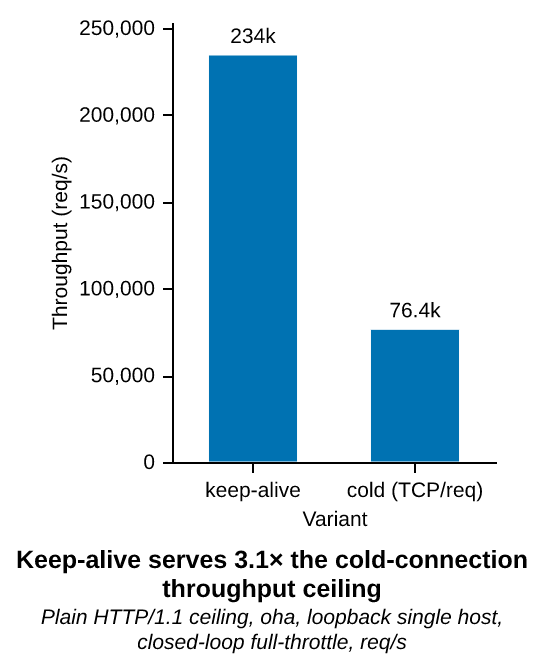
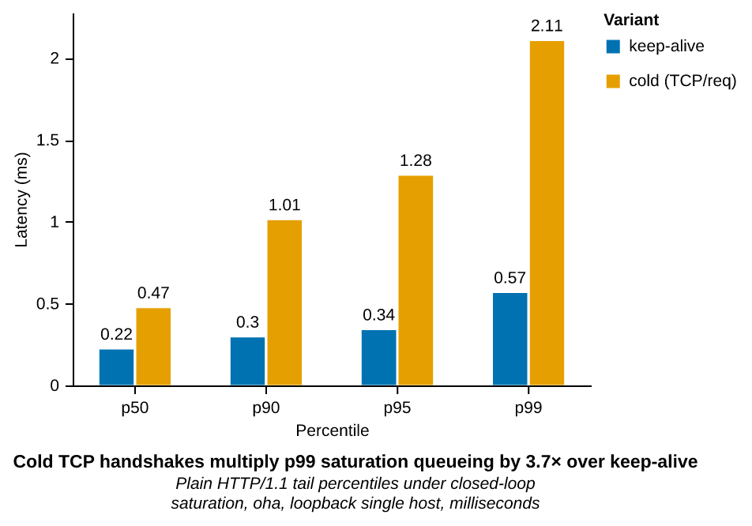

| Variant | KPI | req/s | p50 | p99 |
| --- | --- | --- | --- | --- |
| keep-alive       | RR  | 210,479 | 0.22 ms | 0.57 ms |
| cold (TCP/req)   | CRR | 85,718  | 0.47 ms | 2.11 ms |

*(Re-measured 2026-11-14 (tag **v0.16.1**, `HEAD` `b8f042e`, Rust 1.100.0) under external host load (`load average ≈ 4–13`) — `bash bench/perf/run-perf.sh all` / `ceiling`.
Cold/keep-alive **ratio** and the RR/CRR split are the durable signal.)*

A TCP handshake per request costs **~59 % (`59.3 %`) throughput and +1.54 ms p99** even on loopback (where the
handshake is nearly free; cold CRR `85.7k` vs `106.2k` on the idle `2026-10-24` host is plausibly depressed by external host load, whereas keep-alive RR `210.5k` vs `212.7k` sits within ~1 %) — over a real network the gap widens with RTT. Connection reuse is
load-bearing; this is the plaintext analogue of the [TLS handshake-per-request row](#tls-termination) below.

> **A note on a latency bug this scenario caught.** An early body run showed a ~40 ms p99 cliff on
> medium streamed bodies — the signature of a delayed-ACK stall. The upstream client had Nagle's
> algorithm on (no `TCP_NODELAY`), so a streamed request body sent in several writes stalled on the
> peer's delayed-ACK timer. Disabling Nagle on the upstream sockets — standard practice for L7
> proxies — removed it (100 KB streamed p99 42.9 ms → 4.2 ms). The numbers here are post-fix.

## Throughput & latency vs concurrency

Closed-loop sweep (k6 `constant-vus`) — a fixed number of virtual users, each issuing its next
request only after the previous response. Rising concurrency walks the load curve.

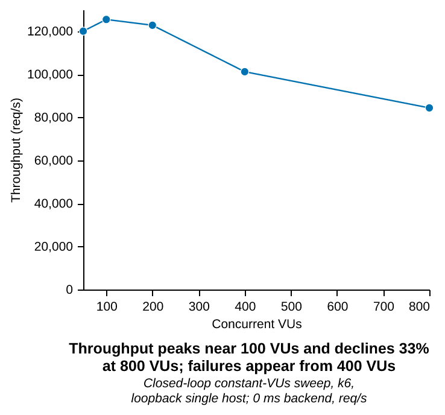
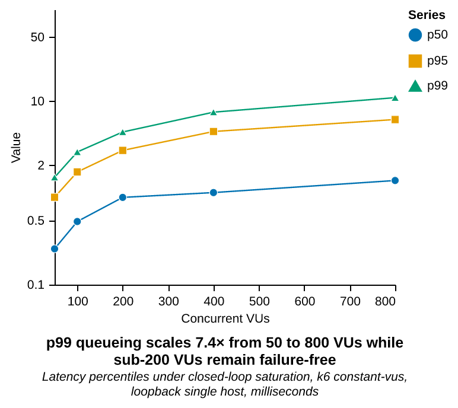

| VUs | req/s | p50 | p95 | p99 | p99.9 | failed |
| --- | --- | --- | --- | --- | --- | --- |
| 50  | 129,222 | 0.25 ms | 0.90 ms | 1.48 ms | 3.13 ms | 0% |
| 100 | **134,327** | 0.49 ms | 1.69 ms | 2.80 ms | 5.03 ms | 0% |
| 200 | 131,253 | 0.89 ms | 2.91 ms | 4.62 ms | 8.57 ms | 0% |
| 400 | 103,941 | 1.01 ms | 4.67 ms | 7.60 ms | 13.69 ms | **29.1%** |
| 800 | 83,301  | 1.37 ms | 6.32 ms | 10.93 ms | 20.06 ms | **51.3%** |

Throughput peaks at **~134.3k at VU 100 this run** (vs ~147.2k on the idle `2026-10-24` host, depressed by external host load — and in general the k6 generator's own ceiling on its cores, so
which VU count wins the peak is host/generator noise, not a proxy change) and, **through VU 200**,
declines gracefully with latency rising in proportion and zero failures — the shape this section has
always shown.

> **A newly-added admission-control cap now surfaces at VU >= 400 (measured 2026-07-20).** This pass
> is the first since ADR 000092 landed (2026-07-15, commit `36006c7`): Plecto Proxy now refuses a new
> connection outright once a single source IP holds `MAX_CONNECTIONS_PER_IP` = **256** concurrent
> connections (`crates/server/src/conn_limit.rs`, amending [ADR 000027](../docs/ADR/000027.md)) - a CWE-770/CWE-400 hardening
> measure so one source can no longer monopolize every connection permit. `constant-vus` runs every
> VU as a genuinely concurrent connection from the **same** loopback source IP as the proxy itself,
> so VU 400 and VU 800 are, from the cap's point of view, one source opening 400 / 800 connections -
> well past the 256 threshold the 07-11 snapshot never crossed (its highest rung was also VU 800, but
> that pre-dates the cap by ten days). The refused connections surface as k6 `status !== 200` (no
> HTTP response at all - `res.status` reads `0`), which is exactly what the `failed` column counts.
> Confirmed as the cap, not host noise or the netns sandbox: the failure fractions reproduce within
> 0.1 pp whether this phase runs inside the isolated network namespace or in the host's normal
> namespace (28.0 %/47.0 % outside vs 27.9 %/47.1 % inside, back-to-back on the same host state), and
> the threshold crossing lines up exactly with the cap - 0 % at VU 200 (under 256), a jump at VU 400
> (over 256). This is a **benchmark-harness / feature interaction**, not a regression in the load
> balancer itself. **Reproduced on 2026-09-25, 2026-10-24 (27.8 % / 50.5 %), and 2026-11-14 (29.1 % / 51.3 %)**, and *kept* here rather
> than tuned away: unlike the open-loop scenarios — whose oversized VU pools were pure artifact and
> are now bounded below the cap (see the [short-circuit](#short-circuit-rejecting-bad-traffic-at-the-edge), [rate-limit](#enforcement--does-it-actually-hold-the-rate), and [weighted-mix](#weighted-request-mix--with-its-own-baseline) notes below) — these two rungs exist to walk the concurrency curve, so
> crossing the cap is the honest thing for them to do. Read VU 400/800 as "one source IP past its
> admission budget", not as proxy overload; every other phase in this report keeps its own
> concurrency under 256 and reads clean.

## Tail latency under open-loop load

Open-loop sends at a **constant arrival rate** regardless of how fast responses come back, so
queueing surfaces in the tail instead of being hidden — the *coordinated-omission-safe* model.

| Model | target | achieved | p50 | p95 | p99 | p99.9 | dropped | failed |
| --- | --- | --- | --- | --- | --- | --- | --- | --- |
| open-loop, 0 ms backend (`plecto-loadgen`, 2026-11-14, contended host, `yield_now()` pacing) | 94,028/s | **94,028/s** | **0.051 ms** | 1.151 ms | 4.783 ms | 17.599 ms | **0** | 0% |
| idle-host reference (`plecto-loadgen`, 2026-10-25, `yield_now()` pacing) | 103,026/s | 103,026/s | 0.050 ms | 0.508 ms | 2.09 ms | 4.57 ms | 0 | 0% |
| *(superseded: 2026-10-24, `sleep_until` pacing)* | 103,026/s | 103,026/s | 0.84 ms | 1.65 ms | 2.83 ms | 5.58 ms | 0 | 0% |

The auto target (70 % of each run's own closed-loop peak, **94,028/s** this run from peak `134,326` req/s, vs `103,026/s` on the idle `2026-10-25` run) is **achieved exactly** (`8,462,520` requests over 90 s) with
**zero dropped slots** under schedule-latency measurement (`plecto-loadgen openloop`, 64 workers —
well under ADR 000092's per-IP cap, unaffected; wrk2 model — see
[`bench/methodology.md`](../bench/methodology.md)). A co-resident Rust generator sustains the
auto rate without dropping slots. With `yield_now()` pacing, **87.7 % of requests complete within 100 µs of their scheduled send time** (mean `0.266 ms` in `openloop_hist.csv`, well under the `64 / 94,028 = 0.681 ms` Little's-law wire bound) and p50 holds at **0.051 ms** (matching the idle `2026-10-25` run's `0.050 ms`); the stretched upper tail percentiles (`p95 1.151 ms / p99 4.783 ms / p99.9 17.599 ms` vs `0.508 / 2.09 / 4.57 ms` on `2026-10-25`) are plausibly from external host load (`load average ≈ 4–13`), but the two runs were also offered different absolute rates (`94,028/s` vs `103,026/s`), so this is not a fixed-rate comparison — cross-snapshot tail comparisons should pin the rate with `OPENLOOP_RATE` (supported by `bench/perf/run-perf.sh`).

> **Why the 2026-10-24 p50 was 0.84 ms — generator-side send lag, confirmed by re-measurement.**
> With `C = 64` single-in-flight worker connections sustaining $\lambda = 103{,}026\text{ req/s}$ (`0 dropped`), Little's law bounds the mean wire response time (`write_all` + `read_response`) at $W_{\text{wire}} \le 64 / 103{,}026 = 0.621\text{ ms}$, and a right-skewed distribution has its median below its mean — yet schedule-latency (`done − scheduled`) reads p50 `0.84 ms` / mean `0.895 ms`. At least ~0.2–0.3 ms of it is therefore time spent *before* the request was written. Binned at 100 µs, `openloop_hist.csv` shows a flat plateau from ~0.2 to ~1.4 ms (≈ 6–9 % per bin) rather than a geometric tail — the shape a uniform 0–1 ms delay convolved with the wire latency would give. That points at the pacing: the run used `tokio::time::sleep_until(scheduled)`, and Tokio's timer wheel has 1 ms granularity, so a wake-up can land up to 1 ms late. The alternative explanation — per-connection queueing at 1,610 req/s per worker — would produce a geometric tail, which the histogram does not show. `bench/loadgen/src/openloop.rs` now sleeps only until `scheduled − 1 ms` (and only when more than 2 ms remain) and covers the last stretch with `tokio::task::yield_now()`, keeping the coordinated-omission-safe `done − scheduled` accounting. Re-measured on 2026-10-25 at the same 103,026/s: p50 fell from 0.84 to **0.050 ms**, the mean from 0.895 to 0.132 ms, and the plateau is gone (89.6 % of samples in the first 100 µs bin, then a geometric decay) — the old p50 was the generator's timer, not the proxy. One confound is not yet bounded: the yield loop keeps the generator cores busy, which can shift the package power budget shared with the proxy's P-cores. That would bias the proxy *slower*, not faster, so it cannot explain the improvement, but the closed-loop ceiling and proxy CPU-µs/req under open-loop load have not been compared with and without it.

## Round-robin distribution

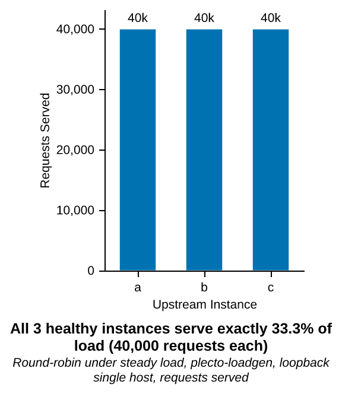

Over a steady window with all three upstreams healthy, **120,000** requests split **40,000 /
40,000 / 40,000** — exact across all three instances (33.3 % each, 0 spread). Round-robin holds under load.
(Re-measured 2026-11-14 (tag **v0.16.1**, `HEAD` `b8f042e`, Rust 1.100.0) under external host load (`load average ≈ 4–13`); `plecto-loadgen rr`, 48 workers — well under the per-IP cap, unaffected.)

## Resilience: ejection & fail-closed

A steady open-loop rate (~4k req/s, `plecto-loadgen ejection` with a 5 s unrecorded warm-up so
t=0 is already steady state) while a controller drives a fault timeline (`eject b` → `rejoin b` →
`eject all` → `restore all`) and the driver buckets each upstream's served-count and the 503/s
every second:

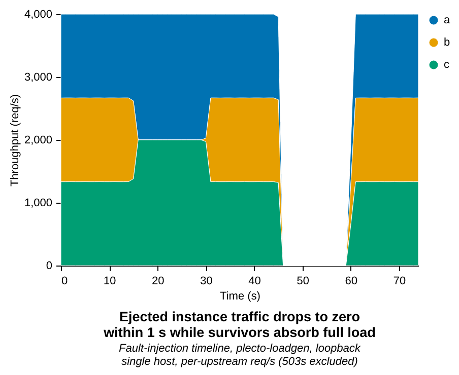
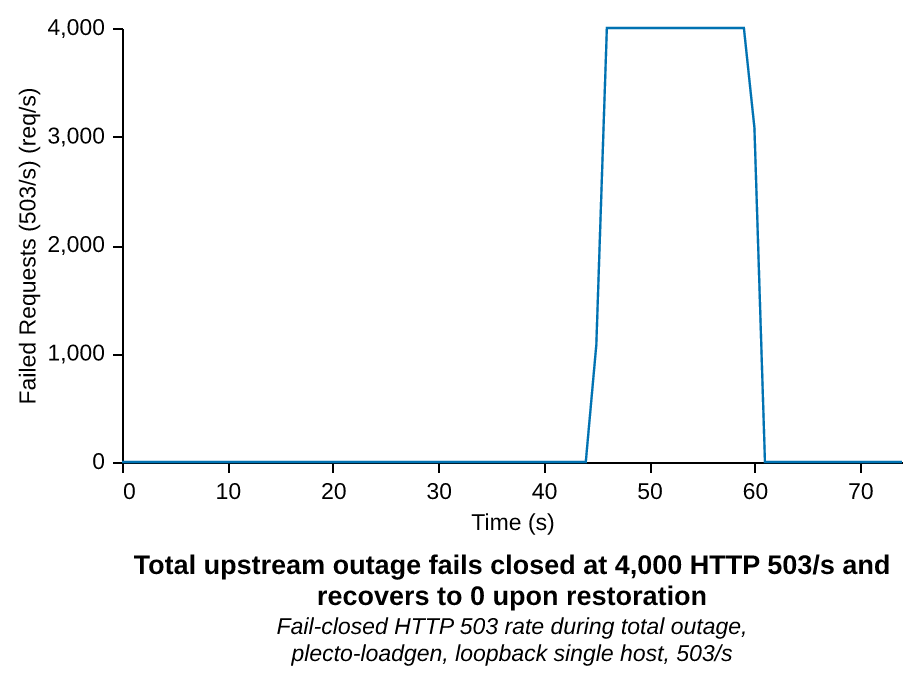

- **Even baseline.** ~4k req/s split three ways while healthy (1,334/1,333/1,333 this run).
- **Graceful ejection.** When **b** is driven unhealthy its share falls to zero within ~1 s (a
  one-second mixed transition bucket — `a=1380, b=1240, c=1380` at t=15, then clean) and the
  survivors (a + c) absorb the full load **with zero failed requests** — this run they split it
  **evenly** (2,000/2,000), round-robin over two survivors landing on an even split (and `rejoin b` at t=30 transitions through `a=1974, b=53, c=1973` back to `1,333/1,334/1,333` at t=31).
- **Fail-closed, not fail-open.** With **every** instance unhealthy (t=45 transition `a=1320, b=1320, c=1320, failed=40`), Plecto Proxy returns **HTTP 503**
  promptly (no hang, no blind forward); the 503/s line jumps to the full offered rate (4,000/s here).
- **Fast recovery.** Restoring health returns instances to rotation within ~1 s (a one-second mixed
  bucket at t=60 — `a=640, b=640, c=640, failed=2080`, then clean 1,334/1,333/1,333 at t=61).

*(Re-measured 2026-11-14 (tag **v0.16.1**, `HEAD` `b8f042e`, Rust 1.100.0) under external host load (`load average ≈ 4–13`). Over the 75 s T2 fault-timeline run: 300,000 responses, 58,120 failed (19.37 %) during total ejection, across events eject b @15 s / rejoin b @30 s / eject all @45 s / restore all @60 s; over the 40 s T1 gate run: 160,000 responses, 24,040 failed (15.02 %), 0 stray failed.)*

## Endpoint-set swap under load (ADR 000044)

A different axis than the ejection run above: instead of an existing instance's *health* flipping,
the upstream's *configured address set itself* changes — the shape a periodic-DNS re-resolution
swap takes (`resolve_interval_ms`), reproduced here via `swap-bench`'s SIGHUP reload path (the same
`ArcSwap<Endpoints>` replacement, ADR 000044). Subject: a 4-instance harness (`a, b, c, d`) starting
with the pool `[a, b, c]`; `plecto-loadgen swap` holds a steady open-loop rate while, mid-run, the
manifest is rewritten to `[a, b, d]` (dropping `c`, adding the spare `d`) and reloaded via SIGHUP —
the same fixed-rate timeline + per-instance bucketing the ejection run uses, generalized to a
changing label set (`bench/perf/run-perf.sh`'s `swap` phase).

The per-pick cost this introduces — an `ArcSwap<Endpoints>` load on every LB pick, not just on a
reload — is isolated in the companion criterion micro-benchmark,
[`pick_under_swap_churn`](#0-micro-benchmarks-in-process-criterion), under continuous concurrent
swap churn (the worst case; an unchanged tick short-circuits to one atomic load + compare and isn't
exercised there).

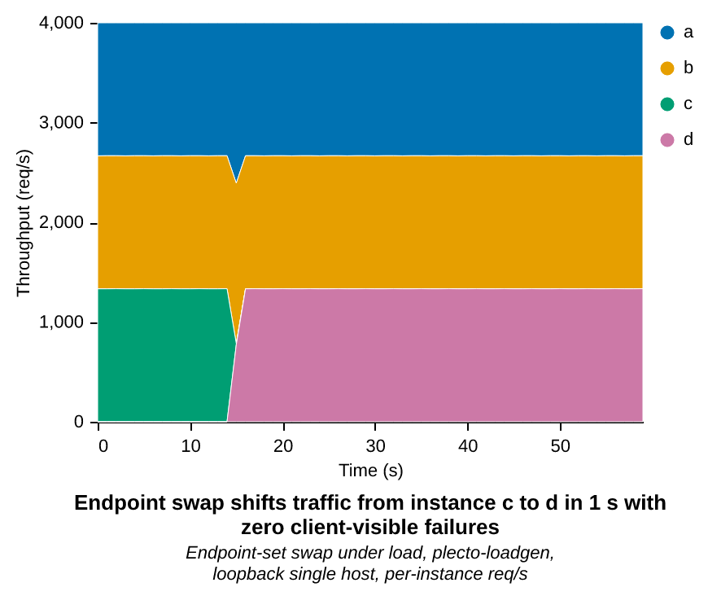

> Re-measured 2026-11-14 (tag **v0.16.1**, `HEAD` `b8f042e`, Rust 1.100.0) under external host load (`load average ≈ 4–13`): a steady ~4k req/s open-loop while, at
> t=15 s (post-warmup), the manifest is rewritten `[a, b, c]` → `[a, b, d]` and SIGHUP-reloaded
> (64 workers — well under the per-IP cap, unaffected; same shape as every prior pass).

- **Zero client-visible failures.** All 240,000 responses over the 60 s run succeeded — **0 %
  failed** — even through the swap itself. Unlike a health-based ejection, nothing here ever needs
  to fail closed: `a` and `b` are unchanged addresses, so `reconcile` reuses their `Arc`s and
  health outright (ADR 000017's reuse rule), and only `d` starts pessimistic.
- **The swap completes within one second.** The transition second (t=15) shows a brief mixed
  bucket (`a=1608, b=1606, c=13, d=773`) as in-flight requests to `c` finish and the reconciled
  pool takes over mid-second; by t=16 the split is already clean — `c=0`, and `a` / `b` / `d` even
  at ~1,333 each (`1,333 / 1,334 / 1,333`) — the same ~1 s time constant [ejection](#resilience-ejection--fail-closed) shows,
  because both paths funnel through the same `ArcSwap<Endpoints>` replacement.
- This confirms the read the [per-pick micro-benchmark](#0-micro-benchmarks-in-process-criterion)
  predicts: the swap itself is cheap and instantaneous from the client's perspective — the cost
  ADR 000044 introduces is the small continuous per-pick `ArcSwap` load, not a client-visible
  disruption at swap time.

## TLS termination

The same single-backend pass-through, re-run with rustls TLS termination, decomposed so the cost
of each layer is separable (oha; h1 client isolates the record/handshake split from h2
multiplexing). `plain (h1)` is the [plain HTTP/1.1 ceiling](#plain-http11-ceiling)'s keep-alive row,
not re-measured here.

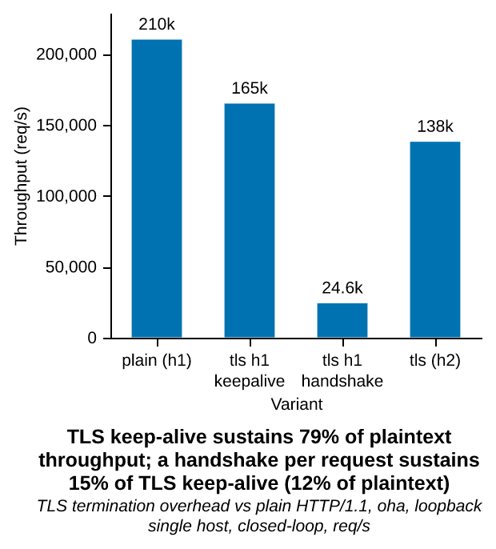
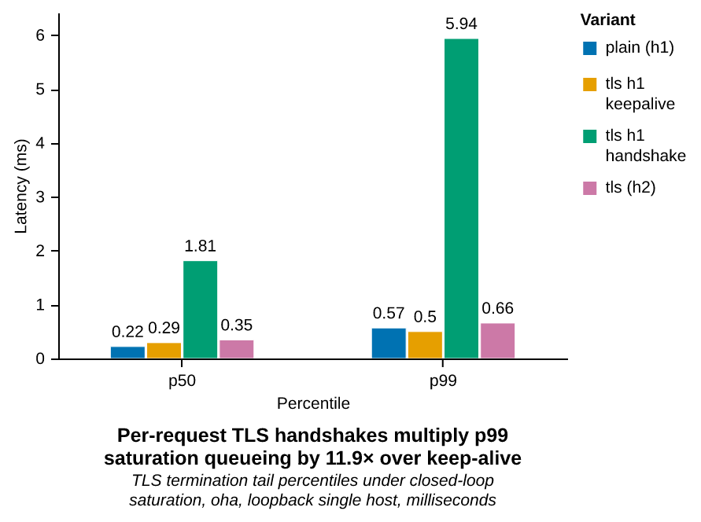

| Variant | req/s | p50 | p99 | isolates |
| --- | --- | --- | --- | --- |
| plain (h1)               | 210,479 | 0.22 ms | 0.57 ms | [ceiling](#plain-http11-ceiling) keep-alive |
| TLS h1, keep-alive       | 165,374 | 0.29 ms | 0.50 ms | record layer + TLS I/O path |
| TLS h1, handshake/req    | 24,562  | 1.81 ms | 5.94 ms | oha, shared `ClientConfig` — see caveat below |
| TLS (h2)                 | 138,442 | 0.35 ms | 0.66 ms | h2 multiplexing over TLS |

The decomposition is the point. This run's ordering is clean — plain h1 keep-alive (210.5k) sits
above the TLS keep-alive rung (165.4k, ~78.6 % of plaintext): **within-TLS ratios** are the signal:
handshake/req (24.6k, slightly below the `26.2k` idle `2026-10-24` figure plausibly from external host load) is **~14.9 % of TLS keep-alive**, and **h2 is clean** (138.4k/s, ~83.7 % of TLS
keep-alive, p99 0.66 ms). The TLS-terminated path remains **crypto-/TLS-I/O-bound**;
native-path optimisations don't reach it. A client that funnels many VUs over a handful of
multiplexed connections can make h2 *look* far worse (head-of-line queueing, not server work);
measuring with a connection-per-concurrency client removes that artifact.

*(Re-measured 2026-11-14 (tag **v0.16.1**, `HEAD` `b8f042e`, Rust 1.100.0) under external host load (`load average ≈ 4–13`) on **aws-lc-rs** (ADR 000051), `-c 50` —
well under the per-IP cap, unaffected. Qualitative story unchanged across every snapshot so far.)*

### Full vs resumed handshake (ADR 000052)

*(Not re-run this pass — `bench/perf/run-perf.sh`'s `tls` phase doesn't drive this
rung automatically; the numbers below are carried over unchanged from 2026-07-05 at commit `c635ed3`, tag **v0.5.0**.)*

The `handshake/req` row above no longer isolates a *true* full handshake: oha shares one rustls
`ClientConfig` across connections, and against a server issuing stateless TLS 1.3 session tickets
its "cold" connections silently resume once warm. `plecto-loadgen tls --mode full|resumed` gives
each rung explicit resumption control instead:

| Client resumption | req/s | p50 | p99 | resumed |
| --- | --- | --- | --- | --- |
| full (disabled)      | 22,099 | 2.06 ms | 4.36 ms | 0 % |
| resumed (enabled)     | 29,768 | 1.54 ms | 3.26 ms | 93.0 % |

Comparing the carried `2026-07-05` (`v0.5.0`) true full handshake (22.1k/s) against the same-session `2026-07-05` (`v0.5.0`, 26.5k/s) and `2026-10-24` (`v0.15.2`, 26.2k/s) `handshake/req` rows gave a **~16–17 %** gap —
confirming oha's row really was partly resumed — whereas against this `2026-11-14` (`v0.16.1`) snapshot's `handshake/req` row (`24.6k`, `24,562/s`) the cross-version gap is **~10 %** (`22.1 / 24.6`), pending a re-run of the full/resumed rungs. Enabling client resumption recovers **~35 % throughput**
over a true full handshake — **≈11.7 µs/connection** (`45.3 → 33.6 µs` in inverse throughput `1e6 / rps`; note that per the [metric definition](#1-load-balancing-fast-path) this is an inverse-throughput delta across concurrent connections rather than single-core server CPU time, and includes both the proxy's server-side `CertificateVerify` signing on `PROXY_CPUS=0-11` and the load generator's client-side certificate-chain verification on `GEN_CPUS=12-23`, which mixes 2 P-cores and 8 E-cores). That saving comes from skipping the
certificate chain + asymmetric signature generation/verification, **not** the ephemeral key exchange: rustls's client
hardcodes `psk_dhe_ke` and never offers plain `psk_ke` ([RFC 9846 §4.3.9](https://www.rfc-editor.org/rfc/rfc9846#section-4.3.9), obsoleting RFC 8446 where this lived at §4.2.9; for forward secrecy of PSK + (EC)DHE/KEM see [RFC 9846 §2.2](https://www.rfc-editor.org/rfc/rfc9846#section-2.2), [RFC 9257 §4.2](https://www.rfc-editor.org/rfc/rfc9257#section-4.2) and [§6](https://www.rfc-editor.org/rfc/rfc9257#section-6), and rustls `client/hs.rs`'s source comment — *"such connections don't have forward secrecy"*), so every resumed handshake here still runs a fresh ephemeral key exchange for forward secrecy. Because both `plecto` (`crates/control/src/tls.rs`) and `plecto-loadgen` build `rustls` with `aws-lc-rs`'s default `prefer-post-quantum` provider, that key exchange negotiates the hybrid post-quantum group **`X25519MLKEM768`** (ML-KEM-768 + X25519; emitted as `kx_group` by `plecto-loadgen tls`) rather than classical ECDHE alone. The ~11.7 µs inverse-throughput delta is consistent with that: skipping only the asymmetric
sign/verify + cert bytes is a much smaller saving than skipping the hybrid `X25519MLKEM768` key exchange too would be. The residual
7 % full handshakes are cold-cache misses under concurrent load.

---

# 2. WASM extension plane

Plecto Proxy runs each request's *decision* — auth, rewriting, rate limiting, policy — as a sandboxed
**WebAssembly Component Model filter**, not native proxy code. This measures what that costs,
changing only **how the decision runs**. The bundled `bench/harnesses/bench-server` serves a **ladder** of
routes — all forwarding to the **same** backend — so each adjacent delta isolates one cost (the full
table is in [the cost ladder](#the-wasm-cost-ladder--isolating-each-cost) below): a native `/baseline`,
a pure no-op WASM filter pooled vs fresh (`/noop-pooled`, `/noop-fresh`), and the real `filter-apikey`
pooled vs fresh (`/trusted`, `/ondemand`).

`filter-apikey` is a real `plecto:filter` component: it reads `x-api-key`, stamps
`x-authenticated-user` on a valid key and forwards, or returns a typed `short-circuit` **401** on a
missing/invalid key. It is cosign-signed and loaded through the production verify-then-load path
(fail-closed). `filter-noop` returns `continue` with **no host-API calls** — it exists only to expose
the irreducible dispatch floor.

## The WASM cost ladder — isolating each cost

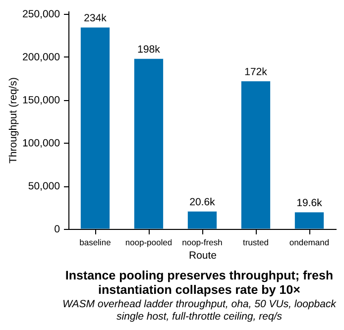
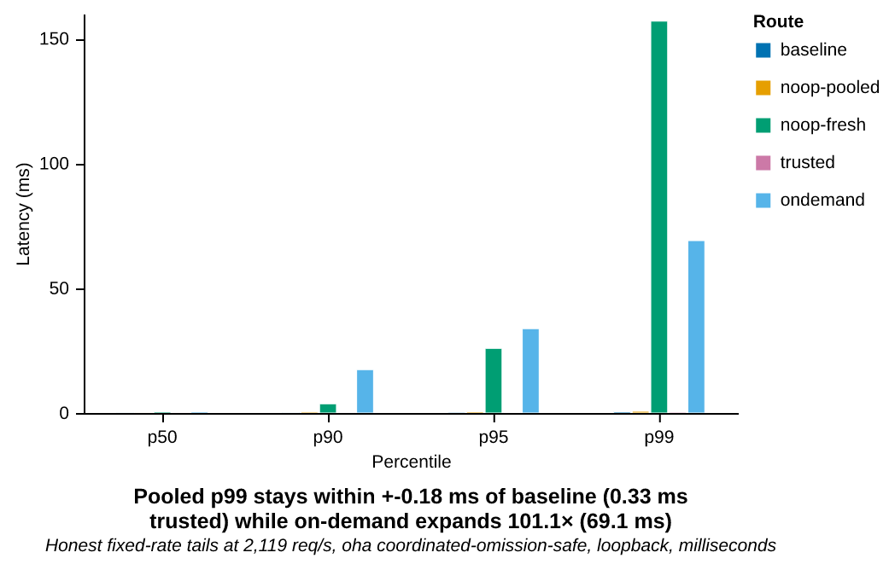

> W1 — fixed 50 connections, 0 ms backend, valid key (oha, warm-up burned in a discarded 5 s
> pre-run). Full-throttle: read these rows as **throughput ceilings**; the honest latencies are in
> the fixed-rate tail table below.

Five routes forward to the **same** backend, so each **adjacent delta isolates exactly one cost**. A
pure **no-op** WASM filter (no host-API calls) is the key addition — it separates "the WASM tax" from
"a real filter's work", which older reports conflated.

| Route | Decision path | req/s | p50 | p99 |
| --- | --- | --- | --- | --- |
| `/baseline` | native fast path (no filter) | 210,479 | 0.22 ms | 0.57 ms |
| `/noop-pooled` | a **pure no-op** WASM filter, pooled | 174,197 | 0.28 ms | 0.50 ms |
| `/noop-fresh` | the same no-op, **fresh instance / request** | 13,638  | 3.54 ms | 7.94 ms |
| `/trusted` | the real `filter-apikey`, pooled | 143,763 | 0.33 ms | 0.67 ms |
| `/ondemand` | `filter-apikey`, fresh instance / request | 13,548  | 3.59 ms | 6.97 ms |

*(Re-measured 2026-11-14 (tag **v0.16.1**, `HEAD` `b8f042e`, Rust 1.100.0) under external host load (`load average ≈ 4–13`), `-c 50` — well under the per-IP cap,
clean. `/baseline` is sourced from [ceiling.csv](#plain-http11-ceiling); the other four rungs are
measured together in the same session. With inline header hooks
([ADR 000119](../docs/ADR/000119.md)), default arena cap 32 ([ADR 000118](../docs/ADR/000118.md)), and Wasmtime 50.0.1: `baseline` > every WASM rung, and the full-throttle floor reads directly; the fixed-rate tails
below remain the honest queueing-free read.)*

- **baseline → noop-pooled** = the **irreducible extension-plane dispatch cost**. Full-throttle,
  this run shows a **~17.2 % throughput** cost (210.5k → 174.2k, **≈ 0.99 µs/req** inverse-throughput
  delta [see metric definition](#1-load-balancing-fast-path); T1 pooled gate `dispatch_floor_us` **`1.0944 ± 0.1898 µs`**, `n = 24`, pass, matching the idle `2026-10-25` pooled gate's `1.24 ± 0.05 µs` and the `1.14–1.29 µs` across the five archived `v0.15.2` post-ADR-000119 gate runs); the fixed-rate tails put the monotone queueing-free floor at
  **+0.02 ms p50** (real filter **+0.03 ms p50**, `0.0855 < 0.1047 < 0.1120 ms` across `/baseline < /noop-pooled < /trusted` at 8,128 req/s; single-window p99s `0.51 / 0.68 / 0.33 ms` are non-monotone jitter at this rate, and the T1 gate at 2,000 req/s reads `+0.0197 ms` p50, `+0.2241 ms` p99). Every WASM filter pays this floor.
- **noop-pooled → noop-fresh** = the **per-request instantiation cost**, cleanly isolated from any
  host work: throughput collapses **~12.8×** (`12.77×`, 174.2k → 13.6k; `10.61×` on `/trusted` → `/ondemand`). This is what pooling buys.
- **noop-pooled → trusted** = a **real filter's own work** on top of the no-op (header parse +
  host-KV lookup + counter): **−17.5 % (≈ 1.22 µs/req this run)** — with T1 pooled gate `apikey_cost_us` **`0.8428 ± 0.2117 µs`** (`n = 24`, pass, inside the calibrated `0.3..1.7 µs` A/B band; `1.06–1.30 µs` on the idle `2026-10-24/25` gates). With inline
  header hooks ([ADR 000119](../docs/ADR/000119.md)), the dispatch floor (`~0.99–1.09 µs`) and the apikey
  filter's own work (`~0.84–1.22 µs`) remain roughly equal terms. As a historical illustration of the pooling rule, the first 8-round gate (2026-10-25) left
  `apikey_cost_us` *inconclusive* at `1.74 ± 1.13 µs`: six of its eight paired rounds read 0.95–1.34 µs, but in
  rounds 3 and 4 the `/trusted` window ran at 124.8k and 80.6k rps (round 4's `/baseline` also dropped to 169k), giving
  2.24 and 4.93 µs. A disturbance that hits one arm of a pair does not cancel, and the t interval correctly refuses a
  verdict. Per the gate's rule the re-run (`20261025T053124Z`, whose own 8 rounds read `1.06 ± 0.14 µs`) was **pooled** with these
  rounds rather than replacing them: n = 16 gives `1.40 ± 0.53 µs`, still inconclusive against the `0.3..1.7` band; a third pooled run (n = 24, reaching the gate's 3-run pooling cap) resolves it to
  **`1.30 ± 0.35 µs`, pass** — with the two disturbed rounds still in the estimate. (Because round-level pooling treats the 24 rounds as independent and does not model between-run cluster variance — at the run-mean level $n = 3$ gives `1.30 ± 0.94 µs`, which still straddles `1.7` — the independent non-pooled holdout run `20261025T061734Z` at **`1.06 ± 0.09 µs`**, $n = 8$, is the decisive check.)
- **noop-fresh and ondemand are the same order of magnitude** (13.6k vs 13.5k req/s — within **~0.7 %**),
  confirming instantiation dominates the fresh path — the filter's per-request work is
  noise next to re-paying `init` (~28.5 µs in the un-re-run `v0.15.2` idle Criterion benchmark) every request.

### The same ladder at one fixed rate — honest tails

> W1b — every rung offered the **same** fixed **8,128 req/s** this run (60 % of the slowest rung's
> ceiling, `/ondemand` at 13,548/s), 50 connections, oha `-q` + `--latency-correction`
> (coordinated-omission-safe). Identical offered load, so the latency columns are directly
> comparable.

| Route | achieved | p50 | p90 | p99 |
| --- | --- | --- | --- | --- |
| `/baseline` | 8,127/s | 0.09 ms | 0.13 ms | 0.51 ms |
| `/noop-pooled` | 8,127/s | 0.10 ms | 0.43 ms | 0.68 ms |
| `/trusted` | 8,128/s | 0.11 ms | 0.15 ms | 0.33 ms |
| `/noop-fresh` | 8,127/s | 0.50 ms | 3.68 ms | 156.99 ms |
| `/ondemand` | 8,127/s | 0.53 ms | 17.36 ms | 69.05 ms |

At a rate every rung sustains (8,128 req/s), p50 increases monotonically across native, pooled noop, and pooled real filter (`0.0855 < 0.1047 < 0.1120 ms`): the pooled dispatch floor costs **+0.02 ms p50** over native (`0.0855 → 0.1047 ms`) and the real pooled filter **+0.03 ms p50** (`0.0855 → 0.1120 ms`; p99s are non-monotone single-window jitter at this rate — `/trusted` `0.3305 ms` < `/baseline` `0.5113 ms` < `/noop-pooled` `0.6829 ms`, all under `0.70 ms`).
The fresh rungs live at **p99 ~69–157 ms** at 8,128 req/s (`/noop-fresh` / `/noop-pooled` = `156.99 / 0.6829 ≈ 230×`, `/ondemand` / `/trusted` = `69.05 / 0.3305 ≈ 209×`; elevated relative to the idle `2026-10-24` run's `2.64–4.19 ms` p99 at `7,565/s`, under external host load `load average ≈ 4–13` and at a higher offered rate (`8,128/s` vs `7,565/s`), so this single point cannot tell whether the knee moved or the run is simply past it), reflecting the per-request instantiation and kernel/allocator cost described below. (And `/noop-fresh` vs `/ondemand` shows the same single-window jitter pattern — `0.50 vs 0.53 ms` p50, `156.99 vs 69.05 ms` p99: on the fresh path, per-request instantiation at `~28.5 µs` plus kernel/allocator contention is `>20×` larger than `filter-apikey`'s `~1.22 µs` guest work, so run-to-run jitter in concurrent instantiation swamps the tiny guest-work difference — a single fixed-rate window per rung cannot separate the two. Adjacent deltas between the fresh rungs are not a reliable isolation of one cost at this rate.)

> **Why per-request instantiation scales poorly under concurrency — and what is (and is not) known about the knee since `v0.15.2`:**
> In the original `2026-07-06` investigation (under legacy `MALLOC_ARENA_MAX=4` and blocking-pool `spawn_blocking` dispatch), a fresh instance (`Allocation::OnDemand`) triggered heavy `mmap`/`munmap` + `mmap_lock` serialization and cross-core TLB shootdowns (`~31–35` TLB shootdowns/req in `/proc/interrupts` vs `~0.3` pooled), causing p99 to blow up from `1.4 ms` at `1k/s` and `4.7 ms` at `2k/s` to `~650 ms` at `4.2k/s` and `~1.2 s` at `6k/s`. In the idle `2026-10-24` (`v0.15.2`) snapshot, **7,565 req/s** completed at **p99 = 2.64–4.19 ms** — more than 150× below the old `4.2k–6k/s` cliff, so the mechanism behind the 07-06 knee no longer describes the current fresh tail (and on `2026-11-14` at **8,128 req/s** under external host load, `p50` stays `0.50–0.53 ms` while `p99` stretches to `69.05–156.99 ms`). Three changes landed after 07-06 and are candidate causes for the idle shift — inline header hooks ([ADR 000119](../docs/ADR/000119.md), which also cut proxy threads from 80 to 35 per its scheduling measurement), the default allocator arena cap `4 → 32` ([ADR 000118](../docs/ADR/000118.md)), and Wasmtime 50.0.x ([ADR 000120](../docs/ADR/000120.md)) — but **none of them has been isolated as the cause**, and where the knee now sits has not been measured. Even with that shift, fresh instantiation remains **~209–230× slower at p99** on like-for-like pairs (`/noop-fresh` / `/noop-pooled` = `156.99 / 0.6829 ≈ 230×`, `/ondemand` / `/trusted` = `69.05 / 0.3305 ≈ 209×` this run; `~12–19×` idle in `v0.15.2`) and **~10.6–12.8× lower in ceiling throughput** than Wasmtime's pooling allocator (which pre-maps slots and avoids per-request virtual-memory churn). *(Re-measuring TLB shootdowns/req from `/proc/interrupts` deltas — unprivileged — at 1k / 2k / 4k / 6k / 7.5k req/s is the prerequisite for any causal statement here.)*

**The µs/req deltas are the invariants to track for regressions, not the percentages** (which widen or
shrink whenever the *baseline* moves). These macro deltas **reconcile with the in-process
[micro-benchmarks](#0-micro-benchmarks-in-process-criterion)** (`v0.15.2` idle Criterion, not re-run) in direction and general scale, while
remembering that the `~0.99 µs/req` (`1.09 µs/req` in the T1 pooled gate) is an inverse-throughput delta under 50-connection saturation (~+49.5 µs mean latency across 50 connections), whereas a single-thread criterion call (~2.09 µs) is in-process wall-clock time on one core. The fresh ~28.5 µs, by contrast, is the *uncontended* single-thread cost — criterion
instantiates sequentially, so it never pays the `mmap_lock` contention or cross-core shootdowns the
concurrent macro run exposes (the knee above). The layers agree once that kernel-side term is named.

> **Decomposed 2026-09-29 (inline header hooks, [ADR 000119](../docs/ADR/000119.md)) & confirmed in T2/T1 (`v0.15.2` idle `2026-10-24/25`, `v0.16.1` `2026-11-14`, wasmtime 50.0.x + WASI 0.3, [ADR 000120](../docs/ADR/000120.md) / [ADR 000121](../docs/ADR/000121.md)):**
> Prior to ADR 000119, the ~4.5–4.9 µs/req dispatch floor was mostly the blocking-pool round trips (two per filtered request: on-request
> and on-response) rather than guest execution. Trusted, non-blocking filters now run inline on the
> Tokio worker. On the reference host (i7-13700K, 6 P-cores, 50 conns), dispatch floor dropped from
> 4.06–4.21 to 1.41–1.44 µs/req at landing, and per-request scheduling collapsed: voluntary context switches 5.09 → 0.79/req (baseline 0.87–0.92),
> CPU 103 → 76 µs/req, runqueue wait 76 → 0.7 µs/req, and proxy thread count 80 → 35. In the idle `2026-10-24` `v0.15.2` snapshot, the T2 cost ladder (`1.17 µs/req` dispatch floor, `1.13 µs/req` apikey cost) and the 2026-10-25 8-round paired gate (`dispatch_floor_us` **1.24 ± 0.05 µs**, `apikey_cost_us` **1.30 ± 0.35 µs**, `ratelimit_tax_us` **1.06 ± 0.14 µs** pooled `n = 24`; standalone holdout `20261025T061734Z` **1.17 ± 0.12 µs**, **1.06 ± 0.09 µs**, **1.49 ± 0.54 µs**, `n = 8`) confirmed the ~1.1–1.3 µs/req inline dispatch floor. In this `2026-11-14` (`v0.16.1` / `HEAD` `b8f042e`) snapshot under external host load, the T2 cost ladder (`0.99 µs/req` dispatch floor, `1.22 µs/req` apikey cost) and the T1 pooled gate (`20261114T030016Z-b8f042e`, `n = 24`: `dispatch_floor_us` **1.0944 ± 0.1898 µs** pass, `apikey_cost_us` **0.8428 ± 0.2117 µs** pass) hold in the same band.

## Short-circuit: rejecting bad traffic at the edge

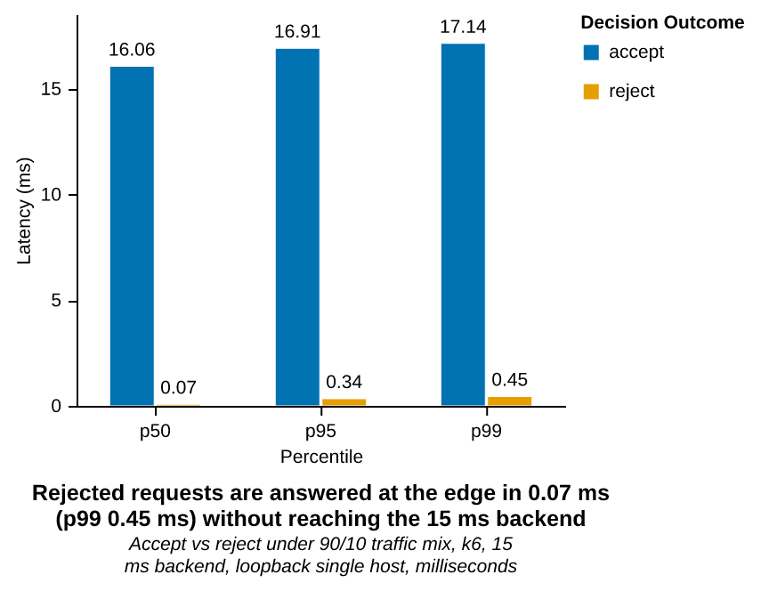

> W2 — fixed 2000 req/s, 15 ms backend, ~90 % valid / ~10 % bad keys (k6). 108,099 accepted, 11,933
> rejected, **0 status-less** — a **90.1 % / 9.9 %** split, matching the script's own key roll.

| Path | p50 | p95 | p99 |
| --- | --- | --- | --- |
| accept (200, forwarded) | 16.060 ms | 16.915 ms | 17.140 ms |
| reject (401, short-circuited) | 0.072 ms | 0.337 ms | 0.447 ms |

Accepted requests cost the 15 ms backend plus the small pooled-filter + proxy overhead. Rejected
requests are decided **at the edge in 0.072 ms (p50) / 0.337 ms (p95)** (`wasm_mixed.csv`; p95 is slightly elevated vs the idle `2026-10-24` `0.178 ms` under external host load, while p99 is `0.447 ms`) and never reach the upstream: bad traffic is shed
**~223× faster at p50 (`16.060 / 0.072 = 223.1×`) and ~50× faster at p95 (`16.915 / 0.337 = 50.2×`)** than good traffic is forwarded, and is harmless to the backend it would otherwise
hit. (Filter faults or deadline overruns **fail closed** - 502/504 - exercised by the test suite,
not this benchmark.)

> **The 07-20 split (76 %/24 %) was a harness artifact, fixed and re-measured on 08-15 and reconfirmed 2026-09-25 / 2026-10-24 / 2026-11-14.**
> That pass's `constant-arrival-rate` executor pre-allocated **300 VUs** — above ADR 000092's
> 256-connections-per-source-IP cap — and `bench/k6-wasm/mixed.js` counted *anything* not `200` as
> a rejection, so refused connections (`res.status === 0`, no HTTP status at all) were tallied
> alongside genuine 401s. The script now bounds its pool below the cap and counts a status-less
> response in its own `no_status` bucket, which the CSV carries; this pass reports **`no_status` =
> 0** and the split returns to the designed ~90/10. The 07-20 *latency* figures were always valid —
> only the count split was contaminated.

<a id="v030-response-ladder--compression"></a>
## Response hooks & compression (ADR 000073–000075)

The `all` pass measures every route with ADR 000073/074/075 **present but
unused**. This section fills the gap: what those features cost **when exercised**. Opt-in phase
(`bash bench/perf/run-perf.sh v03`) — not part of `all`, so a full refresh stays heavy while this
row can be re-run alone. Same generators and CO-safe tail pattern as
[the WASM cost ladder](#the-wasm-cost-ladder--isolating-each-cost).

### Response-context read vs `replace` (ADR 000073)

> R1 — fixed 50 connections, 0 ms backend, tiny response (oha). Lean `filter-resp` (no host-API
> calls): `/resp-ctx` always *reads* the as-forwarded request snapshot then `continue`;
> `/resp-replace` does the same read then `replace`s with a synthesised **418** (marker header
> `x-plecto-resp-replace`). Control is same-session `/noop-pooled` (ignores the snapshot).

| Route | Decision path | req/s | p50 | p99 | µs/req |
| --- | --- | --- | --- | --- | --- |
| `/noop-pooled` | on-response unused params → continue | 112,955 | 0.42 ms | 0.83 ms | 8.85 |
| `/resp-ctx` | read as-forwarded snapshot → continue | 110,183 | 0.44 ms | 0.83 ms | 9.08 |
| `/resp-replace` | read + `replace` (418, 23 B body) | 105,742 | 0.45 ms | 0.84 ms | 9.46 |

*(Not re-run this pass — measured 2026-08-15 at commit `b2a89be` (tag **v0.9.0**) via `v03` prior to [ADR 000119](../docs/ADR/000119.md) inline header hooks and [ADR 000118](../docs/ADR/000118.md) default arena cap 32; `/noop-pooled` in this table is therefore `112,955 rps` (`8.85 µs/req`) from that v0.9.0 session rather than the `2026-11-14` snapshot's `174,197 rps` (`5.74 µs/req`). Same-process adjacent deltas — do not splice onto an older or newer `wasm` CSV's noop row. On current `HEAD` (`v0.16.1`), the T1 gate tracks the 2,000 rps fixed-rate tail delta `respctx_tail_p50_ms` directly and reads `−0.0081 ms` — far outside the `v0.15.2` (`2026-10-24`) idle-host spread `−0.0008 … +0.0011 ms` (about 7–10× the largest idle magnitude; `+0.0010 ms` in the `2026-10-24` `v0.15.2` confirmation run's `gate.csv`) and is contention noise, because reading the snapshot on `on-response` cannot make the response path faster. µs/req = 1e6 / rps inverse throughput; see [definition](#1-load-balancing-fast-path).)*

- **noop-pooled → resp-ctx ≈ +0.22 µs/req** in that v0.9.0 `v03` run — the cost of *using* the ADR 000073 request
  snapshot on `on-response` (path length + header scan), with the same continue/forward path. The
  three snapshots that have measured this rung read **+0.90 / +0.10 / +0.22 µs**, all small enough
  that the run-to-run movement of the ceiling itself is a comparable term; track the fixed-rate p50
  below alongside this figure, not this number alone. The T1 gate's `respctx_tail_p50_ms`
  invariant (**`+0.0010 ms`** over pooled in the `2026-10-24` `v0.15.2` confirmation run's `gate.csv`, `+0.016 ms` in v0.9.0; on `2026-11-14` `v0.16.1`, `−0.0081 ms` is contention noise, ~7–10× the largest magnitude in the `v0.15.2` idle spread `−0.0008 … +0.0011 ms`, since reading the snapshot on `on-response` cannot make the response path faster) is the tighter read on an idle host.
- **noop-pooled → resp-replace ≈ +0.60 µs/req** net at full throttle in that v0.9.0 (`2026-08-15`) `v03` session — unchanged from the preceding
  `v03` run to two decimals. `replace` synthesises a tiny body and **drops** the upstream payload on the
  wire (verified: `Content-Encoding` N/A, 23-byte 418). That wire-shape change can *under-* or
  *over-read* replace's guest/host work relative to resp-ctx run to run; do **not** read either
  run's number as a pure CPU claim. The regression signal for replace is "still within ~1 µs of
  the pooled no-op on this host," which held in that v0.9.0 `v03` session.
- Fixed-rate tails at **63,444/s** (60 % of this ladder's slowest ceiling; oha `-q`
  `--latency-correction`): all three rungs hold the offered rate; **p50 stays ~0.88–0.91 ms**. p99
  at this rate is host-noise-dominated on this session (8–18 ms) — same caveat as other
  high-rate fixed runs near a host knee; prefer µs/req + p50 for this row.

### Native response compression (ADR 000074 / 000075)

> R2 — same oha shape; backend **4 096 B** repeating `text/plain` (above the 1024-byte
> `min_length` default). Both routes send `Accept-Encoding: gzip`. `/baseline` has no
> `[route.compression]` → identity; `/compress` pins `algorithms = ["gzip"]`. Wire check:
> identity 4096 B vs gzip **45 B** + `Content-Encoding: gzip` + `Vary: accept-encoding`.

| Route | Transform | req/s | p50 | p99 | µs/req |
| --- | --- | --- | --- | --- | --- |
| `/baseline` | identity (AE advertised, opt-in off) | 192,892 | 0.25 ms | 0.46 ms | 5.18 |
| `/compress` | gzip (level 5, ADR 000075 defaults) | 133,135 | 0.36 ms | 0.63 ms | 7.51 |

- **baseline → compress ≈ −31.0 % ceiling / +2.33 µs/req** (inverse throughput; see [definition](#1-load-balancing-fast-path)) for this highly compressible 4 KiB
  filler — the third pass in a row within ~0.25 µs of the same figure (+2.11 / +2.09 / +2.33). Real
  HTML/JSON ratios and CPU will differ; this row is a **regression floor** for the opt-in path, not
  a capacity guide for production payloads. RFC 9411 §7.3-style: one object size, sustainable
  throughput, method disclosed.
- Fixed-rate at **79,881/s** (60 % of compress ceiling): both hold the rate; p50 ≈ 0.94 ms;
  p99 again host-noise-band at this offered load (87 ms identity / 116 ms gzip — this session's
  neighbour load shows up hardest in the highest-rate fixed run in the report) — µs/req from the
  ceiling table is the durable signal.

**Criterion note (not re-run here).** Day-to-day criterion absolute drift (±10–20 %) is expected
without a locked governor. To attribute ADR 000073 contract-surface cost in-process, use a
same-host baseline pair — `cargo bench -p plecto-host -- --save-baseline pre-adr73` on the
pre-landing commit, then `--baseline pre-adr73` after — per
[criterion baselines](https://bheisler.github.io/criterion.rs/book/user_guide/command_line_options.html)
([`bench/methodology.md`](../bench/methodology.md)).

## Outbound ext_authz (ADR 000036)

*(Not measured this pass — load numbers deferred; capability verified functional by host test suite.)*

A filter can call an external authorization service per request over the lent, SSRF-guarded outbound
capability (`filter-extauthz`). Per-request cost is three parts, only the first two Plecto Proxy's: the
WASM tax (the same [cost ladder](#the-wasm-cost-ladder--isolating-each-cost)), the outbound gate
(allowlist + SSRF classification — nanoseconds, negligible), and the network round-trip to the authz
endpoint, which dominates and is the *operator's* latency, not Plecto Proxy's.

Load numbers are deferred rather than faked: the SSRF guard blocks loopback by design, so a hermetic
mock authz needs a non-loopback endpoint (environment-specific), and the connector currently opens a
new connection per call (pooling is a follow-up). The capability itself is verified end-to-end by
the host's `outbound-http` test suite (allowlist deny + DNS-rebinding SSRF block).

## Host-enforced rate limiting

Plecto Proxy's rate limiter is a **host-native token bucket** (ADR 000026): the bucket spec
(`capacity` / `refill_tokens` / `refill_interval_ms`) is configured **in the operator's manifest**,
not by the filter — an untrusted filter passes only `(key, cost)` and so cannot widen its own limit.
The refill + counting stay host-side (the WASM boundary is not crossed on the hot path); the filter
only decides *whether* to consult the limiter and *on what key*. Driven through `bench/harnesses/bench-server`
(`filter-hello`, pooled); a `429` carries `retry-after-ms`.

> **Scope: single node.** Every run below drives one `plecto` instance. The bucket is **node-local**
> ([ADR 000053](../docs/ADR/000053.md)) — the enforcement and fairness numbers describe what one
> instance guarantees, not a multi-replica fleet. Behind a load balancer fanning out to N replicas,
> the fleet's effective allowed rate scales with N unless the front LB pins a key to one replica; see
> the [hardening guide](../docs/hardening.md) for the operational formula.
>
> **Scope: in-memory state backend.** These numbers (and every host-state number in this report) run
> the default `[state] backend = "memory"`. With `backend = "redb"`, the backend write happens
> **inside the process-wide quota lock** (`charge_and_apply` — the price of closing the CWE-770
> accounting race), so every host-kv / counter / rate-limit call across all filters serializes
> behind that disk write. Persistent-state throughput under concurrency is structurally different
> and **unmeasured here**.

### Overhead — the cost of consulting the bucket

> R1 — 50 VUs, 0 ms backend, a **never-deny** bucket spread across 1000 keys (k6). `/baseline` vs
> `/ratelimit`.

| Route | Interleaved T1 gate (`20261114T030016Z-b8f042e`, 24 pooled rounds) | Single-round T2 (`ratelimit_overhead.csv`) | T2 p50 | T2 p99 |
| --- | --- | --- | --- | --- |
| `/baseline` (no filter) | **119,048 req/s mean** (`108.0k–128.0k`, `8.42 µs/req`) | 132,457 req/s | 0.25 ms | 1.58 ms |
| `/ratelimit` (bucket) | **111,224 req/s mean** (`101.0k–120.0k`, `9.01 µs/req`, **`+0.59 ± 0.21 µs/req`** 95 % t, `n = 24`) | 127,229 req/s | 0.29 ms | 1.29 ms |

*Note: In the interleaved gate column, `8.42` and `9.01 µs/req` are the means of the 24 per-round `1e6 / rps` values (their difference `9.01 − 8.42 = 0.59 µs/req` matches `ratelimit_tax_us = 0.5913`), rather than `1e6` divided by the mean `req/s` (`8.40` / `8.99 µs/req`).*

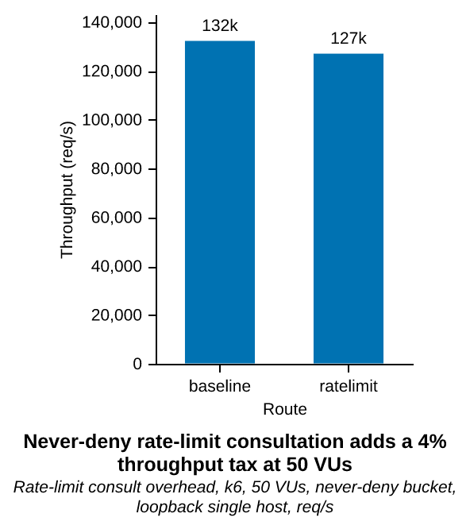
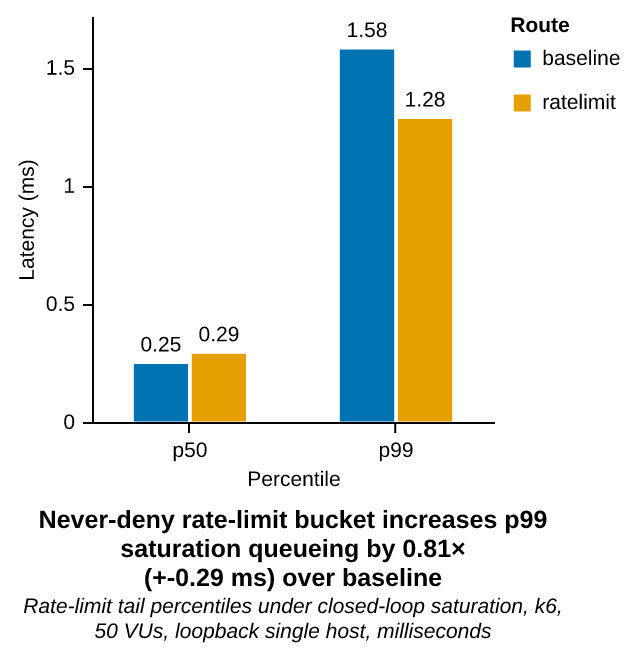

*(Re-measured 2026-11-14 (tag **v0.16.1**, `HEAD` `b8f042e`, Rust 1.100.0) under external host load (`load average ≈ 4–13`), `VUS=50` — well under ADR 000092's per-IP cap, unaffected.)*

With inline header hooks ([ADR 000119](../docs/ADR/000119.md)), the rate-limit tax is small enough
(**`1.06–1.49 µs/req`** on the idle `2026-10-25` 8-round gates; **`1.12–1.30 µs/req`** across the five archived `v0.15.2` runs) that an un-interleaved single-round k6 closed-loop run (`ratelimit_overhead.csv`, plotted above: `132.5k` vs `127.2k req/s`, p50 `0.25 ms → 0.29 ms`) can swing from between-window host variance. That is why the paired gate rounds are the authoritative read for this invariant. In this snapshot's 24-round pooled gate (`20261114T030016Z-b8f042e`), `ratelimit_tax_us` reads **`0.5913 ± 0.2086 µs/req`** (`n = 24`, **inconclusive** — straddling only the fast-side edge `0.5` of `0.5..2.4`; its upper bound `0.80` is far below `2.4`). As `bench/perf/gate_tolerances.toml` documents, that lower edge is not a safety edge (a filter that stops limiting is caught by `enforce_allowed_ratio`, which passed at `0.9999`), and because the instruction-count A/B shows Rust `1.100.0` did not change the extension-plane hot path, the point estimate below the idle-host `1.06–1.49 µs` gates is most plausibly contention noise on the closed-loop delta rather than a speed-up (with the caveat that the A/B does not cover the rate-limit path itself; as supporting inferential evidence, the gate's k6 `/baseline` ran at `119.0k` rps mean vs `132.5k` in the same morning's single-round T2 run, ~10 % lower, suggesting the gate window was the more contended one). Treating the three pooled 8-round runs as independent run means (95 % Student-t, `n = 3`, `t = 4.303`) makes the between-run host variance explicit: `ratelimit_tax_us` run means are `0.56 / 0.86 / 0.35 µs` → `0.59 ± 0.64 µs` (straddling both the `0.5` edge and the idle `1.06 µs` mark), `dispatch_floor_us` is `1.18 / 1.20 / 0.90 µs` → `1.09 ± 0.42 µs`, and `apikey_cost_us` is `0.78 / 0.81 / 0.93 µs` → `0.84 ± 0.20 µs`. In the third run, `dispatch_floor_us` and `ratelimit_tax_us` both dropped by `~0.3–0.5 µs` together, suggesting that the host state shifted. At `n = 24`, the implied round SD is `≈ 0.49 µs` (from `0.2086 = 2.069 · s / √24`), so with the mean at `0.59 µs` roughly `110` rounds would be needed to clear the `0.5` edge — more pooled runs on the same host state cannot resolve it (the pool cap is `24`). The decisive check is the same as on `2026-10-25`: an independent non-pooled `n = 8` gate on an idle host, which has not been run for `v0.16.1` (**no PASS is on record for this build**). *(Historical context on the band calibration: at `n = 2` on `v0.15.2`, e.g. `20261024T042039Z-1061a79` at `1.20 ± 0.80 µs`, intervals were too wide; moving to 8 paired rounds and setting `lo = 0.5` on 2026-10-25 ([ADR 000122](../docs/ADR/000122.md)) passed all 10 invariants on both the idle 3-run pool `1.06 ± 0.14 µs` and the standalone holdout `20261025T061734Z` at `1.49 ± 0.54 µs`.)*

**This tax is not "dispatch floor + bucket consult".** Additively it could never be smaller than the floor, yet the k6
`ratelimit_tax_us` reads below the same run's oha `dispatch_floor_us` in almost every gate run since ADR 000119 (`0.59` vs `1.09 µs` in `20261114T030016Z-b8f042e`; `1.20` vs
`1.29 µs` in the 10-24 confirmation run). The two are measured by different generators: oha (`-c 50`) drives `/baseline` to ~210.5k rps (~212.7k idle), while k6 (`VUS=50`
over 1,000 tenant keys) reaches ~108k–128k rps this run (mean `119.0k`; ~117k–155k idle) on `GEN_CPUS=12-23` — near its own ceiling. In a closed loop
whose generator is near saturation, extra proxy work is partly absorbed by the generator waiting less, which compresses
$\Delta(1/\text{RPS})$; that is the most plausible reading, not a measured decomposition. Either way, deltas from different
generators cannot be added or subtracted. A candidate generator-independent read is proxy **CPU-µs/req at a fixed rate**,
which the gate records as `ratelimit_cpu_us_per_req` (20k/s, `bench/perf/proc_cpu.py`; `info` until calibrated). Each snapshot records both per-thread `/proc/<pid>/task/*/schedstat` (ns resolution) and process-wide `/proc/<pid>/stat` (`utime + stime`), falling back to `stat` whenever a thread present at window start has exited by window end; across all 32 windows of the four 2026-10-25 runs, `schedstat` and `stat` agreed to within `~0.1 µs/req`.
On the idle `2026-10-25` runs, three pooled runs (12 paired rounds, no pre-window idle sleep) read **+15.3 ± 1.0 µs CPU per request** over a `/baseline` of `32.3 ± 0.4 µs`, and the standalone holdout (`20261025T061734Z`, 4 paired rounds with `GATE_CPU_SETTLE_S=11` — now recorded in `gate_params.txt` / `build_id.txt` so runs with different settle times cannot be pooled) read **+18.3 ± 0.8 µs** over a `/baseline` of `34.5 ± 0.7 µs`
(absolute values include the in-process mock upstream; the delta cancels it). On this `2026-11-14` snapshot under external host load (`n = 12`, `GATE_CPU_SETTLE_S=11`), `/baseline` reads **`57.48 ± 16.59 µs/req`** and `ratelimit_cpu_us_per_req` **`+18.44 ± 24.08 µs/req`** — the wide intervals reflect external host contention during the 20k/s windows. Note also from the idle `2026-10-25` holdout why the 11 s settle reads ~7 % higher on `/baseline` (`32.3 → 34.5 µs`) and why `/ratelimit` spawns a few blocking-pool threads (`26 → 29 → 32` across the first two windows, then flat at `32`): the 11 s idle settle after the ~128k req/s closed-loop phase lets the cores clock down under the `powersave` governor before entering the light 20k/s 3 s windows (lower clock frequency means more nanoseconds on-CPU per instruction), while `filter-hello` (`Isolation::Trusted`, `MemoryBackend`) runs its header hooks inline on the Tokio worker (`runs_inline = true`) and only the once-per-65,536-calls instance recycle (`max_requests_per_instance = 65,536`, [ADR 000119](../docs/ADR/000119.md) Decision 2) hands off replacement instance creation (`IdleMiss::PoolFilling`) to `spawn_blocking`. Its additivity is not yet verified: at 20k/s the
proxy is far from saturated, so the figure can include per-request wake-up and recycle costs that amortize differently under load, and ~15–18 CPU-µs spread over 12 cores (≈ 1.27–1.53 µs) only matches the inverse-throughput
deltas in order of magnitude — a consistency hint, not an equivalence. What the tax *contains* is still the filter dispatch plus the host-native bucket consult,
including the per-call host-state quota check (ADR 000027) that keeps a multi-tenant filter's bucket count bounded —
only the arithmetic across generators is invalid.

### Enforcement — does it actually hold the rate?

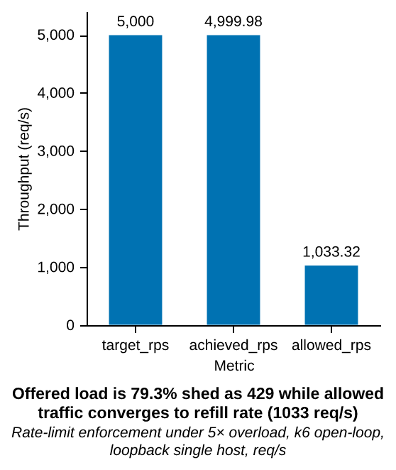

> R2 — a **tight** bucket (refill 1000 tok/s, burst 2000), offered **5000 req/s** open-loop at one
> key for 30 s (k6).

| offered | allowed (200) | shed (429) | status-less | accept p99 | 429 p99 |
| --- | --- | --- | --- | --- | --- |
| 5,000/s | **1,033/s** | 79.3% | **0** | 0.72 ms | 0.31 ms |

Offered 5× over the limit, the **allowed throughput converges to the bucket's discrete refill
schedule**: in `crates/host/src/backend.rs` (`apply_bucket`), the first request on a fresh key initializes `(tokens = capacity, last_refill = t_0)` and refills occur only at discrete integer multiples of `refill_interval_ms = 1,000 ms` (`intervals = now_ms.saturating_sub(last) / refill_interval_ms`). Over a window of $W$ seconds under continuous overload, the bucket therefore grants `capacity + (W - 1) × refill_tokens` requests:
- **30 s T2 report window**: `2,000 + 29 × 1,000 = 31,000` allowed requests (`31,000 / 30 s = 1,033.33 req/s`), **the same 1,033/s as every prior snapshot**.
- **10 s T1 gate window**: `2,000 + 9 × 1,000 = 11,000` allowed requests (`11,000 / 10 s = 1,100.0 req/s`). Historically, `gate_verdict.py` divided by a continuous approximation `(capacity + W × refill) / W = 1,200.0 req/s`, which is why every historical `gate.csv` recorded `enforce_allowed_ratio = 1,100 / 1,200 = 0.9166`; `gate_verdict.py` now uses the exact discrete-tick formula `(capacity + (W - 1) × refill) / W = 1,100.0 req/s` (`ratio = 1.0000`; `0.9999` in this snapshot's `gate.csv`).
- **Operator guidance on refill granularity:** Because `refill_interval_ms = 1,000` grants all 1,000 refill tokens at once on each 1-second boundary under continuous overload, operators who want smoother sub-second pacing to upstream backends can configure a finer `refill_interval_ms` with the same rate (for example, `refill_tokens = 10` and `refill_interval_ms = 10` for 1,000 tokens/s).

The accounting is complete this pass: 31,000 allowed + 119,002 shed = **150,002**,
accounting for the 5,000/s × 30 s offered load, with **zero status-less responses** and **79.3 % shed**
(accept p50 0.11 ms, accept p99 0.72 ms, 429 p99 0.31 ms — tails slightly elevated relative to the idle `2026-10-24` `0.21 / 0.15 ms` under external host load).

> **This row was contaminated on 2026-07-20 and is repaired here (2026-08-15).** That pass reported
> 59.6 % shed because `bench/k6-wasm/ratelimit-enforce.js` counted only `status === 200` and
> `status === 429`, dropping everything else — and its `preAllocatedVUs` (`max(200, RATE/10)` =
> **500** for a 5,000 req/s offer) was almost double ADR 000092's 256-per-IP cap, so **48.8 % of
> attempts produced no HTTP status at all** and vanished from both counters. The pool is now bounded
> below the cap and status-less responses have their own tracked `no_status` bucket. The repaired
> figure — **79.3 %** — reproduces the pre-cap 07-11 snapshot's 79.3 % exactly, which is the
> strongest available evidence that the cap interaction, not the proxy, was the whole story.

### Fairness — one key cannot starve another

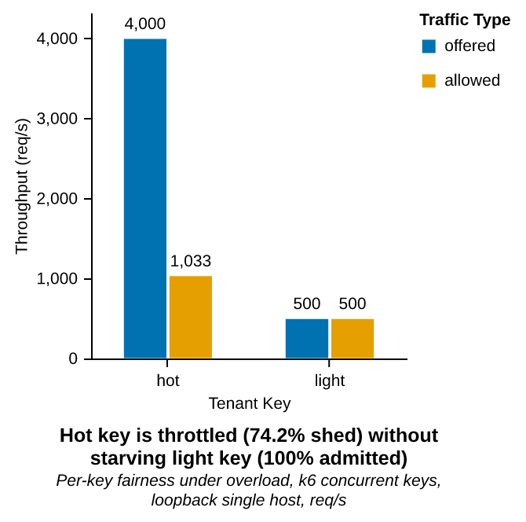

> R3 — same tight bucket; two keys concurrently: a **hot** key offered 4000/s and a **light** key
> offered 500/s (k6).

| key | offered | allowed (200) | shed | status-less |
| --- | --- | --- | --- | --- |
| hot | 4,000/s | 1,033/s | 74.2% | **0** |
| light | 500/s | **500/s** | 0% | **0** |

State is **per key**, and this pass measures it end to end rather than inferring it: the hot key is
throttled to **its own** refill rate (1,033/s — the same figure the single-key
[enforcement](#enforcement--does-it-actually-hold-the-rate) run produces, so the light key's traffic
costs it nothing), while the light key **receives every request it offers** — 500/s offered, 500/s
allowed, zero 429s, zero status-less. A hot neighbour cannot starve a light one.

> **The 07-20 pass could not show this** (light read 145/s against a 500/s offer, with 0 % shed):
> the two scenarios share one k6 process and one loopback source IP, and `hot`'s pool alone
> (`max(200, 4000/10)` = **400**) exceeded ADR 000092's 256-per-IP cap, so the light key's
> connections were refused at accept — starvation by the harness's own connection budget, dressed
> up as a fairness result. With both pools bounded below the cap (150 hot / 50 light) the intended
> claim is now the measured one.

## Request body handling

The request-side **body hook** (`on-request-body`, ADR 000025) follows a *buffer-then-decide* model:
for a filtered route carrying a body, the host buffers it (bounded — 16 MiB cap, fail-closed 413),
runs the filter's `on-request-body`, and forwards the possibly-transformed body — or short-circuits
before upstream. `filter-hello` uppercases the body (a real transform) or 403s on a `deny-body`
marker. A bodyless request, a filter-less route, and — since ADR 000038 — a route whose filters are
**all header-only** (none exports `on-request-body`) keep the zero-copy streaming path: the host
decides from the component's exports whether any filter reads the body, and buffers only then.

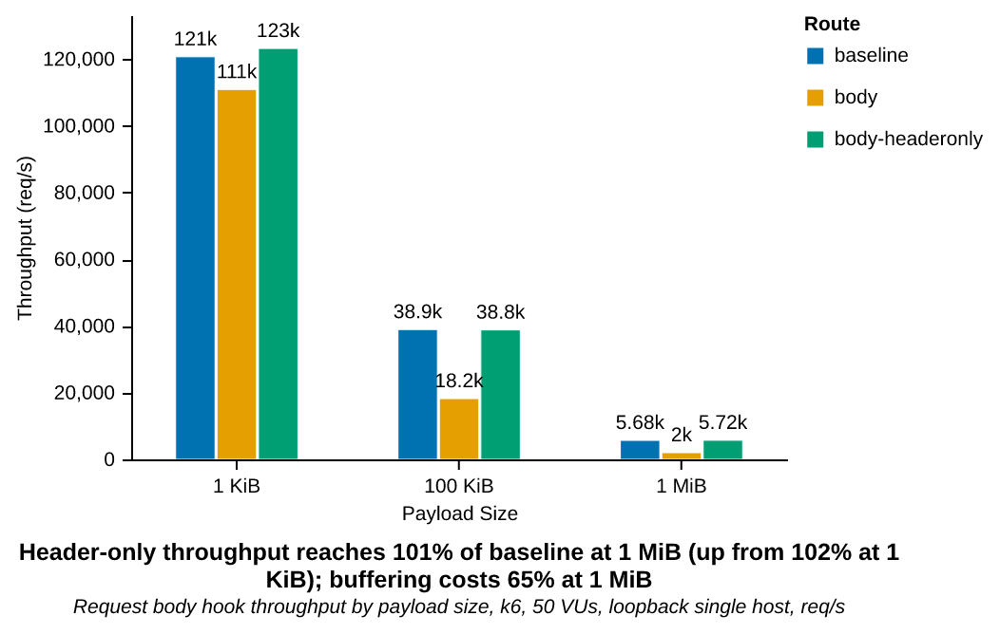
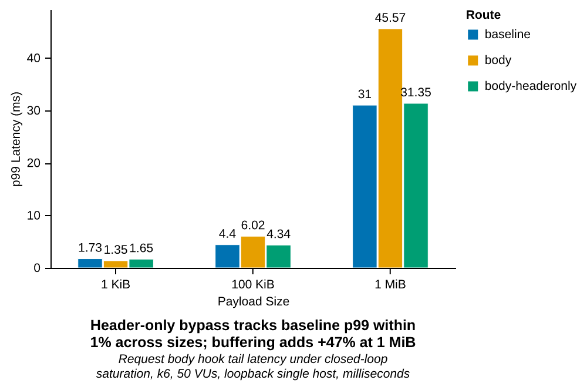

> B — 50 VUs, POST a `SIZE`-byte body at 1 KB / 100 KB / 1 MB (k6), to `/body` (filter-hello buffers +
> transforms), `/body-headeronly` (a header-only filter — body streams through, ADR 000038), and
> `/baseline` (no filter). Default allocator arena cap of **32** ([ADR 000118](../docs/ADR/000118.md), amending ADR 000038's earlier cap 4).

| size | route | req/s | throughput | p99 |
| --- | --- | --- | --- | --- |
| 1 KB   | /baseline        | 133,583 | 137 MB/s  | 1.60 ms |
| 1 KB   | /body            | 103,956 | 106 MB/s  | 1.33 ms |
| 1 KB   | /body-headeronly | 118,992 | 122 MB/s  | 1.39 ms |
| 100 KB | /baseline        | 38,462  | 3939 MB/s | 4.60 ms |
| 100 KB | /body            | 18,541  | 1899 MB/s | 6.06 ms |
| 100 KB | /body-headeronly | 39,697  | 4065 MB/s | 4.18 ms |
| 1 MB   | /baseline        | 5,840   | 6123 MB/s | 30.8 ms |
| 1 MB   | /body            | 1,990   | 2087 MB/s | 44.8 ms |
| 1 MB   | /body-headeronly | 5,794   | 6076 MB/s | 31.2 ms |

*(Re-measured 2026-11-14 (tag **v0.16.1**, `HEAD` `b8f042e`, Rust 1.100.0) under external host load (`load average ≈ 4–13`).)*

A filter that **reads** the body pays for it, growing with payload: **~22.2 % throughput at 1 KB** (the
buffer + WASM transform dominate the small request), **~51.8 % at 100 KB**, **~65.9 % at 1 MB** (a
full-body copy + uppercase per request). A **header-only filter takes the zero-copy bypass** — the
body never enters guest memory: at 1 MB it lands **within ~0.8 % of `/baseline`** (ADR
000038 — the two paths are within run-to-run noise at this size); at 100 KB
it reads **`+3.2 %`** over `/baseline` (`39.7k` vs `38.5k` under single-window external host contention noise, vs `−2.7 %` on the idle `2026-10-24` host; `VUS=50`, well under the per-IP cap); at 1 KB (`−10.9 %`) it reflects
the ordinary **WASM dispatch floor** on a tiny request, not a body cost. RSS at 1 MB × 50 VUs (fresh
proxy per route, default arena cap 32 per [ADR 000118](../docs/ADR/000118.md); proxy + in-process upstream, one mid-load sample): **~136 MB `/baseline` (`135,920 kB`) · ~293 MB `/body` (`292,668 kB`) · ~132 MB
`/body-headeronly` (`131,524 kB`)**
(`data/body_rss.csv`). The export-presence bypass keeps a header-only route near baseline. The buffer
stays bounded (16 MiB cap, fail-closed 413) for the filters that do read the body. The remaining
buffered-path copy is addressed by the opt-in `stream<u8>` streaming-body capability (ADR 000020 / ADR 000121); a per-request
time-series / allocator-sweep decomposition lives in `bench/perf/mem_matrix.py`. For choosing an
arena default, use `bench/perf/arena_sweep.py`: it isolates the upstream in a separate process and
records proxy-only loaded peaks and post-load retention for every candidate. The snapshot above
is neither a proxy-only peak nor a post-load retention measurement; see the
[measurement procedure](../bench/methodology.md#2026-09-27--アリーナ既定値を判断するための分離計測t3).

## Footprint

Idle resident set and the marginal cost of an open connection (`bench/harnesses/bench-server`):

| Metric | Value |
| --- | --- |
| idle RSS | ~41 MB |
| RSS holding keep-alive connections | ~47 MB (250 conns) |
| marginal bytes / connection | ~25.7 KB |

*(Re-measured 2026-11-14 (tag **v0.16.1**, `HEAD` `b8f042e`, Rust 1.100.0) under external host load (`load average ≈ 4–13`). The phase asks for **250** connections (under
ADR 000092's 256-per-IP cap, so every connection it counts is one the proxy actually holds) and
divides by the count the generator reports as open. At 25.7 KB/conn (25,723 bytes/conn) the
figure matches the historical ~24.8–25.6 KB/conn, and idle RSS (~41 MB, 40,632 kB; 46,912 kB with 250 connections) tracks expected baseline memory.)*

---

# 3. Realistic & protocol coverage

## Weighted request mix — with its own baseline

> M1 — open-loop 20k req/s, a weighted blend across routes on one gateway (k6): read-heavy, partly
> edge-checked (per-tenant rate-limit keys, 200 tenants, never-deny bucket), occasional writes,
> rare large payloads. Paired with a **read-only control at the same arrival rate** — 100 % plain
> reads — so the per-class deltas are attributable to the traffic *blend*, not the offered load.

| Profile | Class (share) | route | p50 | p99 | p99.9 |
| --- | --- | --- | --- | --- | --- |
| read-only (control) | read 100 % | GET `/baseline` (1 KB) | 0.064 ms | 1.674 ms | 10.443 ms |
| mix | read 60 % | GET `/baseline` (1 KB) | 0.066 ms | 4.743 ms | 13.683 ms |
| mix | auth read 25 % | GET `/ratelimit` (tenant key) | 0.084 ms | 4.938 ms | 14.061 ms |
| mix | write 10 % | POST `/body` (1 KB) | 0.107 ms | 5.274 ms | 14.650 ms |
| mix | large 5 % | POST `/body` (100 KB) | 0.388 ms | 7.724 ms | 17.740 ms |

*(Re-measured 2026-11-14 (tag **v0.16.1**, `HEAD` `b8f042e`, Rust 1.100.0) under external host load (`load average ≈ 4–13`).)*

Both profiles target ~20k/s offered (from the run log: `19,989` rps read-only with `1,089` dropped iterations (`≈0.18 %`) out of ~600,000; `19,962` rps mix with `2,723` dropped (`≈0.45 %`); `0` 429s from the never-deny bucket, **zero status-less responses** — the honest
open-loop shed signal under the cap, see the note below). In k6's `constant-arrival-rate`, a dropped iteration means the 240-VU pool was momentarily exhausted; both the elevated dropped counts and the ms-scale upper tails (`1.674–7.724 ms` p99, `10.443–17.740 ms` p99.9 vs sub-millisecond `0.191–0.683 ms` p99 and `433` / `0` dropped on the idle `2026-10-24` host) reflect external host load (`load average ≈ 4–13`), while p50 remains sub-millisecond (`0.064–0.388 ms`, vs `0.057–0.352 ms` idle). Because k6 only counts dropped iterations and does not record their latency, percentiles above roughly p99.5 are biased low.
Comparing the two single-window runs across different time windows under host load gives a reference difference of `+3.069 ms` at p99 (`1.674 → 4.743 ms`) and `+3.240 ms` at p99.9 (`10.443 → 13.683 ms`) on the plain reads — reflecting head-of-line pressure
from the body classes alongside window-to-window load variance — while within the mix window itself, the classes order strictly as their work predicts (read < auth read < write <
large, monotone in p50, p99, and p99.9: `0.066 < 0.084 < 0.107 < 0.388 ms` p50, `4.743 < 4.938 < 5.274 < 7.724 ms` p99, `13.683 < 14.061 < 14.650 < 17.740 ms` p99.9). A single-endpoint test hides all of this; the control run
keeps it honest.

> **The 07-20 figures for this section were diluted; these are not (2026-08-15, reconfirmed 2026-09-25 / 2026-10-24 / 2026-11-14).** That pass's
> `record()` folded **every** response's duration into the latency Trends regardless of status,
> while its VU pool (**500**, for a 20,000 req/s offer) sat above ADR 000092's 256-per-IP cap — so
> near-instant connection refusals were pulling the published percentiles *down*. `weighted-mix.js` now drops status-less responses into their own counter
> before the trend, and holds its pool at **240** — just under the cap. Running this phase materially above 20k req/s from a single source IP is not
> possible on this harness without crossing the cap.

## HTTP/3

The fast path terminates **HTTP/3 over QUIC** (ADR 000016; `tls-http` serves h1/h2/h3 on one port). A
functional check confirms it end-to-end:

```
curl --http3-only https://…/api/hello  ->  status=200 http_version=3
```

*(Re-confirmed 2026-11-14.)*

A **rigorous, coordinated-omission-safe H3 *load* benchmark is deferred**: default/distro `oha` builds and `k6` omit native
HTTP/3 (`oha` supports `--http-version 3` experimentally only when compiled from source with `--features http3`, and `h2load --alpn-list=h3` is closed-loop concurrency-based where `--rate` paces connection creation rather than open-loop request arrivals; adding an H3 subcommand to `plecto-loadgen` or using a custom `oha --features http3` build is tracked for T3). Rather than publish process-spawn-bound `curl`-loop numbers, the H3 load figure
stays absent until that tooling is wired into the harness — server support is verified, not throughput.

## WebSocket Upgrade tunnel (ADR 000048)

Plecto Proxy's HTTP/1.1 Upgrade path (ADR 000048): a route declaring `[route.upgrade] protocols =
["websocket"]` forwards the client's handshake (controlled re-issue — hop-by-hop stripping stays
the default for every other route), and on the upstream's 101 the proxy splices the two connections
into an opaque bidirectional byte tunnel — the same post-upgrade relay shape used by typical
L7 `Upgrade` / TCP tunnel modes. This is a **different load shape**
than every other scenario in this report: a long-lived, stateful connection instead of a
short-lived request, so it exercises axes nothing else here does — connection-permit accounting
(the connection admission guards, circuit breaker, and least-request in-flight counters follow the tunnel for its whole lifetime,
not just the handshake) and an activity-based idle timeout, rather than throughput-per-request.

`bench-server`'s `/ws` route tunnels to a dedicated mock upstream that completes the RFC 6455
handshake and echoes every frame; `plecto-loadgen`'s `ws` subcommand drives three sub-scenarios
(`bench/perf/run-perf.sh`'s `ws` phase):

- **Handshake rate** — open-loop paced Upgrade attempts/sec (the 101 handshake runs through the full
  filter chain like any other request, so it pays the same per-request cost the rest of this report
  measures — only the post-101 tunnel is new).
- **Tunnel footprint** — RSS held by concurrently open (idle) tunnels, the long-lived-connection
  analogue of [Footprint](#footprint)'s keep-alive connection measurement.
- **Echo throughput** — sustained request/response frames per held tunnel, at two payload sizes
  (1 KB / 64 KB), closed-loop per connection (the same concurrency model oha's `-c N` uses).

> **Re-measured 2026-11-14 (tag `v0.16.1`, `HEAD` `b8f042e`, Rust 1.100.0) under external host load (`load average ≈ 4–13`); historical context from the 2026-10-25 fixes ([ADR 000122](../docs/ADR/000122.md)):**
> 1. **Why `hold --conns 1000` succeeded despite `MAX_CONNECTIONS_PER_IP = 256` ([ADR 000092](../docs/ADR/000092.md)):** In `crates/server/src/listener.rs`, `_permit` (`MAX_CONNECTIONS`) and `_ip_guard` (`PerIpConnGuard`) lived on `serve_conn`'s stack. Because `hyper`'s `serve_connection(...).with_upgrades()` returns as soon as the `101 Switching Protocols` response headers are written and hands the upgraded I/O to `OnUpgrade` (which runs in the detached `tokio::spawn` task inside `upgrade_switch`), `serve_conn` returned immediately after each 101 handshake and **dropped `_ip_guard` and `_permit` while the WebSocket tunnel stayed open**. Both guards are now bundled into `Arc<ConnGuards>` (`listener.rs` → `dispatch.rs` → `proxy.rs` `upgrade_switch`) and moved into the spawned tunnel task for the full tunnel lifetime, and `run-perf.sh` `phase_ws` now uses `--conns 250` (matching [Footprint](#footprint)) and divides by the actual held count.
> 2. **Why `idle_rss` in `ws_footprint.csv` was `76.5 MB` (vs `42.0 MB` in `footprint.txt`):** `phase_ws` previously reused one `bench-server` process across `10.1 handshake` (10,000 upgrades at 500/s) and `10.2 tunnel footprint`, so `idle_rss = 76,452 kB` was read on a heap that had just served the 10,000-upgrade burst. The most likely reading of the 34.5 MB excess is freed-but-retained allocator memory (more likely with arena cap 32), which new tunnel allocations then reuse — making the marginal `~8.8 KB/tunnel` an underestimate. That is an inference, not an allocator measurement. `phase_ws` now starts with `stop_proxy` and runs `10.2 tunnel footprint` **first** on a freshly launched `bench-server`.

| Scenario | Result |
| --- | --- |
| Handshake rate (2026-11-14) | 10,000/10,000 Upgrades succeeded at the paced 500.0/s target — **0 % failed** over 20 s |
| Tunnel footprint (2026-11-14, fresh process, measured first) | idle RSS 44.8 MB → 50.1 MB with **250 held tunnels** (`ws hold: 250 tunnels`, `44,796 → 50,072 kB`) — **~21.6 KB/tunnel** (`21,610 B`) |
| *(superseded: 2026-10-24)* | 76.5 MB → 85.0 MB across 1,000 tunnels (`8,778 B/tunnel`) — measured while upgraded tunnels escaped the per-IP cap, on a post-burst heap; not reproducible on the current tree |

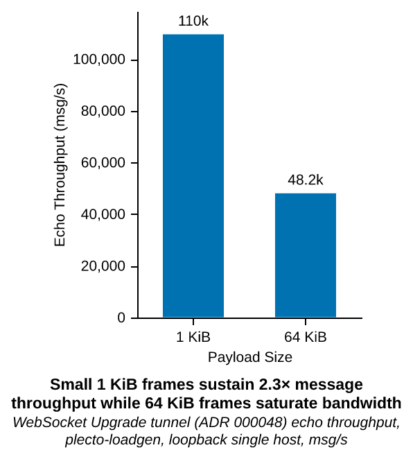
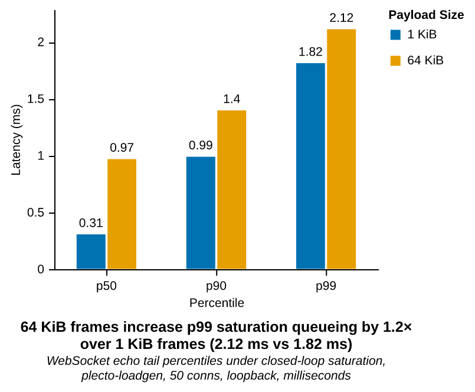

| Payload | messages/s | throughput | p50 | p99 |
| --- | --- | --- | --- | --- |
| 1 KB  | 109,651 | 112 MB/s   | 0.31 ms | 1.82 ms |
| 64 KB | 48,730  | 3,194 MB/s | 0.97 ms | 2.12 ms |

The handshake rate holds at 100 % of the paced 500.0/s target (`10,000/10,000`, `0 % failed` over 20 s; note this validates zero-drop stability at 500 handshakes/s rather than measuring a maximum handshake ceiling). On a fresh process a held tunnel costs **~21.6 KB** of RSS — the same order as a held keep-alive connection in [Footprint](#footprint) (`~25.7 KB/conn`), and 2.5× the superseded post-burst `~8.8 KB`, which confirms that figure was an underestimate. For scale: each tunnel's relay (`tokio::io::copy_bidirectional`) eagerly allocates one 8 KiB buffer per direction (16 KiB), plus the two `Upgraded` I/O handles and the task itself. Echo throughput at 1 KB
(`109.7k msg/s`) is **2.25×** the 64 KB rate (`48.7k msg/s`) while aggregate byte throughput rises **28.4×**
(`112 → 3,194 MB/s`; charts regenerated from `ws_echo.csv`), consistent with a per-message dispatch floor that amortizes better over larger
frames (relative to the idle `2026-10-25` run's `219.6k / 60.1k msg/s`, the `~19 %` drop at 64 KB is plausibly from external host load at `load average ≈ 4–13`, whereas the `~2.0×` drop at 1 KB while keep-alive HTTP throughput barely moved is too large to attribute to host load alone and remains unattributed — consistent with the `2026-08-15` snapshot, where the 1 KB rung moved `~2.4×` without attribution). The *shape* — small frames dispatch-bound, large frames bandwidth-bound — is the
part that has held across every snapshot.

*(A per-request small-frame delayed-ACK stall — the exact Nagle signature the
[connection-churn history](#plain-http11-ceiling) already found once — appeared during this
scenario's development on the mock upstream's accept-side socket; disabling Nagle there fixed it.
The numbers above are post-fix. The idle timeout (default 5 min, ADR 000048) and its interaction
with the breaker permit / least-request in-flight counters are exercised by the host's own test
suite, not this benchmark; a transfer-bytes / tunnel-duration metric is a documented observability
gap (ADR 000048's re-examine condition (d)) this report will pick up once it lands.)*

---

## Methodology — why the numbers look the way they do

(Builds on [Measurement setup](#measurement-setup) above — pinning, warm-up, open/closed-loop — with
what that setup buys.)

- **Track the invariant, not the headline.** The WASM tax and the rate-limit tax are ~µs/req (not a
  %), rate-limit enforcement converges to the configured refill rate, fairness is per-key isolation,
  resilience is ~time-constants, and round-robin is exact — these hold across hosts and generators,
  so a change in them is a real regression. A change in absolute peak throughput is usually just the
  host or the generator.
- **Benchmarks find bugs.** The body scenario surfaced a delayed-ACK stall from Nagle on the upstream
  sockets (no `TCP_NODELAY`); disabling Nagle there — standard for L7 proxies — removed a ~40 ms p99
  cliff on streamed bodies. Disclosing *how* a number was produced is the point.
- **Two layers that must agree.** In-process criterion micro-benchmarks isolate per-function cost
  deterministically; the open-loop macro scenarios measure it end-to-end. Micro-cost × calls-per-request
  should explain the macro delta — the WASM ladder is the worked example — so a divergence between the
  layers is a bug in one of them, not noise. The micro layer itself is split in two: criterion for
  wall-clock direction, and instruction counts (gungraun/callgrind, feature `instruction-bench`) as
  the frequency-invariant judge for "did the contract surface get more expensive?" — see
  [Reproducing](#reproducing) and `bench/methodology.md` § Measurement tiers.
- **The local per-change gate.** `bash bench/perf/run-perf.sh gate` re-measures exactly the
  invariants this report tracks (8 short paired rounds, rung order reversed on even rounds, so a common per-round level shift cancels inside each round and a linear host drift cancels in the sample mean across counterbalanced odd/even round pairs while remaining in $s$ as alternating-sign spread; `ci_half` is the 95 % Student-t half-width of the mean per-round delta, with `n` reported) and machine-checks them
  against `bench/perf/gate_tolerances.toml` — the bands are tracked in-repo, so a deliberate
  performance change is reviewed as a diff. The gate returns a **three-valued verdict**:
  - `pass` (exit code 0): every invariant's uncertainty interval `[value - ci_half, value + ci_half]` falls within its band `[band_lo, band_hi]`.
  - `fail` (exit code 1): at least one invariant's uncertainty interval falls completely outside its band (`value + ci_half < band_lo` or `value - ci_half > band_hi`). Exit code 1 dominates inconclusive.
  - `inconclusive` (exit code 2): an invariant straddles a band edge (neither fully inside nor fully outside). Re-run with `GATE_POOL_FROM=<that RUN_DIR>`: the new rounds are **pooled** with the earlier ones into one estimate (refused with exit 64 if `build_id.txt` differs or if more than 3 runs are pooled), so a re-run adds evidence instead of replacing an unwelcome result. Because round-level pooling treats rounds as independent and sequential stop-on-pass slightly inflates nominal coverage, pooling is capped at **at most 3 runs** (`n = 24`) and any band recalibration requires an independent non-pooled holdout run.
  (Invariants without `ci_half` keep binary pass/fail judgment; `info` rows such as `ratelimit_cpu_us_per_req` are reported, never judged, until they get a band.)
  `all` stays the human-read release snapshot.
- **CI regression gate.** Per-PR, two layers with different verdict policies (`bench.yml`): the
  criterion micro-benchmarks stay *informational* (hosted-runner wall-clock is noisy-neighbour
  bound, ~2–3 % CV, so a tight threshold would false-fail), while the gungraun instruction-count
  benches are *judged* — a soft limit (`ir=5%`) against the baseline saved from main pushes.
  Instruction counts don't inherit the runner's frequency/thermal noise, which is what makes a
  machine verdict meaningful on shared VMs. The heavy k6/oha macro suite never runs in CI — the
  local T1 `gate` covers per-change macro invariants.
- **Prior art.** Disclosing open- vs closed-loop and corrected latency is standard in tools such as
  `wrk2` and k6. This report follows that spirit using only its own measurements.

## Reproducing

The tracked, in-repo subjects and the runbook that produces every CSV here:

```bash
# Build the release examples first (the runbook does not build). bench-server/swap-bench live
# outside plecto/ (bench/harnesses/), so they need --features bench-harnesses.
cargo build --release -p plecto-server --features bench-harnesses \
  --example load-balancing --example bench-server --example tls-http --example swap-bench

# T1 — the per-change regression gate (~6-7 min): interleaved invariant deltas judged against
# bench/perf/gate_tolerances.toml, written to performance/data/gate.csv.
# Exit code: 0 = pass (in band), 1 = fail (out of band), 2 = inconclusive (straddles edge => re-run).
# 75 = refused before launching anything: 1-min load average > GATE_MAX_LOAD (default 4.0) or
# PROXY_CPUS busy > GATE_MAX_PROXY_BUSY (default 0.20), sampled into $RUN_DIR/host_load.txt.
# Retry on an idle host, or GATE_ALLOW_CONTENDED=1 runs anyway and tags the verdict "(contended host)".
bash bench/perf/run-perf.sh gate          # or: just gate

# T2 — the full release-snapshot suite (~22 min at the report-tier windows). Phases:
#   quick gate ceiling sweep openloop rr ejection swap wasm v03 tls h3 ws footprint ratelimit body mix all
bash bench/perf/run-perf.sh all           # or: just report

# T3 — opt-in deep phases (not part of `all`): v0.3.0 response-context / replace + compression:
bash bench/perf/run-perf.sh v03           # or: just deep v03

# T0 — a fast local sanity check (~1 min, oha only, no k6/Docker, no tracked CSV):
bash bench/perf/run-perf.sh quick

# In-process micro-benchmarks, two layers (see bench/methodology.md § Measurement tiers):
# 1) criterion (wall-clock; drifts with the unpinned governor — read direction, not absolutes).
#    For ADR-sized contract changes, prefer a named baseline on the pre-change commit:
#      git checkout <pre-adr73> && cargo bench -p plecto-host -- --save-baseline pre-adr73
#      git checkout <post>      && cargo bench -p plecto-host -- --baseline pre-adr73
cargo bench -p plecto-control -p plecto-host -- --save-baseline main   # on the base branch
cargo bench -p plecto-control -p plecto-host -- --baseline main        # on a change, to read the deltas
# 2) instruction counts (gungraun/callgrind; frequency/thermal-invariant — the deterministic
#    judge for "did the contract surface get more expensive?"). Needs valgrind + a
#    version-matched `cargo install gungraun-runner`; feature-gated so plain `cargo bench` skips it:
#    NB: gungraun needs `=`-attached values — a space-separated `--save-baseline main` is parsed
#    as a positional benchmark filter and silently runs nothing — and baseline names allow only
#    [A-Za-z0-9_] (use `pre_adr73`, not `pre-adr73`).
cargo bench -p plecto-host    --features instruction-bench --bench wasm_inst     -- --save-baseline=main
cargo bench -p plecto-control --features instruction-bench --bench fastpath_inst -- --save-baseline=main
#    ...then on a change: the same commands with `-- --baseline=main` (soft limits are also
#    available, e.g. `-- --callgrind-limits=ir=5%`).

# Optional live dashboard (images are a one-time setup pull; the load stays on loopback):
INFLUX=1 bash bench/perf/run-perf.sh all     # http://localhost:3000/d/plecto-lb-k6

# The underlying examples (default ports overridable with PLECTO_PROXY_ADDR):
cargo run --release -p plecto-server --example load-balancing   # LB fast path
BACKEND_LATENCY_MS=0 cargo run --release -p plecto-server --features bench-harnesses --example bench-server   # WASM plane + rate-limit + body hook + WS
cargo run --release -p plecto-server --example tls-http          # TLS termination
cargo run --release -p plecto-server --features bench-harnesses --example swap-bench          # endpoint-set swap under load

# TLS full-vs-resumed handshake rungs (ADR 000052; the `tls` phase doesn't drive this yet — the
# cert.pem lives in tls-http's temp dir, printed nowhere, so find it under /tmp and pass it as --ca):
plecto-loadgen tls --mode full    --target https://localhost:PORT/api/hello --ca CERT.pem --out performance/data/tls_full.csv
plecto-loadgen tls --mode resumed --target https://localhost:PORT/api/hello --ca CERT.pem --out performance/data/tls_resumed.csv
```

The k6 scenarios live in `bench/k6/` and `bench/k6-wasm/`; the round-robin counter, the open-loop
fault/swap timelines, and the WebSocket handshake/hold/echo scenarios are `plecto-loadgen`
subcommands (`bench/loadgen/`, built lazily by the runbook). The open-loop driver records
schedule-latency into an HDR histogram (fixed footprint at any rate/window) and dumps the FULL
distribution alongside the summary (`--hist-out`, written to `performance/data/openloop_hist.csv`
by the runbook) — so a p99 move can be attributed to a second mode appearing vs one mode's tail
stretching, without a re-run. Charts are compiled with Flint (flint-chart) from the CSVs in performance/data:

```bash
cd performance/flint && npm ci && npm run plot
```

(The benchmark *method* — the runbook, scenarios, the Rust loadgen, plotting — is tracked, as are the rendered charts and this
report; the measured CSVs are regenerable working data and stay untracked, like `bench/`'s raw run
artifacts. See `bench/plan.md`.)

## Non-goals

- Not a sizing or capacity guide.
- Not a comparison against other proxies, gateways, or Wasm runtimes.
- Not representative of production hardware, real networks, or non-trivial upstream work.

## References

- Gil Tene, *coordinated omission* — summarized in ScyllaDB's [On Coordinated Omission](https://www.scylladb.com/2021/04/22/on-coordinated-omission/).
- [k6 executors](https://grafana.com/docs/k6/latest/using-k6/scenarios/executors/) — closed-loop (`constant-vus`) vs open-loop (`constant-arrival-rate`) models.
- [oha](https://github.com/hatoo/oha) — the single-connection-pool HTTP load generator used for the ceiling, WASM overhead, and TLS runs.
- [criterion.rs](https://bheisler.github.io/criterion.rs/book/) — the in-process micro-benchmark harness (LB pick, route match, WASM per-request cost) and its baseline-comparison regression gate.
- HTTP/3 load-testing references for the deferred H3 *load* benchmark (see [HTTP/3](#http3)):
- [h2load](https://nghttp2.org/documentation/h2load-howto.html) — nghttp2's closed-loop concurrency-based load generator; supports HTTP/3 (`--alpn-list=h3`) with qlog output (for open-loop H3 arrival pacing, see `oha --features http3` or a future `plecto-loadgen` H3 subcommand in [HTTP/3](#http3)).
- [wrk2](https://github.com/giltene/wrk2) — constant throughput with corrected latency recording.
- [Wasmtime](https://docs.wasmtime.dev/) — the pooling allocator and epoch interruption behind pooled vs on-demand filter instances.
- [WebAssembly Component Model](https://component-model.bytecodealliance.org/) — the `plecto:filter` contract is a Component Model world.
- [RFC 6455](https://www.rfc-editor.org/rfc/rfc6455) — the WebSocket protocol `bench-server`'s `/ws` mock upstream and `plecto-loadgen`'s `ws` subcommand implement (handshake + frame codec) to drive the Upgrade tunnel scenario.
